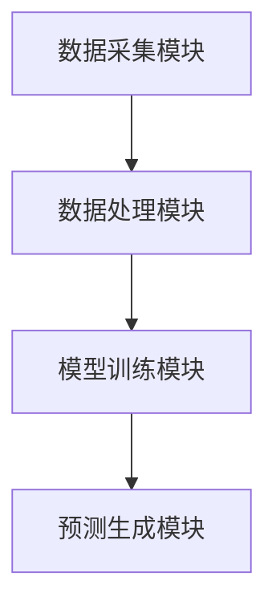
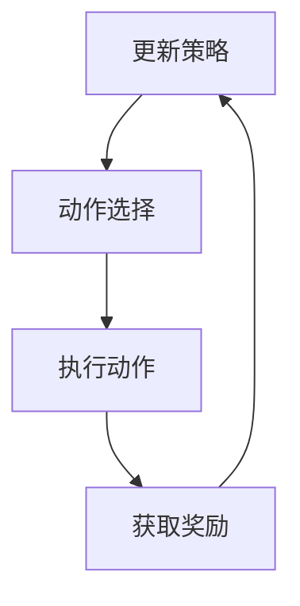
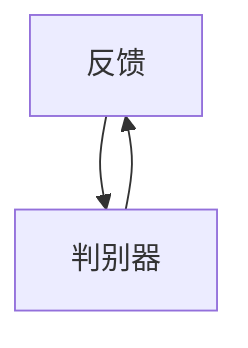
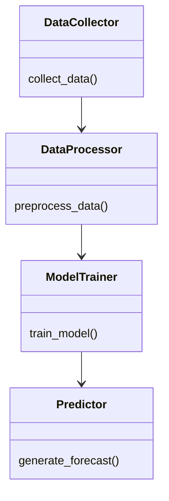
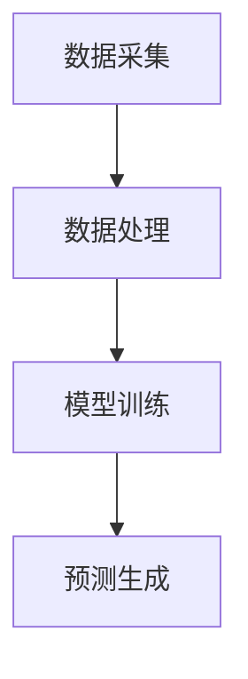
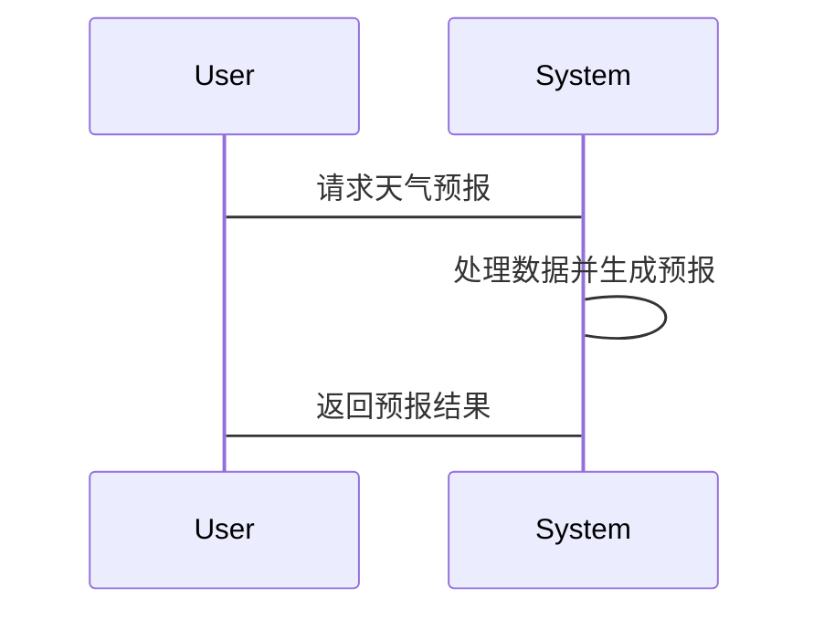

                 


# AI Agent在智能气象预报中的应用

> **关键词**：AI Agent, 智能气象预报, 机器学习, 深度学习, 数据处理  
> **摘要**：本文详细探讨了AI Agent在智能气象预报中的应用，从基本概念到算法原理，再到系统架构和项目实战，全面分析了AI Agent如何提升气象预报的准确性、实时性和智能化水平。

---

## 第一部分: AI Agent在智能气象预报中的应用概述

### 第1章: AI Agent与智能气象预报的背景

#### 1.1 AI Agent的基本概念

##### 1.1.1 AI Agent的定义与特点
AI Agent（人工智能代理）是指能够感知环境、做出决策并执行任务的智能实体。其特点包括自主性、反应性、目标导向和学习能力。

##### 1.1.2 AI Agent的核心功能与优势
AI Agent的核心功能包括数据采集与处理、模型训练与预测、结果分析与反馈。其优势在于高效处理海量数据、实时响应和自适应能力。

##### 1.1.3 AI Agent与传统气象预报方法的对比
与传统方法相比，AI Agent在数据处理速度和预测准确性上具有显著优势，尤其是在复杂天气模型中的表现更为突出。

#### 1.2 智能气象预报的背景与需求

##### 1.2.1 气象预报的重要性与挑战
气象预报对农业、交通、能源等领域至关重要，但传统方法在精度和实时性上存在局限。

##### 1.2.2 传统气象预报的局限性
传统方法依赖经验模型，数据处理效率低，预测范围有限。

##### 1.2.3 智能化气象预报的需求与趋势
随着技术进步，智能化预报需求增加，AI Agent成为提升预报能力的关键技术。

#### 1.3 AI Agent在气象预报中的应用背景

##### 1.3.1 AI Agent在气象数据处理中的作用
AI Agent能高效处理多源数据，提取有价值的信息。

##### 1.3.2 AI Agent在气象预测中的优势
通过深度学习模型，AI Agent能准确预测天气变化。

##### 1.3.3 AI Agent在气象服务中的潜在价值
提供个性化的气象服务，满足不同用户需求。

---

### 第2章: AI Agent的核心概念与原理

#### 2.1 AI Agent的基本原理

##### 2.1.1 AI Agent的感知层
感知层负责数据采集，包括卫星、雷达和地面传感器的数据。

##### 2.1.2 AI Agent的决策层
决策层基于感知数据，利用算法生成预测结果。

##### 2.1.3 AI Agent的执行层
执行层负责输出预测结果，并根据反馈调整模型。

#### 2.2 AI Agent在气象预报中的工作流程

##### 2.2.1 数据采集与预处理
数据采集后，需清洗和标准化处理，确保数据质量。

##### 2.2.2 模型训练与优化
使用机器学习和深度学习模型，通过训练提升预测精度。

##### 2.2.3 预测生成与反馈
模型生成预测结果，根据反馈不断优化。

#### 2.3 AI Agent的核心算法与技术

##### 2.3.1 机器学习算法
包括线性回归、支持向量机等，用于模式识别和分类。

##### 2.3.2 深度学习算法
如卷积神经网络和循环神经网络，擅长处理复杂数据。

##### 2.3.3 自然语言处理技术
用于处理气象报告和用户查询，提升服务智能化。

---

### 第3章: AI Agent在气象预报中的系统架构

#### 3.1 系统架构设计

##### 3.1.1 系统功能模块划分
包括数据采集、处理、模型训练、预测和反馈模块。

##### 3.1.2 系统数据流设计
数据从采集到处理，再到模型训练，最后生成预测结果。

##### 3.1.3 系统组件之间的交互关系
各模块协同工作，确保数据流畅处理。

#### 3.2 系统功能设计

##### 3.2.1 数据采集模块
负责收集气象数据，确保数据的准确性和完整性。

##### 3.2.2 数据处理模块
对数据进行清洗、转换和标准化，为模型训练做准备。

##### 3.2.3 模型训练模块
使用深度学习模型，训练数据生成预测模型。

##### 3.2.4 预测生成模块
根据模型输出预测结果，并生成用户报告。

#### 3.3 系统架构图

##### 3.3.1 系统架构的Mermaid图


##### 3.3.2 模块之间的交互关系
数据流从采集到处理，再到训练和预测，各模块协作完成任务。

---

### 第4章: AI Agent在气象预报中的算法

#### 4.1 算法原理讲解

##### 4.1.1 强化学习算法
通过奖励机制，优化模型预测策略。

##### 4.1.2 生成对抗网络
生成真实天气数据，提升模型泛化能力。

##### 4.1.3 时间序列分析
利用LSTM模型，捕捉天气变化的时序特征。

#### 4.2 算法流程图

##### 4.2.1 强化学习流程图


##### 4.2.2 生成对抗网络流程图


#### 4.3 算法实现代码

##### 4.3.1 强化学习代码示例
```python
class Agent:
    def __init__(self, state_size, action_size):
        self.model = build_model(state_size, action_size)
    
    def act(self, state):
        prediction = self.model.predict(state)
        return np.argmax(prediction)
```

##### 4.3.2 生成对抗网络代码示例
```python
import tensorflow as tf
from tensorflow.keras import layers

generator = tf.keras.Sequential([
    layers.Dense(256, activation='relu'),
    layers.Dense(128, activation='relu'),
    layers.Dense(7, activation='sigmoid')
])

discriminator = tf.keras.Sequential([
    layers.Dense(256, activation='relu'),
    layers.Dense(128, activation='relu'),
    layers.Dense(1, activation='sigmoid')
])
```

#### 4.4 数学模型与公式

##### 4.4.1 强化学习的数学模型
状态s，动作a，奖励r，策略π：P(a|s)。

##### 4.4.2 生成对抗网络的损失函数
生成器损失：L_G = -log(D(G(x)))，判别器损失：L_D = -log(D(x)) - log(1 - D(G(x))).

---

### 第5章: 系统分析与架构设计方案

#### 5.1 问题场景介绍
AI Agent在气象预报中的应用场景，如天气预测和灾害预警。

#### 5.2 系统功能设计

##### 5.2.1 领域模型类图


##### 5.2.2 系统架构图


##### 5.2.3 系统接口设计
API接口定义，数据格式和交互协议。

##### 5.2.4 系统交互序列图


---

### 第6章: 项目实战

#### 6.1 环境安装
安装Python、TensorFlow、Keras等工具。

#### 6.2 核心代码实现

##### 6.2.1 数据采集与处理代码
```python
import pandas as pd

data = pd.read_csv('weather.csv')
data_processed = data.dropna()
```

##### 6.2.2 模型训练代码
```python
model = build_model()
model.fit(processed_data, labels, epochs=100, batch_size=32)
```

##### 6.2.3 预测生成代码
```python
forecast = model.predict(new_data)
print(forecast)
```

#### 6.3 实际案例分析
分析某地区天气预报案例，展示AI Agent的应用效果。

---

### 第7章: 最佳实践

#### 7.1 小结
总结AI Agent在气象预报中的应用价值和优势。

#### 7.2 注意事项
数据质量、模型选择和计算资源是关键因素。

#### 7.3 拓展阅读
推荐相关书籍和论文，供进一步学习。

---

通过以上步骤，我们系统地探讨了AI Agent在智能气象预报中的应用，从理论到实践，全面分析了其在提升气象预报准确性和效率方面的重要作用。希望这篇文章能为相关领域的研究和应用提供有价值的参考。

