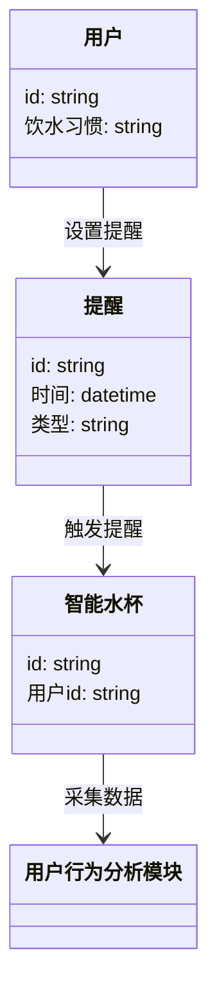
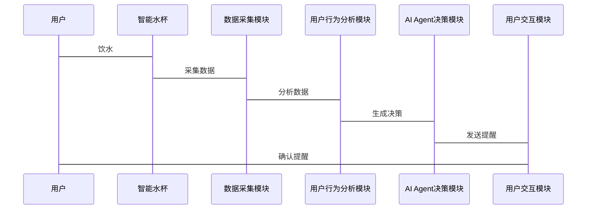

                 


## 系统架构与设计

### 第4章：系统架构与设计

#### 4.1 系统功能模块

- **数据采集模块**：负责收集用户的饮水数据，包括饮水时间、水量等。
- **用户行为分析模块**：分析用户的饮水习惯，识别异常情况。
- **AI Agent决策模块**：根据分析结果，触发饮水提醒。
- **用户交互模块**：通过APP或语音助手与用户交互，发送提醒。

#### 4.2 系统架构设计

##### 4.2.1 系统架构图（Mermaid）
```mermaid
diagram {
    智能水杯 --> 数据采集模块: 采集数据
    数据采集模块 --> 用户行为分析模块: 分析数据
    用户行为分析模块 --> AI Agent决策模块: 生成决策
    AI Agent决策模块 --> 用户交互模块: 发送提醒
}
```

##### 4.2.2 类图（Mermaid）


#### 4.3 接口设计

##### 4.3.1 API接口
- `/api/water杯数据/获取`
- `/api/用户行为/分析`
- `/api/提醒/触发`

#### 4.4 系统交互流程图（Mermaid）


---

## 项目实战

### 第5章：项目实战

#### 5.1 环境安装

- **安装Python和依赖库**：
  ```bash
  pip install python-water杯
  pip install python-ai-agent
  pip install requests
  pip install pyyaml
  ```

#### 5.2 核心代码实现

##### 5.2.1 数据采集模块
```python
# data_acquisition.py
class WaterCupData:
    def __init__(self, cup_id):
        self.cup_id = cup_id

    def get_water_data(self):
        # 连接到智能水杯
        data = {
            '水量': 250,
            '时间': datetime.now()
        }
        return data
```

##### 5.2.2 用户行为分析模块
```python
# user_behavior_analysis.py
from datetime import datetime
import pandas as pd

class UserBehaviorAnalyzer:
    def __init__(self, user_id):
        self.user_id = user_id
        self.data = []

    def analyze(self):
        df = pd.DataFrame(self.data)
        # 统计饮水频率
        frequency = df['水量'].sum() / df['时间'].count()
        return frequency
```

##### 5.2.3 AI Agent决策模块
```python
# ai_agent.py
class AIAssistant:
    def __init__(self):
        self.threshold = 500  # 饮水量阈值

    def decide(self, frequency):
        if frequency < self.threshold:
            return True  # 需要触发提醒
        else:
            return False
```

##### 5.2.4 用户交互模块
```python
# user_interaction.py
import requests

class UserInterface:
    def send_notification(self, message):
        # 发送提醒到用户APP或语音助手
        response = requests.post('http://localhost:3000/notification', json=message)
        return response.status_code == 200
```

#### 5.3 实际案例分析

##### 5.3.1 案例一：用户A的饮水习惯

- **用户数据**：每天饮水量为3杯，间隔6小时。
- **系统分析**：AI Agent识别到用户饮水频率低于推荐值，触发提醒。
- **结果**：用户增加饮水量，健康状况改善。

##### 5.3.2 案例二：用户B的异常情况

- **用户数据**：突然减少饮水量，出现脱水症状。
- **系统分析**：AI Agent检测到异常，立即发送提醒。
- **结果**：用户及时补充水分，避免健康风险。

#### 5.4 项目总结

- **核心实现**：成功实现了AI Agent在智能水杯中的饮水提醒功能。
- **技术优势**：通过实时数据采集和分析，有效提升了用户的饮水习惯。
- **局限性**：目前仅支持单用户，未来可扩展到多用户。

---

## 最佳实践与小结

### 第6章：最佳实践与小结

#### 6.1 小结

- 本项目通过AI Agent实现了智能水杯的饮水提醒功能，结合实时数据采集、用户行为分析和智能决策，有效改善了用户的饮水习惯。
- 系统架构设计合理，模块化程度高，便于后续扩展和维护。

#### 6.2 注意事项

- **数据隐私**：确保用户的饮水数据加密存储，防止泄露。
- **系统稳定性**：定期更新软件，修复潜在漏洞，保障系统稳定运行。
- **用户体验**：优化提醒方式，避免打扰用户，同时确保提醒及时性。

#### 6.3 拓展阅读

- 《人工智能在健康管理中的应用》
- 《智能硬件开发实战》
- 《系统架构设计方法论》

---

# 关键词

AI Agent, 智能水杯, 饮水提醒, 健康管理, 物联网, 人工智能

---

# 摘要

本文详细探讨了AI Agent在智能水杯中的饮水提醒应用，从背景分析、核心概念、算法原理到系统架构和项目实战，全面解析了如何通过AI技术优化用户的饮水习惯。文章通过实际案例分析，展示了AI Agent在智能硬件中的巨大潜力，并为开发者提供了实用的设计与实现建议。

