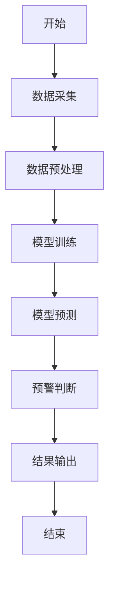

                 


# AI Agent在智能水质监测与预警中的角色

## 关键词：AI Agent、水质监测、智能预警、数据处理、算法原理

## 摘要：  
本文探讨AI Agent在智能水质监测与预警系统中的核心角色。从AI Agent的基本概念到其在水质监测中的具体应用，系统地分析了其算法原理、系统架构设计以及实际案例。文章详细介绍了AI Agent如何通过感知、决策和执行优化水质监测过程，并通过对比分析、Mermaid流程图和Python代码示例，深入阐释了AI Agent在水质监测中的优势与实践价值。

---

## 第一部分: AI Agent与智能水质监测的背景与概念

### 第1章: AI Agent的基本概念与作用

#### 1.1 AI Agent的定义与核心原理
- **AI Agent的定义**：AI Agent是一种能够感知环境、做出决策并采取行动的智能实体，旨在实现特定目标。
- **AI Agent的核心原理**：包括感知（数据采集）、决策（算法分析）、执行（输出结果）三个核心环节。
- **AI Agent在智能系统中的作用**：作为智能系统的“大脑”，负责协调各模块的协作，优化系统的运行效率。

#### 1.2 智能水质监测的基本概念
- **水质监测的定义与重要性**：水质监测是指对水体中的物理、化学和生物参数进行测量和分析的过程，是环境保护的重要手段。
- **智能水质监测的特点**：自动化、实时性、高效性、准确性。
- **智能水质监测的典型应用场景**：饮用水安全、工业废水处理、农业灌溉、环境监测等。

#### 1.3 AI Agent在水质监测中的角色
- **AI Agent在水质监测中的核心作用**：作为智能水质监测系统的核心模块，负责数据处理、异常检测、预警和决策支持。
- **AI Agent与其他技术的结合**：与物联网（IoT）、大数据分析、云计算等技术协同工作，构建智能化的水质监测网络。
- **AI Agent在水质监测中的优势与局限性**：优势包括高效性、精准性、自适应性；局限性包括对环境的依赖性和算法的可解释性。

### 第2章: 智能水质监测的背景与问题分析

#### 2.1 当前水质监测的主要挑战
- **传统水质监测的局限性**：人工监测效率低、成本高；设备监测精度不足，无法满足实时性需求。
- **数据采集与处理的难点**：数据量大、噪声多、实时性要求高等问题。
- **智能化监测的需求**：随着环境保护要求的提高，传统方法已无法满足需求，智能化监测成为趋势。

#### 2.2 AI Agent在水质监测中的应用背景
- **环境保护与水质监测的重要性**：水质好坏直接影响人类健康和生态环境，监测工作至关重要。
- **AI技术在环境监测中的发展趋势**：AI技术的快速发展为水质监测提供了新的工具和方法。
- **AI Agent在水质监测中的潜在价值**：通过AI Agent的实时感知和智能决策，提升水质监测的效率和准确性。

#### 2.3 智能水质监测的系统架构
- **智能水质监测的基本架构**：包括数据采集层、数据处理层、决策层和执行层。
- **系统的主要组成部分**：传感器节点、数据传输网络、数据处理中心、决策支持系统。
- **系统的功能模块划分**：数据采集、数据预处理、模型分析、预警发布、结果反馈。

### 第3章: AI Agent的核心概念与联系

#### 3.1 AI Agent的核心原理
- **感知与数据采集**：AI Agent通过传感器获取水质数据，如pH值、溶解氧、浊度等。
- **数据分析与决策**：利用机器学习算法对数据进行分析，识别异常情况并做出预警。
- **行动与反馈**：根据决策结果采取行动，如调整设备参数或发出警报信号。

#### 3.2 智能水质监测中的关键概念
- **数据采集与预处理**：对传感器数据进行清洗和标准化，确保数据的准确性和一致性。
- **数据分析与建模**：使用回归分析、聚类分析、神经网络等算法建立水质模型。
- **预警与反馈机制**：根据模型预测结果，设定阈值，当数据超过阈值时触发预警。

#### 3.3 AI Agent与水质监测的关联
- **AI Agent在水质监测中的核心功能**：实时感知、智能分析、精准预警。
- **AI Agent与其他技术的协同作用**：与物联网、大数据分析、云计算等技术结合，构建智能化的水质监测网络。
- **AI Agent在水质监测中的系统架构**：传感器-传输-处理-决策-执行的闭环架构。

#### 3.4 概念对比与ER实体关系图
- **AI Agent与传统监测系统的对比**：
  | 参数 | AI Agent | 传统监测系统 |
  |------|----------|-------------|
  | 数据处理 | 智能分析 | 简单统计 | 
  | 响应速度 | 实时 | 延时 | 
  | 自适应性 | 高 | 低 | 

- **ER实体关系图**：展示水质监测系统中各实体及其关系。

```mermaid
er
actor(AI Agent)
actor(传感器节点)
actor(数据处理中心)
actor(预警系统)
actor(用户终端)
```

---

## 第4章: AI Agent在水质监测中的算法原理

### 4.1 算法原理概述
- **强化学习与监督学习**：AI Agent通过强化学习优化决策策略，通过监督学习分类异常数据。
- **算法流程**：
  1. 数据采集：传感器获取水质数据。
  2. 数据预处理：清洗、标准化。
  3. 数据分析：使用机器学习算法进行建模。
  4. 预测与预警：根据模型结果发出预警信号。

### 4.2 算法实现流程


### 4.3 Python代码示例
```python
import numpy as np
from sklearn.linear_model import LinearRegression

# 示例数据：pH值与浊度
X = np.array([1, 2, 3, 4, 5]).reshape(-1, 1)
y = np.array([5, 6, 7, 8, 9])

# 模型训练
model = LinearRegression()
model.fit(X, y)

# 预测新数据
new_X = np.array([6]).reshape(-1, 1)
prediction = model.predict(new_X)

print(f"预测值为：{prediction[0]}")
```

### 4.4 数学模型与公式
- **回归分析**：用于预测水质参数。
  $$ y = \beta_0 + \beta_1 x + \epsilon $$
- **分类算法**：用于识别水质状态。
  $$ P(y=k|x) = \frac{e^{log P(x|k) + log P(k)}}{\sum_{j} e^{log P(x|j) + log P(j)}} $$

---

## 第5章: 系统分析与架构设计方案

### 5.1 问题场景介绍
- **场景描述**：某工业园区需要实时监测水质，预防环境污染。
- **需求分析**：实时采集数据、智能分析、及时预警。

### 5.2 系统功能设计
- **领域模型**：
  ```mermaid
  classDiagram
  class 水质监测系统 {
    +传感器节点：采集水质数据
    +数据处理中心：存储和分析数据
    +AI Agent：决策与预警
    +用户终端：显示结果
  }
  ```

- **系统架构设计**：
  ```mermaid
  architecture
  Client -- 中间件 -- 数据处理中心 -- AI Agent -- 数据库
  ```

- **系统接口设计**：传感器-数据处理中心、数据处理中心-AI Agent、AI Agent-用户终端。

---

## 第6章: 项目实战

### 6.1 环境安装
- **工具安装**：安装Python、机器学习库（如scikit-learn、TensorFlow）、可视化工具（如Matplotlib、Seaborn）。
- **依赖管理**：使用pip安装所需的库。

### 6.2 系统核心实现源代码
```python
import numpy as np
from sklearn.ensemble import RandomForestRegressor
from sklearn.model_selection import train_test_split

# 数据加载
data = np.loadtxt('water_quality.csv', delimiter=',')
X = data[:, :-1]
y = data[:, -1]

# 数据划分
X_train, X_test, y_train, y_test = train_test_split(X, y, test_size=0.2)

# 模型训练
model = RandomForestRegressor(n_estimators=100)
model.fit(X_train, y_train)

# 预测与评估
score = model.score(X_test, y_test)
print(f"模型准确度为：{score}")
```

### 6.3 代码解读与分析
- **数据加载**：读取水质数据集。
- **数据划分**：将数据分为训练集和测试集。
- **模型训练**：使用随机森林回归模型进行训练。
- **模型评估**：计算模型的准确度。

### 6.4 实际案例分析
- **案例描述**：某工业园区的水质监测项目。
- **数据来源**：传感器节点实时采集pH值、浊度、溶解氧等数据。
- **模型应用**：通过AI Agent分析数据，预测水质变化趋势，及时发出预警。

### 6.5 项目小结
- **项目总结**：AI Agent在水质监测中的应用显著提高了监测效率和准确性。
- **经验分享**：数据质量、模型选择、实时性要求是项目成功的关键。

---

## 第7章: 最佳实践与注意事项

### 7.1 最佳实践 tips
- **数据预处理**：确保数据的准确性和完整性。
- **模型选择**：根据具体需求选择合适的算法。
- **实时性优化**：通过分布式架构提升系统的响应速度。

### 7.2 小结
- AI Agent在智能水质监测中的应用前景广阔，能够显著提升监测效率和准确性。

### 7.3 注意事项
- **数据隐私**：确保水质数据的安全性和隐私性。
- **系统维护**：定期更新模型和维护设备。

### 7.4 拓展阅读
- 推荐阅读《机器学习实战》、《深度学习入门》等书籍，深入了解AI Agent的实现细节。

---

通过以上内容，您可以全面了解AI Agent在智能水质监测与预警中的角色及其实际应用。如果需要进一步探讨或补充内容，请随时联系！

