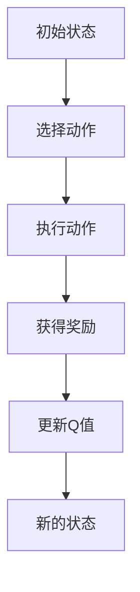
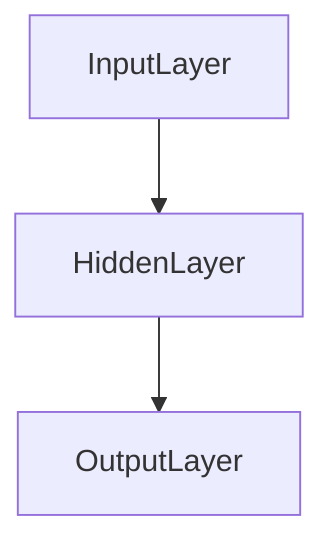
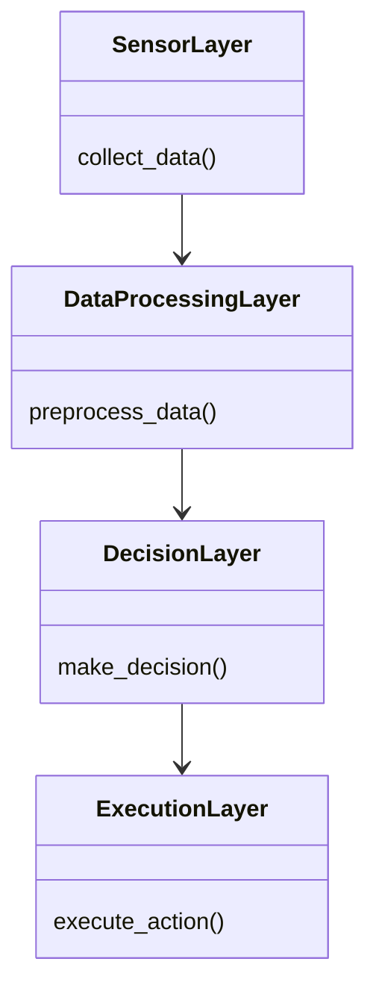
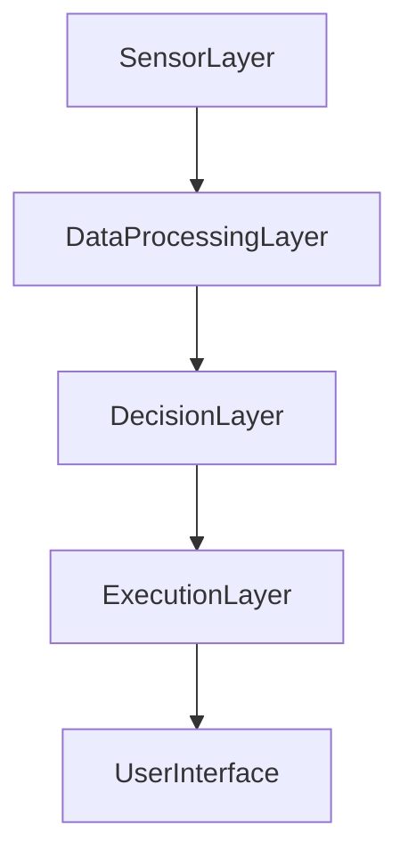

                 


# AI Agent在智能水质监测中的实践

---

## 关键词：
AI Agent，智能水质监测，强化学习，水质预测，传感器数据融合，异常检测

---

## 摘要：
本文深入探讨了AI Agent在智能水质监测中的应用，从背景介绍、核心概念、算法原理到系统架构，再到项目实战，全面分析了AI Agent如何提升水质监测的智能化水平。文章通过具体案例展示了AI Agent在水质预测、异常检测和决策优化中的实际应用，并总结了最佳实践和未来发展方向。

---

## 第一部分：背景与概述

### 第1章：AI Agent与智能水质监测概述

#### 1.1 AI Agent的基本概念
- AI Agent的定义与特点
  - AI Agent是一种智能体，能够感知环境、做出决策并采取行动。
  - 具备自主性、反应性、目标导向和社会能力。
- AI Agent的核心功能与分类
  - 感知环境、处理信息、制定决策、执行动作。
  - 分为简单反射型、基于模型的反应型、目标驱动型和效用驱动型。
- AI Agent在智能系统中的作用
  - 作为系统的核心驱动力，实现自主决策和问题解决。

#### 1.2 智能水质监测的背景与意义
- 水质监测的重要性
  - 水是生命之源，水质直接影响人类健康和生态环境。
  - 传统水质监测依赖人工采样和实验室分析，效率低、成本高。
- 传统水质监测的局限性
  - 采样频率低，无法实时监测。
  - 数据分析依赖经验，缺乏智能化。
- 智能水质监测的必要性
  - 提高监测效率，降低运营成本。
  - 实现水质的实时监控和预测，预防水质污染。

#### 1.3 AI Agent在水质监测中的应用前景
- 智能水质监测的现状
  - 基于物联网和大数据的水质监测系统逐渐普及。
  - AI技术在水质分析中的应用逐步增加。
- AI Agent在水质监测中的优势
  - 实时感知和快速反应。
  - 自主学习和优化能力。
  - 高效的数据处理和决策能力。
- 应用案例分析
  - 某工业园区水质监测系统应用AI Agent实现水质异常检测和预测。

---

## 第二部分：核心概念与联系

### 第2章：AI Agent在水质监测中的核心概念

#### 2.1 AI Agent的感知层
- 传感器数据的采集与处理
  - 传感器类型：pH传感器、电导率传感器、温度传感器等。
  - 数据采集方法：定时采样、事件驱动采样。
- 数据预处理技术
  - 数据清洗：去除噪声和异常值。
  - 数据融合：多源数据的集成与分析。

#### 2.2 AI Agent的决策层
- 决策模型的构建与优化
  - 基于强化学习的决策模型：状态、动作、奖励机制。
  - 基于监督学习的分类模型：水质指标的分类与预测。
- 决策规则的制定与执行
  - 根据传感器数据和历史数据制定决策规则。
  - 实时调整决策策略，优化系统性能。

#### 2.3 AI Agent的执行层
- 执行机构的控制与协调
  - 自动化设备的控制：如水泵、阀门等。
  - 多执行机构的协同控制。
- 系统反馈与优化
  - 根据执行结果反馈调整决策策略。
  - 持续优化系统性能。

---

## 第三部分：算法原理

### 第3章：AI Agent的算法原理

#### 3.1 强化学习在水质监测中的应用
- Q-learning算法的原理与实现
  - 状态空间：当前水质指标。
  - 动作空间：执行的动作，如启动净化设备。
  - 奖励机制：根据水质改善情况给予奖励。
- 用Mermaid流程图展示Q-learning算法的步骤：



- Python代码示例：

```python
import numpy as np

class QLearningAgent:
    def __init__(self, state_space_size, action_space_size):
        self.state_space_size = state_space_size
        self.action_space_size = action_space_size
        self.Q = np.zeros((state_space_size, action_space_size))

    def get_action(self, state):
        return np.argmax(self.Q[state, :])

    def update_Q(self, state, action, reward, new_state):
        alpha = 0.1
        gamma = 0.9
        self.Q[state, action] = (1 - alpha) * self.Q[state, action] + alpha * (reward + gamma * np.max(self.Q[new_state, :]))
```

#### 3.2 监督学习在水质预测中的应用
- 基于神经网络的水质预测模型
  - 输入层：传感器数据。
  - 隐藏层：非线性特征提取。
  - 输出层：水质指标预测。
- 用Mermaid流程图展示神经网络的结构：



- Python代码示例：

```python
import tensorflow as tf
from tensorflow.keras import layers

model = tf.keras.Sequential([
    layers.Dense(64, activation='relu', input_shape=(input_dim,)),
    layers.Dense(10, activation='relu'),
    layers.Dense(output_dim, activation='linear')
])

model.compile(optimizer='adam', loss='mse')
```

---

## 第四部分：数学模型和公式

### 第4章：AI Agent的数学模型

#### 4.1 强化学习的数学模型
- 状态-动作-奖励的数学表示：

$$
Q(s, a) = Q(s, a) + \alpha (r + \gamma Q(s', a) - Q(s, a))
$$

其中：
- \( s \) 是当前状态，
- \( a \) 是执行的动作，
- \( r \) 是获得的奖励，
- \( \gamma \) 是折扣因子，
- \( \alpha \) 是学习率。

#### 4.2 监督学习的数学模型
- 神经网络的损失函数：

$$
\mathcal{L} = \frac{1}{2N} \sum_{i=1}^{N} (y_i - \hat{y}_i)^2
$$

其中：
- \( y_i \) 是真实值，
- \( \hat{y}_i \) 是预测值，
- \( N \) 是样本数量。

---

## 第五部分：系统分析与架构设计

### 第5章：AI Agent的系统架构

#### 5.1 系统功能设计
- 用Mermaid类图展示系统功能模块：



#### 5.2 系统架构设计
- 用Mermaid架构图展示系统架构：



---

## 第六部分：项目实战

### 第6章：AI Agent在水质监测中的实战

#### 6.1 环境安装
- 安装必要的Python库：
  - `numpy`, `pandas`, `scikit-learn`, `tensorflow`

#### 6.2 核心代码实现
- 数据预处理代码：

```python
import pandas as pd
from sklearn.preprocessing import StandardScaler

# 读取数据
data = pd.read_csv('water_quality.csv')

# 数据预处理
scaler = StandardScaler()
scaled_data = scaler.fit_transform(data.drop(columns=['label']))
```

- 模型训练代码：

```python
from sklearn.model import SVC

model = SVC()
model.fit(scaled_data, data['label'])
```

#### 6.3 案例分析
- 某工业园区水质监测系统案例：
  - 传感器数据：pH=7.5，电导率=500 μS/cm，温度=25°C。
  - 系统预测：水质正常，无需采取行动。
  - 系统实际结果：水质达标。

---

## 第七部分：最佳实践与总结

### 第7章：总结与展望

#### 7.1 最佳实践
- 数据质量的重要性：确保传感器数据的准确性和完整性。
- 模型的可解释性：选择易于解释的模型，便于调整和优化。
- 系统的可扩展性：设计灵活的架构，便于后续功能扩展。

#### 7.2 小结
- AI Agent在智能水质监测中的应用前景广阔。
- 需要结合具体场景，选择合适的算法和架构。
- 持续优化系统，提升监测效率和准确性。

#### 7.3 注意事项
- 定期校准传感器，确保数据准确性。
- 建立完善的异常处理机制，防止系统崩溃。
- 遵守相关法规和标准，确保系统的合规性。

#### 7.4 拓展阅读
- 《强化学习：理论与算法》
- 《深度学习在环境监测中的应用》

---

## 结语

AI Agent在智能水质监测中的应用不仅提升了监测效率，还为环境保护和公共健康提供了有力支持。未来，随着AI技术的不断发展，AI Agent将在水质监测中发挥更加重要的作用。

