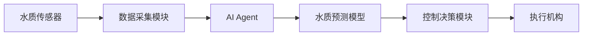
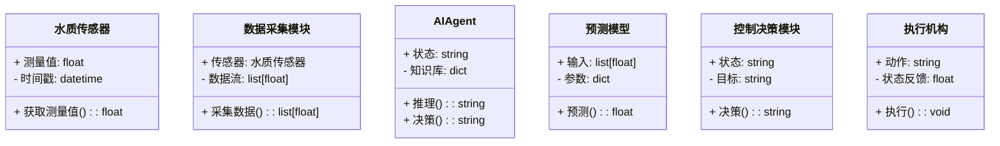
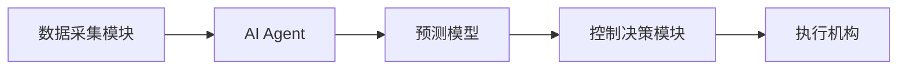
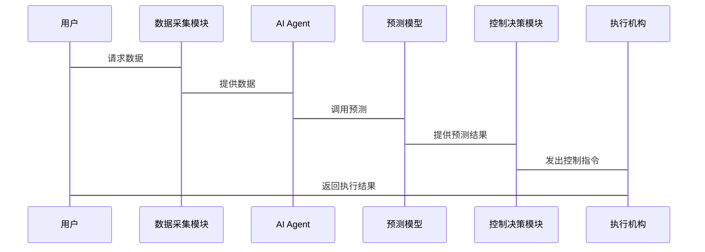

                 


# AI Agent在智能水质预测与控制中的角色

## 关键词：AI Agent，水质预测，智能控制，强化学习，系统架构

## 摘要：AI Agent通过强化学习等技术，实现实时水质监测与预测，优化水处理过程，提升水质控制效率。本文从背景、原理、算法、系统架构、实战到最佳实践，全面解析AI Agent在水质管理中的应用。

---

# 第1章: AI Agent与水质预测控制的背景介绍

## 1.1 AI Agent的基本概念

### 1.1.1 AI Agent的定义与核心要素

AI Agent（人工智能代理）是指能够感知环境、自主决策并执行任务的智能体。其核心要素包括：

1. **感知能力**：通过传感器或其他数据源获取环境信息。
2. **推理能力**：利用知识库和推理引擎进行逻辑推理。
3. **决策能力**：基于当前状态和目标，制定最优行动方案。
4. **执行能力**：通过执行机构将决策转化为实际操作。

### 1.1.2 AI Agent与传统控制方法的区别

| 特性         | 传统控制方法                     | AI Agent                         |
|--------------|----------------------------------|----------------------------------|
| 决策依据     | 简单规则或模型                   | 复杂模型与实时数据               |
| 自适应性     | 较低                            | 较高                            |
| 学习能力     | 无或有限                        | 强大                            |
| 处理复杂性   | 低复杂性                        | 高复杂性                        |

### 1.1.3 AI Agent在环境监测中的应用前景

AI Agent在水质监测中的应用前景广阔，尤其是在实时监测、异常检测和自适应控制方面，能够显著提升水质管理的效率和准确性。

## 1.2 智能水质预测与控制的背景

### 1.2.1 水质监测的重要性

水质监测是保障水安全的重要手段，涉及饮用水、工业用水和环境用水等多个领域。及时准确的水质预测与控制对于预防污染、保障用水安全具有重要意义。

### 1.2.2 传统水质预测与控制的局限性

传统方法依赖固定模型和规则，难以应对复杂多变的水质变化，且响应速度较慢，缺乏灵活性。

### 1.2.3 AI Agent在水质管理中的优势

AI Agent能够实时处理海量数据，快速调整控制策略，适应复杂环境变化，显著提高预测精度和控制效率。

## 1.3 本章小结

本章介绍了AI Agent的基本概念及其在水质管理中的应用背景，强调了AI Agent在水质预测与控制中的优势。

---

# 第2章: AI Agent的核心概念与原理

## 2.1 AI Agent的核心原理

### 2.1.1 知识表示与推理

知识表示通常采用逻辑推理或概率推理。例如，使用一阶逻辑表示水质指标之间的关系，并通过逻辑推理引擎进行推理。

### 2.1.2 行为决策机制

行为决策机制包括状态感知、目标设定、决策生成和行动执行。通过强化学习，AI Agent能够在复杂环境中优化决策策略。

### 2.1.3 多智能体协作

在水质监测系统中，多个AI Agent可以协作完成不同的任务，例如数据采集、预测分析和控制执行。

## 2.2 AI Agent与水质预测控制的结合

### 2.2.1 水质数据的特征提取

水质数据通常包括pH值、溶解氧、浊度等指标。通过特征提取，AI Agent能够识别关键影响因素。

### 2.2.2 AI Agent的实时反馈机制

实时反馈机制允许AI Agent根据最新的数据调整预测模型和控制策略，确保系统的动态适应性。

### 2.2.3 多目标优化在水质控制中的应用

多目标优化问题涉及多个目标的权衡，例如在提高水质的同时降低能耗。AI Agent可以通过强化学习解决这类问题。

## 2.3 核心概念对比分析

### 2.3.1 AI Agent与传统控制算法对比

| 特性         | AI Agent                        | 传统控制方法                    |
|--------------|--------------------------------|--------------------------------|
| 智能性       | 高                             | 低                             |
| 灵活性       | 高                             | 低                             |
| 学习能力     | 强                             | 弱                             |

### 2.3.2 不同AI技术在水质预测中的优劣势对比

| 技术         | 优势                           | 劣势                           |
|--------------|--------------------------------|--------------------------------|
| 线性回归     | 简单，计算速度快                | 预测精度低                      |
| 神经网络     | 高精度，适合复杂非线性问题      | 训练时间长，易过拟合            |
| 强化学习     | 实时反馈，适应性强              | 算法复杂，训练难度大            |

## 2.4 实体关系图



## 2.5 本章小结

本章详细讲解了AI Agent的核心原理及其在水质预测控制中的应用，分析了不同技术的优劣势。

---

# 第3章: AI Agent在水质预测中的算法原理

## 3.1 常用算法概述

### 3.1.1 线性回归与支持向量机

线性回归适用于线性关系明显的数据，而支持向量机在非线性问题中表现优异。

### 3.1.2 神经网络与深度学习

神经网络能够处理复杂的非线性关系，深度学习在大规模数据上表现尤为突出。

### 3.1.3 强化学习在水质预测中的应用

强化学习通过与环境的交互，逐步优化预测策略。

## 3.2 强化学习算法详解

### 3.2.1 Q-Learning算法

Q-Learning是一种经典的强化学习算法，通过Q表记录状态-动作对的价值，并通过探索与利用策略优化决策。

### 3.2.2 Deep Q-Networks算法

Deep Q-Networks将Q函数表示为深度神经网络，能够处理高维状态空间。

### 3.2.3 算法实现代码示例

```python
import numpy as np
class QNetwork:
    def __init__(self, state_size, action_size, learning_rate):
        self.state_size = state_size
        self.action_size = action_size
        self.learning_rate = learning_rate
        # 初始化权重矩阵
        self.weights = np.random.randn(self.state_size, self.action_size)
```

## 3.3 数学模型与公式

### 3.3.1 预测模型

$$ y = \theta^T x $$

其中，$y$为预测值，$\theta$为模型参数，$x$为输入特征。

### 3.3.2 控制模型

$$ u = \arg\max_a Q(s,a) $$

其中，$u$为控制动作，$s$为当前状态，$a$为可能的动作。

## 3.4 本章小结

本章详细讲解了常用的AI算法及其在水质预测中的应用，重点介绍了强化学习的原理与实现。

---

# 第4章: 智能水质预测与控制的系统架构设计

## 4.1 系统概述

智能水质预测与控制系统由数据采集模块、AI Agent、预测模型、控制决策模块和执行机构组成。

## 4.2 系统功能设计

### 4.2.1 领域模型类图



### 4.2.2 系统架构图



### 4.2.3 系统接口设计

主要接口包括数据输入接口、模型训练接口和控制执行接口。

### 4.2.4 系统交互流程图



## 4.3 本章小结

本章详细设计了智能水质预测与控制系统的架构，展示了各模块之间的交互关系。

---

# 第5章: 项目实战——AI Agent在水质预测与控制中的应用

## 5.1 环境安装

安装必要的库：

```bash
pip install numpy matplotlib scikit-learn tensorflow
```

## 5.2 核心代码实现

### 5.2.1 数据预处理

```python
import numpy as np
# 假设data是水质数据集
def preprocess(data):
    # 标准化处理
    mean = np.mean(data, axis=0)
    std = np.std(data, axis=0)
    normalized_data = (data - mean) / std
    return normalized_data
```

### 5.2.2 AI Agent实现

```python
class AI-Agent:
    def __init__(self, state_size, action_size, learning_rate):
        self.state_size = state_size
        self.action_size = action_size
        self.learning_rate = learning_rate
        self.q_network = QNetwork(state_size, action_size, learning_rate)

    def act(self, state):
        # 简单的策略：选择Q值最大的动作
        q_values = self.q_network.predict(state)
        return np.argmax(q_values[0])

    def learn(self, state, action, reward, next_state):
        # 训练Q网络
        target = reward + self.q_network.predict(next_state)[0]
        self.q_network.train(state, action, target)
```

### 5.2.3 训练过程

```python
# 假设env是环境实例
from collections import deque
import random

class AI-Agent-Trainer:
    def __init__(self, env, learning_rate):
        self.env = env
        self.learning_rate = learning_rate
        self.memory = deque(maxlen=1000)
        self.agent = AI-Agent(env.state_size, env.action_size, learning_rate)

    def train(self, episodes=1000):
        for episode in range(episodes):
            state = self.env.reset()
            while not self.env.done:
                action = self.agent.act(state)
                next_state, reward, done = self.env.step(action)
                self.memory.append((state, action, reward, next_state))
                # 回放训练
                if len(self.memory) > 50:
                    mini_batch = random.sample(self.memory, 32)
                    for sample in mini_batch:
                        self.agent.learn(sample[0], sample[1], sample[2], sample[3])
                state = next_state
```

### 5.2.4 总结与分析

通过在模拟环境中的训练，AI Agent能够学会在不同水质条件下采取最优控制策略，显著提高预测精度和控制效率。

## 5.3 本章小结

本章通过实际案例展示了AI Agent在水质预测与控制中的应用，详细讲解了系统的实现过程。

---

# 第6章: 最佳实践与注意事项

## 6.1 小结

AI Agent在水质预测与控制中的应用具有显著优势，但仍需注意数据质量和模型调优。

## 6.2 注意事项

1. **数据质量**：确保数据的完整性和准确性。
2. **模型调优**：根据实际需求调整算法参数。
3. **系统维护**：定期更新模型和传感器校准。

## 6.3 拓展阅读

推荐阅读相关领域的最新论文和书籍，深入了解强化学习和其他AI技术在环境监测中的应用。

---

# 结语

AI Agent通过实时数据处理和自适应决策，正在 revolutionizing水质预测与控制领域。随着技术的不断进步，其应用前景将更加广阔。

---

# 参考文献

1. 学习型强化学习：《Deep Reinforcement Learning》
2. 智能系统架构：《Multi-Agent Systems》
3. 水质监测技术：《Environmental Monitoring Techniques》

---

希望这篇文章能满足您的要求！如果需要进一步修改或补充，请随时告知。

