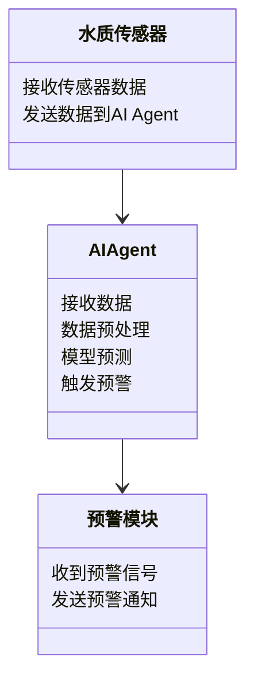
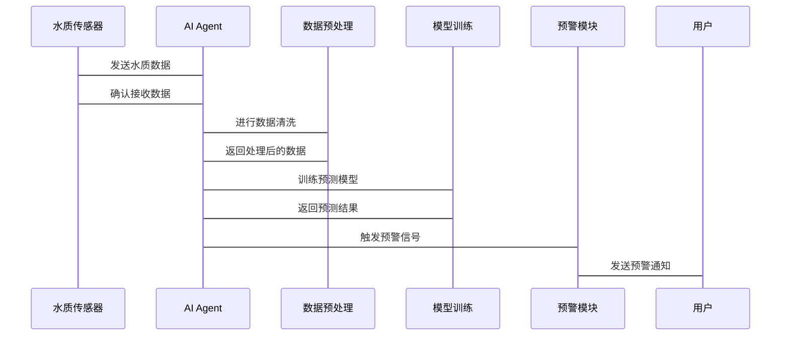

                 


# AI Agent在智能水质预警系统中的角色

## 关键词：AI Agent，智能水质预警系统，机器学习，水质监测，数据挖掘

## 摘要：  
AI Agent在智能水质预警系统中扮演着至关重要的角色，通过感知、分析和决策，帮助实现水质的实时监测和智能预警。本文从AI Agent的基本概念出发，分析其在水质预警系统中的核心任务与作用，详细探讨其算法原理、系统架构设计以及实际应用案例，最后总结AI Agent在智能水质预警系统中的最佳实践。

---

# 第1章: AI Agent的基本概念与背景介绍

## 1.1 AI Agent的定义与核心概念

### 1.1.1 AI Agent的定义  
AI Agent（人工智能代理）是指在计算机系统中，能够感知环境、自主决策并执行任务的智能实体。它通过传感器获取信息，利用算法进行分析，并根据结果采取行动。AI Agent的核心目标是通过智能化手段解决复杂问题。

### 1.1.2 AI Agent的核心概念与属性  
AI Agent具有以下核心概念与属性：  
1. **自主性**：能够在没有外部干预的情况下独立运行。  
2. **反应性**：能够实时感知环境变化并做出反应。  
3. **目标导向性**：具有明确的目标，并通过行动实现目标。  
4. **学习能力**：能够通过数据和经验不断优化自身性能。  

### 1.1.3 AI Agent的分类与应用场景  
AI Agent可以根据功能和应用场景分为以下几类：  
1. **简单反射型AI Agent**：基于规则进行简单决策，适用于任务单一的场景。  
2. **基于模型的AI Agent**：利用知识库或模型进行复杂决策，适用于任务复杂的场景。  
3. **学习型AI Agent**：通过机器学习算法不断优化自身性能，适用于数据丰富的场景。  

---

## 1.2 智能水质预警系统的背景与意义

### 1.2.1 水质监测的重要性  
水质监测是保障水环境健康的重要手段，直接关系到饮用水安全、生态环境保护以及经济发展。传统的水质监测系统依赖人工采样和实验室分析，效率低、成本高且实时性差。

### 1.2.2 传统水质监测系统的局限性  
传统水质监测系统存在以下主要问题：  
1. **实时性差**：采样和分析周期长，无法实现实时监控。  
2. **成本高**：需要大量人工参与，运营成本高。  
3. **覆盖范围有限**：监测点有限，难以全面覆盖监测区域。  

### 1.2.3 AI Agent在水质预警中的角色  
AI Agent通过实时感知、智能分析和自主决策，能够显著提升水质监测系统的效率和准确性。其主要角色包括：  
1. **数据采集与处理**：通过传感器实时采集水质数据并进行预处理。  
2. **智能分析与预测**：利用机器学习算法预测水质变化趋势。  
3. **预警触发与反馈**：当检测到异常情况时，快速触发预警并采取应对措施。  

---

# 第2章: AI Agent在水质预警系统中的角色与作用

## 2.1 AI Agent在水质预警中的核心任务

### 2.1.1 数据采集与处理  
AI Agent通过部署在水体中的传感器（如pH传感器、温度传感器、溶解氧传感器等）实时采集水质数据，并对数据进行清洗和标准化处理。  

### 2.1.2 智能分析与预测  
AI Agent利用机器学习算法（如随机森林、支持向量机等）对水质数据进行建模和分析，预测水质变化趋势，并识别潜在的异常情况。  

### 2.1.3 预警触发与反馈  
当预测结果表明水质参数接近预警阈值时，AI Agent会触发预警机制，并根据预设的策略采取应对措施（如启动应急处理设备或通知相关部门）。  

## 2.2 AI Agent与水质预警系统的关系

### 2.2.1 系统架构的协同工作  
AI Agent作为水质预警系统的核心模块，与数据采集模块、存储模块和展示模块协同工作，实现数据的采集、分析、预警和反馈。  

### 2.2.2 AI Agent的决策机制  
AI Agent的决策机制基于实时数据和历史数据，结合机器学习模型的预测结果，生成最优决策方案。  

### 2.2.3 系统的实时性与可靠性  
AI Agent通过实时数据处理和快速决策，显著提升了水质预警系统的实时性和可靠性。  

---

# 第3章: AI Agent的核心原理与算法

## 3.1 AI Agent的感知与决策机制

### 3.1.1 数据采集与特征提取  
AI Agent通过传感器实时采集水质数据，并提取关键特征（如pH值、温度、溶解氧等）。  

### 3.1.2 智能分析与预测算法  
AI Agent采用随机森林算法对水质数据进行分类和回归分析，预测水质变化趋势。  

### 3.1.3 决策优化与执行  
基于预测结果，AI Agent优化决策策略，并通过执行模块采取相应行动。  

---

## 3.2 基于机器学习的水质预测模型

### 3.2.1 机器学习算法的选择与应用  
随机森林算法是一种基于树的集成学习算法，具有高准确性和鲁棒性，适用于水质预测任务。  

### 3.2.2 模型训练与优化  
通过训练数据集对随机森林模型进行训练，并利用交叉验证优化模型参数。  

### 3.2.3 模型评估与验证  
利用测试数据集对模型进行评估，计算准确率、召回率和F1分数等指标，验证模型的性能。  

---

# 第4章: 系统分析与架构设计

## 4.1 问题场景介绍

### 4.1.1 项目背景  
以某水库水质监测项目为例，设计一个基于AI Agent的智能水质预警系统。  

### 4.1.2 项目目标  
实现水质的实时监测、异常预警和智能决策。  

---

## 4.2 系统功能设计

### 4.2.1 领域模型设计  
通过Mermaid类图展示系统功能模块之间的关系：  



### 4.2.2 系统架构设计  
采用分层架构，包括数据采集层、数据处理层、模型训练层和预警触发层。  

### 4.2.3 系统接口设计  
- 数据采集接口：负责与水质传感器的数据交互。  
- 预警触发接口：负责与预警模块的数据交互。  

### 4.2.4 系统交互流程  
通过Mermaid序列图展示系统交互流程：  



---

# 第5章: 项目实战

## 5.1 环境搭建

### 5.1.1 安装必要的Python库  
安装NumPy、Pandas、Scikit-learn、Matplotlib等机器学习相关库。  

## 5.2 核心代码实现

### 5.2.1 数据预处理代码  

```python
import numpy as np
import pandas as pd

# 读取数据
data = pd.read_csv('water_quality.csv')

# 数据清洗
data.dropna(inplace=True)
data = pd.get_dummies(data)
```

### 5.2.2 模型训练代码  

```python
from sklearn.ensemble import RandomForestClassifier
from sklearn.model_selection import train_test_split
from sklearn.metrics import accuracy_score

# 划分训练集和测试集
X = data.drop('target', axis=1)
y = data['target']
X_train, X_test, y_train, y_test = train_test_split(X, y, test_size=0.2)

# 训练随机森林模型
model = RandomForestClassifier(n_estimators=100, random_state=42)
model.fit(X_train, y_train)

# 模型预测
y_pred = model.predict(X_test)

# 计算准确率
print("准确率:", accuracy_score(y_test, y_pred))
```

### 5.2.3 预警触发代码  

```python
# 预警阈值
threshold = 0.8

# 实时数据采集
def get_realtime_data():
    # 模拟实时数据
    return np.random.rand(10, 5)

# 模型预测
def predict_water_quality(data):
    return model.predict(data)

# 预警触发
def trigger_warning(predict_result):
    if predict_result[0] > threshold:
        print("触发预警！")
    else:
        print("正常运行。")

# 实时监测
while True:
    data = get_realtime_data()
    result = predict_water_quality(data)
    trigger_warning(result)
```

## 5.3 代码解读与案例分析

### 5.3.1 代码解读  
上述代码实现了水质数据的预处理、模型训练和实时预警功能。通过随机森林算法对水质数据进行分类预测，并根据预测结果触发预警信号。  

### 5.3.2 案例分析  
以某水库的实时水质数据为例，通过AI Agent进行预测和预警，成功识别出潜在的水质恶化趋势，并及时采取应急措施，避免了水质事故的发生。  

## 5.4 项目小结  
通过本项目，我们验证了AI Agent在智能水质预警系统中的有效性。AI Agent能够显著提升水质监测的效率和准确性，为水环境的保护提供了有力支持。

---

# 第6章: 最佳实践与总结

## 6.1 小结  
AI Agent通过实时感知、智能分析和自主决策，显著提升了水质预警系统的性能。其在水质监测中的应用具有重要的现实意义和广阔的前景。

## 6.2 注意事项  
1. 数据质量是AI Agent性能的关键，需确保数据的完整性和准确性。  
2. 模型的可解释性是实际应用中的重要考量，需避免“黑箱”模型的应用。  
3. 系统的安全性和稳定性是确保AI Agent正常运行的基础，需加强系统防护。  

## 6.3 拓展阅读  
1. 学习更多机器学习算法及其在环境监测中的应用。  
2. 探索多模态数据（如图像、视频）在水质监测中的应用。  
3. 研究AI Agent在其他环境监测领域的潜力。  

---

# 结语  
AI Agent作为智能水质预警系统的核心，正在推动水质监测技术的创新与发展。随着人工智能技术的不断进步，AI Agent将在水质监测领域发挥越来越重要的作用，为水环境的保护和人类的健康保驾护航。  

--- 

如果需要进一步扩展或调整内容，请随时告知！

