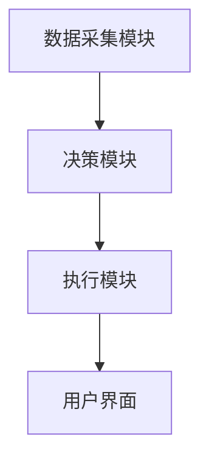

                 


# AI Agent在智能水资源管理中的实践

## 关键词：AI Agent，智能水资源管理，算法原理，系统架构，项目实战

## 摘要：  
本文探讨AI Agent在智能水资源管理中的应用，从基本概念、算法原理到系统架构和项目实战，全面分析其在水资源优化管理中的作用。通过实际案例，展示如何利用AI Agent技术解决水资源管理中的复杂问题，提高管理效率和决策精度。

---

# 第1章: AI Agent与水资源管理的背景介绍

## 1.1 AI Agent的基本概念  
### 1.1.1 什么是AI Agent  
AI Agent（人工智能代理）是一种能够感知环境、自主决策并执行任务的智能实体。它可以基于传感器输入、历史数据和用户指令，通过算法进行推理和选择最优行动方案。

### 1.1.2 AI Agent的核心特征  
- **自主性**：无需人工干预，自主完成任务。  
- **反应性**：实时感知环境变化并做出反应。  
- **学习能力**：通过数据和经验不断优化决策策略。  

### 1.1.3 AI Agent与传统自动化的区别  
AI Agent不仅执行预设指令，还能自主学习和适应环境，而传统自动化系统依赖固定程序。

## 1.2 智能水资源管理的定义与挑战  
### 1.2.1 水资源管理的基本概念  
水资源管理涉及水的分配、使用、保护和恢复，确保可持续利用。  

### 1.2.2 智能水资源管理的核心目标  
- **优化配置**：合理分配水资源，避免浪费。  
- **实时监控**：监测水质、水量和水位变化。  
- **预测预警**：预测干旱、洪涝等自然灾害，提前采取措施。  

### 1.2.3 当前水资源管理的主要挑战  
- 数据获取困难：监测点分布广，数据采集成本高。  
- 决策复杂：涉及多方利益，决策需综合考虑经济、社会和环境因素。  
- 环境动态变化：气候变化和人类活动影响水资源分布。  

## 1.3 AI Agent在水资源管理中的应用前景  
### 1.3.1 AI Agent在水资源管理中的优势  
- 高效决策：快速分析数据，提供最优解决方案。  
- 自适应性：根据环境变化自动调整策略。  
- 实时监控：持续监测水情，及时预警。  

### 1.3.2 AI Agent在水资源管理中的应用场景  
- **水量预测**：基于历史数据和天气预报，预测未来水量。  
- **水质监测**：实时检测水质指标，确保饮用水安全。  
- **智能调度**：优化水资源分配，满足不同地区需求。  

### 1.3.3 AI Agent技术的发展趋势  
- 更强的学习能力：深度学习和强化学习提升决策精度。  
- 更广的应用范围：从局部区域扩展到全球水资源管理。  
- 更高的实时性：边缘计算和物联网技术实现快速响应。  

## 1.4 本章小结  
本章介绍了AI Agent的基本概念、智能水资源管理的核心目标以及AI Agent在水资源管理中的应用优势和前景。下一章将详细探讨AI Agent的核心概念与原理，及其与水资源管理的紧密联系。

---

# 第2章: AI Agent的核心概念与联系  

## 2.1 AI Agent的核心原理  
### 2.1.1 知识表示与推理  
AI Agent通过构建知识图谱，将水资源管理中的数据结构化，利用推理算法（如逻辑推理和概率推理）进行决策。

### 2.1.2 行为选择与决策  
基于感知信息和目标函数，AI Agent通过多目标优化算法选择最优行动方案。

### 2.1.3 环境感知与交互  
通过传感器和数据接口，AI Agent实时感知环境状态，并与用户、系统和其他智能体进行交互。

## 2.2 AI Agent与水资源管理的核心要素  
### 2.2.1 数据采集与处理  
AI Agent需要整合来自多种传感器（如水位计、水质传感器）的数据，进行清洗、融合和特征提取。

### 2.2.2 智能决策与优化  
利用强化学习和遗传算法，AI Agent优化水资源分配策略，确保高效利用。

### 2.2.3 系统反馈与迭代  
系统根据执行结果反馈，更新模型参数，持续优化决策策略。

---

# 第3章: AI Agent的算法原理与数学模型  

## 3.1 AI Agent的算法原理  
### 3.1.1 基于状态转移的AI Agent算法  
AI Agent根据当前状态和动作选择，转移到新的状态，实现目标函数的最大化。  

### 3.1.2 基于Q-learning的AI Agent算法  
通过不断试错，AI Agent学习状态-动作值函数，选择最优动作。  

### 3.1.3 基于强化学习的AI Agent算法  
结合奖励机制，AI Agent通过探索和利用策略，找到最优决策路径。  

## 3.2 AI Agent的数学模型与公式  
### 3.2.1 状态转移矩阵  
$$ P_{i,j} = \text{概率从状态i转移到状态j} $$  

### 3.2.2 Q-learning算法公式  
$$ Q(s,a) = r + \gamma \max Q(s',a') $$  
其中，$r$是奖励值，$\gamma$是折扣因子。  

### 3.2.3 奖励函数设计  
$$ R(s,a) = \text{奖励值} $$  

---

# 第4章: 系统分析与架构设计方案  

## 4.1 问题场景介绍  
以某城市水资源分配为例，分析如何利用AI Agent优化供水调度。

## 4.2 系统功能设计  
- 数据采集模块：整合水质、水位等实时数据。  
- 决策模块：基于AI算法，生成最优调度方案。  
- 执行模块：根据决策结果，控制阀门和水泵。  

## 4.3 系统架构设计  
### 4.3.1 系统架构图  


### 4.3.2 系统接口设计  
- 数据接口：与传感器和数据库交互。  
- 用户接口：提供人机交互界面，显示实时数据和决策建议。  

---

# 第5章: 项目实战  

## 5.1 环境安装  
安装Python、TensorFlow、Keras等工具，配置数据采集设备。

## 5.2 系统核心实现源代码  
```python
import numpy as np
from tensorflow.keras.models import Sequential
from tensorflow.keras.layers import Dense

# 定义Q-learning算法
class AIAgent:
    def __init__(self, state_size, action_size):
        self.model = self.build_model(state_size, action_size)
        self.gamma = 0.99
        self.epsilon = 0.1
    
    def build_model(self, state_size, action_size):
        model = Sequential()
        model.add(Dense(32, activation='relu', input_dim=state_size))
        model.add(Dense(action_size))
        model.compile(optimizer='adam', loss='mse')
        return model
    
    def act(self, state):
        if np.random.random() < self.epsilon:
            return np.random.randint(0, self.model.output_shape[-1])
        q_values = self.model.predict(np.array([state]))
        return np.argmax(q_values[0])
    
    def learn(self, state, action, reward, next_state):
        target = reward + self.gamma * np.max(self.model.predict(np.array([next_state])))
        target = np.array([target])
        self.model.fit(np.array([state]), target, epochs=1, verbose=0)
```

## 5.3 代码应用解读与分析  
- **数据预处理**：清洗和标准化输入数据。  
- **模型训练**：使用历史数据训练AI Agent的决策模型。  
- **实时测试**：在实际场景中测试模型性能，并根据反馈调整参数。  

## 5.4 实际案例分析  
以某城市供水调度为例，展示AI Agent如何优化水资源分配，减少浪费，提高用水效率。  

## 5.5 项目小结  
通过实际案例，验证了AI Agent在水资源管理中的有效性，为后续研究提供了参考。

---

# 第6章: 总结与展望  

## 6.1 本章总结  
本文详细探讨了AI Agent在智能水资源管理中的应用，从理论到实践，全面分析了其优势和挑战。

## 6.2 未来展望  
未来，AI Agent将更加智能化和分布式，结合区块链技术，实现去中心化的水资源管理。

---

# 第7章: 最佳实践 tips  

## 7.1 小结  
AI Agent技术为水资源管理提供了新思路，但仍需解决数据隐私、模型鲁棒性等问题。

## 7.2 注意事项  
- 确保数据质量和实时性。  
- 定期更新模型，适应环境变化。  
- 建立完善的反馈机制，及时优化决策策略。  

## 7.3 拓展阅读  
推荐相关书籍和论文，进一步深入了解AI Agent和水资源管理的结合应用。

---

# 结语  
AI Agent在智能水资源管理中的应用前景广阔，随着技术进步，其作用将更加显著，为全球水资源可持续管理提供有力支持。

