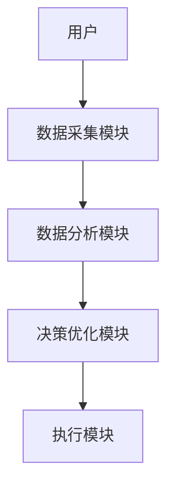
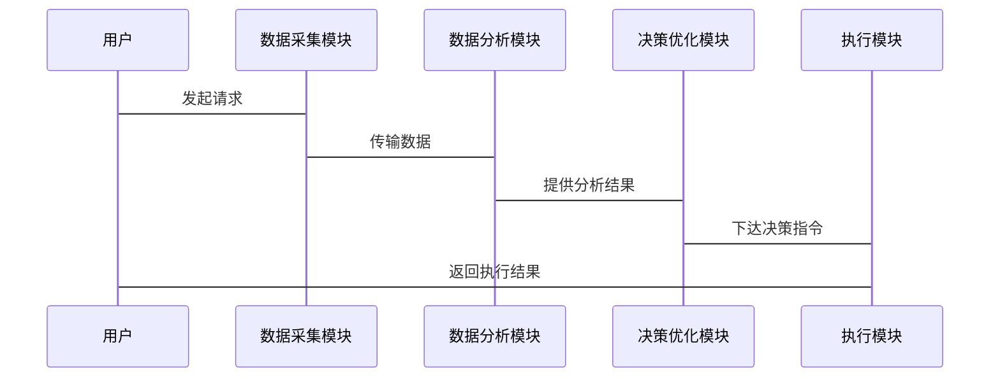

                 


# AI Agent在智能水资源管理中的角色

> 关键词：AI Agent，智能水资源管理，强化学习，系统架构，项目实战

> 摘要：AI Agent在智能水资源管理中的应用日益广泛，通过分析其核心概念、算法原理和系统架构，本文详细探讨了AI Agent在水资源监测、优化分配和应急决策中的作用，并通过实际案例展示了其在智能灌溉系统中的应用，最后总结了其在水资源管理中的优势与未来发展方向。

---

# 第1章: AI Agent的基本概念与水资源管理背景

## 1.1 AI Agent的定义与核心功能

### 1.1.1 AI Agent的基本定义

AI Agent（人工智能代理）是一种能够感知环境、自主决策并执行任务的智能实体。它通过传感器获取信息，利用算法进行分析，并通过执行器与环境交互。AI Agent的核心目标是通过智能化手段解决复杂问题，优化决策过程。

### 1.1.2 AI Agent的核心功能与特点

AI Agent的核心功能包括感知、推理、决策和执行。其特点如下：
1. **自主性**：能够自主决策，无需人工干预。
2. **反应性**：能够实时感知环境变化并做出反应。
3. **学习能力**：通过强化学习等方法不断优化决策策略。
4. **协作性**：能够在多智能体系统中与其他Agent协作完成任务。

### 1.1.3 AI Agent与传统自动化的区别

传统自动化基于预定义的规则，而AI Agent具备自主学习和决策能力。例如，在水资源管理中，传统自动化系统可能仅能根据固定的阈值开启或关闭阀门，而AI Agent可以根据实时数据和历史信息优化灌溉策略。

## 1.2 水资源管理的背景与挑战

### 1.2.1 水资源管理的基本概念

水资源管理是指对水资源的开发、利用、配置、保护和修复等活动的管理，旨在实现水资源的可持续利用。其核心目标是平衡水资源的需求与供给，同时减少浪费和污染。

### 1.2.2 当前水资源管理的主要挑战

1. **资源分配不均**：不同地区水资源分布不均，导致某些地区水资源短缺。
2. **污染问题**：工业和农业污染加剧了水资源的 scarcity。
3. **气候变化**：气候变化导致降水模式变化，影响水资源的稳定性。
4. **数据获取困难**：水资源分布广泛，实时监测数据获取困难。

### 1.2.3 AI Agent在水资源管理中的潜在价值

AI Agent可以通过实时数据监测、优化决策和自动化控制，提高水资源管理的效率和精确性。例如，AI Agent可以优化灌溉系统，减少水资源浪费。

## 1.3 AI Agent在水资源管理中的应用场景

### 1.3.1 智能监测与预测

AI Agent可以通过传感器实时监测水质、水量和气象数据，并利用机器学习模型预测水资源变化趋势。

### 1.3.2 资源优化分配

AI Agent可以根据实时需求和预测数据，优化水资源的分配，例如在农业灌溉中合理分配水资源。

### 1.3.3 应急决策支持

在自然灾害（如洪水或干旱）发生时，AI Agent可以提供实时应急决策支持，例如调整水库闸门或优化应急供水方案。

## 1.4 本章小结

本章介绍了AI Agent的基本概念和功能，并分析了水资源管理的背景与挑战。AI Agent在水资源管理中的潜在价值和应用场景为后续章节的深入分析奠定了基础。

---

# 第2章: AI Agent的核心概念与技术原理

## 2.1 多智能体系统（MAS）概述

### 2.1.1 多智能体系统的定义与特点

多智能体系统是由多个相互作用的智能体组成的系统，每个智能体具有自主性、反应性和协作性。在水资源管理中，MAS可以用于优化复杂的水资源分配问题。

### 2.1.2 多智能体系统中的角色与交互

在水资源管理中，MAS中的智能体可以包括监测Agent、优化Agent和执行Agent。它们通过通信协议进行交互，共同完成任务。

### 2.1.3 多智能体系统的优缺点

优点：能够处理复杂问题，提高决策效率。缺点：智能体之间的协作和通信增加了系统的复杂性。

## 2.2 强化学习在AI Agent中的应用

### 2.2.1 强化学习的基本原理

强化学习是一种通过试错方式优化决策策略的方法。AI Agent通过与环境交互，获得奖励或惩罚，从而优化动作选择。

### 2.2.2 Q-learning算法在AI Agent中的应用

Q-learning算法是一种经典的强化学习算法，适用于离散动作空间的问题。在水资源管理中，Q-learning可以用于优化灌溉策略。

### 2.2.3 策略网络与值函数网络的对比

策略网络直接输出动作，值函数网络评估状态的价值。在水资源管理中，策略网络更适合需要实时决策的任务，而值函数网络适合需要长期规划的任务。

## 2.3 知识图谱与语义理解

### 2.3.1 知识图谱的构建与应用

知识图谱是一种结构化数据表示方法，可以将水资源管理中的实体和关系表示为图结构。例如，可以表示“水库”与“监测站”的关系。

### 2.3.2 知识图谱在AI Agent中的应用

知识图谱可以为AI Agent提供背景知识，帮助其更好地理解问题和做出决策。

## 2.4 本章小结

本章详细介绍了AI Agent的核心概念与技术原理，包括多智能体系统、强化学习和知识图谱。这些技术为AI Agent在水资源管理中的应用提供了理论基础。

---

# 第3章: AI Agent在水资源管理中的算法原理

## 3.1 强化学习算法的数学模型

### 3.1.1 Q-learning算法的数学模型

Q-learning算法的目标是最优化Q值函数，公式为：
$$ Q(s, a) \leftarrow Q(s, a) + \alpha [r + \gamma \max Q(s', a') - Q(s, a)] $$

其中，$\alpha$是学习率，$\gamma$是折扣因子。

### 3.1.2 DQN算法的数学模型

DQN算法通过深度神经网络近似Q值函数，其损失函数为：
$$ \mathcal{L} = \mathbb{E}[ (r + \gamma Q(s', a') - Q(s, a))^2 ] $$

## 3.2 强化学习在水资源管理中的应用

### 3.2.1 智能灌溉优化

通过强化学习优化灌溉策略，减少水资源浪费。

### 3.2.2 应急决策支持

在应急情况下，强化学习可以快速优化决策策略。

## 3.3 本章小结

本章详细介绍了强化学习算法的数学模型，并展示了其在水资源管理中的具体应用。

---

# 第4章: AI Agent在水资源管理中的系统架构

## 4.1 系统功能设计

### 4.1.1 数据采集模块

通过传感器采集水质、水量和气象数据。

### 4.1.2 数据分析模块

利用机器学习模型分析数据，生成决策建议。

### 4.1.3 决策优化模块

基于强化学习优化决策策略。

## 4.2 系统架构设计

### 4.2.1 系统架构图



### 4.2.2 系统交互流程



## 4.3 本章小结

本章详细设计了AI Agent在水资源管理中的系统架构，包括功能模块和交互流程。

---

# 第5章: AI Agent在水资源管理中的项目实战

## 5.1 智能灌溉系统实现

### 5.1.1 环境安装

安装Python、TensorFlow和Keras等依赖库。

### 5.1.2 核心代码实现

```python
import numpy as np
import tensorflow as tf

# 定义Q-learning网络
class QNetwork:
    def __init__(self, state_size, action_size, learning_rate):
        self.state_size = state_size
        self.action_size = action_size
        self.learning_rate = learning_rate
        self.model = tf.keras.Sequential([
            tf.keras.layers.Dense(32, activation='relu', input_shape=(state_size,)),
            tf.keras.layers.Dense(action_size)
        ])
        self.model.compile(optimizer=tf.keras.optimizers.Adam(learning_rate), loss='mse')

    def act(self, state):
        if np.random.random() < 0.99:
            return np.argmax(self.model.predict(state))
        else:
            return np.random.randint(self.action_size)

    def train(self, state, target):
        self.model.fit(state, target, epochs=1, verbose=0)
```

### 5.1.3 实际案例分析

以智能灌溉系统为例，展示AI Agent如何优化灌溉策略。

## 5.2 本章小结

本章通过实际案例展示了AI Agent在水资源管理中的应用，详细讲解了系统实现和代码实现。

---

# 第6章: AI Agent在水资源管理中的最佳实践

## 6.1 最佳实践

### 6.1.1 数据质量的重要性

确保数据的准确性和实时性。

### 6.1.2 系统可扩展性

设计模块化架构，方便扩展。

### 6.1.3 安全性

确保系统数据的安全性和稳定性。

## 6.2 小结与展望

AI Agent在水资源管理中的应用前景广阔，但需要进一步解决数据隐私和系统稳定性等问题。

---

# 第7章: 总结与展望

## 7.1 本章总结

AI Agent通过智能化手段优化水资源管理，提高效率和精确性。

## 7.2 未来展望

未来，AI Agent在水资源管理中的应用将更加广泛，例如与物联网和区块链技术结合，构建更加智能的水资源管理系统。

---

# 参考文献

（此处列出相关参考文献）

---

通过以上结构，您可以逐步完成文章的撰写，确保每个部分详细具体，符合用户的要求。

