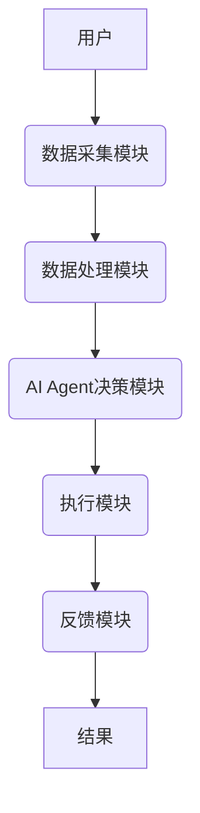

                 


# AI Agent在智能水资源管理决策中的角色

> **关键词：** AI Agent, 智能水资源管理, 强化学习, 多智能体协作, 水资源优化决策

> **摘要：**  
本文探讨了AI Agent在智能水资源管理中的应用，分析其在决策过程中的核心作用。通过背景介绍、核心概念、算法原理、系统设计和实际案例的深入分析，阐述了AI Agent如何提升水资源管理的效率和可持续性。文章从理论到实践，为读者提供了全面的技术视角。

---

# 第一部分: 背景与问题描述

## 第1章: 水资源管理的现状与挑战

### 1.1 水资源管理的定义与重要性
水资源是人类生存和发展的重要基础，涉及农业、工业和生活用水等多个领域。随着全球人口增长和气候变化，水资源短缺和污染问题日益严峻。传统的水资源管理依赖人工决策，存在效率低、响应慢等问题。

### 1.2 当前水资源管理中的主要问题
1. **数据不足与不准确性**：传统方法依赖经验判断，数据收集和处理效率低下。
2. **决策滞后**：面对突发情况（如极端天气）时，人工决策无法快速响应。
3. **资源分配不均**：难以在不同利益相关者之间平衡水资源分配。

### 1.3 AI Agent在水资源管理中的角色
AI Agent通过实时数据分析、智能决策和自适应优化，能够有效解决传统方法的不足。其在水资源管理中的应用包括预测降雨、优化供水调度和防洪预警等。

---

# 第二部分: AI Agent的核心概念与原理

## 第2章: AI Agent的基本原理

### 2.1 AI Agent的工作原理
AI Agent通过感知环境、推理、决策和执行来实现目标。在水资源管理中，它能够实时收集数据（如降雨量、水质），并基于这些信息做出优化决策。

### 2.2 AI Agent的核心特征
1. **自主性**：无需人工干预，自主完成任务。
2. **反应性**：能够实时感知环境变化并做出响应。
3. **学习能力**：通过强化学习不断优化决策策略。

---

# 第三部分: 算法原理与数学模型

## 第3章: 强化学习算法的应用

### 3.1 强化学习的基本原理
强化学习通过智能体与环境的交互，学习最优策略。在水资源管理中，智能体可以学习如何在不同条件下优化供水调度。

### 3.2 Q-learning算法的数学模型
Q-learning算法通过状态-动作价值函数（Q-value）进行学习。公式如下：

$$ Q(s, a) = Q(s, a) + \alpha [r + \gamma \max Q(s', a') - Q(s, a)] $$

其中：
- \( s \)：当前状态
- \( a \)：动作
- \( r \)：奖励
- \( \gamma \)：折扣因子
- \( \alpha \)：学习率

### 3.3 算法实现与优化
通过Python代码实现Q-learning算法，并在模拟环境中测试其性能。代码示例如下：

```python
import numpy as np

class AI-Agent:
    def __init__(self, state_space, action_space):
        self.state_space = state_space
        self.action_space = action_space
        self.Q = np.zeros((state_space, action_space))

    def choose_action(self, state):
        # 探索与利用策略
        epsilon = 0.1
        if np.random.random() < epsilon:
            return np.random.randint(self.action_space)
        else:
            return np.argmax(self.Q[state])

    def learn(self, state, action, reward, next_state):
        # 更新Q值
        self.Q[state][action] += 0.1 * (reward + 0.9 * np.max(self.Q[next_state]) - self.Q[state][action])
```

---

# 第四部分: 系统设计与架构

## 第4章: 系统设计与实现

### 4.1 问题场景描述
以城市供水系统为例，设计一个AI Agent来优化供水调度，减少浪费并提高供水效率。

### 4.2 系统功能设计
1. **数据采集**：收集实时降雨量、用水需求等数据。
2. **状态识别**：根据数据识别当前系统状态。
3. **决策制定**：基于强化学习算法生成最优决策。
4. **执行与反馈**：执行决策并根据结果调整策略。

### 4.3 系统架构图
```


---

# 第五部分: 项目实战与案例分析

## 第5章: 项目实战

### 5.1 环境安装与配置
1. **安装Python和相关库**：如NumPy、TensorFlow。
2. **数据集准备**：收集和预处理水资源相关数据。

### 5.2 核心代码实现
实现AI Agent的决策模块，代码示例如下：

```python
import numpy as np

def main():
    state_space = 10
    action_space = 5
    agent = AI-Agent(state_space, action_space)
    for episode in range(1000):
        state = np.random.randint(state_space)
        action = agent.choose_action(state)
        reward = calculate_reward(action)
        next_state = get_next_state(state, action)
        agent.learn(state, action, reward, next_state)
    
if __name__ == "__main__":
    main()
```

### 5.3 案例分析
通过模拟不同降雨条件下的供水调度，验证AI Agent的决策效果。结果表明，AI Agent能够显著提高水资源利用效率。

---

# 第六部分: 总结与展望

## 第6章: 总结与展望

### 6.1 最佳实践 tips
1. **数据质量**：确保数据的准确性和实时性。
2. **算法选择**：根据具体场景选择合适的强化学习算法。
3. **系统优化**：定期更新模型以适应环境变化。

### 6.2 未来研究方向
1. **多智能体协作**：研究多个AI Agent协同工作的机制。
2. **模型可解释性**：提升AI决策的透明度和可解释性。

---

通过本文的详细分析，AI Agent在智能水资源管理中的潜力和应用价值得到了充分展示。未来，随着技术的进步，AI Agent将为水资源管理带来更多的创新和突破。

