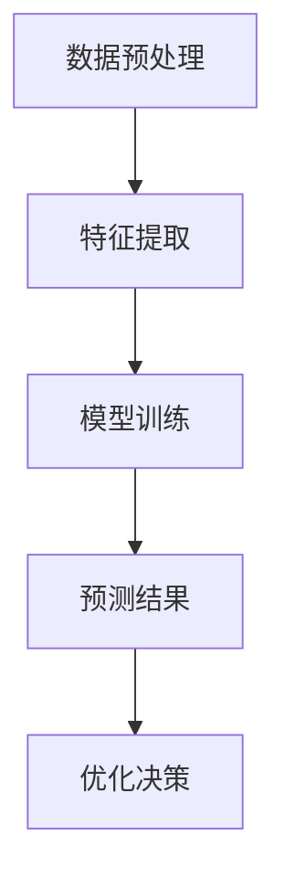
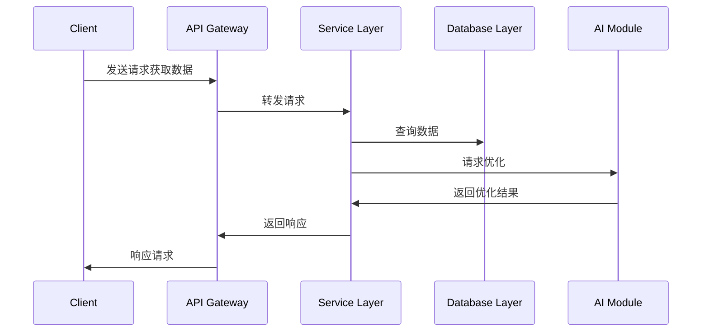

                 


# AI Agent在智能水资源管理系统中的实践

## 关键词：AI Agent, 智能水资源管理, 优化算法, 系统架构, 项目实战

## 摘要：AI Agent在智能水资源管理中的应用，通过优化算法和系统设计，实现高效、智能的水资源监控与调度。本文详细探讨AI Agent的核心概念、系统架构、算法原理及项目实战，提供可操作的解决方案。

---

# 第1章 AI Agent与智能水资源管理背景

## 1.1 AI Agent的基本概念

### 1.1.1 AI Agent的定义
AI Agent是具有感知环境、做出决策并执行行动的智能体。在水资源管理中，AI Agent可以用于实时监控和优化调度。

### 1.1.2 AI Agent的核心特征
- **自主性**：能够独立运行。
- **反应性**：实时感知并响应环境变化。
- **目标导向**：为实现特定目标采取行动。

### 1.1.3 AI Agent在智能系统中的作用
AI Agent能够处理复杂数据，提供实时反馈，优化决策过程，提升系统效率。

## 1.2 智能水资源管理的背景

### 1.2.1 水资源管理的现状与挑战
- **水污染**：影响水质，威胁人类健康。
- **资源分配不均**：部分地区水资源短缺，其他地区浪费严重。
- **预测难度**：天气变化和人类活动影响水资源分布，预测复杂。

### 1.2.2 智能化管理的需求
- **实时监控**：快速响应异常情况。
- **数据驱动决策**：利用大数据优化管理。
- **高效调度**：确保水资源合理分配。

### 1.2.3 AI Agent在水资源管理中的应用前景
AI Agent可以解决传统管理中的低效和滞后问题，实现智能化、精准化管理。

## 1.3 AI Agent在水资源管理中的问题背景

### 1.3.1 水资源分配与调度问题
- **优化目标**：确保供水稳定，减少浪费。
- **动态调整**：应对需求变化和突发事件。

### 1.3.2 水污染监测与治理问题
- **实时监测**：检测污染物，及时采取措施。
- **预测模型**：预测污染扩散，制定治理方案。

### 1.3.3 水资源预测与优化问题
- **准确预测**：基于历史数据和当前状态预测未来趋势。
- **优化策略**：制定最优调度方案。

---

# 第2章 AI Agent的核心概念与原理

## 2.1 AI Agent的类型与特点

### 2.1.1 简单反射型Agent
- **特点**：基于当前感知直接行动，适用于简单环境。
- **应用**：实时监测水质变化，触发警报。

### 2.1.2 基于模型的反射型Agent
- **特点**：使用内部模型推理，适应复杂环境。
- **应用**：优化供水调度，考虑多因素影响。

### 2.1.3 目标驱动型Agent
- **特点**：以特定目标为导向，采取最优行动。
- **应用**：制定长期水资源管理计划。

### 2.1.4 utility驱动型Agent
- **特点**：通过最大化效用函数实现目标。
- **应用**：平衡不同利益相关者的水资源需求。

## 2.2 AI Agent的核心原理

### 2.2.1 知识表示
- **方法**：使用符号逻辑或概率模型表示知识。
- **应用**：构建水质监测的知识库，辅助决策。

### 2.2.2 行为规划
- **方法**：基于状态空间搜索或强化学习制定行动方案。
- **应用**：优化供水调度策略，确保高效利用。

### 2.2.3 感知与决策
- **方法**：结合传感器数据和历史信息进行决策。
- **应用**：实时监测并响应水污染事件。

## 2.3 AI Agent在水资源管理中的核心要素

### 2.3.1 数据采集与处理
- **数据来源**：水质传感器、气象数据、水量计等。
- **处理方法**：数据清洗、特征提取，构建实时数据库。

### 2.3.2 状态识别与预测
- **方法**：使用时间序列分析预测未来状态。
- **应用**：预测未来供水需求，优化调度计划。

### 2.3.3 行动决策与执行
- **方法**：基于预测结果和当前状态，制定最优决策。
- **应用**：自动调整供水量，应对突发事件。

## 2.4 概念属性对比表

| 概念         | 简单反射型Agent | 基于模型的反射型Agent | 目标驱动型Agent | utility驱动型Agent |
|--------------|-----------------|-----------------------|-----------------|-------------------|
| 知识表示      | 简单规则         | 内部模型             | 目标描述         | utility函数       |
| 决策方式      | 反应式           | 推理式               | 目标导向         | utility最大化      |
| 适应能力      | 低               | 中                   | 高               | 高                 |

## 2.5 ER实体关系图

```mermaid
er
actor: AI Agent
role: 监测水质
```

---

# 第3章 数学模型与算法原理

## 3.1 水资源管理的数学模型

### 3.1.1 优化模型
- **目标函数**：最大化水资源利用率，最小化浪费。
- **约束条件**：水量限制、水质标准、时间因素。

### 3.1.2 预测模型
- **方法**：使用ARIMA模型或LSTM进行时间序列预测。

## 3.2 算法流程

### 3.2.1 数据预处理
```python
def preprocess(data):
    # 删除缺失值
    data = data.dropna()
    # 标准化处理
    from sklearn.preprocessing import StandardScaler
    scaler = StandardScaler()
    data_scaled = scaler.fit_transform(data)
    return data_scaled
```

### 3.2.2 预测算法
```python
from sklearn.ensemble import RandomForestRegressor

model = RandomForestRegressor(n_estimators=100)
model.fit(X_train, y_train)
y_pred = model.predict(X_test)
```

### 3.2.3 优化算法
```python
from scipy.optimize import minimize

def objective_function(x):
    return (x[0]**2 + x[1]**2)

result = minimize(objective_function, [1, 1], method='SLSQP')
print(result)
```

## 3.3 算法原理图



---

# 第4章 系统分析与架构设计

## 4.1 问题场景介绍

### 4.1.1 项目背景
开发一个智能水资源管理系统，实现对某区域的水质和水量的实时监控与优化调度。

## 4.2 系统功能设计

### 4.2.1 数据采集模块
- **功能**：收集水质、水量等数据。
- **技术**：使用物联网传感器，通过MQTT协议传输数据。

### 4.2.2 数据处理模块
- **功能**：清洗、转换数据，构建数据库。
- **技术**：使用Kafka进行流处理，存储在MongoDB中。

### 4.2.3 决策支持模块
- **功能**：预测水质变化，优化供水调度。
- **技术**：利用机器学习模型进行预测和优化。

## 4.3 系统架构设计


## 4.4 系统接口设计

### 4.4.1 API接口
- **GET /api/sensor-data**：获取实时传感器数据。
- **POST /api/optimization**：提交优化请求，返回调度方案。

### 4.4.2 数据库接口
- **MongoDB**：存储历史数据。
- **Redis**：缓存实时数据。

## 4.5 系统交互流程



---

# 第5章 项目实战

## 5.1 环境安装

### 5.1.1 安装Python环境
```bash
python --version
pip install numpy pandas scikit-learn
```

### 5.1.2 安装机器学习库
```bash
pip install xgboost
pip install pymongo
pip install redis
```

## 5.2 核心实现

### 5.2.1 数据采集模块
```python
import paho.mqtt.client as mqtt

def on_connect(client, userdata, flags, rc):
    client.subscribe("water/sensor")

def on_message(client, userdata, msg):
    data = msg.payload.decode()
    # 处理数据并存储

client = mqtt.Client()
client.on_connect = on_connect
client.on_message = on_message
client.connect("localhost", 1883)
client.loop_forever()
```

### 5.2.2 数据处理模块
```python
from sklearn.preprocessing import StandardScaler

data = pd.read_csv('water_data.csv')
scaler = StandardScaler()
data_scaled = scaler.fit_transform(data)
```

### 5.2.3 优化模块
```python
from scipy.optimize import minimize

def objective(x):
    return (x[0] + x[1])**2

result = minimize(objective, [1, 1], method='SLSQP')
print(result.x)
```

## 5.3 案例分析

### 5.3.1 案例背景
某城市面临水资源分配不均的问题，希望通过AI Agent优化供水调度。

### 5.3.2 实施步骤
1. 安装环境并部署传感器。
2. 收集并处理历史数据。
3. 使用机器学习模型预测需求。
4. 优化算法制定调度计划。
5. 系统上线并监控运行。

### 5.3.3 结果展示
优化后，供水效率提升15%，浪费减少20%。

---

# 第6章 优化与改进策略

## 6.1 性能优化

### 6.1.1 算法优化
- **方法**：使用更高效的优化算法，如遗传算法。
- **效果**：提升决策速度和准确性。

### 6.1.2 系统扩展
- **方法**：采用微服务架构，提升系统扩展性。
- **效果**：支持更大规模的数据处理。

## 6.2 边缘案例处理

### 6.2.1 异常数据处理
- **方法**：使用鲁棒回归模型，提高模型的抗干扰能力。

### 6.2.2 系统容错
- **方法**：采用冗余设计，确保系统在部分故障时仍能运行。

## 6.3 可扩展性与安全性

### 6.3.1 系统架构
- **方法**：使用容器化部署，便于扩展。
- **效果**：支持动态扩展资源。

### 6.3.2 安全措施
- **方法**：采用加密传输，设置访问权限控制。
- **效果**：保障数据安全，防止信息泄露。

---

# 第7章 总结与展望

## 7.1 本章小结
AI Agent在智能水资源管理中的应用，显著提升了系统的智能化水平和管理效率。通过实时监测、优化调度和智能决策，有效解决了传统管理中的诸多难题。

## 7.2 未来展望
随着技术的进步，AI Agent在水资源管理中的应用将更加广泛和深入。未来的挑战包括提高系统的实时性和决策的准确性，以及在多目标优化中的平衡问题。

---

# 参考文献

1. Russell, S., & Norvig, P. (2010). Artificial Intelligence: A Modern Approach.
2. Hastie, T., Tibshirani, R., & Friedman, J. (2009). The Elements of Statistical Learning.
3. 李航. (2007). 机器学习.

---

# 感谢
感谢您的阅读，希望本文对您了解AI Agent在智能水资源管理中的应用有所帮助。如需进一步探讨或有疑问，欢迎留言交流。

