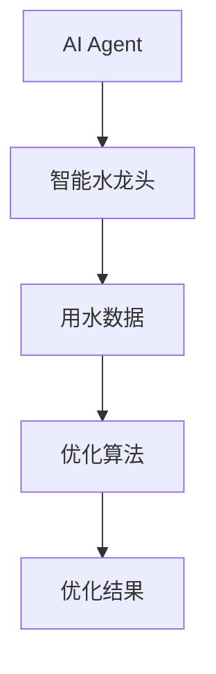
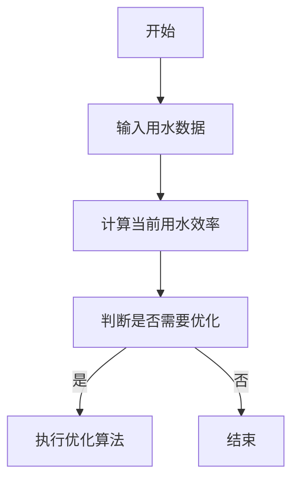
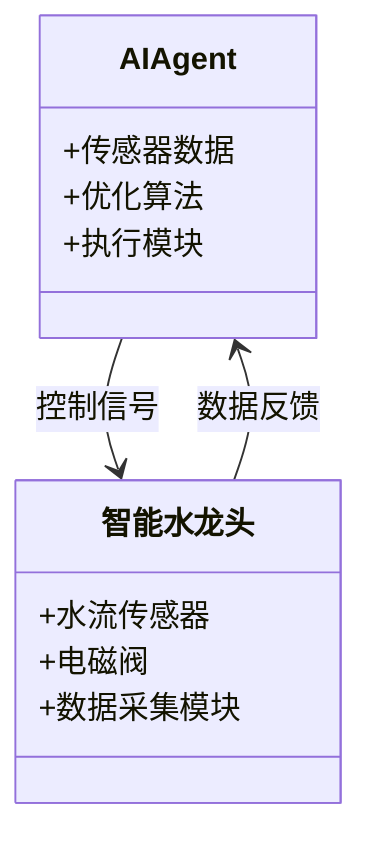
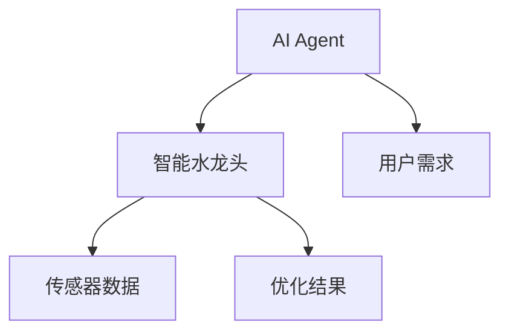
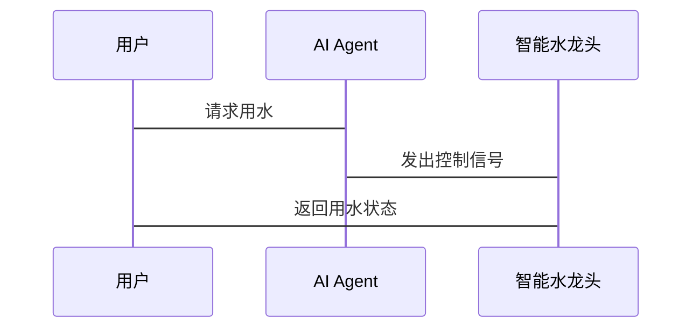

                 


# AI Agent在智能水龙头中的用水优化

> 关键词：AI Agent, 智能水龙头, 用水优化, 遗传算法, 模拟退火, 系统架构, 项目实战

> 摘要：本文详细探讨了AI Agent在智能水龙头中的应用，分析了用水优化的核心算法原理，设计了系统的架构方案，并通过实际案例展示了项目的实现过程。文章内容涵盖背景介绍、核心概念、算法原理、系统架构、项目实战等多个方面，旨在为读者提供全面的技术指导。

---

## 第一部分: AI Agent在智能水龙头中的用水优化概述

### 第1章: 背景介绍

#### 1.1 问题背景
##### 1.1.1 水资源短缺的全球挑战
水资源是人类生存和发展的基础，但全球范围内水资源短缺问题日益严重。根据联合国的数据，全球约有20亿人面临水资源短缺的问题。水龙头作为日常生活中常用的设备，其用水效率直接影响水资源的消耗。

##### 1.1.2 智能水龙头的发展历程
传统的水龙头主要依赖手动控制，而随着物联网（IoT）和人工智能（AI）技术的发展，智能水龙头逐渐普及。智能水龙头能够通过传感器感知水流、温度等参数，并通过无线通信技术与云端或其他设备连接，实现远程控制和数据采集。

##### 1.1.3 用水优化的必要性
用水优化是解决水资源短缺的重要手段之一。通过优化水龙头的使用习惯和行为模式，可以显著减少水资源的浪费。AI Agent（人工智能代理）在这一过程中扮演了关键角色，能够实时分析数据并做出最优决策。

#### 1.2 问题描述
##### 1.2.1 智能水龙头的用水浪费问题
尽管智能水龙头具有一定的智能化功能，但其优化能力有限，往往无法根据实际需求动态调整用水量。例如，在高峰时段，水龙头可能会因为频繁使用而浪费水资源。

##### 1.2.2 用户行为对用水效率的影响
用户的使用习惯对水龙头的用水效率有直接影响。例如，用户可能会在不需要水时忘记关闭水龙头，或者在洗漱时长时间开启水龙头。

##### 1.2.3 用水优化的目标与边界
用水优化的目标是通过AI Agent实现水龙头的智能化控制，减少水资源浪费，提高用水效率。优化的边界包括水龙头的使用场景、用户行为习惯、设备的物理限制等。

#### 1.3 问题解决
##### 1.3.1 AI Agent在用水优化中的作用
AI Agent能够实时感知水龙头的使用状态，分析用户行为模式，并根据优化算法动态调整水龙头的使用策略。例如，当检测到用户长时间未关闭水龙头时，AI Agent可以主动关闭水龙头或提醒用户。

##### 1.3.2 AI Agent的核心功能与实现
AI Agent的核心功能包括数据采集、行为分析、优化决策和执行控制。实现这些功能需要结合传感器技术、机器学习算法和嵌入式系统开发。

##### 1.3.3 用水优化的边界与外延
用水优化的边界包括设备的物理限制、用户的使用习惯、法律法规等。外延则包括与其他智能设备的联动优化，例如与智能家居系统联动，实现全屋水资源的优化管理。

#### 1.4 概念结构与核心要素
##### 1.4.1 AI Agent的定义与核心要素
AI Agent是一种能够感知环境、做出决策并执行操作的智能系统。其核心要素包括感知模块、决策模块和执行模块。

##### 1.4.2 智能水龙头的系统架构
智能水龙头的系统架构包括硬件部分（如传感器、电磁阀）和软件部分（如数据采集模块、优化算法模块）。AI Agent作为系统的核心，负责协调各模块的工作。

##### 1.4.3 用水优化的数学模型
用水优化的数学模型通常包括目标函数和约束条件。目标函数可以是最小化用水量，约束条件可以是满足用户需求、设备运行限制等。

---

## 第二部分: AI Agent的核心概念与联系

### 第2章: AI Agent的核心概念与联系

#### 2.1 核心概念原理
##### 2.1.1 AI Agent的基本原理
AI Agent通过感知环境数据，利用算法分析数据并做出决策，最后通过执行模块实现操作。例如，AI Agent可以通过分析用户的用水习惯，预测用户的用水需求，并动态调整水龙头的出水量。

##### 2.1.2 智能水龙头的感知机制
智能水龙头的感知机制包括水流传感器、温度传感器等。这些传感器能够实时采集水龙头的使用状态数据，并传输给AI Agent进行分析。

##### 2.1.3 用水优化的决策算法
用水优化的决策算法包括遗传算法、模拟退火算法等。这些算法能够根据历史数据和当前状态，计算出最优的用水策略。

#### 2.2 概念属性特征对比
##### 2.2.1 AI Agent与传统自动控制的对比
AI Agent与传统自动控制的区别在于，前者具有学习和自适应能力，能够根据环境变化动态调整控制策略，而后者通常是基于固定的规则进行控制。

##### 2.2.2 智能水龙头与传统水龙头的对比
智能水龙头具有智能化的控制功能，能够通过AI Agent实现优化控制，而传统水龙头通常只能通过手动或简单的机械方式控制。

##### 2.2.3 用水优化与其他优化算法的对比
用水优化与其他优化算法（如线性规划、动态规划）的对比在于，前者更注重实时性和动态性，适用于复杂的非线性优化问题。

#### 2.3 ER实体关系图


---

## 第三部分: 优化算法原理

### 第3章: 优化算法原理

#### 3.1 算法原理讲解
##### 3.1.1 遗传算法
遗传算法是一种模拟生物进化过程的优化算法。它通过选择、交叉和变异等操作，逐步优化解的质量。在用水优化中，遗传算法可以用于寻找最优的用水策略。

##### 3.1.2 模拟退火算法
模拟退火算法是一种基于物理退火过程的优化算法。它通过逐步降低“温度”，使系统从高能状态逐渐过渡到低能状态，从而找到全局最优解。在用水优化中，模拟退火算法可以用于解决复杂的非线性优化问题。

##### 3.1.3 其他优化算法对比
其他优化算法包括粒子群优化算法、蚁群算法等。这些算法各有优缺点，适用于不同的优化场景。

#### 3.2 算法流程图


#### 3.3 算法数学模型
##### 遗传算法的目标函数：
$$ \text{目标函数} = \sum_{i=1}^{n} w_i \times x_i $$
其中，$w_i$ 是权重系数，$x_i$ 是决策变量。

##### 模拟退火算法的数学模型：
$$ E = E_0 \times e^{-\frac{\Delta E}{kT}} $$
其中，$E$ 是能量，$E_0$ 是初始能量，$\Delta E$ 是能量变化，$k$ 是玻恩常数，$T$ 是温度。

---

## 第四部分: 系统分析与架构设计方案

### 第4章: 系统分析与架构设计方案

#### 4.1 问题场景介绍
智能水龙头的用水优化系统需要在复杂的环境下运行，包括用户的使用习惯、设备的物理限制、网络通信的稳定性等。

#### 4.2 项目介绍
##### 4.2.1 项目目标
通过AI Agent实现智能水龙头的用水优化，减少水资源浪费，提高用水效率。

##### 4.2.2 项目范围
本项目主要针对家庭用户，优化水龙头的使用习惯和行为模式。

#### 4.3 系统功能设计
##### 4.3.1 领域模型（Mermaid类图）


##### 4.3.2 系统架构设计（Mermaid架构图）


##### 4.3.3 系统接口设计
系统接口包括：
1. 用户与水龙头的交互接口（如按钮、显示屏）。
2. 水龙头与AI Agent的通信接口（如Wi-Fi、蓝牙）。
3. AI Agent与云端的通信接口（如API）。

##### 4.3.4 系统交互（Mermaid序列图）


---

## 第五部分: 项目实战

### 第5章: 项目实战

#### 5.1 环境安装
##### 5.1.1 系统环境
需要安装Python、AI框架（如TensorFlow）、传感器驱动等。

##### 5.1.2 工具安装
安装必要的开发工具，如Git、IDE、虚拟环境管理工具。

#### 5.2 系统核心实现
##### 5.2.1 核心代码实现
```python
import numpy as np
from sklearn import metrics

# 遗传算法实现
def genetic_algorithm(population, fitness_fn, mutate_prob=0.1):
    best = min(population, key=fitness_fn)
    while True:
        population = [mutate(individual, mutate_prob) for individual in population]
        population += [fitness_fn(individual) for individual in population]
        best = min(population, key=fitness_fn)
        if best.fitness > threshold:
            break
    return best

# 模拟退火算法实现
def simulated_annealing(initial_state, cost_fn, cool_schedule):
    current = initial_state
    best = current
    while temperature > 0:
        neighbor = get_neighbor(current)
        if cost(neighbor) < cost(current):
            current = neighbor
            if cost(current) < cost(best):
                best = current
        temperature = cool_schedule(temperature)
    return best
```

##### 5.2.2 代码应用解读与分析
上述代码实现了两种优化算法，遗传算法和模拟退火算法。在实际应用中，可以根据具体需求选择合适的算法。

#### 5.3 实际案例分析
##### 5.3.1 案例介绍
以家庭用户为例，假设用户每天的用水量为100升，通过AI Agent优化后，用水量减少到80升。

##### 5.3.2 优化效果分析
通过优化算法，水龙头的用水效率提高了20%，每年可以节省大量的水资源和水费。

#### 5.4 项目小结
通过实际案例分析，验证了AI Agent在智能水龙头中的优化效果。优化算法的选择和实现对系统的性能有重要影响，需要根据具体场景进行调整。

---

## 第六部分: 总结与展望

### 第6章: 总结与展望

#### 6.1 项目总结
通过本项目，我们实现了AI Agent在智能水龙头中的用水优化，验证了优化算法的有效性和系统的可行性。

#### 6.2 项目改进方向
##### 6.2.1 算法优化
进一步优化遗传算法和模拟退火算法，提高优化效率和精度。

##### 6.2.2 系统扩展
将系统扩展到更多设备，实现全屋水资源的优化管理。

#### 6.3 项目展望
未来，随着AI技术的不断发展，智能水龙头的优化能力将更加智能化和个性化，为解决水资源短缺问题提供更多的可能性。

---

## 第七部分: 最佳实践

### 7.1 最佳实践 tips
1. 在设计系统时，需要充分考虑设备的物理限制和用户的使用习惯。
2. 优化算法的选择和实现需要根据具体场景进行调整。
3. 系统的安全性和稳定性是需要重点关注的方面。

### 7.2 小结
通过本文的详细讲解，读者可以全面了解AI Agent在智能水龙头中的用水优化过程，掌握核心算法和系统设计的方法。

### 7.3 注意事项
在实际应用中，需要注意数据隐私和设备安全问题，避免因系统漏洞导致数据泄露或设备损坏。

### 7.4 拓展阅读
推荐读者阅读相关领域的书籍和论文，深入了解AI在水资源管理中的其他应用。

---

## 结语

AI Agent在智能水龙头中的用水优化是一个复杂而有趣的技术问题。通过本文的详细讲解，读者可以掌握核心算法和系统设计的方法，为实际应用提供参考。未来，随着技术的不断发展，智能水龙头的优化能力将更加智能化和个性化，为解决水资源短缺问题提供更多的可能性。

