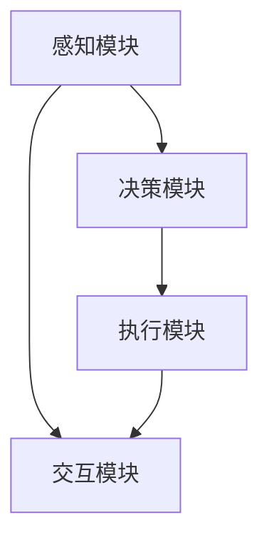
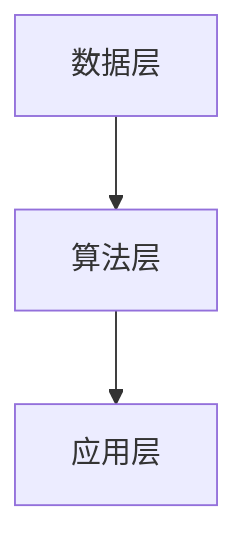
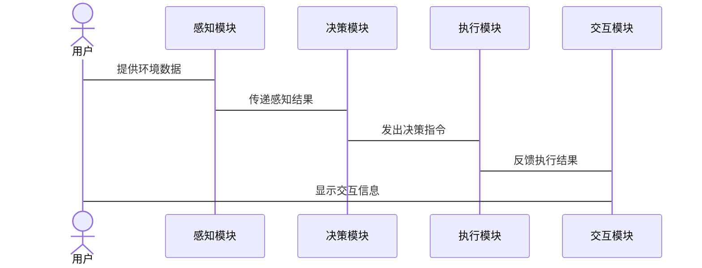

                 


# AI Agent在智能汽车中的驾驶辅助

> 关键词：AI Agent, 智能汽车, 驾驶辅助, 深度学习, 强化学习, 系统架构

> 摘要：本文详细探讨了AI Agent在智能汽车驾驶辅助中的应用，从背景介绍、核心原理、算法实现、系统架构到项目实战，全面解析了AI Agent如何提升驾驶安全性和智能化水平。文章结合理论与实践，通过具体案例和代码实现，展示了AI Agent在智能汽车中的实际应用价值和未来发展方向。

---

## 第一部分: AI Agent与智能汽车驾驶辅助概述

### 第1章: AI Agent与智能汽车驾驶辅助背景介绍

#### 1.1 AI Agent的核心概念

##### 1.1.1 AI Agent的定义与特点
AI Agent（人工智能代理）是指能够感知环境、自主决策并执行任务的智能实体。其核心特点包括：
- **自主性**：无需外部干预，自主完成任务。
- **反应性**：能够实时感知环境变化并做出反应。
- **学习能力**：通过数据和经验不断优化性能。

##### 1.1.2 智能汽车的定义与分类
智能汽车是指通过先进的传感器、计算平台和智能系统，实现车辆与环境之间智能交互的汽车。其分类包括：
- **辅助驾驶（L1-L2级）**：部分功能由系统辅助完成，如车道保持、自适应巡航。
- **高度自动驾驶（L3-L4级）**：系统能够处理大部分驾驶任务，驾驶员可暂时不干预。
- **完全自动驾驶（L5级）**：系统能够完成所有驾驶任务，无需人类干预。

##### 1.1.3 驾驶辅助系统的概念与功能
驾驶辅助系统（ADAS）是智能汽车的重要组成部分，旨在通过技术手段提升驾驶安全性和舒适性。其主要功能包括：
- **环境感知**：通过传感器获取环境信息。
- **决策规划**：基于感知数据做出驾驶决策。
- **执行控制**：将决策转化为具体动作。

#### 1.2 驾驶辅助系统的背景与发展趋势

##### 1.2.1 驾驶辅助系统的发展历程
驾驶辅助系统的发展经历了从单一功能到多系统协同的演变：
- **早期阶段**（20世纪80年代）：单一功能的辅助系统，如防抱死制动系统（ABS）。
- **发展阶段**（21世纪初）：集成化辅助系统，如电子稳定控制系统（ESC）。
- **智能化阶段**（近年来）：基于AI技术的辅助系统，如自动泊车、车道保持辅助。

##### 1.2.2 当前技术现状与挑战
当前，AI Agent在驾驶辅助中的应用日益广泛，但仍面临以下挑战：
- **感知精度**：传感器在复杂环境中的感知精度有限。
- **决策可靠性**：AI Agent的决策模型在极端情况下的可靠性不足。
- **系统安全性**：系统的安全性与稳定性需要进一步提升。

##### 1.2.3 未来发展趋势与应用场景
未来，AI Agent在驾驶辅助中的应用将更加智能化和人性化：
- **应用场景扩展**：从高速公路到城市道路，从普通车辆到共享出行。
- **技术融合**：AI Agent将与5G、物联网等技术深度融合，实现车车互联、车路协同。

#### 1.3 本章小结
本章通过介绍AI Agent和智能汽车的基本概念，分析了驾驶辅助系统的发展历程、现状及未来趋势，为后续章节奠定了基础。

---

## 第二部分: AI Agent的核心原理与技术

### 第2章: AI Agent的核心原理与技术

#### 2.1 AI Agent的基本原理

##### 2.1.1 感知层：环境数据的获取与处理
AI Agent的感知层通过多种传感器获取环境数据：
- **视觉传感器**：如摄像头，用于图像识别和目标检测。
- **雷达传感器**：如毫米波雷达，用于距离和速度测量。
- **激光雷达**：如LiDAR，用于高精度三维环境建模。

##### 2.1.2 决策层：基于数据的智能决策
决策层基于感知数据，利用AI算法做出驾驶决策：
- **规则-based决策**：基于预定义规则的简单决策。
- **学习-based决策**：基于深度学习或强化学习的智能决策。

##### 2.1.3 执行层：决策的执行与反馈
执行层将决策转化为具体动作：
- ** actuators**：如转向系统、制动系统等。
- **反馈机制**：通过传感器实时反馈执行效果，调整决策。

#### 2.2 AI Agent的关键技术

##### 2.2.1 深度学习在AI Agent中的应用
深度学习在AI Agent中的应用主要体现在图像识别和语义理解：
- **卷积神经网络（CNN）**：用于图像识别和目标检测。
- **生成对抗网络（GAN）**：用于图像生成和修复。

##### 2.2.2 强化学习在决策优化中的作用
强化学习通过试错机制优化决策策略：
- **Q-learning**：基于状态-动作-奖励模型的决策优化。
- **Deep Q-Network（DQN）**：结合深度学习的强化学习算法。

##### 2.2.3 自然语言处理在人机交互中的应用
自然语言处理（NLP）技术用于人机交互：
- **文本理解**：通过NLP技术理解用户的意图。
- **语音交互**：通过语音识别和合成实现自然对话。

#### 2.3 AI Agent与智能汽车的结合

##### 2.3.1 AI Agent在智能汽车中的角色定位
AI Agent在智能汽车中扮演“智能大脑”的角色，负责感知、决策和执行。

##### 2.3.2 多模态数据融合技术
多模态数据融合技术结合多种传感器数据，提升感知精度：
- **数据融合层次**：从低级特征到高层语义的融合。
- **融合方法**：基于概率的融合方法，如粒子滤波。

##### 2.3.3 系统协同工作原理
系统协同工作原理包括：
- **任务分配**：明确各模块的任务分工。
- **信息传递**：模块间高效的信息交互。
- **协同优化**：通过协同优化提升系统整体性能。

#### 2.4 本章小结
本章详细讲解了AI Agent的核心原理与关键技术，分析了其在智能汽车中的应用，为后续章节的实现提供了理论基础。

---

## 第三部分: AI Agent在驾驶辅助中的具体应用

### 第3章: AI Agent在驾驶辅助中的具体应用

#### 3.1 环境感知与目标识别

##### 3.1.1 基于视觉的物体检测
基于视觉的物体检测主要使用深度学习模型，如YOLO、Faster R-CNN：
- **YOLO**：实时目标检测算法，速度快、精度高。
- **Faster R-CNN**：基于区域建议的两阶段目标检测算法。

##### 3.1.2 基于激光雷达的环境建模
激光雷达通过扫描环境生成高精度的三维点云模型：
- **点云处理**：使用点云分割和聚类算法识别障碍物。
- **环境建模**：构建动态环境模型，用于路径规划和避障。

##### 3.1.3 多传感器融合技术
多传感器融合技术通过融合视觉、激光雷达、雷达等多种传感器数据，提升感知精度：
- **融合方法**：基于概率的融合方法，如卡尔曼滤波。
- **数据同步**：传感器数据的时间同步与空间对齐。

#### 3.2 路径规划与决策优化

##### 3.2.1 基于深度学习的路径规划
基于深度学习的路径规划算法：
- **端到端学习**：直接从环境图像中学习路径。
- **图神经网络（GNN）**：基于交通网络图的路径规划。

##### 3.2.2 基于强化学习的决策优化
基于强化学习的决策优化：
- **PPO算法**：基于策略梯度的强化学习算法，用于复杂决策任务。
- **离线学习与在线学习**：结合离线数据和在线反馈优化决策策略。

##### 3.2.3 动态环境下的实时调整
动态环境下的实时调整：
- **模型预测**：预测其他交通参与者的行为。
- **实时优化**：基于动态预测调整路径规划。

#### 3.3 人机交互与用户反馈

##### 3.3.1 自然语言理解在交互中的应用
自然语言理解（NLU）技术用于人机交互：
- **意图识别**：识别用户的意图，如“我要去机场”。
- **语义解析**：解析用户需求，生成相应的系统响应。

##### 3.3.2 用户反馈的实时处理
用户反馈的实时处理：
- **反馈分类**：对用户的反馈进行分类，如“满意”、“不满意”。
- **实时调整**：根据用户反馈调整系统行为，提升用户体验。

##### 3.3.3 个性化驾驶辅助系统的构建
个性化驾驶辅助系统构建：
- **用户画像**：基于用户行为数据构建用户画像。
- **个性化推荐**：根据用户需求推荐驾驶模式，如“经济模式”、“运动模式”。

#### 3.4 本章小结
本章通过具体案例展示了AI Agent在智能汽车驾驶辅助中的应用，包括环境感知、路径规划和人机交互等方面。

---

## 第四部分: AI Agent算法原理与实现

### 第4章: AI Agent算法原理与实现

#### 4.1 深度学习算法原理

##### 4.1.1 卷积神经网络（CNN）的基本原理
卷积神经网络（CNN）通过卷积层和池化层提取图像特征：
- **卷积层**：提取局部特征，捕获空间信息。
- **池化层**：降低计算复杂度，提升模型的泛化能力。

##### 4.1.2 循环神经网络（RNN）的应用
循环神经网络（RNN）用于序列数据的处理：
- **长短期记忆网络（LSTM）**：解决RNN的梯度消失问题，适用于时间序列数据。
- **门控循环单元（GRU）**：简化LSTM结构，性能接近LSTM。

##### 4.1.3 图神经网络（GNN）的优势
图神经网络（GNN）用于图结构数据的处理：
- **图卷积网络（GCN）**：基于图结构的卷积操作。
- **图注意力网络（GAT）**：基于注意力机制的图神经网络。

#### 4.2 强化学习算法原理

##### 4.2.1 Q-learning算法的基本原理
Q-learning算法通过Q表记录状态-动作的值：
- **状态转移**：根据当前状态和动作，转移到下一个状态。
- **奖励机制**：通过奖励函数指导学习方向。

##### 4.2.2 DQN算法的实现细节
DQN算法结合深度学习和Q-learning：
- **经验回放**：通过回放历史经验提升学习效率。
- **目标网络**：使用目标网络稳定训练过程。

##### 4.2.3 PPO算法的应用场景
PPO算法用于复杂环境下的决策优化：
- **策略优化**：基于策略梯度的优化方法。
- **优势估计**：通过优势估计改进策略更新。

#### 4.3 算法实现与优化

##### 4.3.1 算法实现的代码框架
以下是一个简单的DQN算法代码框架：

```python
class DQNetwork:
    def __init__(self):
        # 网络结构定义
        self.model = Sequential([
            Dense(24, input_dim=2, activation='relu'),
            Dense(2, activation='linear')
        ])
    
    def action(self, state):
        # 选择动作
        q_values = self.model.predict(state)
        return np.argmax(q_values[0])
    
    def remember(self, state, action, reward, next_state):
        # 存储经验
        self.memory.append((state, action, reward, next_state))
    
    def replay(self, batch_size):
        # 经验回放
        batch = random.sample(self.memory, batch_size)
        for state, action, reward, next_state in batch:
            target = reward + self.gamma * np.max(self.model.predict(next_state)[0])
            target_f = self.model.predict(state)
            target_f[0][action] = target
            self.model.fit(state, target_f, epochs=1, verbose=0)

# 初始化网络
dqn = DQNetwork()
# 开始训练
for episode in range(episodes):
    state = env.reset()
    while not done:
        action = dqn.action(state)
        next_state, reward, done, _ = env.step(action)
        dqn.remember(state, action, reward, next_state)
        if len(dqn.memory) >= batch_size:
            dqn.replay(batch_size)
        state = next_state
```

##### 4.3.2 算法优化的策略与技巧
算法优化的策略包括：
- **参数调整**：如学习率、折扣因子的调整。
- **网络结构优化**：如使用更深的网络结构或引入注意力机制。
- **经验回放优化**：如使用优先经验回放，优先选择重要的经验。

##### 4.3.3 算法性能的评估与分析
算法性能的评估指标包括：
- **收敛速度**：算法达到稳定状态的速度。
- **决策精度**：算法在复杂环境中的决策准确率。
- **执行效率**：算法在实际应用中的运行效率。

#### 4.4 本章小结
本章详细讲解了AI Agent中的核心算法原理与实现，包括深度学习和强化学习的实现细节，并通过代码示例展示了算法的具体实现。

---

## 第五部分: 系统架构与设计

### 第5章: 系统架构与设计

#### 5.1 系统功能设计

##### 5.1.1 系统功能模块划分
系统功能模块包括：
- **感知模块**：负责环境感知。
- **决策模块**：负责路径规划和决策。
- **执行模块**：负责动作执行。
- **交互模块**：负责人机交互。

##### 5.1.2 系统功能流程
系统功能流程包括：
1. 感知模块获取环境数据。
2. 决策模块基于感知数据做出决策。
3. 执行模块根据决策执行动作。
4. 交互模块与用户进行实时交互。

##### 5.1.3 功能模块之间的关系
功能模块之间的关系如下：



#### 5.2 系统架构设计

##### 5.2.1 系统架构设计原理
系统架构设计基于分层架构：
- **数据层**：负责数据的存储与管理。
- **算法层**：负责算法的实现与优化。
- **应用层**：负责系统功能的实现与集成。

##### 5.2.2 系统架构图
系统架构图如下：



##### 5.2.3 系统接口设计
系统接口设计包括：
- **感知接口**：与传感器的接口。
- **决策接口**：与路径规划算法的接口。
- **执行接口**：与 actuators 的接口。
- **交互接口**：与用户的交互接口。

##### 5.2.4 系统交互流程
系统交互流程如下：



#### 5.3 本章小结
本章详细讲解了AI Agent在智能汽车驾驶辅助系统中的架构设计与功能实现。

---

## 第六部分: 项目实战

### 第6章: 项目实战

#### 6.1 项目环境安装

##### 6.1.1 开发环境选择
推荐使用Python 3.8及以上版本，安装以下库：
- **TensorFlow或Keras**：深度学习框架。
- **OpenCV**：图像处理库。
- **ROS（Robot Operating System）**：机器人操作系统，用于系统集成。

##### 6.1.2 系统依赖安装
安装以下依赖：
```bash
pip install numpy tensorflow keras opencv-python
```

#### 6.2 系统核心实现源代码

##### 6.2.1 环境感知模块代码
环境感知模块代码如下：

```python
import cv2
import numpy as np

class PerceptionModule:
    def __init__(self):
        self.camera = cv2.VideoCapture(0)
    
    def get_image(self):
        ret, frame = self.camera.read()
        return frame
    
    def detect_objects(self, frame):
        # 假设使用YOLO进行目标检测
        # 返回检测结果
        return results
```

##### 6.2.2 决策规划模块代码
决策规划模块代码如下：

```python
from tensorflow.keras.models import Sequential
from tensorflow.keras.layers import Dense

class DecisionModule:
    def __init__(self):
        self.model = Sequential([
            Dense(128, activation='relu'),
            Dense(2, activation='softmax')
        ])
    
    def predict(self, input_data):
        return self.model.predict(input_data)
```

##### 6.2.3 执行控制模块代码
执行控制模块代码如下：

```python
import serial

class ActuationModule:
    def __init__(self):
        self.ser = serial.Serial('COM3', 9600)
    
    def send_command(self, command):
        self.ser.write(command.encode())
```

#### 6.3 代码应用解读与分析

##### 6.3.1 环境感知模块解读
环境感知模块通过摄像头获取图像数据，并使用YOLO算法进行目标检测。

##### 6.3.2 决策规划模块解读
决策规划模块使用深度学习模型进行分类，输出驾驶决策。

##### 6.3.3 执行控制模块解读
执行控制模块通过串口发送控制命令，实现车辆的执行动作。

#### 6.4 实际案例分析和详细讲解剖析
以自动泊车为例：
1. **环境感知**：通过摄像头和激光雷达获取停车位信息。
2. **决策规划**：基于停车位信息规划泊车路径。
3. **执行控制**：根据规划路径控制车辆完成泊车动作。

#### 6.5 项目小结
本章通过实际案例展示了AI Agent在智能汽车驾驶辅助中的实现过程，从环境感知到决策规划，再到执行控制，详细解读了系统的核心实现。

---

## 第七部分: 总结与展望

### 第7章: 总结与展望

#### 7.1 总结
本文详细探讨了AI Agent在智能汽车驾驶辅助中的应用，从理论到实践，全面分析了AI Agent的核心原理、系统架构及具体实现。通过实际案例展示了AI Agent在智能汽车中的巨大潜力。

#### 7.2 展望
未来，AI Agent在智能汽车中的应用将更加智能化和人性化，技术融合将更加紧密，系统性能将不断提升。同时，AI Agent的安全性和可靠性也将进一步优化，为智能汽车的普及和发展提供坚实的技术支持。

#### 7.3 最佳实践 Tips
- **数据质量**：保证感知数据的准确性和完整性。
- **算法优化**：持续优化算法性能，提升系统决策能力。
- **系统集成**：注重系统各模块的协同工作，确保整体性能最优。

#### 7.4 小结
AI Agent作为智能汽车驾驶辅助的核心技术，将在未来发挥越来越重要的作用。通过不断的技术创新和实践积累，AI Agent将为智能汽车的发展注入新的活力。

---

## 关键词
AI Agent, 智能汽车, 驾驶辅助, 深度学习, 强化学习, 系统架构

## 摘要
本文详细探讨了AI Agent在智能汽车驾驶辅助中的应用，从背景介绍、核心原理、算法实现、系统架构到项目实战，全面解析了AI Agent如何提升驾驶安全性和智能化水平。文章结合理论与实践，通过具体案例和代码实现，展示了AI Agent在智能汽车中的实际应用价值和未来发展方向。

