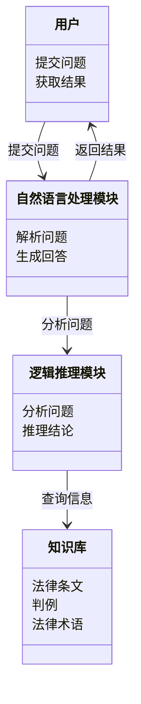
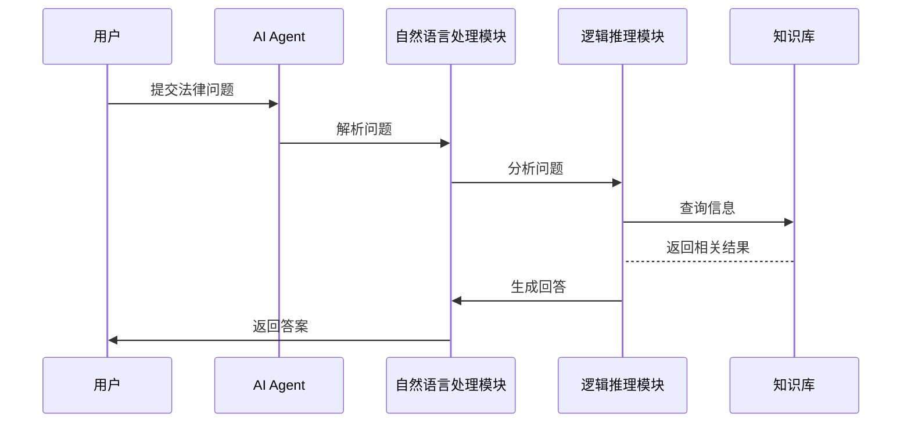

                 


# AI Agent在智能法律咨询中的角色

> 关键词：AI Agent, 智能法律咨询, 自然语言处理, 逻辑推理, 知识库, 法律咨询系统, 人机协作

> 摘要：随着人工智能技术的迅速发展，AI Agent在法律咨询领域的应用逐渐崭露头角。本文将详细探讨AI Agent在智能法律咨询中的角色，从背景介绍、核心概念、算法原理到系统架构设计和项目实战，层层剖析其工作原理和实际应用。通过本文，读者将全面理解AI Agent如何辅助法律专业人士提供更高效、更精准的法律咨询服务。

---

# 第一部分: AI Agent在智能法律咨询中的背景与概念

## 第1章: AI Agent的基本概念与法律咨询背景

### 1.1 AI Agent的定义与核心原理

#### 1.1.1 AI Agent的基本定义
AI Agent，即人工智能代理，是一种能够感知环境、自主决策并执行任务的智能实体。在法律咨询领域，AI Agent通常以软件形式存在，通过自然语言处理（NLP）和逻辑推理技术，帮助用户解答法律问题。

#### 1.1.2 AI Agent的核心特征
- **自主性**：能够独立执行任务，无需人工干预。
- **反应性**：能实时感知用户需求并做出响应。
- **学习能力**：通过机器学习不断优化自身的知识库和推理能力。

#### 1.1.3 AI Agent与传统法律咨询的区别
- **效率**：AI Agent能够快速检索大量法律条文和案例。
- **可扩展性**：可以同时为多个用户提供服务，覆盖更广泛的法律领域。
- **准确性**：通过深度学习模型，减少人为错误。

### 1.2 智能法律咨询的背景与需求

#### 1.2.1 当前法律咨询服务的痛点
- **资源有限**：传统法律咨询依赖大量法律专业人士，成本高。
- **信息滞后**：法律条文更新频繁，人工检索效率低。
- **服务不均**：偏远地区难以获得高质量的法律服务。

#### 1.2.2 AI技术在法律咨询中的应用潜力
- **自动化检索**：快速查找相关法律条文和判例。
- **智能问答**：通过NLP技术理解用户问题并提供解答。
- **辅助决策**：帮助法律专业人士分析案件，提供参考意见。

#### 1.2.3 智能法律咨询的典型场景
- **合同审查**：AI Agent可以自动分析合同条款，识别潜在法律风险。
- **法律咨询**：用户通过自然语言提问，AI Agent提供初步解答。
- **案例分析**：基于历史案例，AI Agent辅助律师制定辩护策略。

### 1.3 AI Agent在法律咨询中的角色定位

#### 1.3.1 AI Agent作为法律咨询辅助工具的角色
- **信息检索**：快速查找相关法律条文和判例。
- **知识库管理**：维护结构化的法律知识库，支持实时更新。

#### 1.3.2 AI Agent在法律咨询流程中的功能定位
- **初步筛选**：根据用户描述的问题，快速判断案件类型。
- **辅助分析**：提供法律条文和案例参考，帮助法律专业人士制定解决方案。

#### 1.3.3 AI Agent与法律专业人士的协同工作模式
- **分工协作**：AI Agent处理基础性、重复性工作，法律专业人士负责复杂性、创造性任务。
- **实时互动**：通过多轮对话，AI Agent动态调整输出内容，确保准确性和相关性。

## 1.4 本章小结
本章介绍了AI Agent的基本概念、核心特征及其在法律咨询中的角色定位。AI Agent通过自动化、智能化的方式，显著提升了法律咨询服务的效率和准确性，同时减轻了法律专业人士的工作负担。

---

## 第2章: AI Agent的核心概念与原理

### 2.1 AI Agent的核心概念

#### 2.1.1 知识表示与推理
- **知识表示**：将法律知识转化为结构化的数据，如法律条文、案例库等。
- **逻辑推理**：基于知识库中的信息，通过逻辑推理得出结论。

#### 2.1.2 自然语言处理（NLP）技术
- **文本解析**：理解用户输入的自然语言问题，提取关键信息。
- **语义理解**：通过深度学习模型（如BERT）理解用户意图。

#### 2.1.3 逻辑推理与决策树
- **逻辑推理**：基于规则或概率模型，推导出可能的法律结论。
- **决策树**：通过预设的逻辑树结构，逐步缩小问题范围，最终得出解决方案。

### 2.2 AI Agent的感知与决策机制

#### 2.2.1 信息采集与预处理
- **信息采集**：通过API接口或用户输入获取法律咨询的相关数据。
- **预处理**：对采集的信息进行清洗、分类和标注，便于后续处理。

#### 2.2.2 知识库的构建与管理
- **知识库构建**：整合法律条文、案例判例、法律术语等信息，形成结构化的知识库。
- **动态更新**：定期更新知识库，确保信息的时效性。

#### 2.2.3 多轮对话中的上下文理解
- **上下文记忆**：在多轮对话中，AI Agent需要记忆之前的历史对话，确保理解的连续性。
- **意图识别**：通过分析用户的话语，识别用户的深层需求。

### 2.3 AI Agent的执行与反馈机制

#### 2.3.1 行为规划与任务分解
- **任务分解**：将复杂的法律咨询任务分解为多个子任务，逐步解决。
- **行为规划**：根据当前任务状态，动态调整执行策略。

#### 2.3.2 执行结果的反馈与优化
- **反馈收集**：记录用户对AI Agent输出结果的反馈，评估系统表现。
- **优化调整**：根据反馈结果，优化知识库和推理算法，提升系统性能。

#### 2.3.3 异常情况的处理与容错机制
- **异常检测**：识别用户输入或系统执行中的异常情况，启动容错机制。
- **错误恢复**：在发生错误时，系统能够快速恢复，避免影响整体流程。

## 2.4 本章小结
本章详细介绍了AI Agent的核心概念与工作原理，包括知识表示与推理、自然语言处理、逻辑推理与决策树等关键环节。这些技术共同支撑了AI Agent在法律咨询中的高效运作。

---

## 第3章: AI Agent的算法原理与数学模型

### 3.1 知识表示与推理的数学模型

#### 3.1.1 知识图谱的构建与表示
- **知识图谱**：通过图结构表示法律知识，节点表示法律实体，边表示实体之间的关系。
- **表示学习**：使用向量表示法律实体，便于计算和推理。

#### 3.1.2 逻辑推理的基本原理
- **规则推理**：基于预设的逻辑规则进行推理，适用于确定性问题。
- **概率推理**：基于贝叶斯网络等概率模型进行推理，适用于不确定性问题。

#### 3.1.3 知识表示的向量空间模型
- **词向量表示**：使用Word2Vec等模型将法律术语转化为向量表示。
- **句子向量表示**：使用Sentence-BERT等模型将法律文本转化为向量表示。

### 3.2 自然语言处理的算法原理

#### 3.2.1 词嵌入模型（如Word2Vec）
- **Word2Vec**：通过上下文预测词义，生成词向量表示。
- **训练过程**：使用Skip-Gram或CBOW模型训练词嵌入。

#### 3.2.2 语法分析与句法树
- **句法分析**：通过依存句法分析，解析句子的语法结构。
- **句法树构建**：生成句法树，帮助理解句子的语义关系。

#### 3.2.3 语义理解的深度学习模型
- **BERT模型**：通过预训练的 transformer 模型，理解文本的上下文语义。
- **模型训练**：基于大规模法律文本数据，微调BERT模型，提升法律领域的语义理解能力。

### 3.3 逻辑推理与决策的数学公式

#### 3.3.1 基于概率的推理公式
- **贝叶斯定理**：$$ P(A|B) = \frac{P(B|A)P(A)}{P(B)} $$
  - 其中，$A$ 是目标事件，$B$ 是已知条件。

#### 3.3.2 基于规则的推理公式
- **逻辑蕴含**：$$ A \rightarrow B $$
  - 如果 $A$ 为真，则 $B$ 必须为真。

#### 3.3.3 基于决策树的分类公式
- **决策树构建**：通过ID3、C4.5等算法，构建法律咨询的决策树。
- **决策树分类**：根据输入的特征，沿着决策树路径进行分类，最终得出法律结论。

## 3.4 本章小结
本章深入探讨了AI Agent在法律咨询中的算法原理与数学模型，包括知识表示与推理、自然语言处理和逻辑推理等关键技术。通过这些算法，AI Agent能够高效地理解和解决法律咨询中的复杂问题。

---

## 第4章: AI Agent的系统架构设计

### 4.1 系统应用场景

#### 4.1.1 合同审查
- **输入**：用户上传合同文本。
- **处理**：AI Agent自动识别合同中的法律条款，评估潜在风险。
- **输出**：生成审查报告，标注风险点并提出建议。

#### 4.1.2 法律咨询
- **输入**：用户提出法律问题，如“如何起草劳动合同？”。
- **处理**：AI Agent通过NLP技术理解问题，结合知识库生成答案。
- **输出**：提供初步解答，并建议用户咨询专业律师。

### 4.2 系统功能设计

#### 4.2.1 领域模型（Mermaid类图）


#### 4.2.2 系统架构设计（Mermaid架构图）


#### 4.2.3 系统接口设计
- **输入接口**：用户通过网页或移动应用提交法律咨询问题。
- **输出接口**：系统返回处理结果，包括文本、表格或图表形式。

#### 4.2.4 系统交互设计（Mermaid序列图）


## 4.3 本章小结
本章详细描述了AI Agent在法律咨询系统中的应用场景、功能设计和系统架构。通过模块化设计和高效的系统交互，AI Agent能够为用户提供高质量的法律咨询服务。

---

## 第5章: AI Agent的项目实战

### 5.1 环境搭建

#### 5.1.1 安装Python
```bash
python --version
# 确保Python版本为3.6以上
```

#### 5.1.2 安装依赖库
```bash
pip install numpy
pip install scikit-learn
pip install transformers
pip install sentence-transformers
```

### 5.2 系统核心实现源代码

#### 5.2.1 自然语言处理模块

```python
from transformers import pipeline

# 初始化NLP pipeline
nlp = pipeline("question-answering", model="deepseek/ai-agent-legal-consult")
```

#### 5.2.2 知识库查询模块

```python
def query_knowledge_base(question):
    # 连接到知识库数据库
    # 执行查询并返回结果
    return result
```

#### 5.2.3 逻辑推理模块

```python
from sklearn.tree import DecisionTreeClassifier

# 初始化决策树模型
model = DecisionTreeClassifier()

# 训练模型
model.fit(X_train, y_train)
```

### 5.3 代码应用解读与分析

#### 5.3.1 自然语言处理模块解读
- **输入**：用户提交的法律问题。
- **处理**：通过预训练的NLP模型，解析问题并生成关键词。
- **输出**：提取的关键信息用于后续的逻辑推理。

#### 5.3.2 知识库查询模块解读
- **输入**：解析后的关键词。
- **处理**：从知识库中检索相关法律条文和案例。
- **输出**：返回匹配的结果，供后续分析。

#### 5.3.3 逻辑推理模块解读
- **输入**：检索到的法律条文和案例。
- **处理**：基于训练好的决策树模型，进行分类和推理。
- **输出**：生成最终的法律结论。

### 5.4 案例分析与详细讲解

#### 5.4.1 案例背景
用户咨询：“在劳动合同中，如何界定试用期的长短？”

#### 5.4.2 系统处理流程
1. **自然语言处理**：解析用户问题，提取关键词“试用期”、“劳动合同”。
2. **知识库查询**：检索相关法律条文，如《劳动合同法》第七条。
3. **逻辑推理**：结合查询结果，生成回答：“根据《劳动合同法》，试用期最长不得超过6个月。”

#### 5.4.3 系统输出
```
根据《劳动合同法》第七条，试用期的长短应与劳动合同期限相适应，最长不得超过6个月。建议您在起草合同时，明确试用期的具体条款，以确保符合法律规定。
```

### 5.5 项目小结
本章通过实际案例展示了AI Agent在法律咨询中的应用流程，从环境搭建、代码实现到案例分析，详细解读了系统的核心功能和实现过程。

---

## 第6章: 最佳实践与总结

### 6.1 最佳实践 tips

#### 6.1.1 数据隐私保护
- 确保用户数据的安全性和隐私性，遵循相关法律法规。

#### 6.1.2 模型优化
- 定期更新知识库和模型，提升系统的准确性和响应速度。

#### 6.1.3 人机协作
- 在AI Agent的基础上，结合法律专业人士的经验，形成高效的协同工作模式。

### 6.2 小结
AI Agent在智能法律咨询中的应用，不仅提高了服务效率，还降低了法律咨询的成本。通过人机协作，能够为用户提供更加精准、全面的法律支持。

### 6.3 注意事项
- **模型局限性**：AI Agent的推理能力受限于知识库的质量和算法的准确性。
- **用户信任**：需建立信任机制，确保用户对AI Agent输出结果的可靠性有信心。
- **法律合规性**：AI Agent的输出结果需符合相关法律法规，避免法律风险。

### 6.4 拓展阅读
- 推荐阅读《人工智能在法律领域的应用》和《自然语言处理在法律咨询中的实践》。

---

# 结语

AI Agent作为智能法律咨询的核心工具，正在逐步改变传统的法律服务模式。通过本文的详细分析，读者可以全面了解AI Agent在法律咨询中的角色和应用价值。未来，随着技术的不断进步，AI Agent将在法律咨询领域发挥更大的作用，为用户提供更加智能化、个性化的服务。

--- 

# END

