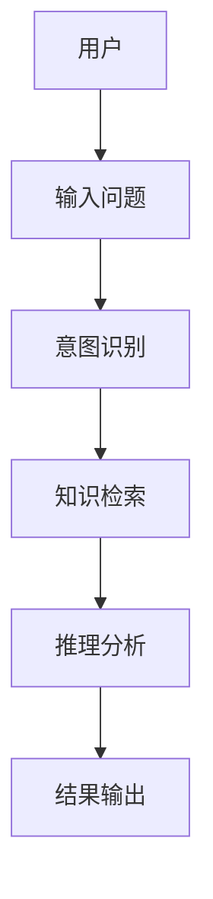
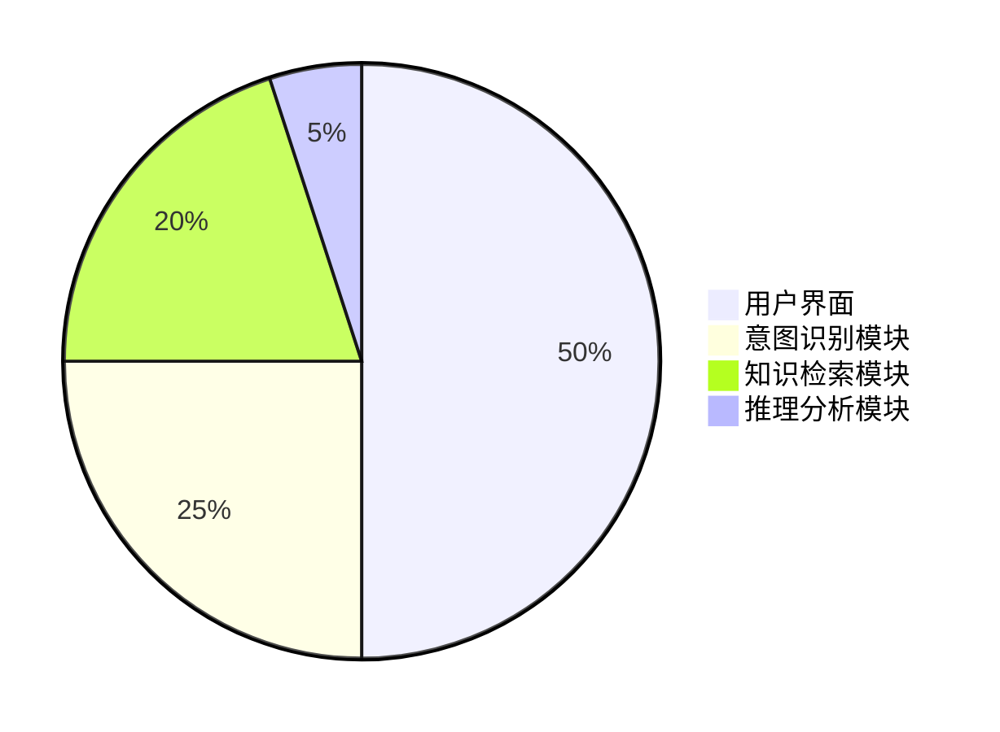
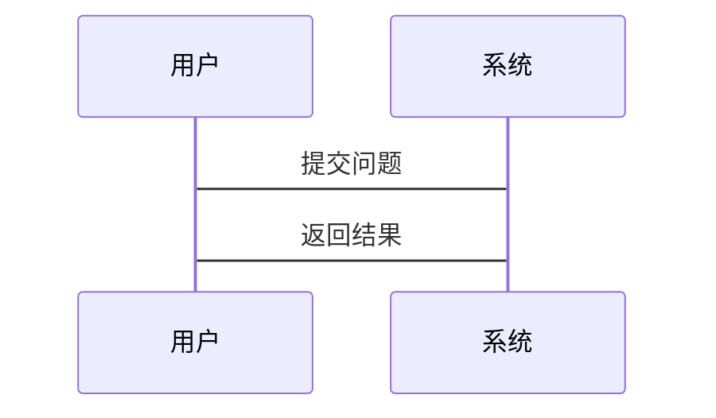
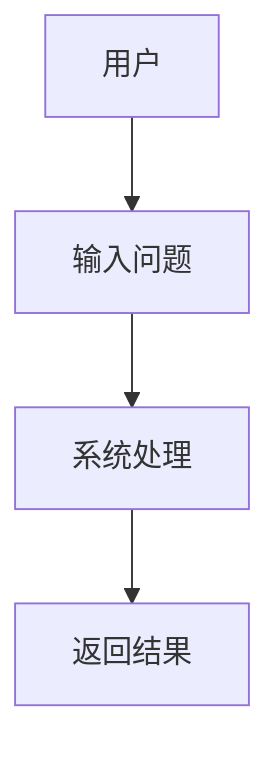

                 


# AI Agent在智能法律咨询系统中的角色

## 关键词
AI Agent, 智能法律咨询系统, 法律知识库, 自然语言处理, 法律推理, 法律咨询系统

## 摘要
本文深入探讨了AI Agent在智能法律咨询系统中的核心角色及其技术实现。首先，我们介绍了AI Agent的基本概念和法律咨询系统的发展背景，分析了AI Agent在法律咨询中的独特优势。接着，从知识表示、推理机制、交互能力三个方面详细阐述了AI Agent的核心原理。然后，我们设计了一个基于知识图谱的法律咨询系统架构，并通过实际案例展示了系统的功能和应用场景。最后，我们总结了当前系统的优缺点，并对未来的发展方向提出了展望。

---

## 第一部分：AI Agent与智能法律咨询系统概述

## 第1章：AI Agent与智能法律咨询系统背景介绍

### 1.1 AI Agent的基本概念与定义

#### 1.1.1 AI Agent的定义与核心特征
AI Agent（人工智能代理）是指能够感知环境、自主决策并执行任务的智能实体。其核心特征包括：
1. **自主性**：能够在没有外部干预的情况下独立运行。
2. **反应性**：能够实时感知环境并做出反应。
3. **目标导向性**：具备明确的目标，并能采取行动实现目标。
4. **学习能力**：能够通过经验改进性能。

#### 1.1.2 AI Agent与传统法律咨询系统的区别
传统的法律咨询系统主要依赖于预设的规则和流程，无法动态调整或学习。而AI Agent具备以下优势：
1. **动态适应性**：能够根据新的信息调整行为。
2. **智能推理**：能够基于知识库进行逻辑推理。
3. **自然语言处理**：能够理解并生成自然语言。

#### 1.1.3 智能法律咨询系统的目标
智能法律咨询系统的目的是通过AI Agent实现以下目标：
1. 提供7×24小时的实时法律咨询服务。
2. 根据用户需求动态调整咨询内容。
3. 提供个性化的法律建议。

### 1.2 智能法律咨询系统的发展背景

#### 1.2.1 传统法律咨询的局限性
传统法律咨询系统存在以下问题：
1. **资源依赖性**：需要大量人工参与。
2. **效率低下**：处理复杂问题时耗时较长。
3. **一致性不足**：不同咨询人员的建议可能存在差异。

#### 1.2.2 AI技术在法律咨询中的应用潜力
AI技术的快速发展为法律咨询系统带来了新的可能性：
1. **自然语言处理**：能够理解用户的复杂查询。
2. **知识图谱**：构建法律知识库，支持智能推理。
3. **机器学习**：通过数据训练，提高咨询准确率。

#### 1.2.3 当前法律咨询系统的技术现状
当前，基于AI的法律咨询系统已经在以下领域取得进展：
1. **合同审查**：通过NLP技术自动分析合同内容。
2. **法律问答**：基于知识图谱提供智能回答。
3. **案例分析**：利用机器学习算法分析相似案例。

---

## 第二部分：AI Agent的核心概念与原理

## 第2章：AI Agent的核心概念与原理

### 2.1 AI Agent的任务分解与知识表示

#### 2.1.1 任务分解的基本原理
任务分解是将复杂问题拆解为简单任务的过程。例如，法律咨询任务可以分解为：
1. **问题识别**：确定用户的具体需求。
2. **知识检索**：从知识库中提取相关信息。
3. **推理分析**：基于知识进行逻辑推理。
4. **结果生成**：生成最终的法律建议。

#### 2.1.2 知识表示的多种方式
知识表示是AI Agent理解世界的基础。常见的知识表示方法包括：
1. **规则表示法**：通过逻辑规则定义知识。
2. **语义网络**：通过节点和边表示概念及其关系。
3. **知识图谱**：将知识以图结构表示，支持语义搜索。

#### 2.1.3 知识图谱的构建与应用
知识图谱是一种强大的知识表示方法，适用于法律咨询系统。以下是知识图谱的构建流程：
1. **数据收集**：从法律文档中提取信息。
2. **实体识别**：识别法律术语和概念。
3. **关系抽取**：发现实体之间的关系。
4. **知识融合**：整合多个来源的信息。

### 2.2 AI Agent的推理与决策机制

#### 2.2.1 基于规则的推理
基于规则的推理是一种简单但有效的推理方法。例如，当用户询问“合同违约责任”时，AI Agent可以执行以下步骤：
1. **规则匹配**：匹配与“合同违约责任”相关的法律规则。
2. **规则应用**：根据规则生成具体的法律建议。

#### 2.2.2 基于案例的推理
基于案例的推理是一种更灵活的推理方法。例如，当用户询问“合同纠纷解决方式”时，AI Agent可以：
1. **案例检索**：从知识库中检索类似案例。
2. **案例分析**：分析案例的相似性和差异性。
3. **建议生成**：基于案例分析结果生成建议。

#### 2.2.3 基于概率的推理
基于概率的推理是一种更复杂的推理方法，适用于不确定性的场景。例如，当用户询问“某公司的法律风险”时，AI Agent可以：
1. **概率计算**：计算不同风险因素的概率。
2. **结果排序**：根据概率排序并生成建议。

### 2.3 AI Agent的交互与学习能力

#### 2.3.1 自然语言处理在AI Agent交互中的作用
自然语言处理（NLP）是AI Agent与用户交互的核心技术。NLP的主要任务包括：
1. **意图识别**：识别用户的咨询意图。
2. **语义理解**：理解用户的问题含义。
3. **对话生成**：生成自然的回复。

#### 2.3.2 知识学习与更新机制
为了保持AI Agent的准确性，需要定期更新知识库。知识学习与更新机制包括：
1. **数据采集**：收集新的法律案例和法规。
2. **知识抽取**：从新数据中提取知识。
3. **知识融合**：将新知识整合到现有知识库中。

#### 2.3.3 用户反馈对AI Agent优化的意义
用户反馈是优化AI Agent的重要来源。通过收集用户反馈，可以：
1. **改进推理算法**：优化推理模型的准确性。
2. **丰富知识库**：增加新的法律知识。
3. **提升用户体验**：改进交互流程。

---

## 第三部分：AI Agent在智能法律咨询系统中的应用

## 第3章：基于AI Agent的智能法律咨询系统架构

### 3.1 系统功能设计

#### 3.1.1 系统功能模块
基于AI Agent的智能法律咨询系统通常包括以下功能模块：
1. **用户界面**：供用户输入问题。
2. **意图识别**：识别用户的咨询意图。
3. **知识检索**：从知识库中检索相关信息。
4. **推理分析**：基于知识生成建议。
5. **结果输出**：以自然语言形式输出结果。

#### 3.1.2 系统功能流程
以下是系统功能的流程图：



### 3.2 系统架构设计

#### 3.2.1 系统架构图
以下是系统的架构图：



#### 3.2.2 关键模块实现
1. **意图识别模块**：使用NLP技术，如词袋模型或词嵌入模型（如Word2Vec）进行意图识别。
2. **知识检索模块**：基于知识图谱进行语义搜索。
3. **推理分析模块**：结合规则推理和案例推理生成建议。

### 3.3 系统接口设计

#### 3.3.1 API接口
以下是系统的API接口：



### 3.4 系统交互设计

#### 3.4.1 交互流程
以下是系统的交互流程图：



---

## 第四部分：项目实战与优化

## 第4章：AI Agent法律咨询系统项目实战

### 4.1 环境配置

#### 4.1.1 技术选型
1. **编程语言**：Python
2. **NLP库**：spaCy或NLTK
3. **知识图谱库**：Neo4j
4. **推理引擎**：Rete-OO

### 4.2 核心代码实现

#### 4.2.1 意图识别模块
以下是意图识别的代码示例：

```python
import spacy

nlp = spacy.load("en_core_web_sm")

def identify_intent(text):
    doc = nlp(text)
    intent = "unknown"
    for token in doc:
        if token.pos_ == "NOUN" and token.lower() in ["case", "contract"]:
            intent = "legal_case_analysis"
            break
    return intent
```

#### 4.2.2 知识检索模块
以下是知识检索的代码示例：

```python
from neo4j import GraphDatabase

class LegalKnowledgeGraph:
    def __init__(self, uri, user, password):
        self.driver = GraphDatabase.driver(uri, auth=(user, password))
    
    def get_recommendations(self, query):
        with self.driver.session() as session:
            result = session.read_transaction(
                lambda tx: tx.run(
                    "MATCH (n:LegalConcept) WHERE n.name contains $query RETURN n.name LIMIT 5",
                    query=query
                )
            )
            return [record["n.name"] for record in result]
```

#### 4.2.3 推理分析模块
以下是推理分析的代码示例：

```python
from rete_oo import Rete

class LegalReasoner:
    def __init__(self):
        self.network = Rete()
    
    def add_rule(self, condition, action):
        self.network.add_nodes(condition)
        self.network.add_nodes(action)
        self.network.link_nodes(condition[-1], action[0])
    
    def infer(self, facts):
        self.network.reset()
        for fact in facts:
            self.network.activate(fact)
        return self.network.get_conclusions()
```

### 4.3 案例分析与优化

#### 4.3.1 案例分析
假设用户询问：“如果我在合同中未按期支付款项，会有什么法律后果？”

系统处理流程如下：
1. **意图识别**：识别到“合同违约”。
2. **知识检索**：从知识库中检索相关法律条文和案例。
3. **推理分析**：结合合同法相关规定生成建议。

#### 4.3.2 系统优化
1. **性能优化**：通过缓存技术减少重复查询。
2. **准确性优化**：引入监督学习算法提高推理准确率。
3. **用户体验优化**：增加多轮对话功能，提供更精准的建议。

### 4.4 项目小结
通过本次项目实战，我们验证了AI Agent在法律咨询系统中的可行性，并总结了以下经验：
1. **技术选型**：选择合适的NLP库和知识图谱库至关重要。
2. **模块设计**：合理的模块划分有助于系统的可维护性和扩展性。
3. **数据质量**：高质量的法律知识库是系统准确性的基础。

---

## 第五部分：总结与展望

## 第5章：总结与展望

### 5.1 系统总结
通过本文的探讨，我们总结了AI Agent在智能法律咨询系统中的重要作用，并详细介绍了其核心原理和系统架构。通过实际案例，我们验证了系统的可行性和实用性。

### 5.2 未来展望
尽管当前系统已经取得了一定的成果，但仍存在以下改进方向：
1. **数据隐私**：需要加强数据隐私保护措施。
2. **模型解释性**：需要提高模型的可解释性。
3. **多语言支持**：未来可以扩展支持多种语言。

---

## 参考文献
[此处列出相关文献和资料]

---

希望这篇文章符合您的要求！如果需要进一步调整或补充，请随时告知。

