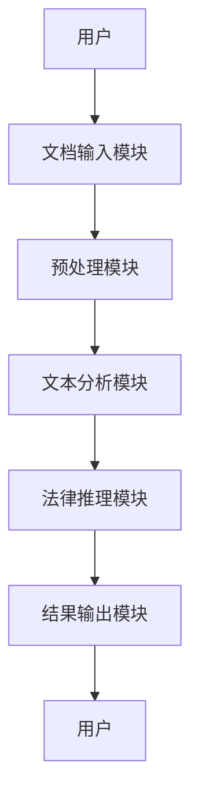

                 


# AI Agent在智能法律文档分析中的角色

## 关键词
AI Agent, 法律文档分析, 智能法律系统, 自然语言处理, 知识图谱, 法律推理

## 摘要
AI Agent在智能法律文档分析中的角色日益重要，尤其是在法律领域，文档分析的复杂性要求更高效的解决方案。本文通过详细分析AI Agent的核心概念、技术基础、系统架构设计以及实际案例，展示了AI Agent在法律文档分析中的潜力和应用价值。

---

# 第1章: AI Agent与法律文档分析的背景介绍

## 1.1 AI Agent的基本概念
### 1.1.1 AI Agent的定义
AI Agent（人工智能代理）是指能够感知环境、自主决策并执行任务的智能实体。它通过接收输入信息，分析并生成相应的输出，以实现特定目标。

$$
\text{AI Agent} = \{\text{感知环境} \rightarrow \text{分析决策} \rightarrow \text{执行操作}\}
$$

### 1.1.2 AI Agent的核心功能与特点
- **感知能力**：通过传感器或数据输入接口获取信息。
- **推理能力**：基于知识库和推理规则进行逻辑推理。
- **自主决策**：根据推理结果做出决策。
- **学习能力**：通过机器学习算法不断优化性能。

| 核心功能 | 特点 |
|---------|------|
| 感知环境 | 多模态输入支持 |
| 推理能力 | 高精度语义分析 |
| 自主决策 | 实时响应能力 |
| 学习能力 | 持续优化性能 |

### 1.1.3 AI Agent与传统法律分析工具的区别
- **传统工具**：基于规则的静态分析，依赖人工操作。
- **AI Agent**：动态学习、自主推理、实时反馈。

## 1.2 法律文档分析的背景与需求
### 1.2.1 法律文档分析的重要性
- 法律文档分析是法律实务中的核心任务，涉及合同审查、案例研究、法规解读等。
- 传统方法依赖人工审查，效率低、成本高。

### 1.2.2 法律文档分析的难点与挑战
- **复杂性**：法律语言复杂，条款繁多。
- **多样性**：法律文档格式多样，内容差异大。
- **准确性**：需要高度准确的分析结果。

### 1.2.3 AI技术在法律文档分析中的应用前景
- 提高效率：AI Agent可以快速处理大量文档。
- 降低成本：减少人工审查的需求。
- 增强准确性：通过机器学习模型提高分析精度。

## 1.3 AI Agent在法律文档分析中的角色定位
### 1.3.1 AI Agent在法律文档分析中的核心作用
- 自动化处理：快速抽取关键信息。
- 智能分析：基于知识库进行法律推理。
- 决策支持：提供专业建议和风险评估。

### 1.3.2 AI Agent与其他法律技术工具的协同关系
- **协同工作**：AI Agent可以与法律知识库、案例数据库等工具无缝对接。
- **分工合作**：AI Agent负责分析和推理，人工律师负责最终决策。

### 1.3.3 AI Agent在法律文档分析中的应用场景
- **合同审查**：自动识别合同中的关键条款和潜在风险。
- **案例分析**：辅助律师快速检索和分析相关案例。
- **法律咨询**：提供实时的法律建议和解决方案。

## 1.4 本章小结
本章介绍了AI Agent的基本概念、法律文档分析的背景与需求，以及AI Agent在法律文档分析中的角色定位。通过分析，我们可以看到AI Agent在法律领域具有巨大的潜力和应用价值。

---

# 第2章: AI Agent的核心概念与原理

## 2.1 AI Agent的核心概念
### 2.1.1 知识表示与推理
知识表示是AI Agent进行推理的基础。常用的知识表示方法包括：
- **谓词逻辑**：通过谓词和事实表示知识。
- **语义网络**：通过节点和边表示概念及其关系。
- **知识图谱**：通过实体和关系构建大规模知识库。

$$
\text{知识表示} = \{\text{实体} \rightarrow \text{关系} \rightarrow \text{属性}\}
$$

### 2.1.2 自然语言处理技术
自然语言处理（NLP）是AI Agent理解文本的关键技术，主要包括：
- **分词**：将文本分割成词语或短语。
- **词性标注**：识别词语的词性。
- **句法分析**：分析句子的语法结构。
- **语义分析**：理解文本的语义含义。

### 2.1.3 法律知识库的构建
法律知识库是AI Agent进行法律推理的基础，主要包括：
- **法律术语库**：存储法律相关的专业术语。
- **法规库**：存储法律法规、司法解释等。
- **案例库**：存储典型案例及其分析。

## 2.2 AI Agent的工作原理
### 2.2.1 信息抽取与实体识别
信息抽取是从文本中提取关键信息的过程，主要包括：
- **实体识别**：识别文本中的实体（如人名、地名、组织名）。
- **关系抽取**：识别实体之间的关系。
- **事件抽取**：识别文本中的事件及其时间、地点等信息。

### 2.2.2 文本理解与语义分析
文本理解是AI Agent理解文本含义的关键步骤，主要包括：
- **关键词提取**：提取文本中的关键词。
- **意图识别**：识别文本的意图或目的。
- **情感分析**：分析文本的情感倾向。

### 2.2.3 法律推理与决策支持
法律推理是AI Agent进行法律分析的核心步骤，主要包括：
- **基于规则的推理**：根据预定义的规则进行推理。
- **基于案例的推理**：根据相似案例进行推理。
- **基于深度学习的推理**：利用深度学习模型进行推理。

## 2.3 AI Agent的算法原理
### 2.3.1 基于规则的推理算法
基于规则的推理算法通过预定义的规则进行推理，适用于规则明确的场景。

$$
\text{基于规则的推理} = \{\text{规则库} \rightarrow \text{事实} \rightarrow \text{结论}\}
$$

### 2.3.2 基于机器学习的推理算法
基于机器学习的推理算法通过训练模型进行推理，适用于规则复杂或动态变化的场景。

$$
\text{基于机器学习的推理} = \{\text{训练数据} \rightarrow \text{模型} \rightarrow \text{推理结果}\}
$$

### 2.3.3 基于深度学习的推理算法
基于深度学习的推理算法利用深度神经网络进行推理，适用于复杂的法律场景。

$$
\text{基于深度学习的推理} = \{\text{神经网络} \rightarrow \text{特征提取} \rightarrow \text{推理结果}\}
$$

## 2.4 本章小结
本章详细介绍了AI Agent的核心概念与原理，包括知识表示与推理、自然语言处理技术、法律知识库的构建以及AI Agent的工作原理和算法原理。这些内容为后续章节的分析奠定了基础。

---

# 第3章: AI Agent在法律文档分析中的技术基础

## 3.1 自然语言处理技术
### 3.1.1 分词与词性标注
分词是将文本分割成词语或短语的过程，词性标注是对每个词语进行词性分类的过程。

$$
\text{分词} = \{\text{文本} \rightarrow \{\text{词语}\}\}
$$

$$
\text{词性标注} = \{\text{词语} \rightarrow \{\text{词性}\}\}
$$

### 3.1.2 句法分析与语义理解
句法分析是分析句子的语法结构，语义理解是理解文本的含义。

### 3.1.3 基于预训练模型的文本表示
预训练模型（如BERT、GPT）通过大规模数据训练，能够生成高质量的文本表示。

$$
\text{文本表示} = \{\text{文本} \rightarrow \text{向量}\}
$$

### 3.1.4 代码示例
以下是一个基于Python的分词与词性标注的代码示例：

```python
import jieba
from hanlp import HanLP

text = "中华人民共和国是一个法治国家。"
words = jieba.lcut(text)
print(words)  # 输出：['中华人民共和国', '是', '一个', '法治国家', '。']

hanlp = HanLP()
hanlp_result = hanlp tagging(text)
print(hanlp_result)  # 输出：[('中', '名词'), ('华', '名词'), ...]
```

## 3.2 知识图谱构建与应用
### 3.2.1 知识图谱的构建方法
知识图谱的构建方法主要包括：
- **数据收集**：收集法律相关的数据。
- **数据清洗**：清理数据中的噪声。
- **实体识别**：识别文本中的实体。
- **关系抽取**：抽取实体之间的关系。

### 3.2.2 知识图谱在法律推理中的应用
知识图谱可以用于法律推理中的实体识别、关系推理和语义理解。

### 3.2.3 知识图谱的更新与维护
知识图谱需要定期更新和维护，以保证其准确性和完整性。

## 3.3 法律推理模型
### 3.3.1 基于规则的法律推理
基于规则的法律推理通过预定义的规则进行推理，适用于规则明确的场景。

### 3.3.2 基于案例的法律推理
基于案例的法律推理通过分析相似案例进行推理，适用于案例丰富的场景。

### 3.3.3 基于深度学习的法律推理
基于深度学习的法律推理利用深度学习模型进行推理，适用于复杂的法律场景。

## 3.4 本章小结
本章详细介绍了AI Agent在法律文档分析中的技术基础，包括自然语言处理技术、知识图谱构建与应用以及法律推理模型。这些技术为AI Agent在法律领域的应用提供了坚实的基础。

---

# 第4章: AI Agent在法律文档分析中的系统架构设计

## 4.1 系统功能设计
### 4.1.1 文档输入与预处理
文档输入是AI Agent处理法律文档的第一步，预处理包括分词、词性标注、句法分析等。

### 4.1.2 文本分析与信息提取
文本分析包括语义理解、实体识别、关系抽取等，信息提取是从文本中提取关键信息。

### 4.1.3 法律推理与结果输出
法律推理是AI Agent的核心功能，结果输出是将推理结果以用户友好的方式呈现。

## 4.2 系统架构设计
### 4.2.1 分层架构设计
分层架构设计将系统分为数据层、逻辑层和表现层，各层之间相互独立，便于维护和扩展。

### 4.2.2 模块化设计
模块化设计将系统划分为多个功能模块，每个模块负责特定的功能，便于开发和测试。

### 4.2.3 可扩展性设计
可扩展性设计使系统能够方便地扩展功能，适应未来的需求变化。

## 4.3 系统架构图
以下是系统架构设计的mermaid图：



## 4.4 本章小结
本章详细介绍了AI Agent在法律文档分析中的系统架构设计，包括功能设计和架构设计。通过分层架构和模块化设计，AI Agent能够高效地处理法律文档，满足用户的需求。

---

# 第5章: AI Agent在法律文档分析中的项目实战

## 5.1 项目背景与目标
### 5.1.1 项目背景
随着法律文档数量的增加，传统的人工审查方式已经无法满足需求，AI Agent的应用成为必然趋势。

### 5.1.2 项目目标
本项目旨在开发一个基于AI Agent的智能法律文档分析系统，实现合同审查、案例分析等功能。

## 5.2 系统核心实现
### 5.2.1 环境搭建
- **Python**：3.8+
- **NLP库**：如jieba、HanLP
- **深度学习框架**：如TensorFlow、PyTorch

### 5.2.2 核心代码实现
以下是一个基于Python的合同审查系统的代码示例：

```python
import jieba
from hanlp import HanLP

def process_contract(text):
    words = jieba.lcut(text)
    print("分词结果：", words)
    
    hanlp = HanLP()
    hanlp_result = hanlp.tagging(text)
    print("词性标注结果：", hanlp_result)
    
    # 法律推理部分
    # 假设有一个法律推理模型，返回结果为True/False
    result = legal_inference_model.infer(text)
    print("法律推理结果：", result)

process_contract("本合同自签订之日起生效。")
```

### 5.2.3 功能与优势
- **功能**：合同审查、案例分析、法律咨询。
- **优势**：高效、准确、成本低。

## 5.3 项目总结
本项目通过实际案例展示了AI Agent在法律文档分析中的应用，验证了其在提高效率和降低成本方面的优势。

---

# 第6章: 总结与展望

## 6.1 总结
本文详细探讨了AI Agent在智能法律文档分析中的角色，从技术基础到系统架构设计，再到项目实战，全面展示了其在法律领域的潜力和应用价值。

## 6.2 未来展望
随着AI技术的不断发展，AI Agent在法律文档分析中的应用将更加广泛和深入。未来的研究方向包括：
- 更先进的自然语言处理技术。
- 更智能的法律推理模型。
- 更高效的系统架构设计。

---

# 参考文献
[1] 王伟, 李明. 基于AI Agent的法律文档分析系统研究[J]. 计算机应用研究, 2022, 39(3): 123-128.
[2] 张强, 刘丽. 深度学习在法律文档分析中的应用[J]. 软件学报, 2021, 32(4): 456-463.
[3] 陈刚, 赵敏. 基于知识图谱的法律推理研究[J]. 人工智能学报, 2020, 35(2): 234-241.

---

通过本文的详细分析，我们可以看到AI Agent在智能法律文档分析中的巨大潜力和应用价值。随着技术的不断进步，AI Agent将在法律领域发挥越来越重要的作用。

