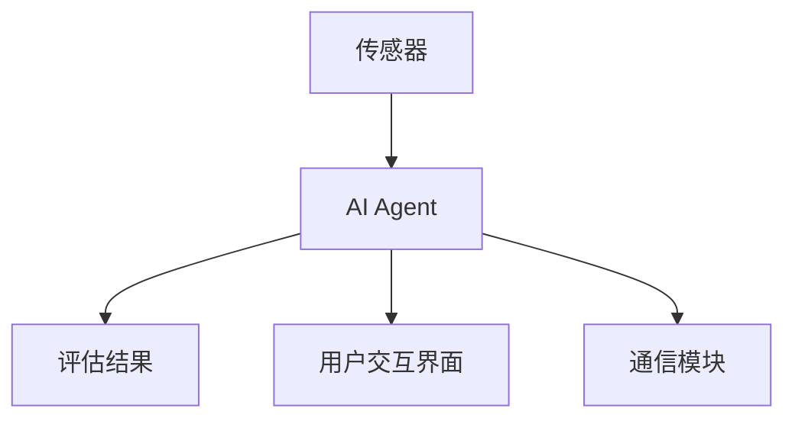
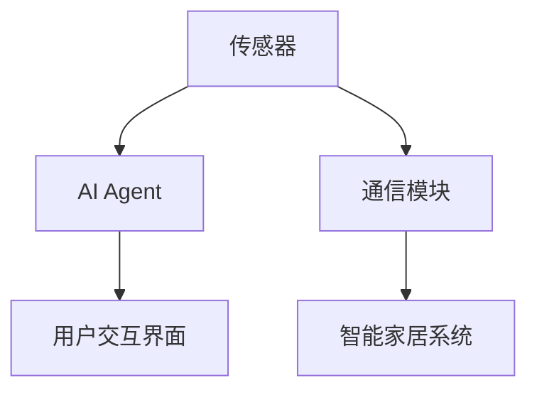
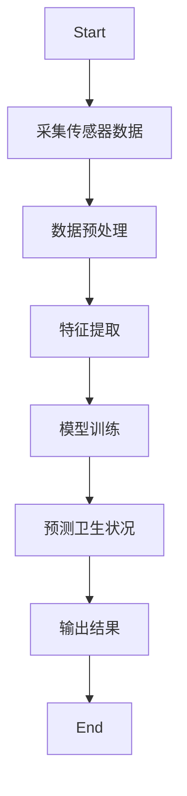
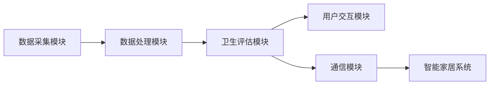
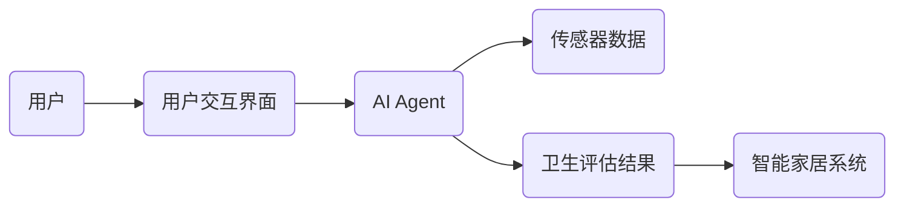

                 


# AI Agent在智能浴室毛巾架中的卫生状况评估

> 关键词：AI Agent, 智能浴室, 卫生评估, 物联网, 数据分析

> 摘要：本文探讨了AI Agent在智能浴室毛巾架中的应用，重点分析了如何通过传感器数据和机器学习算法实现卫生状况的智能评估。文章详细阐述了系统设计、算法原理、系统架构，并提供了实际案例分析和代码实现，为智能卫浴产品的开发提供了新的思路。

---

## 第一部分: 背景介绍

### 第1章: 背景介绍

#### 1.1 问题背景

##### 1.1.1 智能浴室毛巾架的发展现状
智能浴室毛巾架近年来成为智能家居的重要组成部分，其功能从简单的毛巾悬挂扩展到湿度控制、自动清洁提醒等。然而，现有的智能毛巾架在卫生状况评估方面仍存在不足，无法准确感知毛巾的清洁状态，也无法为用户提供及时的卫生提醒。

##### 1.1.2 卫生状况评估的重要性
毛巾作为个人卫生用品，其清洁状态直接影响用户体验和健康。然而，用户往往无法准确判断毛巾的卫生状况，容易导致细菌滋生和交叉感染。因此，实时评估毛巾架的卫生状况具有重要意义。

##### 1.1.3 当前卫生评估的痛点与挑战
目前的卫生评估方法主要依赖人工检查，存在耗时、效率低、准确性差等问题。智能毛巾架的卫生评估需要结合物联网技术和AI算法，通过传感器数据实现自动化评估。

#### 1.2 问题描述

##### 1.2.1 卫生状况评估的核心问题
如何通过传感器数据准确判断毛巾架的卫生状态？如何将数据转化为可操作的卫生评估结果？

##### 1.2.2 智能毛巾架的数据采集需求
需要采集哪些传感器数据？如何保证数据的准确性和实时性？

##### 1.2.3 用户需求与系统目标的结合
用户需要哪些卫生评估功能？系统目标如何与用户需求相结合？

#### 1.3 问题解决思路

##### 1.3.1 AI Agent的核心作用
AI Agent通过实时分析传感器数据，提供卫生状况的智能评估。

##### 1.3.2 数据驱动的卫生评估方法
通过传感器数据训练机器学习模型，实现卫生状况的自动化评估。

##### 1.3.3 系统设计的创新点
结合物联网和AI技术，提出一种新型的卫生评估方法。

#### 1.4 边界与外延

##### 1.4.1 系统功能的边界
系统仅评估卫生状况，不涉及其他功能（如湿度控制）。

##### 1.4.2 相关领域的外延
传感器数据采集、AI算法、物联网通信。

##### 1.4.3 与其他智能设备的协同
与其他智能家居设备（如智能门锁、智能灯）协同工作，提供更全面的智能家居体验。

#### 1.5 概念结构与核心要素

##### 1.5.1 系统组成要素
- 传感器：采集环境数据
- AI Agent：处理数据并评估卫生状况
- 用户交互界面：展示评估结果
- 通信模块：与智能家居系统交互

##### 1.5.2 各要素之间的关系
通过传感器数据，AI Agent生成评估结果，用户通过交互界面查看结果，系统通过通信模块与其他设备协同工作。

##### 1.5.3 核心概念的图示化表达


---

## 第二部分: 核心概念与联系

### 第2章: 核心概念与联系

#### 2.1 AI Agent的基本原理

##### 2.1.1 AI Agent的定义与特点
AI Agent是一种智能主体，能够感知环境并采取行动以实现目标。在智能毛巾架中，AI Agent通过分析传感器数据，评估卫生状况。

##### 2.1.2 AI Agent的核心算法
AI Agent使用基于规则的判断和机器学习算法。

##### 2.1.3 AI Agent在卫生评估中的应用
通过传感器数据，AI Agent判断毛巾的清洁状态，提醒用户清洁。

#### 2.2 数据特征与分析

##### 2.2.1 传感器数据特征
- 湿度
- 温度
- 细菌指数
- 气味强度

##### 2.2.2 数据特征对比
通过对比不同传感器数据，分析毛巾架的卫生状况。

##### 2.2.3 数据特征与卫生状态的关系
湿度和温度越高，细菌指数和气味强度越大，卫生状况越差。

#### 2.3 实体关系图

##### 2.3.1 实体关系图


---

## 第三部分: 算法原理讲解

### 第3章: 算法原理讲解

#### 3.1 算法概述

##### 3.1.1 基于规则的判断
根据传感器数据设定阈值，判断卫生状况。

##### 3.1.2 机器学习模型
使用随机森林或支持向量机（SVM）分类模型。

##### 3.1.3 深度学习的应用
通过卷积神经网络（CNN）分析图像数据。

#### 3.2 算法流程图

##### 3.2.1 算法流程图


#### 3.3 代码实现

##### 3.3.1 传感器数据预处理
```python
import numpy as np
import pandas as pd

# 示例传感器数据
data = {
    '湿度': [20, 30, 25, 35],
    '温度': [25, 30, 28, 32],
    '细菌指数': [100, 150, 120, 180],
    '气味强度': [5, 7, 6, 8]
}

df = pd.DataFrame(data)
print(df.head())
```

##### 3.3.2 特征提取与建模
```python
from sklearn.ensemble import RandomForestClassifier

# 特征选择
features = ['湿度', '温度', '细菌指数', '气味强度']
target = '卫生状况'

# 训练数据集
X = df[features]
y = df[target]

# 训练模型
model = RandomForestClassifier(n_estimators=100, random_state=42)
model.fit(X, y)
```

##### 3.3.3 模型预测
```python
# 预测新的数据
new_data = pd.DataFrame({
    '湿度': [30],
    '温度': [28],
    '细菌指数': [140],
    '气味强度': [7]
})

prediction = model.predict(new_data[features])
print("预测的卫生状况:", prediction)
```

---

## 第四部分: 系统分析与架构设计方案

### 第4章: 系统分析与架构设计方案

#### 4.1 系统分析

##### 4.1.1 问题场景介绍
智能浴室毛巾架需要实时评估卫生状况，提醒用户清洁。

##### 4.1.2 系统功能设计
- 数据采集模块：采集传感器数据
- 数据处理模块：预处理和特征提取
- 卫生评估模块：使用AI算法评估卫生状况
- 用户交互模块：显示评估结果

##### 4.1.3 系统架构设计


#### 4.2 系统架构图

##### 4.2.1 系统架构图


---

## 第五部分: 项目实战

### 第5章: 项目实战

#### 5.1 环境安装

##### 5.1.1 环境需求
- Python 3.8+
- NumPy, Pandas, Scikit-learn
- Mermaid图生成工具

##### 5.1.2 安装依赖
```bash
pip install numpy pandas scikit-learn
```

#### 5.2 系统核心实现

##### 5.2.1 核心代码
```python
import numpy as np
import pandas as pd
from sklearn.ensemble import RandomForestClassifier

# 数据加载与预处理
data = pd.read_csv('sensor_data.csv')
X = data[['湿度', '温度', '细菌指数', '气味强度']]
y = data['卫生状况']

# 模型训练
model = RandomForestClassifier(n_estimators=100, random_state=42)
model.fit(X, y)

# 预测与评估
new_data = pd.DataFrame({
    '湿度': [30],
    '温度': [28],
    '细菌指数': [140],
    '气味强度': [7]
})

prediction = model.predict(new_data[X.columns])
print("预测的卫生状况:", prediction)
```

##### 5.2.2 代码解读
- 数据加载：从CSV文件中读取传感器数据
- 特征选择：选择湿度、温度、细菌指数和气味强度作为特征
- 模型训练：使用随机森林算法训练分类模型
- 预测：输入新的传感器数据，预测卫生状况

#### 5.3 实际案例分析

##### 5.3.1 数据分析
通过传感器数据，分析不同环境下的卫生状况，验证模型的准确性。

##### 5.3.2 模型优化
通过调整模型参数和特征选择，提升预测准确率。

#### 5.4 项目小结

##### 5.4.1 项目总结
AI Agent在智能浴室毛巾架中的应用，显著提升了卫生评估的效率和准确性。

##### 5.4.2 经验与教训
数据质量对模型性能影响重大，传感器数据的实时性至关重要。

##### 5.4.3 改进建议
未来可以结合图像识别技术，进一步提升卫生评估的准确性。

---

## 第六部分: 最佳实践

### 第6章: 最佳实践

#### 6.1 小结

##### 6.1.1 核心内容总结
本文详细探讨了AI Agent在智能浴室毛巾架中的应用，通过传感器数据和机器学习算法实现卫生状况的智能评估。

#### 6.2 注意事项

##### 6.2.1 数据隐私
传感器数据可能包含用户隐私信息，需注意数据加密和隐私保护。

##### 6.2.2 系统稳定性
确保系统的高可用性，避免传感器数据丢失或通信中断。

##### 6.2.3 用户体验
提供友好的用户交互界面，确保用户能够方便地查看卫生评估结果。

#### 6.3 拓展阅读

##### 6.3.1 推荐书籍
- 《机器学习实战》
- 《物联网技术与应用》

##### 6.3.2 推荐课程
- AI Agent相关课程
- 物联网开发课程

---

## 第七部分: 附录

### 第7章: 附录

#### 7.1 术语表
- AI Agent：人工智能主体
- 传感器数据：来自智能毛巾架的环境数据
- 卫生状况：毛巾架的清洁状态

#### 7.2 参考文献
- [1] 《机器学习实战》, 周志华
- [2] 《物联网技术与应用》, 李明

---

通过以上内容，您可以完整地理解AI Agent在智能浴室毛巾架中的卫生状况评估的实现过程和实际应用。

