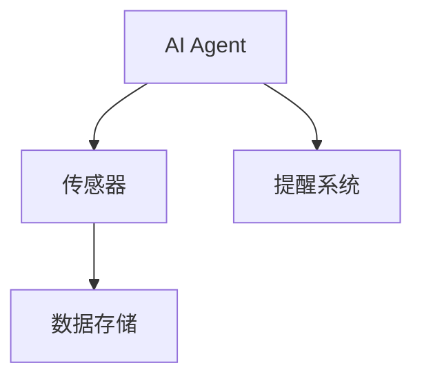
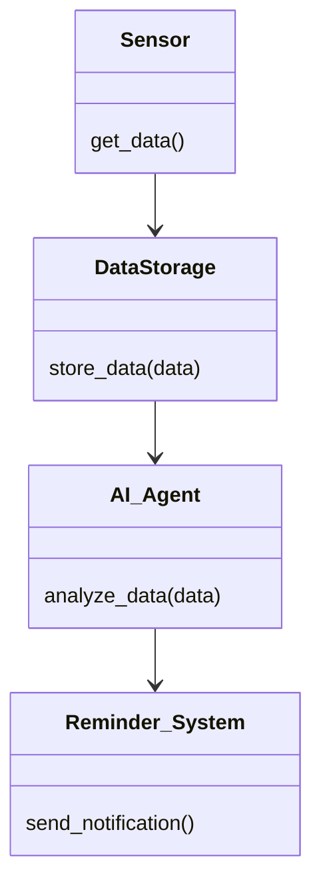
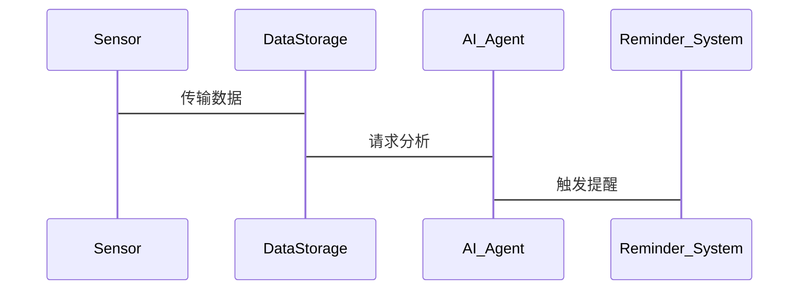

                 


```markdown
# AI Agent在智能浴室毛巾架中的毛巾更换提醒

## 关键词
AI Agent, 智能浴室, 物联网, 传感器, 数据处理, 提醒系统

## 摘要
本文探讨了AI Agent在智能浴室毛巾架中的应用，通过传感器数据和用户行为分析，实现毛巾更换提醒，提升用户体验。文章详细介绍了AI Agent的核心概念、算法原理、系统架构设计以及实际项目实现，展示了AI技术在智能家居中的巨大潜力。

---

## 第1章：问题背景与需求分析

### 1.1 问题背景

#### 1.1.1 智能浴室的发展趋势
智能家居的普及推动了浴室设备的智能化，物联网技术的应用使得浴室设备能够联网并互相通信。

#### 1.1.2 毛巾更换提醒的必要性
毛巾是浴室中频繁使用的物品，定期更换是保持卫生的重要环节。然而，用户常常忘记更换，导致细菌滋生，影响健康。

#### 1.1.3 AI Agent在智能家居中的应用前景
AI Agent（人工智能代理）能够感知环境并自主决策，其在智能家居中的应用前景广阔，可以显著提升生活的便捷性和舒适性。

### 1.2 问题描述

#### 1.2.1 毛巾更换提醒的核心问题
如何实现毛巾的自动更换提醒，确保卫生，同时减少用户的操作负担。

#### 1.2.2 用户需求分析
用户希望毛巾架能够自动检测使用情况并及时提醒更换，减少手动操作，提升使用体验。

#### 1.2.3 系统边界与外延
系统仅关注毛巾更换提醒功能，不涉及其他浴室设备的控制。

### 1.3 问题解决思路

#### 1.3.1 AI Agent的核心作用
AI Agent通过传感器数据和用户行为分析，判断毛巾的使用状态，触发提醒。

#### 1.3.2 物联网技术的应用
物联网技术用于采集毛巾架的传感器数据，AI Agent通过分析这些数据，决定是否需要提醒更换。

#### 1.3.3 多传感器协同工作的重要性
结合温度、湿度和使用频率等多种传感器的数据，提高判断的准确性。

---

## 第2章：核心概念与联系

### 2.1 AI Agent的基本概念

#### 2.1.1 AI Agent的定义
AI Agent是能够感知环境并采取行动以实现目标的智能实体。

#### 2.1.2 AI Agent的核心属性
- **自主性**：无需外部干预，自主决策。
- **反应性**：能够实时感知环境并做出反应。
- **目标导向**：所有行为均以实现特定目标为导向。

#### 2.1.3 AI Agent与传统算法的区别
AI Agent具有自主决策能力，而传统算法通常需要明确的规则。

### 2.2 物联网技术的基本概念

#### 2.2.1 物联网的定义
物联网是通过各种信息传感设备，按约定的协议，把任何物品与互联网连接起来，进行信息交换和通信。

#### 2.2.2 物联网的核心技术
- **传感器技术**：采集环境数据。
- **数据传输技术**：通过网络传输数据。
- **数据处理技术**：对数据进行分析和处理。

#### 2.2.3 物联网在智能家居中的应用
智能门锁、智能灯泡、智能插座等，提升家居智能化水平。

### 2.3 核心概念的联系与对比

#### 2.3.1 AI Agent与物联网的协同关系
物联网提供数据，AI Agent进行分析和决策。

#### 2.3.2 核心概念的属性特征对比（表格形式）

| 属性      | AI Agent               | 物联网技术           |
|-----------|------------------------|----------------------|
| 感知能力  | 高，实时感知环境数据   | 依赖传感器采集数据   |
| 决策能力  | 强，自主决策           | 无，仅传输数据       |
| 实时性     | 高，实时响应          | 中，依赖网络传输速度  |

#### 2.3.3 ER实体关系图（Mermaid流程图）



---

## 第3章：算法原理讲解

### 3.1 AI Agent的算法原理

#### 3.1.1 基于时间的提醒算法
根据预设的时间间隔提醒更换毛巾，例如每周更换一次。

#### 3.1.2 基于传感器数据的动态调整算法
根据传感器数据（如湿度、使用频率）动态调整提醒时间。

#### 3.1.3 算法的数学模型与公式
使用马尔可夫链模型预测毛巾的使用状态，状态转移概率公式如下：

$$ P(i_{n+1} = j) = \sum_{k} P(i_n = k) \cdot P(j | k) $$

### 3.2 算法实现与代码示例

#### 3.2.1 数据采集与处理

```python
import time

# 传感器数据采集
def get_sensor_data():
    # 模拟传感器数据
    return {'humidity': 60, 'temperature': 25, 'usage_count': 5}

# 数据处理
def process_data(data):
    if data['usage_count'] > 10 or data['humidity'] > 70:
        return True
    else:
        return False

# 算法实现
def ai_agent_logic():
    while True:
        data = get_sensor_data()
        if process_data(data):
            send_notification()
        time.sleep(24 * 60 * 60)  # 每天检查一次

# 提醒逻辑
def send_notification():
    print("提醒：请及时更换毛巾")
```

#### 3.2.2 代码解读与分析
- **数据采集**：函数`get_sensor_data`模拟传感器数据采集，返回湿度、温度和使用次数。
- **数据处理**：函数`process_data`根据传感器数据判断是否需要更换毛巾。
- **AI Agent逻辑**：函数`ai_agent_logic`每隔24小时检查一次传感器数据，触发提醒。

---

## 第4章：系统分析与架构设计

### 4.1 问题场景介绍

智能浴室中，毛巾架通过传感器监控毛巾的使用情况，AI Agent分析数据后，向用户发送提醒。

### 4.2 系统功能设计

#### 4.2.1 领域模型（Mermaid类图）



#### 4.2.2 系统架构设计（分层架构）

1. **数据采集层**：传感器采集数据。
2. **数据处理层**：处理并存储数据。
3. **业务逻辑层**：AI Agent分析数据，决定是否触发提醒。
4. **用户界面层**：显示提醒信息。

#### 4.2.3 系统接口设计

- **传感器数据接口**：提供传感器数据的读取接口。
- **提醒触发接口**：在需要更换时触发提醒。

#### 4.2.4 系统交互流程（Mermaid序列图）



---

## 第5章：项目实战

### 5.1 环境安装

- **安装Python**：使用Anaconda或Pyenv安装Python 3.8以上版本。
- **安装物联网设备库**：如Adafruit_IO库或其他传感器库。

### 5.2 核心代码实现

#### 5.2.1 数据采集代码

```python
import board
import adafruit_dht

# 初始化传感器
dht_SENSOR = adafruit_dht.DHT22(board.D4)

# 读取数据
def get_dht_data():
    try:
        temperature = dht_SENSOR.temperature
        humidity = dht_SENSOR.humidity
        return {'temperature': temperature, 'humidity': humidity}
    except:
        return None
```

#### 5.2.2 数据处理代码

```python
def process_data(data):
    if data['humidity'] > 70 or data['temperature'] > 25:
        return True
    else:
        return False
```

#### 5.2.3 提醒逻辑代码

```python
def send_notification():
    print("提醒：请及时更换毛巾")
    # 可以通过API发送通知到手机或其他设备
```

### 5.3 代码解读与分析

- **数据采集部分**：使用Adafruit_DHT库读取传感器数据，获取温度和湿度。
- **数据处理部分**：判断湿度和温度是否超过阈值，决定是否需要更换毛巾。
- **提醒逻辑部分**：通过控制台输出提醒信息，或通过网络发送通知。

### 5.4 实际案例分析

#### 5.4.1 案例描述
传感器数据：湿度为75%，温度为26℃，使用次数为10次。

#### 5.4.2 分析
湿度和温度均超过阈值，触发提醒。

#### 5.4.3 优化
调整湿度阈值至70%，减少误提醒。

---

## 第6章：总结与展望

### 6.1 最佳实践tips

- **传感器选择**：建议使用高精度传感器，确保数据准确性。
- **系统维护**：定期检查传感器和AI Agent的运行状态，确保系统稳定。

### 6.2 小结

本文详细介绍了AI Agent在智能浴室毛巾架中的应用，展示了其在物联网环境下的巨大潜力，为未来的智能家居系统设计提供了参考。

### 6.3 注意事项

- 提醒用户注意数据隐私，确保系统安全。

### 6.4 拓展阅读

- 推荐相关书籍：《人工智能：一种现代方法》、《物联网技术入门与实践》。

---

## 关键词
AI Agent, 智能浴室, 物联网, 传感器, 数据处理, 提醒系统

## 摘要
本文探讨了AI Agent在智能浴室毛巾架中的应用，通过传感器数据和用户行为分析，实现毛巾更换提醒，提升用户体验。文章详细介绍了AI Agent的核心概念、算法原理、系统架构设计以及实际项目实现，展示了AI技术在智能家居中的巨大潜力。
```

