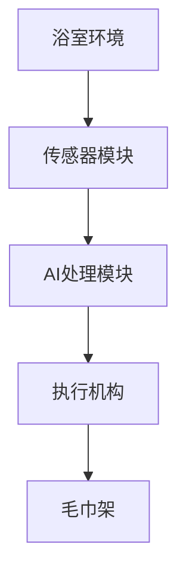
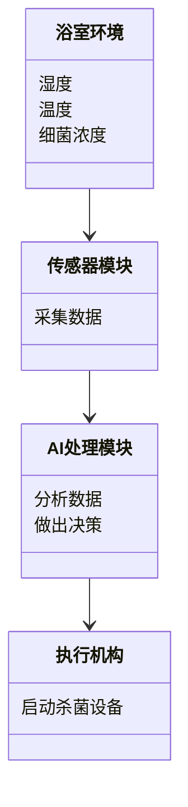
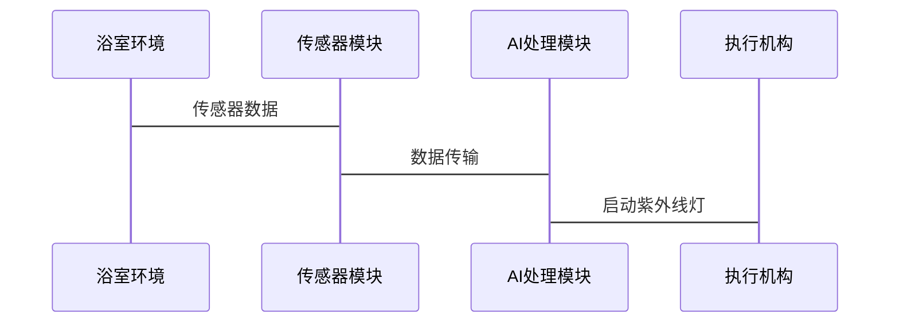

                 


# AI Agent在智能浴室毛巾架中的细菌控制

> 关键词：AI Agent, 智能浴室, 细菌控制, 物联网, 传感器

> 摘要：本文探讨了AI Agent在智能浴室毛巾架中的细菌控制应用。通过分析细菌检测、智能决策和执行控制的全过程，详细介绍了AI Agent的感知、决策和执行机制，并结合具体算法和系统架构设计，展示了如何利用AI技术实现浴室环境中的高效细菌控制。

---

## 第一部分: 背景介绍

### 第1章: 问题背景

#### 1.1 浴室环境中的细菌问题
浴室是一个潮湿、温暖的环境，非常适合细菌的生长。毛巾架作为浴室中的常见物品，经常接触水和湿气，容易成为细菌滋生的温床。常见的细菌包括大肠杆菌、金黄色葡萄球菌等，这些细菌不仅会影响毛巾的卫生，还可能对人体健康造成威胁。

#### 1.2 毛巾架在细菌传播中的作用
毛巾架是浴室中使用频率较高的物品，毛巾在使用过程中容易积累细菌。如果毛巾架本身不具备杀菌功能，细菌会在毛巾上快速繁殖，从而传播到使用者身上，导致健康问题。

#### 1.3 传统细菌控制方法的局限性
传统的细菌控制方法主要包括定期清洗、使用消毒剂等，但这些方法存在以下问题：
- 清洗和消毒需要人工操作，耗时耗力。
- 人工操作无法实时监测细菌浓度，难以实现精准控制。
- 化学消毒剂可能对人体和环境造成二次污染。

### 第2章: 问题描述

#### 2.1 毛巾架细菌控制的目标
通过智能技术实现毛巾架的自动杀菌功能，确保毛巾的卫生安全，减少细菌传播的风险。

#### 2.2 AI Agent在细菌控制中的角色
AI Agent（人工智能代理）是一种能够感知环境、做出决策并执行操作的智能系统。在浴室毛巾架中，AI Agent可以实时监测细菌浓度，根据数据做出杀菌决策，并通过执行机构实现杀菌操作。

### 第3章: 问题解决

#### 3.1 AI Agent的核心作用
AI Agent通过感知、决策和执行三个环节，实现对浴室环境中细菌的实时监测和控制。具体包括：
- **感知**：通过传感器获取浴室环境中的细菌浓度数据。
- **决策**：基于传感器数据，利用算法模型做出是否需要杀菌的决策。
- **执行**：根据决策结果，启动相应的杀菌设备（如紫外线灯）。

#### 3.2 智能毛巾架的设计理念
智能毛巾架的设计理念是将AI Agent技术与传统毛巾架结合，通过智能化的传感器和执行机构，实现对细菌的实时监测和自动控制。

#### 3.3 系统的整体解决方案
系统整体解决方案包括：
1. 传感器模块：用于实时监测浴室环境中的细菌浓度。
2. AI处理模块：用于数据的分析和决策。
3. 执行机构：用于根据决策结果执行杀菌操作。

### 第4章: 边界与外延

#### 4.1 系统的边界条件
- 系统仅针对浴室环境中的细菌控制。
- 传感器的监测范围有限，仅覆盖毛巾架附近的区域。
- 系统的杀菌操作仅限于毛巾架本身，不涉及其他区域。

#### 4.2 相关技术的外延影响
AI Agent技术的应用不仅限于浴室毛巾架，还可以扩展到其他领域，如医院、食品加工等需要实时监测和控制细菌的场景。

#### 4.3 系统的适用范围与限制
- 适用于家庭、酒店等小型浴室环境。
- 由于传感器的精度限制，系统可能无法检测到超低浓度的细菌。

### 第5章: 概念结构与核心要素

#### 5.1 系统的组成要素
- **传感器模块**：用于检测环境中的细菌浓度。
- **AI处理模块**：用于数据的分析和决策。
- **执行机构**：用于根据决策结果执行杀菌操作。

#### 5.2 各要素之间的关系
- 传感器模块将数据传输给AI处理模块，AI处理模块根据数据做出决策，并将指令传递给执行机构。

#### 5.3 核心概念的结构化描述
AI Agent在智能毛巾架中的工作流程可以总结为：感知 → 决策 → 执行。

---

## 第二部分: 核心概念与联系

### 第6章: AI Agent的原理

#### 6.1 AI Agent的基本概念
AI Agent是一种能够感知环境、做出决策并执行操作的智能系统。在智能毛巾架中，AI Agent通过传感器获取环境数据，利用算法模型做出决策，并通过执行机构实现杀菌操作。

#### 6.2 感知、决策、执行的流程
- **感知**：AI Agent通过传感器获取浴室环境中的细菌浓度数据。
- **决策**：AI Agent根据传感器数据，利用算法模型做出是否需要杀菌的决策。
- **执行**：AI Agent根据决策结果，启动相应的杀菌设备。

#### 6.3 AI Agent的核心算法
AI Agent的核心算法包括：
1. **细菌检测算法**：用于识别和计算环境中的细菌浓度。
2. **决策算法**：用于根据细菌浓度数据做出是否需要杀菌的决策。

### 第7章: 核心概念的属性特征对比

#### 7.1 不同AI Agent的对比分析
以下是几种常见的AI Agent的对比分析：

| 特性       | 基于规则的AI Agent | 基于机器学习的AI Agent | 基于深度学习的AI Agent |
|------------|---------------------|-------------------------|-------------------------|
| 决策方式   | 预先定义的规则       | 基于数据训练的模型     | 基于深度神经网络的模型 |
| 适应性     | 较低                | 较高                   | 高                     |
| 复杂性     | 低                  | 中                     | 高                     |

#### 7.2 系统实体关系的Mermaid图
以下是系统实体关系的Mermaid图：



---

## 第三部分: 算法原理讲解

### 第8章: 算法流程

#### 8.1 感知阶段
AI Agent通过传感器模块感知浴室环境中的细菌浓度。常用的传感器包括：
- **光度计**：通过测量溶液的吸光度来判断细菌浓度。
- **电化学传感器**：通过检测细菌代谢产物的电化学信号来判断细菌浓度。

#### 8.2 决策阶段
AI Agent根据传感器数据，利用算法模型做出是否需要杀菌的决策。常用的算法模型包括：
- **逻辑回归**：用于分类问题，判断细菌浓度是否超过阈值。
- **支持向量机**：用于分类问题，判断细菌浓度是否需要杀菌。

#### 8.3 执行阶段
AI Agent根据决策结果，启动相应的杀菌设备。常用的杀菌设备包括：
- **紫外线灯**：通过紫外线照射杀死细菌。
- **臭氧发生器**：通过臭氧气体杀菌。

### 第9章: 算法的数学模型

#### 9.1 感知模型
感知模型用于将传感器数据转换为细菌浓度。常用的感知模型包括：
- **线性回归模型**：用于将传感器信号与细菌浓度线性相关。
- **非线性回归模型**：用于将传感器信号与细菌浓度非线性相关。

#### 9.2 决策模型
决策模型用于根据细菌浓度数据做出是否需要杀菌的决策。常用的决策模型包括：
- **逻辑回归模型**：用于分类问题，判断细菌浓度是否超过阈值。
- **支持向量机模型**：用于分类问题，判断细菌浓度是否需要杀菌。

#### 9.3 执行模型
执行模型用于根据决策结果启动相应的杀菌设备。常用的执行模型包括：
- **阈值控制模型**：当细菌浓度超过阈值时，启动杀菌设备。
- **时间控制模型**：在特定时间启动杀菌设备。

---

## 第四部分: 系统分析与架构设计方案

### 第10章: 问题场景介绍

#### 10.1 浴室环境的复杂性
浴室环境复杂，包括高温、高湿、光照不足等因素，这些因素都会影响传感器的性能和杀菌设备的效果。

#### 10.2 系统的目标与约束
系统的目标是实现浴室环境中细菌的实时监测和自动控制。系统的约束包括：
- 传感器的精度有限。
- 系统的功耗需要控制在合理范围内。
- 系统的体积需要小巧紧凑。

### 第11章: 项目介绍

#### 11.1 项目的目
通过AI Agent技术实现浴室毛巾架的细菌控制，确保毛巾的卫生安全，减少细菌传播的风险。

#### 11.2 系统功能设计
系统的功能设计包括：
- **传感器模块**：实时监测浴室环境中的细菌浓度。
- **AI处理模块**：分析传感器数据，做出杀菌决策。
- **执行机构**：根据决策结果启动相应的杀菌设备。

### 第12章: 系统架构设计

#### 12.1 领域模型Mermaid类图
以下是领域模型的Mermaid类图：



#### 12.2 系统架构设计Mermaid架构图
以下是系统架构设计的Mermaid架构图：


---

## 第五部分: 项目实战

### 第13章: 环境安装

#### 13.1 安装Python
```bash
python --version
pip install --upgrade pip
pip install numpy
pip install scikit-learn
pip install tensorflow
```

#### 13.2 安装TensorFlow
```bash
pip install tensorflow
```

### 第14章: 系统核心实现源代码

#### 14.1 传感器数据的处理
```python
import numpy as np

# 传感器数据
data = np.array([0.5, 0.6, 0.7, 0.8, 0.9])

# 数据预处理
normalized_data = (data - np.min(data)) / (np.max(data) - np.min(data))

print(normalized_data)
```

#### 14.2 AI算法的实现
```python
import tensorflow as tf
from tensorflow import keras

# 数据集
X_train = np.array([[0.5], [0.6], [0.7], [0.8], [0.9]])
y_train = np.array([0, 0, 0, 1, 1])

# 模型构建
model = keras.Sequential([
    keras.layers.Dense(1, input_shape=(1,)),
    keras.layers.Activation('sigmoid')
])

# 模型训练
model.compile(optimizer='adam', loss='binary_crossentropy')
model.fit(X_train, y_train, epochs=100)
```

#### 14.3 执行机构的控制
```python
import RPi.GPIO as GPIO

# 紫外线灯控制
GPIO.setmode(GPIO.BCM)
GPIO.setup(17, GPIO.OUT)

# 启动紫外线灯
GPIO.output(17, GPIO.HIGH)
```

### 第15章: 实际案例分析

#### 15.1 案例分析
假设浴室环境中细菌浓度为0.8，AI Agent会根据传感器数据判断细菌浓度超过阈值，启动紫外线灯进行杀菌。

#### 15.2 系统交互分析
以下是系统的交互流程图：



---

## 第六部分: 最佳实践 tips、小结、注意事项、拓展阅读

### 第16章: 小结

#### 16.1 系统的优缺点
- 优点：能够实现浴室环境中细菌的实时监测和自动控制。
- 缺点：传感器的精度有限，系统成本较高。

### 第17章: 注意事项

#### 17.1 系统的维护
- 定期清洁传感器和执行机构。
- 定期检查AI算法模型的准确性。

#### 17.2 用户操作
- 用户需要定期更换紫外线灯泡。
- 用户需要定期清洁毛巾架。

### 第18章: 拓展阅读

#### 18.1 相关技术
- 智能家居
- 物联网
- 人工智能

#### 18.2 相关书籍
- 《人工智能：一种现代的方法》
- 《物联网技术与应用》

---

通过以上内容，我们可以看到AI Agent在智能浴室毛巾架中的细菌控制是一个复杂但有趣的技术问题。通过传感器、AI算法和执行机构的结合，我们可以实现浴室环境中的高效细菌控制，确保毛巾的卫生安全。

