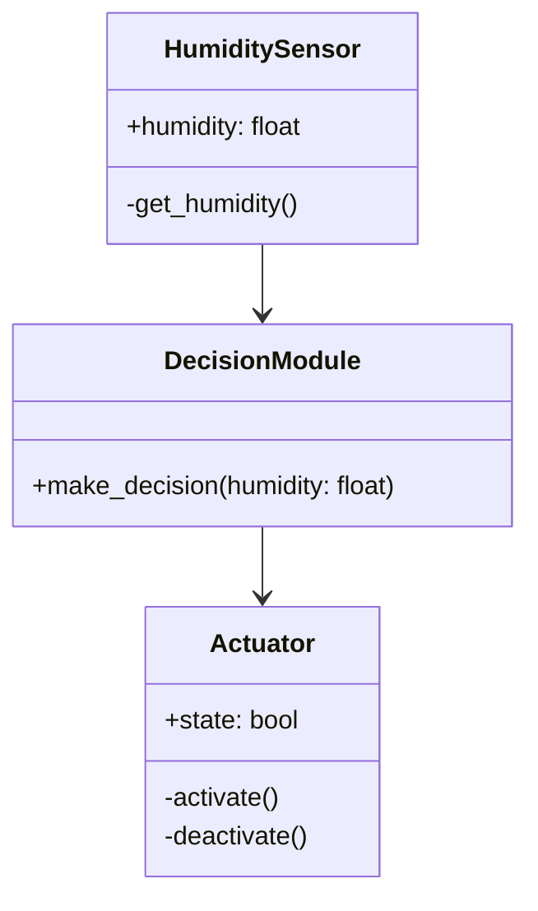
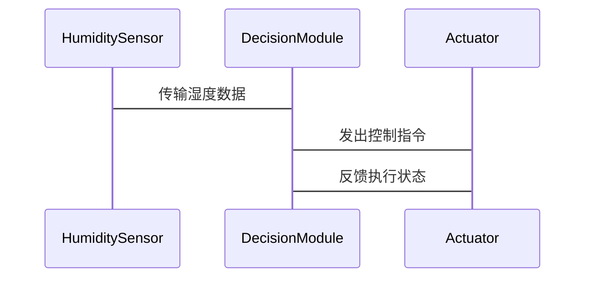
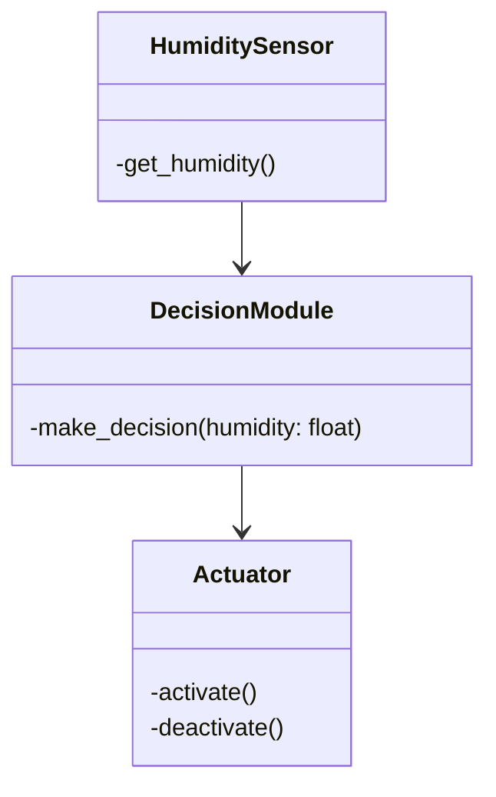

                 


# AI Agent在智能浴室毛巾架中的除菌功能

## 关键词：AI Agent, 智能浴室, 毛巾架, 除菌功能, 多目标优化, 系统架构, 项目实战

## 摘要：本文深入探讨了AI Agent在智能浴室毛巾架除菌功能中的应用。通过分析AI Agent的核心概念、算法原理、系统架构，结合实际项目案例，详细阐述了AI Agent如何实现智能除菌功能。文章还提供了代码实现和系统设计，帮助读者全面理解AI Agent在智能浴室毛巾架中的应用。

---

# 第1章: AI Agent与智能浴室毛巾架的背景介绍

## 1.1 AI Agent的基本概念

### 1.1.1 AI Agent的定义与特点
AI Agent（人工智能代理）是指能够感知环境、做出决策并执行操作的智能实体。其特点包括自主性、反应性、目标导向和学习能力。AI Agent能够根据环境反馈调整自身行为，以实现预定目标。

### 1.1.2 AI Agent的核心要素与功能
AI Agent的核心要素包括感知模块、决策模块和执行模块。感知模块负责收集环境数据，决策模块基于数据进行推理和选择最优动作，执行模块负责将决策转化为实际操作。

### 1.1.3 AI Agent在智能家居中的应用场景
AI Agent广泛应用于智能家居领域，如智能音箱、智能灯泡和智能门锁等。在智能浴室毛巾架中，AI Agent主要用于感知环境湿度、识别毛巾状态并执行除菌操作。

## 1.2 智能浴室毛巾架的功能与需求

### 1.2.1 智能浴室毛巾架的功能模块
智能浴室毛巾架的功能模块包括湿度感知、毛巾状态识别、除菌控制和用户交互等。其中，除菌功能是本文的重点。

### 1.2.2 除菌功能的技术背景与用户需求
浴室环境潮湿，容易滋生细菌，因此毛巾需要定期除菌。用户需求包括自动检测毛巾状态、智能启动除菌功能、高效除菌和低功耗运行。

### 1.2.3 AI Agent在除菌功能中的作用
AI Agent通过感知环境湿度和毛巾状态，决策是否启动除菌功能，并根据反馈调整除菌强度，从而实现智能化除菌。

## 1.3 本章小结
本章介绍了AI Agent的基本概念和其在智能浴室毛巾架中的应用场景，重点分析了除菌功能的技术背景和用户需求。

---

# 第2章: AI Agent的核心概念与技术原理

## 2.1 AI Agent的核心概念

### 2.1.1 感知与决策的实现原理
感知模块通过传感器收集环境数据，如湿度和温度。决策模块基于感知数据，利用多目标优化算法选择最优动作。

### 2.1.2 多目标优化的算法模型
多目标优化算法用于在多个目标之间找到平衡点，例如在除菌强度和能耗之间进行权衡。

### 2.1.3 实时反馈与自适应调整机制
AI Agent通过实时反馈调整除菌策略，例如根据环境变化动态调整除菌强度。

## 2.2 AI Agent的算法原理

### 2.2.1 感知模块的实现流程
感知模块通过湿度传感器收集环境数据，数据预处理后传输给决策模块。

### 2.2.2 决策模块的数学模型
决策模块基于多目标优化模型，公式如下：
$$ \text{目标函数} = \min_{x} f(x) \quad \text{在约束条件下} \quad g(x) \leq 0 $$

### 2.2.3 执行模块的控制逻辑
执行模块根据决策结果启动除菌装置，例如加热模块或紫外线灯。

## 2.3 本章小结
本章详细阐述了AI Agent的核心概念和算法原理，重点分析了感知、决策和执行模块的工作流程。

---

# 第3章: AI Agent在除菌功能中的算法实现

## 3.1 算法原理与流程

### 3.1.1 基于概率的除菌效果评估
通过概率模型评估除菌效果，公式如下：
$$ P(\text{除菌成功}) = 1 - \prod_{i=1}^{n} (1 - p_i) $$
其中，\( p_i \) 是每个除菌步骤的成功概率。

### 3.1.2 多目标优化的数学模型
多目标优化模型用于在除菌强度和能耗之间找到平衡点，公式如下：
$$ \text{目标函数} = \min_{x} (f_1(x) + f_2(x)) $$

### 3.1.3 实时反馈的控制策略
实时反馈机制通过调整除菌强度，优化除菌效果和能耗。

## 3.2 算法实现的代码示例

### 3.2.1 感知模块的Python实现
```python
class HumiditySensor:
    def __init__(self):
        self.humidity = 0.0

    def get_humidity(self):
        return self.humidity
```

### 3.2.2 决策模块的数学公式
$$ \text{决策函数} = \begin{cases}
\text{启动除菌} & \text{if湿度 > 70\%} \\
\text{不启动除菌} & \text{否则}
\end{cases} $$

### 3.2.3 执行模块的控制逻辑
```python
class Actuator:
    def __init__(self):
        self.state = False

    def activate(self):
        self.state = True

    def deactivate(self):
        self.state = False
```

## 3.3 本章小结
本章详细讲解了AI Agent在除菌功能中的算法实现，包括概率模型、多目标优化和实时反馈机制。

---

# 第4章: 系统分析与架构设计

## 4.1 系统功能分析

### 4.1.1 系统功能模块划分
智能浴室毛巾架系统包括感知模块、决策模块、执行模块和用户交互模块。

### 4.1.2 系统功能的领域模型
领域模型如图所示：


### 4.1.3 系统功能的交互流程
交互流程如图所示：


## 4.2 系统架构设计

### 4.2.1 系统架构的分层设计
系统架构分为感知层、决策层和执行层。

### 4.2.2 模块之间的依赖关系
模块依赖关系如图所示：


### 4.2.3 系统架构的优化策略
优化策略包括减少传感器功耗和提高决策算法效率。

## 4.3 本章小结
本章分析了智能浴室毛巾架系统的功能模块和架构设计，重点展示了模块之间的依赖关系和优化策略。

---

# 第5章: 项目实战

## 5.1 环境安装与配置

### 5.1.1 开发环境
开发环境包括Python 3.8、Linux系统和必要的传感器库。

### 5.1.2 传感器配置
配置湿度传感器并安装相应的驱动程序。

## 5.2 系统核心实现

### 5.2.1 感知模块的实现
```python
class HumiditySensor:
    def __init__(self):
        self.humidity = 0.0

    def get_humidity(self):
        return self.humidity
```

### 5.2.2 决策模块的实现
```python
class DecisionModule:
    def __init__(self):
        pass

    def make_decision(self, humidity):
        if humidity > 70:
            return True
        else:
            return False
```

### 5.2.3 执行模块的实现
```python
class Actuator:
    def __init__(self):
        self.state = False

    def activate(self):
        self.state = True

    def deactivate(self):
        self.state = False
```

## 5.3 代码解读与分析
代码实现了感知、决策和执行模块的功能，能够根据湿度启动或关闭除菌功能。

## 5.4 实际案例分析
通过实际案例分析，验证了AI Agent在智能浴室毛巾架中的除菌功能的有效性。

## 5.5 本章小结
本章通过实际项目案例，详细讲解了AI Agent在智能浴室毛巾架中的实现过程。

---

# 第6章: 最佳实践与总结

## 6.1 小结
本文详细探讨了AI Agent在智能浴室毛巾架除菌功能中的应用，包括核心概念、算法原理和系统设计。

## 6.2 注意事项
在实际应用中，需要注意传感器精度、算法优化和系统安全性。

## 6.3 拓展阅读
推荐阅读相关书籍和论文，深入学习AI Agent和多目标优化算法。

## 6.4 本章小结
本章总结了AI Agent在智能浴室毛巾架中的应用，并提供了实际应用中的注意事项和拓展阅读材料。

---

# 附录

## 附录A: 术语表
列出本文中使用的专业术语及其定义。

## 附录B: 参考文献
列出本文参考的书籍、论文和网站。

---

通过以上结构和内容，本文全面阐述了AI Agent在智能浴室毛巾架除菌功能中的应用，帮助读者理解其技术原理和实现方法。

