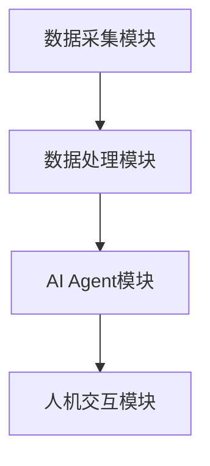
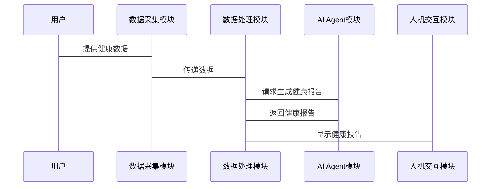

                 


# AI Agent在智能浴室镜中的每日健康报告

> 关键词：AI Agent, 智能浴室镜, 健康报告, 机器学习, 数据分析

> 摘要：本文探讨了AI Agent在智能浴室镜中的应用，重点分析了其在每日健康报告生成中的算法原理、系统架构和实现细节，通过实际案例展示了AI Agent在智能健康监测中的优势和潜力。

---

# 第1章: AI Agent与智能浴室镜的背景介绍

## 1.1 AI Agent的基本概念

### 1.1.1 什么是AI Agent
AI Agent（人工智能代理）是一种能够感知环境、自主决策并执行任务的智能实体。它通过传感器获取数据，利用算法进行分析，执行预设或自适应的行为以达到目标。

### 1.1.2 AI Agent的核心功能
- 数据感知与采集：通过传感器获取实时数据。
- 数据分析与处理：利用机器学习算法对数据进行分析和预测。
- 自主决策：基于分析结果做出决策并执行动作。
- 人机交互：通过界面与用户进行实时互动。

### 1.1.3 AI Agent与传统软件的区别
- **自主性**：AI Agent能够自主决策，而传统软件依赖于预设规则。
- **学习能力**：AI Agent能够通过数据不断优化性能，而传统软件无法自我改进。
- **适应性**：AI Agent能够适应环境变化，而传统软件需要手动调整。

## 1.2 智能浴室镜的功能与特点

### 1.2.1 智能浴室镜的基本功能
- 显示时间、天气信息。
- 提供健康数据可视化。
- 自动生成每日健康报告。

### 1.2.2 智能浴室镜的智能化特点
- **数据采集**：集成传感器，实时监测用户健康数据。
- **智能分析**：利用AI技术对数据进行分析和预测。
- **个性化服务**：根据用户需求提供定制化建议。

### 1.2.3 智能浴室镜的用户需求分析
- 用户希望获得个性化的健康建议。
- 用户需要实时的健康监测数据。
- 用户期望设备能够自动优化健康计划。

## 1.3 每日健康报告的核心价值

### 1.3.1 健康报告的定义与作用
健康报告是基于用户的健康数据生成的分析结果，用于帮助用户了解健康状况并提供改进建议。

### 1.3.2 每日健康报告的核心内容
- **基础代谢率**：计算用户的每日能量消耗。
- **健康评分**：综合评估用户的健康状况。
- **健康建议**：提供个性化的饮食和运动建议。

### 1.3.3 健康报告对用户的意义
- 帮助用户实时了解健康状况。
- 提供科学的健康建议，改善生活习惯。
- 通过长期跟踪，帮助用户实现健康目标。

## 1.4 本章小结
本章介绍了AI Agent的基本概念和智能浴室镜的功能特点，重点阐述了每日健康报告的核心价值及其对用户的重要性。通过了解AI Agent和智能浴室镜的基本原理，为后续的深入分析奠定了基础。

---

# 第2章: AI Agent与健康数据的关系

## 2.1 AI Agent的核心原理

### 2.1.1 AI Agent的基本工作原理
AI Agent通过传感器获取数据，利用算法进行分析和预测，并根据结果做出决策和执行动作。

### 2.1.2 AI Agent的决策机制
- 数据输入：通过传感器获取用户健康数据。
- 数据处理：利用机器学习算法进行分析和预测。
- 决策输出：基于分析结果生成健康报告。

### 2.1.3 AI Agent的学习与优化
AI Agent通过不断学习新的数据，优化算法模型，提高预测精度和决策能力。

## 2.2 健康数据的特征与分类

### 2.2.1 健康数据的类型
- **生理数据**：心率、体温、血压等。
- **行为数据**：运动量、睡眠质量等。
- **环境数据**：空气质量、温度、湿度等。

### 2.2.2 健康数据的采集方式
- **传感器采集**：通过智能设备采集数据。
- **用户输入**：用户手动输入数据。
- **第三方数据**：从其他健康设备获取数据。

### 2.2.3 健康数据的处理与分析
- 数据清洗：去除噪声和异常值。
- 数据转换：将数据转换为适合算法处理的形式。
- 数据分析：利用机器学习算法进行分析和预测。

## 2.3 AI Agent与健康数据的关联

### 2.3.1 AI Agent如何处理健康数据
AI Agent通过传感器获取健康数据，利用算法进行分析和预测，生成健康报告。

### 2.3.2 AI Agent如何生成健康报告
AI Agent根据分析结果，生成个性化的健康报告，包括健康评分、健康建议等内容。

### 2.3.3 健康数据对AI Agent的影响
健康数据的质量和数量直接影响AI Agent的预测精度和决策能力。

## 2.4 核心概念的对比分析

### 2.4.1 AI Agent与传统算法的对比
| 对比维度 | AI Agent | 传统算法 |
|----------|-----------|-----------|
| 自主性    | 高         | 低         |
| 学习能力  | 高         | 低         |
| 适应性    | 高         | 低         |

### 2.4.2 健康数据与传统数据的对比
| 对比维度 | 健康数据     | 传统数据   |
|----------|--------------|-------------|
| 类型      | 多维、动态    | 单一、静态   |
| 用途      | 健康分析     | 业务处理    |
| 复杂性    | 高           | 低           |

### 2.4.3 AI Agent在健康数据中的优势
- **数据处理能力强**：能够处理多维、动态的健康数据。
- **学习能力强**：能够通过不断学习优化健康报告的生成。

## 2.5 本章小结
本章详细分析了AI Agent的核心原理和健康数据的特征与分类，通过对比分析，突出了AI Agent在健康数据处理中的优势和潜力。

---

# 第3章: AI Agent的算法原理

## 3.1 AI Agent的核心算法

### 3.1.1 基于规则的AI Agent
基于规则的AI Agent通过预设的规则进行决策，适用于规则简单、场景固定的场景。

### 3.1.2 基于机器学习的AI Agent
基于机器学习的AI Agent通过训练模型进行预测和决策，适用于复杂场景。

### 3.1.3 基于深度学习的AI Agent
基于深度学习的AI Agent通过深度神经网络进行分析和预测，适用于数据量大、复杂度高的场景。

## 3.2 AI Agent的数学模型

### 3.2.1 线性回归模型
线性回归模型是一种常用的回归分析方法，用于预测连续型变量。

$$ y = \beta_0 + \beta_1x_1 + \beta_2x_2 + \dots + \beta_nx_n $$

### 3.2.2 支持向量机模型
支持向量机模型是一种常用的分类算法，用于分类问题。

### 3.2.3 神经网络模型
神经网络模型是一种常用的深度学习算法，用于复杂的模式识别。

## 3.3 AI Agent的实现流程

### 3.3.1 数据预处理
数据预处理是AI Agent实现的关键步骤，包括数据清洗、数据转换等。

### 3.3.2 模型训练
模型训练是AI Agent的核心过程，通过训练数据优化模型参数。

### 3.3.3 模型预测
模型预测是AI Agent的输出阶段，通过模型预测结果生成健康报告。

## 3.4 本章小结
本章详细介绍了AI Agent的核心算法和数学模型，通过实现流程的描述，展示了AI Agent在智能浴室镜中的具体应用。

---

# 第4章: AI Agent的系统架构设计

## 4.1 智能浴室镜的系统架构

### 4.1.1 系统功能模块
- 数据采集模块：负责采集用户健康数据。
- 数据处理模块：负责处理和分析数据。
- AI Agent模块：负责生成健康报告。
- 人机交互模块：负责与用户进行互动。

### 4.1.2 系统架构图


## 4.2 系统接口设计

### 4.2.1 数据接口
- 数据输入接口：接收传感器数据。
- 数据输出接口：输出健康报告。

### 4.2.2 用户接口
- 用户输入接口：接收用户的输入指令。
- 用户输出接口：显示健康报告。

## 4.3 系统交互流程

### 4.3.1 交互流程图


## 4.4 本章小结
本章详细描述了智能浴室镜的系统架构设计，包括功能模块、接口设计和交互流程，展示了AI Agent在系统中的具体实现。

---

# 第5章: AI Agent的项目实战

## 5.1 环境安装

### 5.1.1 安装Python
```bash
python --version
pip install --upgrade pip
```

### 5.1.2 安装机器学习库
```bash
pip install numpy scikit-learn
```

## 5.2 核心代码实现

### 5.2.1 数据预处理代码
```python
import numpy as np
from sklearn import preprocessing

# 假设data是原始数据
data = np.array([100, 200, 300, 400])
data_normalized = preprocessing.normalize(data)
print(data_normalized)
```

### 5.2.2 线性回归模型代码
```python
from sklearn.linear_model import LinearRegression

# 假设X是特征矩阵，y是目标向量
model = LinearRegression()
model.fit(X, y)
predictions = model.predict(X_test)
```

## 5.3 代码解读与分析

### 5.3.1 数据预处理代码解读
- 使用`preprocessing.normalize`对数据进行标准化处理，确保数据分布均匀。

### 5.3.2 线性回归模型代码解读
- 使用`LinearRegression`模型进行训练和预测，适用于简单的回归问题。

## 5.4 实际案例分析

### 5.4.1 数据集准备
- 数据集包含用户健康数据，如心率、体重、运动时间等。

### 5.4.2 模型训练
- 使用训练数据训练线性回归模型，优化模型参数。

### 5.4.3 模型预测
- 使用训练好的模型对测试数据进行预测，生成健康报告。

## 5.5 本章小结
本章通过实际案例展示了AI Agent在智能浴室镜中的具体实现，包括环境安装、代码实现和案例分析。

---

# 第6章: AI Agent的最佳实践

## 6.1 小结
- AI Agent在智能浴室镜中的应用前景广阔。
- 通过机器学习算法和数据分析技术，能够生成个性化的健康报告。

## 6.2 注意事项
- 数据隐私保护：确保用户数据的安全性。
- 算法优化：不断优化算法模型，提高预测精度。
- 系统维护：定期维护系统，确保设备正常运行。

## 6.3 拓展阅读
- 《机器学习实战》
- 《深度学习》
- 《人工智能导论》

---

# 结语

通过本文的分析，我们可以看到AI Agent在智能浴室镜中的应用潜力巨大。随着技术的不断发展，AI Agent将更加智能化，为用户带来更加个性化的健康服务。

