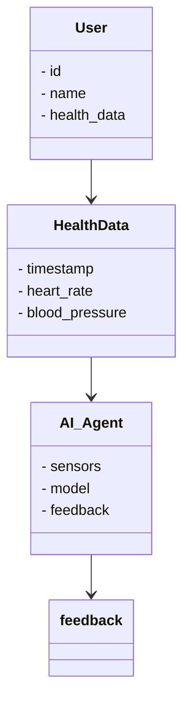
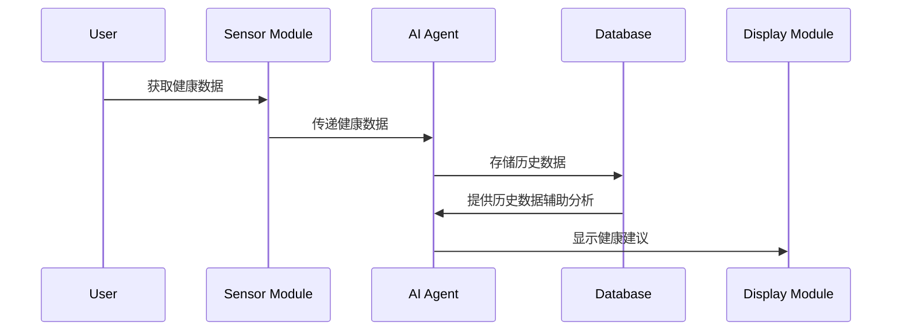

                 


# 目录大纲：AI Agent在智能浴室镜中的每日健康检查

---

# 第一部分：AI Agent在智能浴室镜中的每日健康检查背景介绍

## 第1章：AI Agent与智能浴室镜概述

### 1.1 问题背景
- **1.1.1 智能家居的发展现状**：智能家居的普及趋势，浴室智能化的市场增长。
- **1.1.2 智能浴室镜的市场需求**：用户对智能镜子的多样化需求，健康监测的兴起。
- **1.1.3 健康监测的必要性**：日常健康监测的重要性，预防疾病的作用。

### 1.2 问题描述
- **1.2.1 智能浴室镜的功能需求**：显示健康数据、天气、新闻等功能。
- **1.2.2 每日健康检查的核心问题**：如何准确采集和分析健康数据。
- **1.2.3 用户痛点与需求分析**：用户对隐私保护、数据准确性的关注。

### 1.3 问题解决
- **1.3.1 AI Agent的核心作用**：通过AI算法处理健康数据，提供个性化建议。
- **1.3.2 智能浴室镜的实现路径**：集成传感器、AI算法和显示模块。
- **1.3.3 健康数据的采集与分析**：通过传感器采集数据，AI分析生成建议。

### 1.4 边界与外延
- **1.4.1 智能浴室镜的功能边界**：仅限于健康监测，不涉及医疗诊断。
- **1.4.2 AI Agent的应用范围**：健康数据监测、个性化建议提供。
- **1.4.3 健康数据的隐私保护**：数据加密传输，用户隐私保护措施。

### 1.5 核心概念结构
- **1.5.1 核心概念组成**：AI Agent、智能浴室镜、健康数据。
- **1.5.2 概念之间的关系**：AI Agent处理健康数据，驱动智能镜子显示结果。
- **1.5.3 系统架构的初步框架**：传感器、AI算法、显示模块的集成。

---

# 第二部分：AI Agent的核心概念与联系

## 第2章：AI Agent的原理与特征

### 2.1 核心原理
- **2.1.1 基于规则的推理**：通过预设规则进行简单的逻辑推理。
- **2.1.2 基于机器学习的决策**：使用深度学习模型进行复杂决策。
- **2.1.3 多模态数据的融合**：整合图像、文本、数值等多种数据类型。

### 2.2 概念属性对比
| 概念       | 属性               | 描述                                   |
|------------|--------------------|----------------------------------------|
| AI Agent   | 输入方式           | 多模态数据输入                         |
|            | 输出方式           | 实时反馈                               |
|            | 处理能力           | 多任务处理能力                         |

### 2.3 ER实体关系图
```mermaid
er
actor: 用户
agent: AI Agent
mirror: 智能浴室镜
health_data: 健康数据
goal: 健康目标
rules: 规则库
feedback: 反馈
action: 行动建议
```

---

# 第三部分：AI Agent的算法原理

## 第3章：算法原理与实现

### 3.1 算法原理
- **3.1.1 基于规则的推理算法**：简单的条件判断，如早晨显示天气。
- **3.1.2 基于机器学习的分类算法**：使用神经网络分析健康数据，如心率异常检测。
- **3.1.3 基于深度学习的自然语言处理**：生成自然的健康建议文本。

### 3.2 算法流程图
```mermaid
graph TD
A[开始]
B[数据采集]
C[数据预处理]
D[选择算法]
E[模型训练]
F[生成反馈]
G[结束]
A -> B
B -> C
C -> D
D -> E
E -> F
F -> G
```

### 3.3 核心代码实现
```python
def preprocess_data(data):
    # 数据清洗和标准化
    processed_data = data.dropna().astype(float)
    return processed_data

def train_model(train_data, labels):
    # 使用机器学习模型训练
    model = RandomForestClassifier()
    model.fit(train_data, labels)
    return model

def generate_feedback(predicted_labels):
    # 生成健康反馈
    feedback = []
    for label in predicted_labels:
        if label == 1:
            feedback.append("请注意您的心率偏高，建议休息。")
        else:
            feedback.append("您的健康状况良好，继续保持。")
    return feedback
```

### 3.4 数学模型与公式
- **贝叶斯定理**：用于分类问题，公式如下：
  $$ P(A|B) = \frac{P(B|A)P(A)}{P(B)} $$
- **决策树模型**：用于健康数据分类，通过特征重要性排序优化模型。

---

# 第四部分：系统分析与架构设计

## 第4章：系统分析与架构设计

### 4.1 项目背景
- **目标**：设计一个智能浴室镜，每天监测用户的健康状况。
- **范围**：仅限于健康监测，不涉及医疗诊断。

### 4.2 系统功能设计


### 4.3 系统架构设计


### 4.4 系统接口设计
- **数据采集接口**：传感器数据的读取和存储。
- **模型调用接口**：AI Agent调用预训练模型进行分析。
- **反馈展示接口**：将健康建议显示在镜子上。

### 4.5 系统交互流程


---

# 第五部分：项目实战

## 第5章：项目实战与实现

### 5.1 环境安装
- **Python 3.8+**
- **安装库**：numpy、pandas、scikit-learn、mermaid、tensorflow

### 5.2 核心代码实现
```python
import numpy as np
import pandas as pd
from sklearn.ensemble import RandomForestClassifier

# 数据预处理
def preprocess_data(dataframe):
    return dataframe.dropna().astype(float)

# 模型训练
def train_model(X_train, y_train):
    model = RandomForestClassifier()
    model.fit(X_train, y_train)
    return model

# 模型预测
def predict_health(model, X_test):
    predictions = model.predict(X_test)
    return predictions

# 生成反馈
def generate_feedback(predictions):
    feedback = []
    for pred in predictions:
        if pred == 1:
            feedback.append("请注意您的心率偏高，建议休息。")
        else:
            feedback.append("您的健康状况良好，继续保持。")
    return feedback
```

### 5.3 项目小结
- **经验总结**：数据质量和模型选择对结果影响显著。
- **注意事项**：确保数据隐私和系统稳定性。
- **优化方向**：引入更先进的AI算法，如Transformer模型，提升健康建议的准确性。

---

# 第六部分：最佳实践与总结

## 第6章：最佳实践与总结

### 6.1 小结
- 通过AI Agent实现智能浴室镜的每日健康检查，提升了用户体验。
- 系统架构设计合理，数据处理流程清晰。

### 6.2 注意事项
- **数据隐私**：确保健康数据的加密存储和传输。
- **系统稳定性**：定期更新模型，确保算法的有效性。

### 6.3 拓展阅读
- 推荐阅读《人工智能入门》和《深度学习实战》。

---

# 结束语

通过本章的学习和实践，读者可以掌握AI Agent在智能浴室镜中的应用，从理论到实践，实现一个完整的健康监测系统。希望这些内容能够为读者在智能家居和AI领域的深入探索提供有价值的参考。

