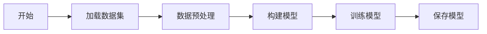
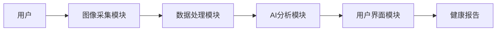
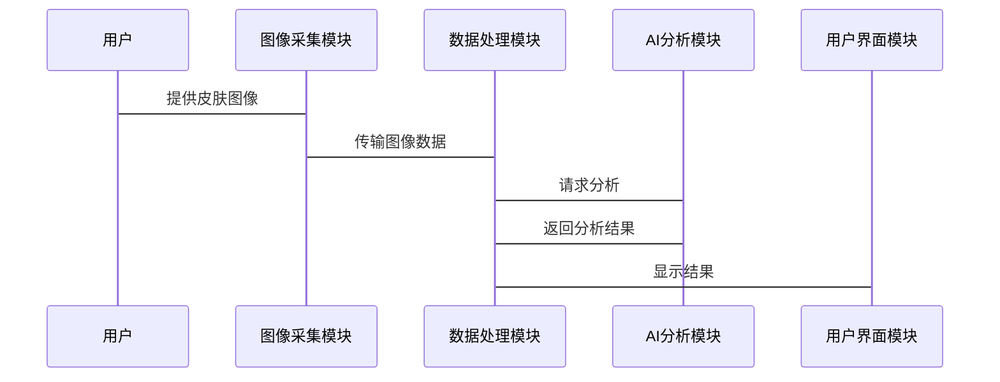

                 


# AI Agent在智能浴室镜中的皮肤状态分析

> 关键词：AI Agent, 皮肤状态分析, 智能浴室镜, 人工智能, 图像处理, 健康监测

> 摘要：本文探讨了AI Agent在智能浴室镜中的应用，特别是皮肤状态分析的实现。通过详细的技术分析和案例研究，展示了如何利用AI技术实时监测皮肤健康，提供个性化护肤建议，并记录健康数据。文章从背景介绍、核心概念、算法原理、系统架构、项目实战到最佳实践，全面解析了这一技术的实现过程和实际应用。

---

## 第一部分: AI Agent与皮肤状态分析的背景与概念

### 第1章: AI Agent与皮肤状态分析概述

#### 1.1 AI Agent的基本概念
##### 1.1.1 人工智能代理（AI Agent）的定义
人工智能代理（AI Agent）是一种能够感知环境、执行任务并做出决策的智能实体。它通过传感器获取信息，利用算法处理数据，并通过执行器与环境交互。AI Agent的核心目标是通过自动化手段解决问题或优化特定目标。

##### 1.1.2 AI Agent的核心特征
AI Agent具有以下核心特征：
1. **自主性**：能够在没有外部干预的情况下独立运行。
2. **反应性**：能够实时感知环境变化并做出相应反应。
3. **目标导向**：所有行为都围绕特定目标展开。
4. **学习能力**：能够通过数据和经验不断优化自身的决策能力。

##### 1.1.3 AI Agent在智能浴室镜中的应用背景
智能浴室镜是一个集成硬件和软件的设备，能够通过AI Agent实现多种智能功能。AI Agent在其中的主要作用是实时监测用户的皮肤状态，分析健康数据，并提供个性化的护肤建议。

#### 1.2 皮肤状态分析的必要性
##### 1.2.1 皮肤健康的重要性
皮肤是人体最大的器官，不仅是保护身体的第一道屏障，还反映着整体健康状况。皮肤问题如 acne（粉刺）、wrinkles（皱纹）、dark spots（色斑）等，可能与饮食、作息、压力等多种因素有关。

##### 1.2.2 现有皮肤监测技术的局限性
传统的皮肤监测方法依赖于人工观察和定期检查，存在耗时长、效率低、难以实时监测等问题。医疗资源的有限性也导致许多人无法及时获得专业的皮肤健康建议。

##### 1.2.3 AI Agent在皮肤状态分析中的优势
AI Agent能够通过图像处理技术快速分析皮肤状态，实时监测健康状况，并提供个性化的护肤建议。它能够显著提高监测效率，降低医疗成本，并为用户提供便捷的健康服务。

#### 1.3 智能浴室镜中的AI Agent应用场景
##### 1.3.1 皮肤状态实时监测
AI Agent通过摄像头采集用户的皮肤图像，利用图像处理技术分析皮肤状态，实时监测皮肤健康状况。

##### 1.3.2 个性化护肤建议
根据皮肤状态分析结果，AI Agent能够为用户提供个性化的护肤建议，包括推荐适合的护肤品、调整护肤习惯等。

##### 1.3.3 健康数据记录与分析
AI Agent可以记录用户的皮肤健康数据，并通过长期分析提供健康趋势报告，帮助用户更好地了解和管理皮肤健康。

---

### 第2章: 皮肤状态分析的核心概念与原理

#### 2.1 皮肤状态分析的关键特征
##### 2.1.1 皮肤颜色特征
皮肤颜色特征包括色调（Hue）、饱和度（Saturation）、亮度（Value）等参数。这些参数能够反映皮肤的健康状况，例如苍白可能表示贫血，黄疸可能表示肝功能异常。

##### 2.1.2 皮肤纹理特征
皮肤纹理特征包括 wrinkles（皱纹）、acne（粉刺）、dark spots（色斑）等。这些特征可以通过图像处理技术提取，并用于皮肤健康评估。

##### 2.1.3 皮肤病变特征
皮肤病变特征包括痣、痣变性、皮肤癌前病变等。AI Agent可以通过图像识别技术检测这些病变特征，并及时发出预警。

#### 2.2 AI Agent在皮肤状态分析中的工作流程
##### 2.2.1 数据采集与预处理
AI Agent通过摄像头采集用户的皮肤图像，并对图像进行预处理，包括去噪、调整亮度和对比度等，以提高图像质量。

##### 2.2.2 特征提取与分析
AI Agent利用图像处理技术提取皮肤颜色、纹理和病变特征，并通过机器学习算法进行分析，评估皮肤健康状况。

##### 2.2.3 结果输出与反馈
AI Agent根据分析结果输出皮肤健康报告，并提供个性化的护肤建议。用户可以根据报告调整护肤习惯或咨询专业医生。

---

#### 2.3 皮肤状态分析的核心概念与联系
##### 2.3.1 核心概念原理
皮肤状态分析的核心原理是通过图像处理和机器学习技术，提取和分析皮肤特征，评估健康状况。AI Agent在此过程中起到数据处理和决策支持的作用。

##### 2.3.2 特征提取方法对比
| 特征提取方法 | 优点 | 缺点 |
|----------------|------|------|
| 基于颜色的特征提取 | 实现简单，计算效率高 | 易受光照条件影响 |
| 基于纹理的特征提取 | 能够捕捉皮肤细节 | 实现复杂，计算效率较低 |
| 基于深度学习的特征提取 | 提取特征能力强，准确性高 | 需要大量标注数据，计算资源消耗大 |

##### 2.3.3 ER实体关系图
```mermaid
er
  actor: 用户
  agent: AI Agent
  skin_image: 皮肤图像
  skin_feature: 皮肤特征
  health_report: 健康报告
  advice: 护肤建议

  actor --> skin_image: 提供
  agent --> skin_image: 采集
  agent --> skin_feature: 提取
  agent --> health_report: 生成
  agent --> advice: 提供
```

---

### 第3章: 皮肤状态分析的算法原理

#### 3.1 算法原理概述
皮肤状态分析的核心算法是基于卷积神经网络（CNN）的图像分类。通过训练CNN模型，AI Agent能够识别和分类不同的皮肤特征。

#### 3.2 算法流程
1. **数据预处理**：调整图像大小、归一化处理。
2. **特征提取**：利用CNN提取图像特征。
3. **分类预测**：通过分类器预测皮肤状态。
4. **结果分析**：根据预测结果生成健康报告。

#### 3.3 算法的数学模型和公式
##### 3.3.1 损失函数
$$\text{损失函数} = \frac{1}{N} \sum_{i=1}^{N} (y_i - \hat{y_i})^2$$
其中，\( y_i \) 是真实标签，\( \hat{y_i} \) 是预测标签，\( N \) 是样本数量。

##### 3.3.2 优化器
$$\text{优化器} = \text{Adam}(\text{学习率}=0.001, \beta_1=0.9, \beta_2=0.999)$$

##### 3.3.3 模型训练流程


#### 3.4 算法实现代码
```python
import tensorflow as tf
from tensorflow.keras import layers, models

# 数据预处理
def preprocess_image(image):
    image = tf.keras.preprocessing.image.load_img(image, target_size=(128, 128))
    image = tf.keras.preprocessing.image.img_to_array(image)
    image = tf.keras.applications.mobilenet_v2.preprocess_input(image)
    return image

# 构建模型
def build_model():
    model = models.Sequential()
    model.add(layers.Conv2D(32, (3, 3), activation='relu', input_shape=(128, 128, 3)))
    model.add(layers.MaxPooling2D((2, 2)))
    model.add(layers.Conv2D(64, (3, 3), activation='relu'))
    model.add(layers.MaxPooling2D((2, 2)))
    model.add(layers.Flatten())
    model.add(layers.Dense(128, activation='relu'))
    model.add(layers.Dense(2, activation='sigmoid'))
    model.compile(optimizer='adam', loss='binary_crossentropy', metrics=['accuracy'])
    return model

# 训练模型
def train_model(model, train_images, train_labels):
    model.fit(train_images, train_labels, epochs=10, batch_size=32, validation_split=0.2)
    model.save('skin_analyzer.h5')
```

---

### 第4章: 系统架构设计

#### 4.1 系统构成与功能设计
智能浴室镜系统主要由以下模块组成：
1. **图像采集模块**：通过摄像头采集用户的皮肤图像。
2. **数据处理模块**：对图像进行预处理和特征提取。
3. **AI分析模块**：利用CNN模型分析皮肤状态。
4. **用户界面模块**：显示分析结果和护肤建议。

#### 4.2 系统架构图


#### 4.3 系统交互流程


---

## 第二部分: 项目实战与优化

### 第5章: 项目实战

#### 5.1 环境搭建
- **硬件**：摄像头、显示屏、处理器。
- **软件**：Python、TensorFlow、Keras、OpenCV。

#### 5.2 核心实现
##### 5.2.1 数据集准备
```python
import os
import cv2

def load_dataset(train_dir, val_dir):
    train_datagen = tf.keras.preprocessing.image.ImageDataGenerator(rescale=1./255)
    val_datagen = tf.keras.preprocessing.image.ImageDataGenerator(rescale=1./255)

    train_generator = train_datagen.flow_from_directory(train_dir, target_size=(128, 128), batch_size=32, class_mode='binary')
    val_generator = val_datagen.flow_from_directory(val_dir, target_size=(128, 128), batch_size=32, class_mode='binary')
    return train_generator, val_generator
```

##### 5.2.2 模型训练
```python
model = build_model()
train_generator, val_generator = load_dataset('data/train', 'data/val')
train_model(model, train_generator, val_generator)
```

##### 5.2.3 结果分析
```python
loss, accuracy = model.evaluate(train_generator)
print(f"训练损失: {loss}, 训练准确率: {accuracy}")
```

#### 5.3 优化与改进
##### 5.3.1 模型优化
通过调整学习率、批量大小和模型结构，提升模型的准确率和训练效率。

##### 5.3.2 系统优化
优化数据处理流程，提高系统的实时响应能力。

---

## 第三部分: 最佳实践与总结

### 第6章: 最佳实践

#### 6.1 小结
通过本文的详细讲解，读者可以了解AI Agent在智能浴室镜中的应用，掌握皮肤状态分析的核心技术和实现方法。

#### 6.2 注意事项
- 数据隐私保护：确保用户数据的安全性和隐私性。
- 系统稳定性：保证系统的高可用性和稳定性。
- 模型可解释性：提高模型的可解释性，便于用户理解和信任。

#### 6.3 未来展望
随着AI技术的不断发展，智能浴室镜将更加智能化和个性化，为用户提供更全面的健康监测和管理服务。

---

## 参考文献
1. TensorFlow官方文档
2. Keras官方文档
3. OpenCV官方文档
4. 相关学术论文和技术报告

