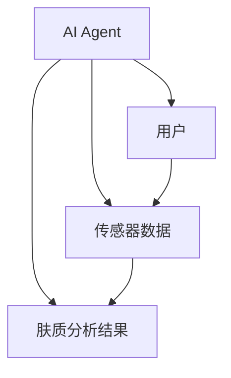
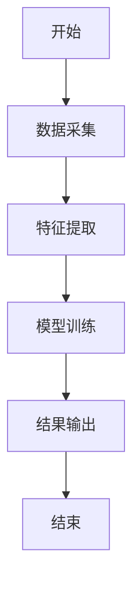
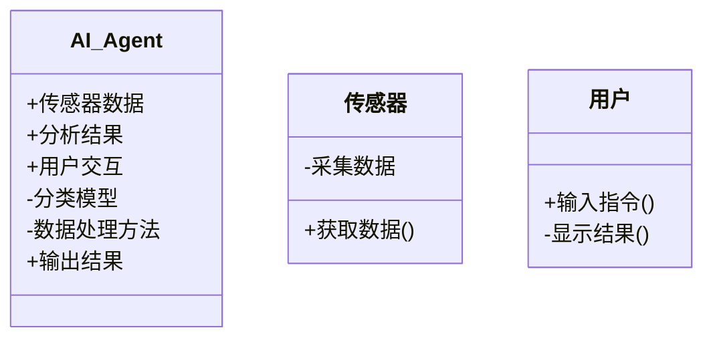
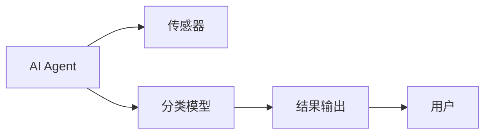
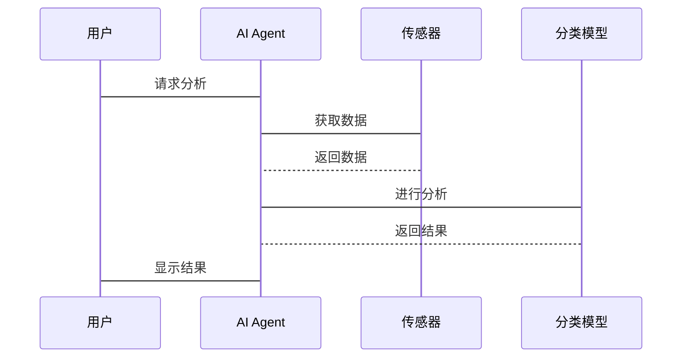

                 


好的，我明白您的需求。以下是根据您的描述设计的完整目录大纲：

---

# AI Agent在智能浴室镜中的肤质分析

> **关键词**：AI Agent, 智能浴室镜, 肤质分析, 算法原理, 系统架构, 项目实战

> **摘要**：  
> 本文探讨AI Agent在智能浴室镜中的应用，重点分析肤质分析的核心算法、系统架构设计及实际项目实现。通过背景介绍、算法原理、系统架构、项目实战和最佳实践，深入剖析AI Agent在智能浴室镜中的功能与价值。

---

# 第1章: 背景介绍

## 1.1 问题背景
### 1.1.1 肤质分析的重要性  
皮肤健康是个人健康的重要指标，通过AI技术实现精准的肤质分析，能够帮助用户更好地了解和管理皮肤状况。

### 1.1.2 智能浴室镜的发展现状  
传统浴室镜的功能单一，而智能浴室镜通过集成传感器和AI技术，能够提供更智能的用户体验。

### 1.1.3 AI Agent在肤质分析中的作用  
AI Agent能够实时采集和分析用户皮肤数据，提供个性化的护肤建议，提升用户体验。

## 1.2 问题描述
### 1.2.1 肤质分析的常见问题  
如何准确采集皮肤数据？如何快速分析并给出建议？

### 1.2.2 智能浴室镜的局限性  
传感器精度不足，算法复杂度高，用户体验不佳。

### 1.2.3 AI Agent如何解决这些问题  
通过优化算法和传感器集成，AI Agent能够实现高精度的肤质分析。

## 1.3 问题解决
### 1.3.1 AI Agent的核心功能  
数据采集、特征提取、模型训练、结果输出。

### 1.3.2 肤质分析的实现流程  
数据采集 → 特征提取 → 模型分析 → 结果输出。

### 1.3.3 智能浴室镜的用户体验优化  
实时反馈、个性化建议、便捷操作。

## 1.4 边界与外延
### 1.4.1 肤质分析的边界条件  
数据采集范围、分析精度、用户隐私保护。

### 1.4.2 智能浴室镜的功能范围  
数据采集、分析、反馈、交互。

### 1.4.3 AI Agent的适用场景与限制  
适用于家庭和个人用户，受限于传感器精度和数据隐私问题。

## 1.5 概念结构与核心要素
### 1.5.1 肤质分析的系统架构  
传感器、AI算法、用户界面。

### 1.5.2 AI Agent的功能模块  
数据采集模块、分析模块、反馈模块。

### 1.5.3 智能浴室镜的硬件与软件组成  
硬件：传感器、显示屏、摄像头；软件：AI算法、用户界面。

## 1.6 本章小结  
本章介绍了AI Agent在智能浴室镜中的应用背景、问题和解决方案，为后续章节奠定了基础。

---

# 第2章: AI Agent的核心概念与原理

## 2.1 核心概念原理
### 2.1.1 AI Agent的基本定义  
AI Agent是一种能够感知环境并采取行动以实现目标的智能实体。

### 2.1.2 肤质分析的算法原理  
基于深度学习的特征提取和分类算法。

### 2.1.3 智能浴室镜的交互机制  
传感器数据采集、AI分析、用户反馈的闭环系统。

## 2.2 核心概念属性对比
### 表2-1: AI Agent与传统软件的对比  
| 特性 | AI Agent | 传统软件 |  
|------|----------|----------|  
| 智能性 | 高 | 低 |  
| 自适应性 | 强 | 弱 |  
| 学习能力 | 有 | 无 |

## 2.3 ER实体关系图  


## 2.4 本章小结  
本章详细介绍了AI Agent的核心概念和原理，为后续章节的算法和系统设计提供了理论基础。

---

# 第3章: 算法原理讲解

## 3.1 算法流程


## 3.2 特征提取
### 3.2.1 数据预处理  
去噪、标准化、归一化。

### 3.2.2 使用CNN进行特征提取  
代码示例：
```python
import torch
import torch.nn as nn
import torch.optim as optim

class SkinFeatureExtractor(nn.Module):
    def __init__(self):
        super(SkinFeatureExtractor, self).__init__()
        self.conv1 = nn.Conv2d(3, 64, kernel_size=3, padding=1)
        self.relu = nn.ReLU()
        self.pool = nn.MaxPool2d(2, 2)

    def forward(self, x):
        x = self.conv1(x)
        x = self.relu(x)
        x = self.pool(x)
        return x
```

## 3.3 分类算法
### 3.3.1 使用随机森林进行分类  
代码示例：
```python
from sklearn.ensemble import RandomForestClassifier
import numpy as np

# 假设X_train和y_train是训练数据
model = RandomForestClassifier(n_estimators=100)
model.fit(X_train, y_train)
```

### 3.3.2 分类模型的数学公式  
随机森林的投票机制：
$$ \text{预测结果} = \arg\max_{i} \sum_{j} I(y_j = i) $$

## 3.4 算法优化
### 3.4.1 参数调优  
调整学习率、批量大小等超参数。

### 3.4.2 模型评估  
准确率、召回率、F1分数。

## 3.5 本章小结  
本章详细讲解了AI Agent在肤质分析中的算法原理，包括特征提取和分类算法的设计与实现。

---

# 第4章: 系统分析与架构设计方案

## 4.1 问题场景介绍
### 4.1.1 系统需求  
实时分析、高精度、用户友好。

## 4.2 项目介绍
### 4.2.1 项目目标  
开发一个基于AI Agent的智能浴室镜，实现肤质分析功能。

## 4.3 系统功能设计
### 4.3.1 领域模型类图  


## 4.4 系统架构设计


## 4.5 系统接口设计
### 4.5.1 接口定义  
传感器接口、用户交互接口。

## 4.6 系统交互序列图


## 4.7 本章小结  
本章通过系统分析和架构设计，详细描述了AI Agent在智能浴室镜中的实现方案。

---

# 第5章: 项目实战

## 5.1 环境安装
### 5.1.1 安装Python  
Python 3.8+

### 5.1.2 安装依赖  
PyTorch、OpenCV、scikit-learn。

## 5.2 核心代码实现
### 5.2.1 数据采集代码  
```python
import cv2

def capture_skin_image():
    cap = cv2.VideoCapture(0)
    ret, frame = cap.read()
    cap.release()
    return frame
```

### 5.2.2 分析代码  
```python
def analyze_skin(image):
    # 预处理
    gray = cv2.cvtColor(image, cv2.COLOR_BGR2GRAY)
    # 特征提取
    features = extract_features(gray)
    # 分类
    result = model.predict(features)
    return result
```

## 5.3 案例分析
### 5.3.1 数据集介绍  
训练数据集和测试数据集。

### 5.3.2 案例分析过程  
数据采集、分析、结果输出。

## 5.4 项目总结  
项目实现的成果、遇到的问题及解决方案。

## 5.5 本章小结  
本章通过实际项目，详细展示了AI Agent在智能浴室镜中的实现过程。

---

# 第6章: 最佳实践与小结

## 6.1 最佳实践
### 6.1.1 数据质量的重要性  
高精度数据是模型准确性的关键。

### 6.1.2 模型优化技巧  
调整超参数、使用数据增强。

## 6.2 小结
### 6.2.1 全文总结  
AI Agent在智能浴室镜中的应用前景广阔，能够显著提升用户体验。

### 6.2.2 展望未来  
未来发展方向、技术趋势。

---

# 附录

## 附录A: 参考文献  
[1] 《深度学习实战》  
[2] 《Python机器学习》  

## 附录B: 工具推荐  
- OpenCV  
- PyTorch  
- scikit-learn

---

希望这个目录大纲能满足您的需求！如果需要进一步调整或补充，请随时告诉我。

