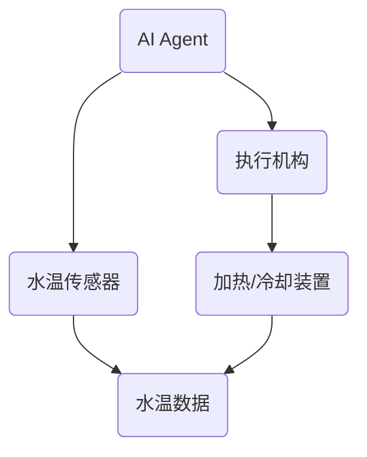
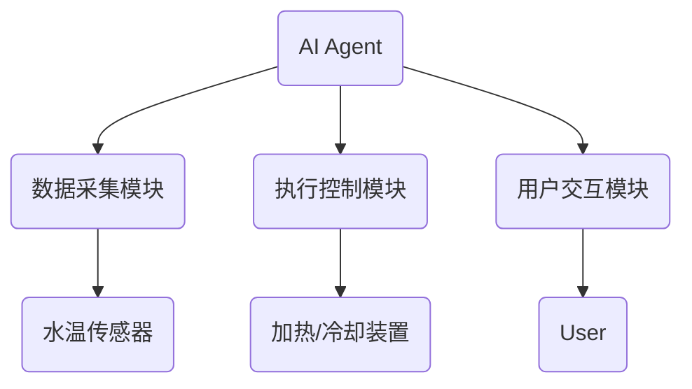
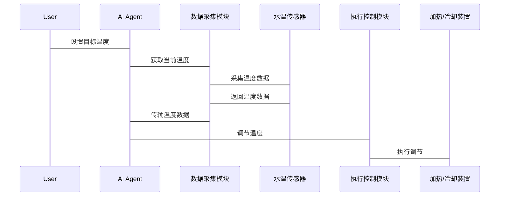

                 


# 目录大纲：《AI Agent在智能浴缸中的水温调节》

---

## 第1章：背景介绍

### 1.1 问题背景
- 1.1.1 浴缸水温调节的现状与痛点
- 1.1.2 智能家居的发展趋势
- 1.1.3 AI Agent在智能家居中的应用潜力

### 1.2 问题描述
- 1.2.1 水温调节的核心问题
- 1.2.2 用户需求与体验优化
- 1.2.3 智能浴缸的功能与目标

### 1.3 问题解决思路
- 1.3.1 AI Agent的引入与作用
- 1.3.2 数据采集与处理方案
- 1.3.3 自动调节算法的设计

### 1.4 边界与外延
- 1.4.1 系统的边界条件
- 1.4.2 功能的外延与扩展
- 1.4.3 系统与环境的交互边界

### 1.5 概念结构与核心要素
- 1.5.1 核心概念的组成
- 1.5.2 系统模块的划分
- 1.5.3 核心要素的关联与作用

---

## 第2章：AI Agent与智能浴缸的核心原理

### 2.1 AI Agent的基本原理
- 2.1.1 AI Agent的定义与特点
- 2.1.2 AI Agent的核心算法
- 2.1.3 AI Agent的感知与决策机制

### 2.2 智能浴缸的系统构成
- 2.2.1 水温传感器的作用
- 2.2.2 加热与冷却装置的原理
- 2.2.3 用户交互界面的设计

### 2.3 核心概念对比分析
- 2.3.1 AI Agent与传统控制系统的对比
- 2.3.2 智能浴缸与普通浴缸的功能对比
- 2.3.3 数据采集与处理的效率对比

### 2.4 实体关系架构图


---

## 第3章：AI Agent的算法原理

### 3.1 算法核心流程
- 3.1.1 感知阶段
- 3.1.2 决策阶段
- 3.1.3 执行阶段

### 3.2 算法实现细节
- 3.2.1 数据采集与预处理
- 3.2.2 温度预测模型
- 3.2.3 自适应调节算法

### 3.3 数学模型与公式
- 3.3.1 温度调节的数学模型
$$ T(t) = a \cdot T_{target} + b \cdot T_{current} $$

- 3.3.2 PID控制算法
$$ PID = K_p \cdot e + K_i \cdot \int e \, dt + K_d \cdot \frac{de}{dt} $$

---

## 第4章：系统分析与架构设计

### 4.1 系统架构概述
- 4.1.1 问题场景介绍
- 4.1.2 项目介绍
- 4.1.3 系统功能设计

### 4.2 系统架构图


### 4.3 系统接口设计
- 4.3.1 数据接口
- 4.3.2 控制接口
- 4.3.3 用户界面

### 4.4 系统交互流程图


---

## 第5章：项目实战

### 5.1 环境安装
- 5.1.1 Python安装与配置
- 5.1.2 传感器驱动安装
- 5.1.3 开发工具配置

### 5.2 核心代码实现
- 5.2.1 数据采集模块
```python
import time

class WaterTemperatureSensor:
    def __init__(self):
        self.temperature = 0.0

    def read_temperature(self):
        # 模拟传感器数据
        self.temperature = self.temperature + 0.1 * (1 if self.temperature < 37 else -1)
        return self.temperature
```

- 5.2.2 AI Agent实现
```python
class AIAssistant:
    def __init__(self, target_temp):
        self.target_temp = target_temp
        self.sensor = WaterTemperatureSensor()
        self.current_temp = self.sensor.read_temperature()

    def adjust_temperature(self):
        if self.current_temp < self.target_temp:
            # 加热
            pass
        elif self.current_temp > self.target_temp:
            # 冷却
            pass
```

### 5.3 代码解读与分析
- 5.3.1 代码结构分析
- 5.3.2 核心算法实现
- 5.3.3 代码优化建议

### 5.4 实际案例分析
- 5.4.1 案例背景
- 5.4.2 数据分析
- 5.4.3 调节过程展示

### 5.5 项目小结
- 5.5.1 成果总结
- 5.5.2 经验分享
- 5.5.3 改进建议

---

## 第6章：总结与展望

### 6.1 最佳实践
- 6.1.1 传感器校准建议
- 6.1.2 网络稳定性优化
- 6.1.3 用户交互优化

### 6.2 总结
- 6.2.1 核心成果回顾
- 6.2.2 系统优势总结
- 6.2.3 项目意义

### 6.3 未来展望
- 6.3.1 多设备联动的可能性
- 6.3.2 用户行为分析的优化
- 6.3.3 更智能化的调节算法

---

## 第7章：注意事项与拓展阅读

### 7.1 注意事项
- 7.1.1 系统安全注意事项
- 7.1.2 数据隐私保护
- 7.1.3 系统维护建议

### 7.2 拓展阅读
- 7.2.1 更多AI Agent应用场景
- 7.2.2 智能家居领域的最新技术
- 7.2.3 相关技术论文与书籍推荐

---

## 附录

### 附录A：常用术语解释
- AI Agent
- PID控制
- 智能家居

### 附录B：代码示例汇总
- 水温传感器代码
- AI Agent代码
- 用户交互界面代码

### 附录C：参考文献
- 相关技术文档
- 学术论文推荐
- 网站链接

