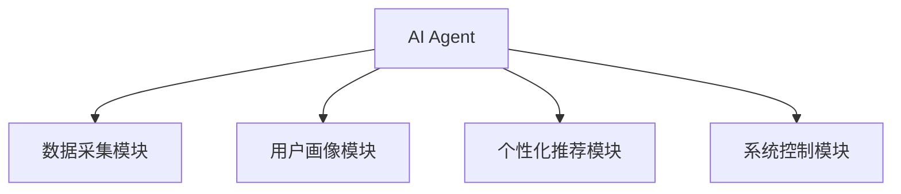
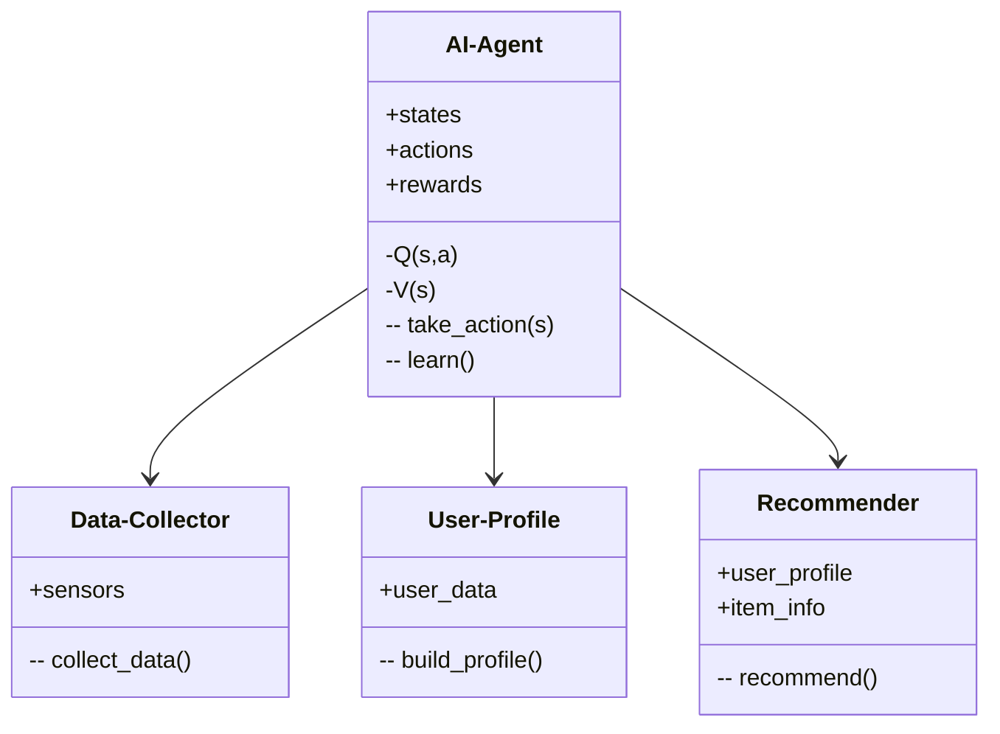
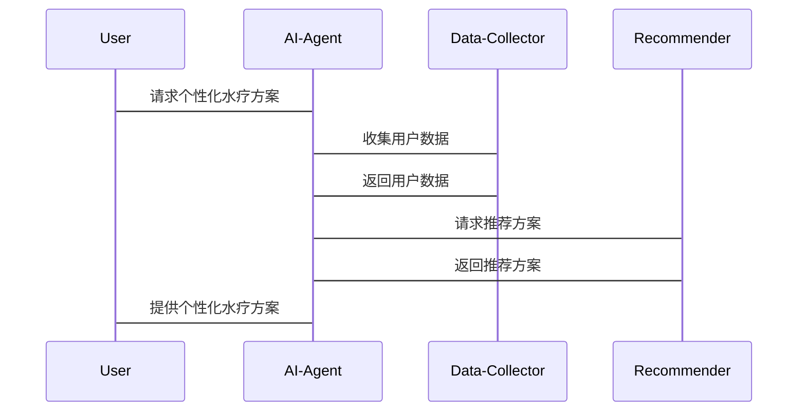

                 


# AI Agent在智能浴缸中的水疗养生定制系统

## 关键词：AI Agent, 智能浴缸, 水疗养生, 定制系统, 个性化服务

## 摘要：本文探讨AI Agent在智能浴缸中的应用，通过分析水疗养生的需求，设计一个定制化系统，利用AI技术实现个性化服务，提升用户体验。

---

# 第一部分：背景介绍与问题背景

## 第1章：背景介绍与问题背景

### 1.1 智能浴缸与水疗养生的背景

#### 1.1.1 智能浴缸的发展历程
智能浴缸从最初的机械控制到现在的AI驱动，经历了技术的飞跃。早期的浴缸只能调节温度和水流，如今则可以实现个性化水疗方案。

#### 1.1.2 水疗养生的健康需求
随着人们对健康的重视，水疗成为一种受欢迎的养生方式。不同用户有不同的健康需求，如缓解肌肉疼痛、改善血液循环等。

#### 1.1.3 AI技术在智能设备中的应用趋势
AI技术广泛应用于智能家居、医疗设备等领域。智能浴缸通过AI技术实现个性化服务，提升了用户体验。

### 1.2 问题背景与需求分析

#### 1.2.1 当前水疗养生系统的痛点
传统浴缸无法根据用户需求调整水疗方案，用户体验单一，缺乏个性化。

#### 1.2.2 用户需求的多样化与个性化
用户希望浴缸能根据他们的健康状况、时间安排等因素，提供个性化的水疗方案。

#### 1.2.3 AI Agent在智能浴缸中的应用价值
AI Agent可以实时分析用户数据，提供个性化建议，提升水疗效果。

### 1.3 问题解决与系统边界

#### 1.3.1 AI Agent如何解决水疗养生问题
AI Agent通过学习用户习惯，优化水疗方案，提升用户体验。

#### 1.3.2 系统的边界与功能范围
系统仅限于水疗养生，不涉及浴缸的其他功能，如清洁和维护。

#### 1.3.3 核心问题与解决方案的对比分析
传统浴缸缺乏个性化，AI驱动的浴缸可以根据用户需求调整水疗方案。

## 1.4 本章小结
本章介绍了智能浴缸的发展背景，分析了水疗养生的健康需求，并探讨了AI技术的应用趋势。最后，讨论了AI Agent在智能浴缸中的应用价值。

---

# 第二部分：AI Agent与水疗养生系统的核心概念

## 第2章：核心概念与原理

### 2.1 AI Agent的基本原理

#### 2.1.1 AI Agent的定义与分类
AI Agent是一种智能体，能够感知环境并采取行动以实现目标。分为简单反射型、基于模型推理型和目标驱动型。

#### 2.1.2 AI Agent的核心功能与属性
AI Agent具有感知、决策、执行和自适应功能，能够实时响应用户需求。

#### 2.1.3 AI Agent与传统自动化系统的区别
AI Agent能够学习和适应，而传统系统只是固定的自动化流程。

### 2.2 水疗养生系统的核心要素

#### 2.2.1 水疗养生的科学原理
水温、水流速度、压力等物理因素对身体有不同影响，AI Agent可以根据这些因素调整水疗方案。

#### 2.2.2 系统的硬件与软件组成
硬件包括温度传感器、水流控制器，软件包括数据采集模块、AI算法模块和用户界面模块。

#### 2.2.3 用户数据与个性化需求
系统收集用户的健康数据，如血压、心率，以制定个性化的水疗方案。

### 2.3 AI Agent与水疗养生系统的关联

#### 2.3.1 AI Agent在水疗养生中的角色
AI Agent负责数据分析、个性化推荐和系统控制。

#### 2.3.2 系统的核心概念结构
系统包括AI Agent、水疗设备和用户接口三个主要部分。

#### 2.3.3 核心要素的对比分析
AI Agent通过数据驱动优化水疗方案，传统系统则无法做到这一点。

## 2.4 本章小结
本章详细讲解了AI Agent的基本原理，分析了水疗养生系统的核心要素，并探讨了AI Agent在其中的作用。

---

# 第三部分：AI Agent的算法原理与数学模型

## 第3章：AI Agent的算法原理

### 3.1 基于强化学习的AI Agent

#### 3.1.1 强化学习的基本原理
强化学习通过试错机制，AI Agent通过与环境互动，学习最优策略。

#### 3.1.2 AI Agent的决策过程
AI Agent根据当前状态，选择最优动作，获得奖励或惩罚。

#### 3.1.3 奖励机制的设计与实现
奖励机制设计直接影响AI Agent的学习效果，奖励函数定义为：

$$ R(s, a) = \begin{cases} 
1 & \text{if } a \text{是最佳动作} \\
0 & \text{否则}
\end{cases} $$

### 3.2 水疗养生系统的算法实现

#### 3.2.1 用户行为分析算法
基于历史数据，分析用户的使用习惯和偏好。

#### 3.2.2 个性化推荐算法
利用协同过滤和基于内容的推荐算法，为用户提供个性化的水疗方案。

#### 3.2.3 系统优化算法
通过遗传算法优化水疗方案的参数，如温度、水流速度等。

### 3.3 算法的数学模型与公式

#### 3.3.1 强化学习的数学模型
状态价值函数：

$$ V(s) = \max_a Q(s,a) $$

#### 3.3.2 用户画像的构建模型
用户画像的构建模型：

$$ U = \sum_{i=1}^{n} w_i x_i $$

其中，$w_i$是权重，$x_i$是特征向量。

#### 3.3.3 个性化推荐的计算公式
个性化推荐的计算公式：

$$ R(u,i) = \alpha \cdot U(u) + \beta \cdot I(i) $$

其中，$\alpha$和$\beta$是调节参数，$U(u)$是用户画像，$I(i)$是物品特征。

### 3.4 算法实现的代码示例

#### 3.4.1 强化学习的Python代码
```python
class AI-Agent:
    def __init__(self):
        self.states = []
        self.actions = []
        self.rewards = []
    
    def take_action(self, state):
        # 根据当前状态选择动作
        pass
    
    def learn(self):
        # 强化学习算法
        pass
```

---

# 第四部分：系统架构设计

## 第4章：系统架构设计

### 4.1 系统功能设计

#### 4.1.1 数据采集模块
采集用户的健康数据和环境数据，如心率、血压、水温等。

#### 4.1.2 用户画像模块
根据用户数据构建用户画像，分析用户的健康状况和偏好。

#### 4.1.3 个性化推荐模块
基于用户画像，推荐个性化的水疗方案。

#### 4.1.4 系统控制模块
根据推荐方案，控制浴缸的水温、水流速度等参数。

### 4.2 系统架构设计

#### 4.2.1 系统架构图
使用Mermaid绘制系统架构图：



#### 4.2.2 类图
使用Mermaid绘制类图：



### 4.3 系统接口设计

#### 4.3.1 传感器接口
传感器接口用于采集水温和水流速度等数据。

#### 4.3.2 用户输入接口
用户可以通过触摸屏输入健康状况和偏好。

#### 4.3.3 系统控制接口
系统控制接口用于调整浴缸的水温和水流速度。

### 4.4 系统交互流程

#### 4.4.1 交互流程图
使用Mermaid绘制交互流程图：



## 4.5 本章小结
本章详细设计了系统的架构，包括功能模块、类图和交互流程图，展示了AI Agent在系统中的核心作用。

---

# 第五部分：项目实战

## 第5章：项目实战

### 5.1 环境安装与配置

#### 5.1.1 安装Python环境
安装Python 3.8以上版本，并安装所需的库，如TensorFlow、Keras等。

#### 5.1.2 安装AI框架
安装强化学习框架，如OpenAI Gym。

### 5.2 系统核心实现

#### 5.2.1 数据采集模块实现
编写代码采集用户的健康数据，如心率和血压。

#### 5.2.2 AI Agent实现
实现AI Agent的强化学习算法，如Q-learning。

#### 5.2.3 系统控制模块实现
根据推荐方案，调整浴缸的参数。

### 5.3 代码实现与解读

#### 5.3.1 强化学习代码示例
```python
import numpy as np

class QLearningAgent:
    def __init__(self, state_space_size, action_space_size):
        self.q_table = np.zeros((state_space_size, action_space_size))
        self.learning_rate = 0.1
        self.discount_factor = 0.9

    def take_action(self, state):
        return np.argmax(self.q_table[state, :])

    def learn(self, state, action, reward, next_state):
        self.q_table[state, action] = self.q_table[state, action] + self.learning_rate * (reward + self.discount_factor * np.max(self.q_table[next_state, :]) - self.q_table[state, action])
```

#### 5.3.2 用户画像构建
```python
def build_user_profile(data):
    profile = {}
    for key in data:
        profile[key] = data[key]
    return profile
```

### 5.4 实际案例分析与解读
通过实际案例分析，展示AI Agent如何优化水疗方案，提升用户体验。

### 5.5 本章小结
本章通过实际项目实战，展示了如何安装环境，实现系统核心功能，并进行代码解读和案例分析。

---

# 第六部分：总结与展望

## 第6章：总结与展望

### 6.1 总结
本文详细探讨了AI Agent在智能浴缸中的应用，设计了一个定制化的水疗养生系统，利用AI技术实现个性化服务。

### 6.2 未来展望
未来，随着AI技术的发展，智能浴缸将更加智能化，提供更个性化的服务，如健康监测和疾病预防。

### 6.3 最佳实践 tips
在实际应用中，建议定期更新用户数据，保持系统的准确性。同时，注意数据隐私保护，确保用户信息安全。

### 6.4 小结
本文通过系统设计和项目实战，展示了AI技术在智能浴缸中的巨大潜力，为未来的健康发展提供了方向。

---

# 结语
通过本文的详细讲解，读者可以深入了解AI Agent在智能浴缸中的应用，掌握系统设计和实现的方法。希望本文能为相关领域的研究和实践提供有价值的参考。

