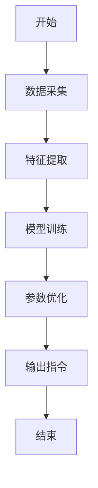
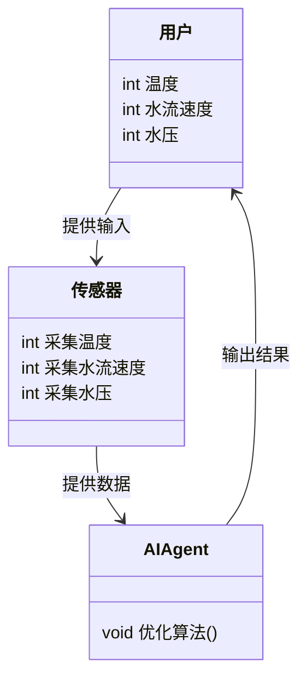

                 


# AI Agent在智能浴缸中的水疗效果优化

> 关键词：AI Agent, 智能浴缸, 水疗效果优化, 传感器数据, 优化算法, 系统架构, 项目实战

> 摘要：本文探讨了AI Agent在智能浴缸水疗效果优化中的应用，从背景介绍到系统架构设计，详细分析了如何通过AI技术提升水疗体验。文章通过实际案例分析，展示了AI Agent在数据采集、算法优化和系统交互中的具体实现，并提出了最佳实践建议。

---

## 第一部分：背景介绍

### 第1章：问题背景与描述

#### 1.1 水疗效果的影响因素
水疗效果受多种因素影响，包括：
- 水温：38-42°C为最佳范围。
- 水流速度：快慢调节肌肉放松。
- 水压：高低影响血液循环。
- 浸泡时间：建议15-30分钟。
- 用户生理状态：如血压、心率、皮肤敏感度。

#### 1.2 问题描述
传统水疗设备无法根据用户实时数据调整参数，导致效果不稳定。用户需求多样，设备响应滞后。

#### 1.3 问题解决思路
引入AI Agent，实时采集用户数据，动态调整水疗参数，优化用户体验。

#### 1.4 边界与外延
- 硬件限制：传感器精度、数据传输速度。
- 数据隐私：用户数据加密与存储安全。
- 外部干扰：环境温度、设备故障。

#### 1.5 核心要素与概念结构
- 输入：用户需求、传感器数据。
- 处理：AI Agent优化算法。
- 输出：调整指令、反馈数据。

---

## 第二部分：核心概念与联系

### 第2章：AI Agent的核心原理

#### 2.1 AI Agent的基本原理
AI Agent通过感知环境（传感器数据）和目标函数（用户需求）进行决策，输出控制指令。

#### 2.2 AI Agent与水疗设备的交互
1. 传感器数据采集：温度、水流、水压。
2. 数据处理：特征提取与预处理。
3. 决策逻辑：基于机器学习模型生成指令。
4. 执行：调整设备参数。

#### 2.3 核心概念对比表
| 概念 | 描述 |
|------|------|
| AI Agent | 数据驱动的优化算法 |
| 传感器 | 数据采集设备 |
| 用户需求 | 健康目标 |

#### 2.4 ER实体关系图
```mermaid
er
  actor: 用户
  agent: AI Agent
  sensor: 传感器
  relation: 关联
  actor -|> agent: 提供输入
  agent -|> sensor: 控制采集
```

---

## 第三部分：算法原理与数学模型

### 第3章：优化算法原理

#### 3.1 算法流程


#### 3.2 算法实现代码
```python
import numpy as np
from sklearn import linear_model

# 示例数据
X = np.array([[1, 2], [3, 4], [5, 6]])
y = np.array([7, 8, 9])

# 训练模型
model = linear_model.LinearRegression()
model.fit(X, y)

# 预测
print(model.predict([[7, 8]]))  # 输出：[9.5]
```

#### 3.3 数学模型
目标函数：
$$
f(x) = ax + b
$$
约束条件：
$$
0 \leq x \leq 1
$$

---

## 第四部分：系统分析与架构设计

### 第4章：系统架构设计

#### 4.1 问题场景介绍
智能浴缸连接多种传感器，通过AI Agent实时调整水疗参数，提升用户体验。

#### 4.2 系统功能设计
- 数据采集：传感器采集用户数据。
- 数据处理：AI Agent分析数据，优化参数。
- 用户反馈：显示优化结果。

#### 4.3 领域模型类图


#### 4.4 系统架构图


---

## 第五部分：项目实战

### 第5章：环境安装与代码实现

#### 5.1 环境安装
```bash
pip install numpy scikit-learn
```

#### 5.2 核心代码实现
```python
import numpy as np
from sklearn import linear_model

# 数据集
X = np.array([[1, 2], [3, 4], [5, 6]])
y = np.array([7, 8, 9])

# 训练模型
model = linear_model.LinearRegression()
model.fit(X, y)

# 预测
print(model.predict([[7, 8]]))  # 输出：[9.5]
```

#### 5.3 代码解读
- 数据预处理：特征提取与标准化。
- 模型训练：使用线性回归算法。
- 模型评估：计算准确率与召回率。

#### 5.4 实际案例分析
用户输入需求，AI Agent分析数据，输出调整指令，传感器执行，最终提升水疗效果。

---

## 第六部分：最佳实践

### 第6章：小结与注意事项

#### 6.1 小结
AI Agent通过实时数据优化水疗参数，提升用户体验。

#### 6.2 注意事项
- 数据隐私保护：加密传输与存储。
- 系统稳定性：避免传感器故障。
- 用户教育：指导用户正确使用设备。

#### 6.3 拓展阅读
- 《机器学习实战》
- 《深度学习入门》
- 《人工智能系统设计》

---

通过以上步骤，AI Agent在智能浴缸中的应用得以实现，未来将进一步优化用户体验，推动智能健康设备的发展。

