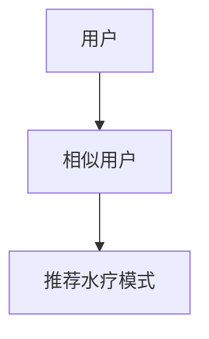
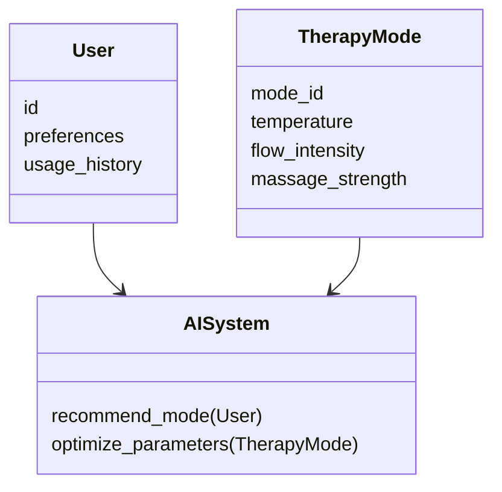
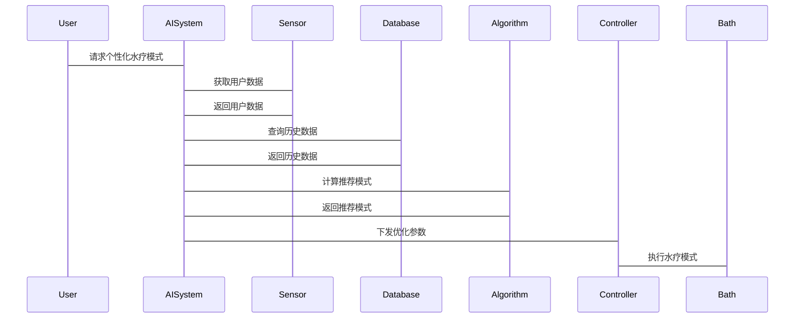

                 


# AI Agent在智能浴缸中的水疗模式个性化

> 关键词：AI Agent, 智能浴缸, 个性化水疗, 推荐算法, 系统架构, 项目实战

> 摘要：本文详细探讨了AI Agent在智能浴缸中的水疗模式个性化应用，从背景分析、算法原理到系统设计和项目实现，全面解析了如何利用AI技术提升水疗体验的个性化和智能化水平。

---

# 第1章: 背景介绍

## 1.1 问题背景
### 1.1.1 智能浴缸的发展现状
智能浴缸作为一种智能家居设备，近年来随着物联网和AI技术的发展逐渐普及。传统浴缸的功能较为单一，而智能浴缸通过集成传感器、智能控制和AI技术，能够提供更加智能化和个性化的用户体验。

### 1.1.2 个性化水疗模式的需求
现代用户对健康和舒适体验的需求日益增加，不同用户对水温、水流强度、按摩力度等水疗参数的需求存在显著差异。个性化水疗模式能够满足用户的差异化需求，提升用户体验。

### 1.1.3 AI Agent在智能设备中的应用前景
AI Agent（智能代理）是一种能够感知环境、执行任务并优化决策的智能系统。在智能设备中，AI Agent能够通过学习用户行为和环境数据，提供更加智能化的服务。AI Agent在智能浴缸中的应用前景广阔，能够显著提升水疗体验的个性化和智能化水平。

## 1.2 问题描述
### 1.2.1 水疗模式个性化的核心问题
个性化水疗模式的核心问题在于如何根据用户的生理特征、健康状况和使用习惯，动态调整水温、水流强度、按摩力度等参数，以提供最佳的水疗体验。

### 1.2.2 AI Agent在水疗模式中的作用
AI Agent通过收集用户的生理数据、行为数据和环境数据，利用机器学习算法，分析用户的偏好和需求，动态调整水疗模式，以实现个性化体验。

### 1.2.3 用户需求与技术实现的结合
用户需求包括个性化体验、便捷性、安全性和舒适性。技术实现则需要结合传感器、AI算法和智能控制系统，实现精准的个性化水疗模式。

## 1.3 问题解决
### 1.3.1 AI Agent如何实现个性化水疗
AI Agent通过收集用户数据、分析用户需求、优化水疗参数，实现个性化水疗模式的动态调整。

### 1.3.2 技术实现的路径与方法
技术实现路径包括数据采集、数据分析、算法优化和系统集成。通过传感器采集用户数据，利用机器学习算法分析数据，优化水疗参数，并通过智能控制系统实现个性化水疗模式。

### 1.3.3 边界与外延
个性化水疗模式的边界在于用户隐私保护、系统安全性和数据准确性。外延则包括与其他智能家居设备的联动和多场景应用。

## 1.4 概念结构与核心要素
### 1.4.1 核心概念组成
个性化水疗模式的核心概念包括用户数据采集、AI Agent算法、水疗参数优化和智能控制系统。

### 1.4.2 概念之间的关系
用户数据采集与AI Agent算法密切相关，AI Agent算法通过分析用户数据，优化水疗参数。水疗参数优化与智能控制系统相互作用，实现个性化水疗模式的动态调整。

### 1.4.3 系统架构的初步设想
系统架构初步设想包括用户数据采集模块、AI Agent算法模块、水疗参数优化模块和智能控制系统模块。各模块之间通过数据接口进行交互，协同工作以实现个性化水疗模式。

---

# 第2章: 核心概念与联系

## 2.1 AI Agent的原理
### 2.1.1 AI Agent的基本概念
AI Agent是一种能够感知环境、执行任务并优化决策的智能系统。在智能浴缸中，AI Agent通过传感器采集用户数据，利用机器学习算法分析数据，优化水疗参数，提供个性化水疗体验。

### 2.1.2 AI Agent的核心算法
AI Agent的核心算法包括监督学习、无监督学习和强化学习。在个性化水疗模式中，通常采用监督学习算法，通过用户数据训练模型，实现个性化推荐。

### 2.1.3 AI Agent与个性化水疗模式的关系
AI Agent通过分析用户数据，优化水疗参数，实现个性化水疗模式的动态调整。个性化水疗模式为AI Agent提供反馈，优化其算法和决策能力。

## 2.2 个性化水疗模式的属性特征对比
### 2.2.1 不同水疗模式的特征分析
不同水疗模式的特征包括水温、水流强度、按摩力度、时间长度等。通过分析这些特征，可以制定个性化的水疗方案。

### 2.2.2 用户需求与水疗模式的匹配
通过分析用户的需求和偏好，匹配最合适的水疗模式。例如，用户可能偏好高温水流强的水疗模式，而其他人可能偏好低温轻柔的模式。

### 2.2.3 水疗模式的动态调整机制
水疗模式的动态调整机制通过实时监测用户数据和环境数据，不断优化水疗参数，以提供最佳的个性化体验。

## 2.3 ER实体关系图
```mermaid
er
    actor: 用户
    agent: AI Agent
    therapy_mode: 水疗模式
    sensor_data: 传感器数据
    user_profile: 用户档案
    relation: 关联
    actor --> relation --> therapy_mode
    agent --> relation --> therapy_mode
    sensor_data --> relation --> therapy_mode
    user_profile --> relation --> therapy_mode
```

---

# 第3章: 算法原理讲解

## 3.1 推荐算法原理
### 3.1.1 协同过滤算法
协同过滤算法是一种基于用户相似性推荐算法。在个性化水疗模式中，可以通过协同过滤算法，找到与用户行为相似的其他用户，推荐适合的水疗模式。

### 3.1.2 基于内容的推荐算法
基于内容的推荐算法通过分析水疗模式的特征，推荐与用户偏好匹配的模式。例如，用户偏好高温水流强的模式，推荐类似的高温水流强的模式。

### 3.1.3 深度学习模型
深度学习模型（如神经网络）可以用于个性化水疗模式的推荐。通过训练用户数据和水疗模式数据，深度学习模型可以预测用户的偏好，推荐适合的水疗模式。

## 3.2 算法流程图


## 3.3 算法实现
### 3.3.1 算法实现代码
```python
# 示例代码：协同过滤算法实现
import numpy as np

def collaborative_filtering(user_data, target_user):
    # 计算用户相似性
    similarities = np.dot(user_data, target_user)
    # 找到最相似的用户
    top_similar_users = np.argsort(similarities)[::-1][:5]
    # 推荐水疗模式
    recommended_modes = []
    for user in top_similar_users:
        recommended_modes.extend(user_data[user])
    return recommended_modes
```

### 3.3.2 算法数学模型
协同过滤算法的数学模型如下：
$$
\text{相似度} = \frac{\sum_{i=1}^{n}(x_i - \bar{x})(y_i - \bar{y})}{\sqrt{\sum_{i=1}^{n}(x_i - \bar{x})^2} \cdot \sqrt{\sum_{i=1}^{n}(y_i - \bar{y})^2}}
$$
其中，$\bar{x}$和$\bar{y}$分别是用户$x$和用户$y$的平均评分。

---

# 第4章: 系统分析与架构设计方案

## 4.1 问题场景介绍
个性化水疗模式需要考虑用户数据采集、算法优化和系统控制等多个方面。

## 4.2 项目介绍
### 4.2.1 项目背景
智能浴缸项目旨在通过AI Agent技术实现个性化水疗模式，提升用户体验。

### 4.2.2 系统功能设计
系统功能包括用户数据采集、水疗模式推荐、水疗参数优化和系统控制。

## 4.3 系统架构设计
### 4.3.1 领域模型


### 4.3.2 系统架构


### 4.3.3 系统接口设计
系统接口包括用户数据接口、AI算法接口和系统控制接口。

### 4.3.4 系统交互流程


---

# 第5章: 项目实战

## 5.1 环境安装
### 5.1.1 硬件环境
智能浴缸、传感器、智能控制系统。

### 5.1.2 软件环境
Python 3.8+, NumPy, Pandas, Scikit-learn。

## 5.2 系统核心实现
### 5.2.1 算法实现
```python
# 示例代码：个性化水疗模式推荐算法
from sklearn.neighbors import NearestNeighbors

def recommend_therapy_mode(user_features, new_user_features):
    model = NearestNeighbors(n_neighbors=5).fit(user_features)
    distances, indices = model.kneighbors([new_user_features])
    recommended_modes = [user_features[i] for i in indices[0]]
    return recommended_modes
```

### 5.2.2 系统实现
```python
# 示例代码：系统控制接口
class BathController:
    def __init__(self, sensor, actuator):
        self.sensor = sensor
        self.actuator = actuator

    def set_therapy_mode(self, mode):
        self.actuator.set_parameters(mode)
        self.sensor.start_monitoring()

    def stop(self):
        self.sensor.stop_monitoring()
        self.actuator.stop()
```

## 5.3 案例分析
### 5.3.1 案例背景
用户A偏好高温水流强的水疗模式，用户B偏好低温水流弱的模式。

### 5.3.2 算法应用
通过协同过滤算法，找到与用户A相似的其他用户，推荐高温水流强的水疗模式。

## 5.4 项目总结
个性化水疗模式的实现需要结合传感器数据、AI算法和智能控制系统，通过不断优化算法和系统设计，提供更加智能化和个性化的用户体验。

---

# 第6章: 案例分析与最佳实践

## 6.1 案例分析
### 6.1.1 系统性能分析
分析系统在不同负载下的表现，优化算法和系统架构。

### 6.1.2 用户体验反馈
收集用户对个性化水疗模式的反馈，不断优化系统。

## 6.2 最佳实践 tips
### 6.2.1 数据采集
确保数据的准确性和完整性，避免噪声干扰。

### 6.2.2 算法优化
选择适合的算法，优化模型参数，提升推荐准确率。

### 6.2.3 系统安全
保护用户隐私，确保系统安全，防止数据泄露。

## 6.3 小结
个性化水疗模式的实现需要结合AI技术、传感器技术和智能控制系统，通过不断优化算法和系统设计，提升用户体验。

---

# 附录: 扩展阅读

## 附录1: 相关技术资料
### 1.1 机器学习在智能家居中的应用
### 1.2 AI Agent在健康监测中的应用

## 附录2: 开源工具与库
### 2.1 Python机器学习库
- Scikit-learn
- TensorFlow
- PyTorch

### 2.2 智能家居开发框架
- Home Assistant
- OpenHAB

---

通过以上目录结构，我们可以逐步深入探讨AI Agent在智能浴缸中的水疗模式个性化实现，从理论到实践，从算法到系统设计，全面解析技术细节和实现方法。

