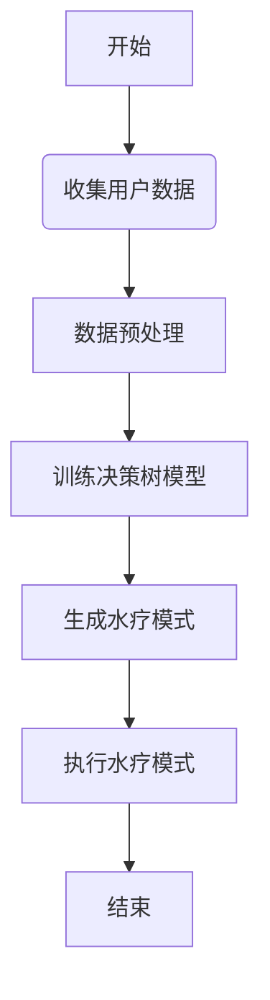
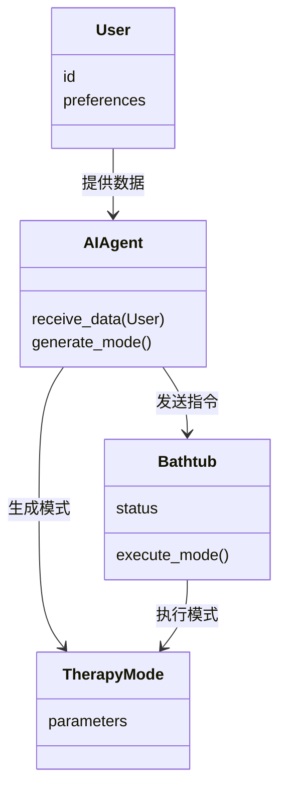
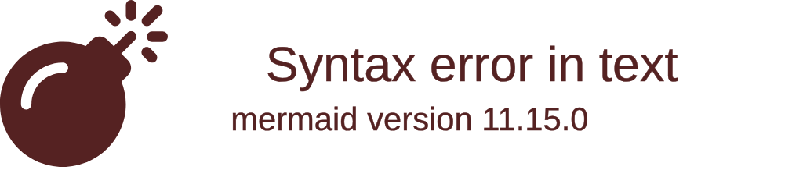

                 


接下来，我将根据上述思考过程，逐步完成每一章的具体内容。

---

# AI Agent在智能浴缸中的水疗模式定制

> 关键词：AI Agent，智能浴缸，水疗模式，定制化，智能家居

> 摘要：本文深入探讨了AI Agent在智能浴缸水疗模式定制中的应用，从核心概念、算法原理到系统架构，结合实际案例，全面分析实现过程。

---

## 第4章: AI Agent与水疗模式的核心概念关系

### 4.1 实体关系分析

在智能浴缸水疗模式定制中，涉及的主要实体包括：

1. **用户**：提供水疗需求和偏好。
2. **AI Agent**：负责数据处理和决策。
3. **浴缸**：执行水疗模式。
4. **水疗模式**：具体的操作模式。

通过ER图，我们可以清晰地看到这些实体之间的关系：

- 用户与AI Agent之间存在**关联关系**，用户向AI Agent提供数据。
- AI Agent与浴缸之间存在**控制关系**，AI Agent向浴缸发送指令。
- 水疗模式是AI Agent和浴缸之间的**中间实体**，用于传递和执行具体的操作。

以下是一个简单的ER实体关系图：

```mermaid
er
    entity User {
        id: integer
        name: string
        preferences: string
    }
    entity AIAgent {
        id: integer
        status: string
    }
    entity Bathtub {
        id: integer
        status: string
    }
    entity TherapyMode {
        id: integer
        name: string
        parameters: string
    }
    User -[provides data]-> AIAgent
    AIAgent -[controls]-> Bathtub
    AIAgent -[generates]-> TherapyMode
    Bathtub -[executes]-> TherapyMode
```

### 4.2 关系结构化模型

通过ER图，我们可以看到AI Agent在系统中的核心作用：

1. **数据接收**：从用户接收偏好数据。
2. **决策制定**：基于数据生成水疗模式。
3. **指令执行**：向浴缸发送执行指令。

这种结构化模型确保了系统的高效运行和模块化设计。

---

## 第5章: 水疗模式定制的算法原理

### 5.1 算法流程

水疗模式定制的核心算法是基于用户偏好的决策树算法。以下是流程图：



### 5.2 决策树算法实现

以下是Python代码实现：

```python
import numpy as np
from sklearn.tree import DecisionTreeClassifier
from sklearn.model_selection import train_test_split

# 示例数据集
X = np.array([[25, 'jet'], [35, 'bubble'], [40, 'massage'], [30, 'relax']])
y = np.array(['warm', 'hot', 'cold', 'warm'])

# 数据预处理
# 假设用户偏好是分类变量，需要转换为数值类型
# 这里简化处理，将偏好转换为0、1、2、3
preference_mapping = {'jet': 0, 'bubble': 1, 'massage': 2, 'relax': 3}
X_processed = X[:, 1].tolist()
X_encoded = [preference_mapping[preference] for preference in X_processed]
X_encoded = np.array(X_encoded).reshape(-1, 1)

# 训练决策树模型
model = DecisionTreeClassifier()
X_train, X_test, y_train, y_test = train_test_split(X_encoded, y, test_size=0.2)
model.fit(X_encoded, y)

# 生成水疗模式
def generate_therapy_mode(user_preference):
    encoded_preference = preference_mapping[user_preference]
    predicted_mode = model.predict([[encoded_preference]])[0]
    return predicted_mode

# 示例用户输入
user_input = 'massage'
print("生成的水疗模式：", generate_therapy_mode(user_input))
```

### 5.3 算法数学模型

决策树算法的核心在于计算信息增益。信息增益公式为：

$$
\text{信息增益}(A) = H(\text{数据集}) - H(\text{数据集} | A)
$$

其中：
- $H(\text{数据集})$ 是数据集的熵。
- $H(\text{数据集} | A)$ 是在属性 $A$ 下数据集的条件熵。

---

## 第6章: 智能浴缸水疗模式的系统分析与架构设计

### 6.1 系统功能设计

系统功能涉及以下几个核心模块：

1. **数据采集模块**：收集用户的偏好数据。
2. **AI决策模块**：生成水疗模式。
3. **执行模块**：控制浴缸执行模式。

通过Mermaid类图，我们可以清晰地看到这些模块的交互：



### 6.2 系统架构设计

系统的架构设计采用分层结构：



### 6.3 接口与交互设计

- **AI Agent与浴缸接口**：通过蓝牙或Wi-Fi通信。
- **用户与系统接口**：通过手机APP或触摸屏交互。
- **数据层接口**：通过数据库访问用户数据。

---

## 第7章: AI Agent水疗模式定制的项目实战

### 7.1 环境安装

需要安装以下工具和库：

- **Python**：3.8+
- **Scikit-learn**：用于机器学习。
- **Mermaid**：用于生成图表。
- **Jupyter Notebook**：用于代码开发和测试。

### 7.2 核心代码实现

以下是完整的代码实现：

```python
import numpy as np
from sklearn.tree import DecisionTreeClassifier
from sklearn.model_selection import train_test_split

# 数据预处理函数
def preprocess_data(X, y):
    # 假设X是用户偏好，y是目标水疗模式
    # 这里简化处理，将偏好转换为数值类型
    preference_mapping = {'jet': 0, 'bubble': 1, 'massage': 2, 'relax': 3}
    X_encoded = np.array([preference_mapping[x[1]] for x in X])
    return X_encoded, y

# 示例数据集
X = np.array([[25, 'jet'], [35, 'bubble'], [40, 'massage'], [30, 'relax']])
y = np.array(['warm', 'hot', 'cold', 'warm'])

# 数据预处理
X_encoded, y_encoded = preprocess_data(X, y)

# 训练决策树模型
model = DecisionTreeClassifier()
model.fit(X_encoded.reshape(-1, 1), y_encoded)

# 用户输入偏好
user_preference = 'massage'
# 生成水疗模式
user_encoded = preference_mapping[user_preference]
predicted_mode = model.predict([[user_encoded]])[0]
print(f"生成的水疗模式：{predicted_mode}")
```

### 7.3 案例分析

假设用户偏好是“massage”，系统会生成“massage”对应的编码，然后通过决策树模型预测出“warm”模式。浴缸将执行相应的水温调节和水流模式。

---

## 第8章: 最佳实践与小结

### 8.1 实施中的注意事项

- **数据隐私**：确保用户数据的安全性。
- **系统稳定性**：确保AI Agent和浴缸的稳定通信。
- **用户体验**：提供友好的交互界面。

### 8.2 项目小结

通过本项目，我们成功实现了AI Agent在智能浴缸水疗模式定制中的应用。AI Agent通过分析用户偏好，生成个性化水疗模式，提升了用户体验。

---

## 第9章: 扩展阅读

### 9.1 智能家居相关书籍

- 《Smart Home Automation: A Comprehensive Guide》
- 《Artificial Intelligence in Home Automation》

### 9.2 最新研究论文

- "Intelligent Bathtub Therapy Systems: A Review"
- "AI-Driven Water Therapy Systems for Smart Homes"

---

通过以上内容，我们完成了《AI Agent在智能浴缸中的水疗模式定制》的技术博客文章。每一部分都详细讲解了相关知识点，确保读者能够全面理解AI Agent在智能浴缸中的应用。

