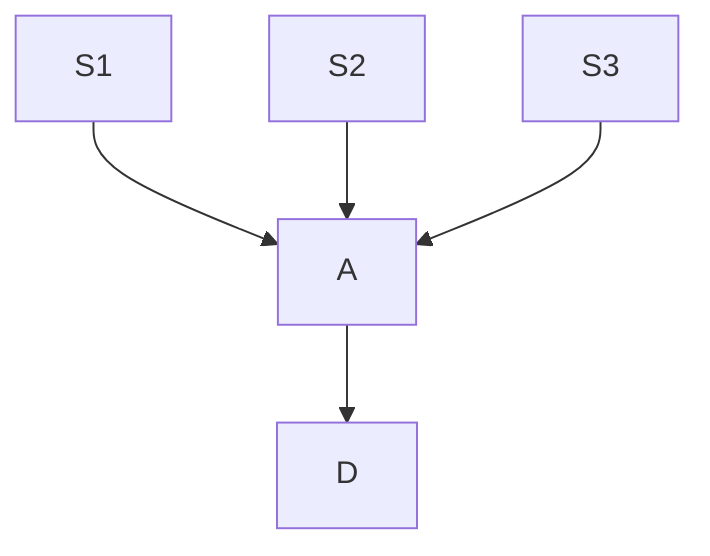
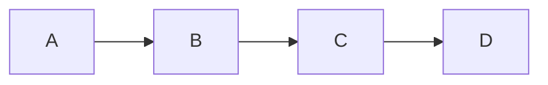
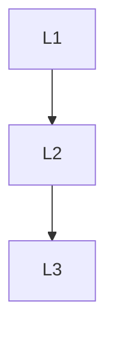
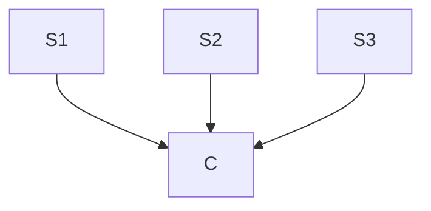

                 


# AI Agent在智能海洋生态监测中的实践

**关键词**: AI Agent, 智能海洋生态监测, 机器学习, 强化学习, 海洋传感器, 数据分析

**摘要**: 本文探讨了AI Agent在智能海洋生态监测中的应用，分析了其核心概念、算法原理、系统架构设计以及项目实战。通过强化学习和机器学习模型，结合海洋传感器网络，展示了AI Agent如何优化海洋生态监测的效率和准确性，为环境保护和资源管理提供科学支持。

---

# 第一部分: AI Agent与智能海洋生态监测概述

## 第1章: AI Agent与智能海洋生态监测的背景介绍

### 1.1 AI Agent的基本概念

#### 1.1.1 什么是AI Agent
AI Agent（人工智能代理）是一种智能体，能够感知环境、自主决策并执行任务。它具备以下核心特征：
- **自主性**: 能够自主决策，无需外部干预。
- **反应性**: 能够实时感知环境变化并做出反应。
- **目标导向性**: 具有明确的目标，能够优化决策以实现目标。
- **学习能力**: 能够通过经验改进性能。

#### 1.1.2 AI Agent的核心特征
- **感知能力**: 通过传感器或其他数据源获取环境信息。
- **推理能力**: 利用逻辑推理或机器学习模型分析数据。
- **决策能力**: 根据分析结果制定最优策略。
- **执行能力**: 执行预设或自动生成的动作。

#### 1.1.3 AI Agent与传统自动化的区别
| 特性 | AI Agent | 传统自动化 |
|------|----------|------------|
| 决策能力 | 自主决策 | 固定规则 |
| 学习能力 | 可学习优化 | 不可学习 |
| 环境适应性 | 能适应变化 | 适应性有限 |

### 1.2 智能海洋生态监测的定义与目标

#### 1.2.1 海洋生态监测的内涵
海洋生态监测是指对海洋环境及其生态系统的状态进行实时或定期观测、评估和分析。主要内容包括：
- **水文参数**: 水温、盐度、溶解氧含量。
- **生物参数**: 浮游生物数量、鱼类分布。
- **环境变化**: 海洋酸化、海底污染。

#### 1.2.2 智能化监测的意义
智能化监测通过引入AI技术，提高监测效率和准确性，降低监测成本，同时能够实时分析数据，快速响应环境变化。

#### 1.2.3 监测的主要目标与指标
- **目标**: 保护海洋生态系统，支持渔业管理，评估气候变化影响。
- **指标**: 水温、溶解氧、浮游生物密度、鱼类数量。

### 1.3 AI Agent在海洋生态监测中的应用价值

#### 1.3.1 提高监测效率
AI Agent能够自主规划监测任务，优化传感器部署，减少重复劳动。

#### 1.3.2 实现数据智能分析
通过机器学习模型，AI Agent能够自动识别异常数据，预测环境变化趋势。

#### 1.3.3 支持决策优化
AI Agent可以根据实时数据优化监测策略，提高监测结果的准确性。

---

## 第2章: AI Agent与海洋生态监测的核心概念

### 2.1 AI Agent的核心原理

#### 2.1.1 感知层: 数据采集与处理
AI Agent通过海洋传感器网络获取数据，例如：
- **水温传感器**: 测量水温。
- **溶解氧传感器**: 测量溶解氧含量。
- **图像传感器**: 拍摄海洋生物照片。

数据采集后，需进行预处理，包括去噪和归一化。

#### 2.1.2 计划层: 任务规划与决策
AI Agent根据当前状态和目标，制定监测任务的最优计划。例如：
- **任务规划**: 决定哪些区域需要优先监测。
- **决策优化**: 根据实时数据调整监测策略。

#### 2.1.3 执行层: 动作控制与反馈
AI Agent根据决策结果，控制传感器或无人船执行监测任务，并实时反馈执行结果。

### 2.2 海洋生态监测系统的构成

#### 2.2.1 数据采集层: 传感器网络
海洋传感器网络由多种传感器组成，负责采集环境数据。传感器网络的架构如下：

其中，S表示传感器，A表示汇聚节点，D表示数据处理节点。

#### 2.2.2 数据处理层: 中间件与平台
数据处理层负责对传感器数据进行存储、分析和可视化。常用工具包括：
- **数据库**: MongoDB、PostgreSQL。
- **数据处理框架**: Apache Spark、Flink。

#### 2.2.3 应用层: 用户界面与决策支持
应用层为用户提供友好的界面，展示监测结果，并提供决策支持。例如：
- **可视化界面**: 地图显示监测数据。
- **决策支持系统**: 根据分析结果提供建议。

### 2.3 AI Agent与海洋生态监测的关联

#### 2.3.1 数据流的闭环
AI Agent通过传感器获取数据，经过分析和决策，再通过执行机构反馈结果，形成闭环。

#### 2.3.2 多 Agent 协作机制
在海洋监测中，多个AI Agent可以协作完成任务。例如：
- **分工合作**: 每个Agent负责不同的监测区域。
- **信息共享**: Agent之间共享数据，提高整体效率。

#### 2.3.3 系统的实时性与可靠性
AI Agent需要具备实时处理数据的能力，并能够在复杂环境中保持稳定运行。

---

## 第3章: AI Agent在海洋生态监测中的算法原理

### 3.1 强化学习算法

#### 3.1.1 Q-Learning算法
Q-Learning是一种经典的强化学习算法，适用于离散动作空间。其核心公式为：
$$ Q(s, a) = Q(s, a) + \alpha (r + \gamma \max Q(s', a') - Q(s, a)) $$
其中，$\alpha$是学习率，$\gamma$是折扣因子。

#### 3.1.2 Deep Q-Network (DQN)算法
DQN将Q-Learning与深度神经网络结合，适用于连续动作空间。其网络结构如下：

其中，A表示输入层，B表示隐藏层，C表示输出层。

### 3.2 机器学习模型

#### 3.2.1 监督学习与无监督学习
- **监督学习**: 根据标记数据训练模型，适用于分类任务。
- **无监督学习**: 无标记数据中发现模式，适用于聚类任务。

#### 3.2.2 深度学习模型: CNN与RNN
- **CNN**: 用于图像识别，提取空间特征。
- **RNN**: 用于时间序列分析，捕捉序列信息。

### 3.3 联合学习与协作算法

#### 3.3.1 联合学习的定义与特点
联合学习是指多个Agent共享知识，共同完成任务。其数学模型为：
$$ \theta^{new} = \theta^{old} + \alpha \Delta \theta $$

#### 3.3.2 跨 Agent 协作机制
- **通信协议**: 定义Agent之间的通信方式。
- **协作策略**: 制定任务分配规则。

---

## 第4章: 海洋生态监测系统的架构设计

### 4.1 系统整体架构

#### 4.1.1 分层架构设计
系统分为数据采集层、数据处理层和应用层，如下图所示：


#### 4.1.2 微服务架构
系统采用微服务架构，每个服务负责不同的功能模块，如下图所示：


#### 4.1.3 系统的可扩展性与可维护性
通过模块化设计，系统具备良好的扩展性和维护性。

### 4.2 数据流的闭环设计

#### 4.2.1 数据采集与预处理
数据采集后，需进行去噪和归一化处理，确保数据质量。

#### 4.2.2 数据存储与管理
数据存储在分布式数据库中，支持高效的查询和分析。

#### 4.2.3 数据分析与反馈
通过机器学习模型分析数据，生成反馈信息，指导下一步行动。

### 4.3 系统接口与交互设计

#### 4.3.1 API接口设计
系统提供RESTful API接口，供其他系统调用。

#### 4.3.2 用户界面设计
用户界面友好直观，支持数据可视化和交互式分析。

#### 4.3.3 系统监控与日志管理
系统具备监控功能，实时跟踪运行状态，并记录日志以便调试。

---

## 第5章: 项目实战与案例分析

### 5.1 环境安装与配置

#### 5.1.1 环境需求
- **操作系统**: Linux/Windows/MacOS
- **编程语言**: Python 3.8+
- **依赖库**: TensorFlow、Keras、NumPy、Pandas

#### 5.1.2 安装步骤
1. 安装Python和必要的依赖库。
2. 安装深度学习框架（如TensorFlow）。
3. 配置数据存储和处理环境。

### 5.2 核心代码实现

#### 5.2.1 强化学习算法实现
```python
import numpy as np

class Agent:
    def __init__(self, state_space, action_space):
        self.state_space = state_space
        self.action_space = action_space
        self.Q = np.zeros((state_space, action_space))

    def act(self, state):
        return np.argmax(self.Q[state])

    def update(self, state, action, reward, next_state):
        self.Q[state, action] += 0.1 * (reward + 0.9 * np.max(self.Q[next_state]) - self.Q[state, action])
```

#### 5.2.2 机器学习模型实现
```python
import tensorflow as tf
from tensorflow.keras import layers

model = tf.keras.Sequential([
    layers.Conv2D(32, (3,3), activation='relu', input_shape=(64,64,3)),
    layers.MaxPooling2D((2,2)),
    layers.Flatten(),
    layers.Dense(128, activation='relu'),
    layers.Dense(1, activation='sigmoid')
])
```

### 5.3 数据处理与分析

#### 5.3.1 数据预处理
- **归一化**: 将数据缩放到0-1范围。
- **去噪**: 去除噪声数据，确保数据质量。

#### 5.3.2 数据分析
使用机器学习模型分析数据，识别异常情况并预测趋势。

### 5.4 案例分析

#### 5.4.1 数据采集与处理
假设我们从海洋传感器获取了水温、溶解氧和浮游生物密度数据。

#### 5.4.2 数据分析与结果
通过强化学习算法优化监测路径，提高监测效率。

#### 5.4.3 结果可视化
将分析结果可视化，帮助用户更好地理解数据。

---

## 第6章: 最佳实践与小结

### 6.1 最佳实践 tips
- **数据质量**: 确保数据准确可靠。
- **算法选择**: 根据任务需求选择合适的算法。
- **系统优化**: 不断优化系统架构，提高性能。

### 6.2 小结
本文详细探讨了AI Agent在智能海洋生态监测中的应用，分析了其核心概念、算法原理、系统架构设计以及项目实战。通过实际案例展示了AI Agent如何优化监测效率和准确性。

### 6.3 注意事项
- **数据隐私**: 注意数据的安全性和隐私保护。
- **系统稳定性**: 确保系统在复杂环境下的稳定性。

### 6.4 拓展阅读
- **推荐书籍**: 《机器学习实战》、《强化学习原理与应用》。
- **推荐阅读论文**: 关于强化学习在环境监测中的应用。

---

通过以上步骤，我详细地分析了AI Agent在智能海洋生态监测中的实践应用，从背景介绍到算法实现，再到系统设计和项目实战，为读者提供了一个全面的视角。希望这篇文章能为相关领域的研究和实践提供有价值的参考。

