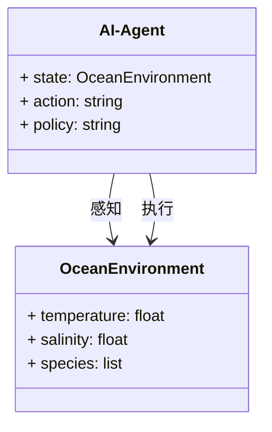
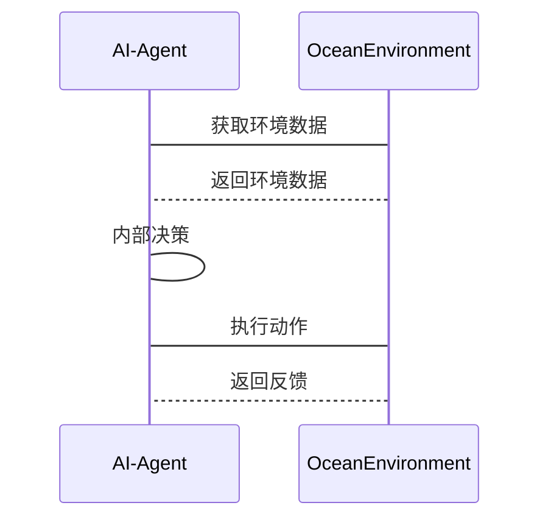

                 


# AI Agent在智能海洋生态系统模拟中的实践

> 关键词：AI Agent，智能海洋生态系统，强化学习，知识图谱，海洋生态监测

> 摘要：本文探讨了AI Agent在智能海洋生态系统模拟中的应用，从基本概念到核心算法，再到系统架构和实战案例，详细介绍了AI Agent在海洋生态监测、资源管理等领域的实践应用。通过理论与实践结合，展示了如何利用AI技术提升海洋生态系统的智能化管理水平。

---

# 第1章: AI Agent与智能海洋生态系统概述

## 1.1 AI Agent的基本概念

### 1.1.1 什么是AI Agent

AI Agent，即人工智能代理，是指能够感知环境、自主决策并执行任务的智能体。它能够根据环境信息做出决策，并采取行动以实现特定目标。

### 1.1.2 AI Agent的核心特征

- **自主性**：AI Agent能够自主决策，无需外部干预。
- **反应性**：能够实时感知环境变化并做出反应。
- **学习能力**：通过经验不断优化决策策略。
- **协作性**：能够与其他Agent或系统协同工作。

### 1.1.3 AI Agent与传统算法的区别

传统算法通常基于固定的规则或预定义的逻辑执行任务，而AI Agent能够根据环境动态调整策略，具有更强的适应性和学习能力。

| **特征** | **传统算法** | **AI Agent** |
|----------|--------------|--------------|
| 决策方式 | 基于规则     | 基于学习     |
| 环境适应 | 静态          | 动态          |
| 知识表示 | 明确规则      | 概率模型      |

## 1.2 智能海洋生态系统的基本概念

### 1.2.1 海洋生态系统的定义

海洋生态系统是由海洋生物群落及其非生物环境组成的复杂系统，包括从微生物到大型海洋生物的各种生物。

### 1.2.2 智能海洋生态系统的特征

- **智能化**：利用AI技术进行实时监测和管理。
- **动态性**：能够实时感知和响应环境变化。
- **协作性**：多个Agent协同工作，共同实现系统目标。

### 1.2.3 AI Agent在智能海洋生态系统中的作用

AI Agent可以作为海洋生态系统的智能节点，负责数据采集、环境监测、资源管理等任务。

## 1.3 AI Agent在智能海洋生态系统中的应用前景

### 1.3.1 AI Agent在海洋生态监测中的应用

AI Agent可以实时监测海洋环境数据，如温度、盐度、氧气含量等，帮助科学家了解海洋生态系统的健康状况。

### 1.3.2 AI Agent在海洋资源管理中的应用

AI Agent可以优化渔业资源管理，预测鱼类洄游路径，帮助渔民更高效地进行捕捞。

### 1.3.3 AI Agent在海洋环境保护中的应用

AI Agent可以监测非法捕捞活动，保护濒危海洋生物，维护海洋生态平衡。

## 1.4 本章小结

本章介绍了AI Agent的基本概念及其在智能海洋生态系统中的应用。AI Agent通过自主感知、决策和执行，能够显著提升海洋生态系统的智能化管理水平。

---

# 第2章: AI Agent的核心原理

## 2.1 AI Agent的感知机制

### 2.1.1 数据采集与处理

AI Agent通过传感器或数据接口获取环境数据，如温度、湿度、光照强度等。

### 2.1.2 知识表示与推理

AI Agent利用知识图谱或逻辑推理对数据进行理解和分析，形成对环境的语义理解。

## 2.2 AI Agent的决策机制

### 2.2.1 状态空间与动作空间

- **状态空间**：所有可能的环境状态集合。
- **动作空间**：AI Agent在每个状态下可执行的动作集合。

### 2.2.2 决策算法

- **强化学习**：通过试错学习，优化决策策略。
- **基于规则的决策**：根据预定义规则进行决策。

## 2.3 AI Agent的执行机制

### 2.3.1 执行器的设计与实现

AI Agent通过执行器与环境交互，执行具体动作，如打开传感器、调整设备参数等。

### 2.3.2 执行结果的反馈机制

AI Agent根据环境反馈调整决策策略，形成闭环控制系统。

## 2.4 本章小结

本章详细讲解了AI Agent的核心原理，包括感知、决策和执行三个主要部分。这些原理为后续章节的实践应用奠定了理论基础。

---

# 第3章: AI Agent在智能海洋生态系统中的实现技术

## 3.1 基于强化学习的AI Agent算法

### 3.1.1 Q-learning算法

Q-learning是一种常用的强化学习算法，通过学习Q值表来优化决策策略。

```python
# Q-learning算法实现
class QLearning:
    def __init__(self, state_space_size, action_space_size):
        self.q_table = np.zeros((state_space_size, action_space_size))
    
    def choose_action(self, state, epsilon):
        if random.random() < epsilon:
            return random.randint(0, action_space_size-1)
        else:
            return np.argmax(self.q_table[state])
    
    def update_q_value(self, state, action, reward, next_state, alpha):
        self.q_table[state][action] = (1 - alpha) * self.q_table[state][action] + alpha * (reward + np.max(self.q_table[next_state]))
```

### 3.1.2 DQN算法

DQN（Deep Q-Network）算法结合了深度神经网络和Q-learning，能够处理高维状态空间。

### 3.1.3 算法实现的数学模型

Q-learning的目标是通过更新Q值表，使得Q值逼近真实值：

$$ Q(s, a) = Q(s, a) + \alpha (r + \max Q(s', a) - Q(s, a)) $$

其中，$\alpha$是学习率，$r$是奖励。

## 3.2 基于知识图谱的AI Agent算法

### 3.2.1 知识图谱的构建

知识图谱通过实体和关系描述海洋生态系统中的知识。

### 3.2.2 基于知识图谱的推理算法

通过语义推理，AI Agent可以理解复杂的海洋生态关系。

## 3.3 基于遗传算法的AI Agent优化

### 3.3.1 遗传算法的基本原理

遗传算法模拟生物进化过程，通过选择、交叉和变异生成新的解。

### 3.3.2 在AI Agent中的应用

遗传算法可以优化AI Agent的参数设置，提高决策效率。

## 3.4 本章小结

本章介绍了几种常用的AI Agent算法，包括强化学习、知识图谱推理和遗传算法，为后续的系统设计和实战提供了技术支撑。

---

# 第4章: AI Agent的系统分析与架构设计

## 4.1 项目背景介绍

本项目旨在利用AI Agent技术，构建智能海洋生态系统模拟平台，实现对海洋生态的实时监测和管理。

## 4.2 系统功能设计

### 4.2.1 领域模型设计

通过Mermaid类图展示系统的各个模块及其关系。



### 4.2.2 系统架构设计

采用分层架构，包括数据采集层、处理层、存储层和用户界面层。

### 4.2.3 系统接口设计

定义标准接口，如数据采集接口、决策接口和反馈接口。

### 4.2.4 系统交互流程图

通过Mermaid序列图展示系统交互流程。



## 4.3 本章小结

本章详细分析了AI Agent在智能海洋生态系统中的系统架构设计，为后续的实现提供了指导。

---

# 第5章: AI Agent的项目实战

## 5.1 环境安装

安装必要的库，如TensorFlow、NumPy、Matplotlib等。

```bash
pip install tensorflow numpy matplotlib
```

## 5.2 系统核心实现

### 5.2.1 感知模块实现

读取环境数据并进行预处理。

```python
import numpy as np

def get_environment_data():
    # 示例数据获取
    temperature = np.random.uniform(0, 30)
    salinity = np.random.uniform(0, 35)
    return {'temperature': temperature, 'salinity': salinity}
```

### 5.2.2 决策模块实现

基于强化学习算法做出决策。

```python
class AI-Agent:
    def decide_action(self, state):
        # 示例决策逻辑
        if state['temperature'] > 25:
            return 'adjust_cooling'
        else:
            return 'adjust_heating'
```

### 5.2.3 执行模块实现

根据决策结果执行具体动作。

```python
def execute_action(action):
    # 示例执行逻辑
    if action == 'adjust_cooling':
        print("调整冷却系统")
    elif action == 'adjust_heating':
        print("调整加热系统")
```

## 5.3 实际案例分析

### 5.3.1 案例背景

以监测海洋温度为例，AI Agent需要根据温度数据调整冷却或加热系统。

### 5.3.2 案例实现

通过AI Agent实现温度监测与控制。

```python
# 示例代码
environment = get_environment_data()
action = agent.decide_action(environment)
execute_action(action)
```

## 5.4 项目小结

本章通过实战案例，详细讲解了AI Agent在智能海洋生态系统中的实现过程，展示了从数据采集到决策执行的完整流程。

---

# 第6章: AI Agent的最佳实践

## 6.1 小结

总结全文内容，强调AI Agent在智能海洋生态系统中的重要性。

## 6.2 注意事项

- 确保数据采集的准确性。
- 定期更新AI Agent的决策模型。
- 处理好AI Agent之间的协作关系。

## 6.3 拓展阅读

推荐相关领域的书籍和论文，供读者进一步学习。

---

# 附录: 参考文献与工具资源

## 附录A: 参考文献

1. Russell, S., & Norvig, P. (2010). Artificial Intelligence: A Modern Approach.
2. LeCun, Y., Bengio, Y., & Hinton, G. (2015). Deep learning.
3. Sutton, R. S., & Barto, A. G. (2018). Reinforcement learning: An introduction.

## 附录B: 工具资源

- TensorFlow官方文档：https://tensorflow.org
- NumPy官方文档：https://numpy.org
- Mermaid图表工具：https://mermaid-js.github.io/mermaid-live-editor/

---

通过以上目录结构和内容安排，您可以开始撰写具体的章节内容，每部分内容都按照上述大纲展开，确保逻辑清晰、结构紧凑，同时深入浅出地讲解AI Agent在智能海洋生态系统中的实践应用。

