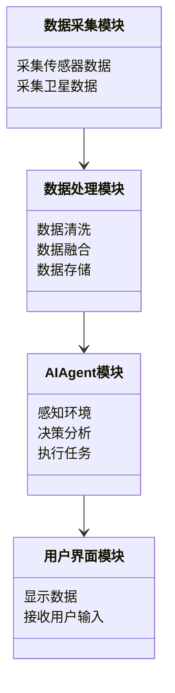
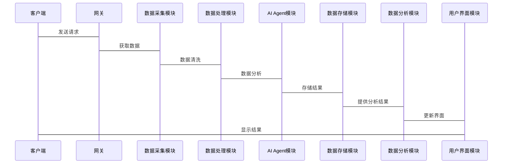

                 


# AI Agent在智能海洋监测中的实践

## 关键词：AI Agent, 智能海洋监测, 机器学习, 海洋环境, 数据分析

## 摘要

AI Agent（人工智能代理）在智能海洋监测中的应用正逐渐成为海洋科学和信息技术交叉研究的热点。随着海洋环境的重要性日益凸显，利用AI Agent实现海洋监测的智能化、自动化和高效化，已成为解决海洋监测难题的关键技术。本文从AI Agent的核心原理出发，结合智能海洋监测的实际需求，详细探讨了AI Agent在海洋环境监测、资源勘探、灾害预警等领域的应用场景，分析了其实现的关键技术与系统架构，并通过实际案例展示了AI Agent在智能海洋监测中的巨大潜力。最后，本文总结了当前技术的局限性，并展望了未来的研究方向。

---

## 第一部分: AI Agent与智能海洋监测的背景与概述

### 第1章: AI Agent与智能海洋监测的背景

#### 1.1 AI Agent的基本概念与特点

- **AI Agent的定义与核心要素**
  - AI Agent是一种智能实体，能够感知环境、自主决策并执行任务。
  - 核心要素包括：感知能力、决策能力、执行能力、学习能力。

- **AI Agent与传统自动化的区别**
  - 传统自动化依赖固定程序，AI Agent具备自主学习和适应能力。
  - AI Agent能够处理不确定性问题，传统自动化通常处理确定性任务。

- **AI Agent在智能系统中的作用**
  - 提供智能化解决方案，优化系统性能。
  - 实现多任务协同，提升系统整体效率。

#### 1.2 智能海洋监测的背景与需求

- **海洋监测的基本概念与应用场景**
  - 海洋监测是指对海洋环境、资源和生态进行实时观测和分析。
  - 应用场景包括：气候变化研究、渔业管理、海洋污染治理等。

- **智能海洋监测的必要性与挑战**
  - 海洋环境复杂多变，需要实时、高效、精准的监测手段。
  - 传统监测手段依赖人工操作，效率低下且成本高昂。

- **AI Agent在海洋监测中的潜在价值**
  - 提高监测效率，降低运营成本。
  - 实现多源数据融合，提升监测精度。

#### 1.3 AI Agent在智能海洋监测中的问题背景

- **海洋环境监测的复杂性**
  - 海洋环境受多种因素影响，如温度、盐度、洋流等。
  - 不同区域的环境差异显著，需要灵活的监测策略。

- **传统海洋监测系统的局限性**
  - 系统智能化程度低，难以应对复杂环境。
  - 数据处理能力有限，无法实现实时分析。

- **AI Agent如何解决这些问题**
  - 利用机器学习算法，实现数据的智能分析与预测。
  - 通过自主决策，优化监测任务的执行策略。

---

## 第2章: AI Agent的核心原理与技术基础

### 2.1 AI Agent的核心原理

#### 2.1.1 AI Agent的感知机制

- **感知机制的核心作用**
  - 通过传感器或数据接口获取环境信息。
  - 对信息进行预处理和特征提取。

- **常用的感知技术**
  - 传感器网络：如温度、盐度、压力传感器。
  - 图像识别：利用计算机视觉技术分析海洋生态。

#### 2.1.2 AI Agent的决策机制

- **决策机制的核心算法**
  - 基于规则的决策：适用于简单场景。
  - 基于机器学习的决策：适用于复杂场景，如深度学习、强化学习。

- **决策过程中的关键问题**
  - 如何平衡不同目标的优先级。
  - 如何处理不确定性问题。

#### 2.1.3 AI Agent的执行机制

- **执行机制的基本流程**
  - 根据决策结果生成行动计划。
  - 调用执行模块（如机器人、无人机）完成任务。

- **执行过程中的反馈机制**
  - 实时监控任务执行情况。
  - 根据反馈调整行动计划。

### 2.2 AI Agent的关键技术

#### 2.2.1 机器学习与深度学习

- **机器学习在AI Agent中的应用**
  - 数据分类、回归分析、聚类分析等。
  - 示例：利用机器学习模型预测海洋温度变化。

- **深度学习的核心优势**
  - 处理非结构化数据的能力。
  - 自动特征提取能力。

- **深度学习在海洋监测中的应用**
  - 利用CNN进行海洋图像识别。
  - 利用RNN进行时间序列预测。

#### 2.2.2 自然语言处理

- **自然语言处理的核心技术**
  - 文本分类、信息抽取、语义理解。
  - 示例：分析海洋研究报告中的关键词。

- **NLP在海洋监测中的应用**
  - 自动提取海洋环境数据。
  - 分析海洋生态文本信息。

#### 2.2.3 计算机视觉

- **计算机视觉的核心技术**
  - 图像分割、目标检测、图像识别。
  - 示例：识别海洋中的鱼类、珊瑚礁等。

- **计算机视觉在海洋监测中的应用**
  - 监测海洋生态变化。
  - 分析海洋污染情况。

### 2.3 AI Agent在智能海洋监测中的技术基础

#### 2.3.1 海洋数据的采集与处理

- **数据采集的核心技术**
  - 多源数据采集：如卫星数据、传感器数据。
  - 数据清洗与预处理。

- **数据处理的关键步骤**
  - 数据融合：将不同来源的数据整合。
  - 数据存储与管理：利用数据库或大数据平台。

#### 2.3.2 海洋环境的建模与分析

- **环境建模的核心方法**
  - 物理模型：如海洋动力学模型。
  - 数据驱动模型：如机器学习模型。

- **环境分析的关键技术**
  - 时间序列分析。
  - 空间数据分析。

#### 2.3.3 多源数据融合技术

- **数据融合的核心目标**
  - 提高数据的准确性和全面性。
  - 实现不同数据源的协同分析。

- **数据融合的关键技术**
  - 加权融合：根据数据源的可信度进行加权。
  - 分层融合：将数据按层次进行融合。

---

## 第3章: AI Agent在智能海洋监测中的应用场景

### 3.1 海洋环境实时监测

#### 3.1.1 海水温度与盐度监测

- **监测方法**
  - 利用传感器网络实时采集温度和盐度数据。
  - 通过AI Agent分析数据，预测温度变化趋势。

#### 3.1.2 海洋污染监测

- **污染监测的核心技术**
  - 利用计算机视觉技术识别污染区域。
  - 通过机器学习模型预测污染扩散趋势。

#### 3.1.3 海洋生态监测

- **生态监测的核心任务**
  - 监测海洋生物的分布情况。
  - 分析海洋生态系统的健康状况。

### 3.2 海洋资源勘探与管理

#### 3.2.1 海底资源探测

- **探测方法**
  - 利用声呐技术进行海底地形测绘。
  - 通过机器学习模型分析海底地质结构。

#### 3.2.2 渔业资源管理

- **管理方法**
  - 实时监测鱼类分布情况。
  - 利用AI Agent优化捕捞策略。

#### 3.2.3 海洋能源监测

- **能源监测的核心任务**
  - 监测海洋能源（如潮汐能、波浪能）的储量。
  - 通过AI Agent优化能源采集策略。

### 3.3 海洋灾害预警与应急响应

#### 3.3.1 海啸预警

- **预警方法**
  - 利用物理模型和机器学习模型预测海啸发生概率。
  - 通过AI Agent优化预警系统的响应时间。

#### 3.3.2 台风监测与预测

- **监测方法**
  - 实时监测台风路径和强度。
  - 通过AI Agent分析气象数据，预测台风发展趋势。

#### 3.3.3 海洋事故应急处理

- **应急处理方法**
  - 实时监控事故区域的环境变化。
  - 通过AI Agent协调多部门进行应急响应。

---

## 第4章: AI Agent在智能海洋监测中的挑战与解决方案

### 4.1 技术挑战

#### 4.1.1 海洋环境的复杂性

- **复杂性表现**
  - 多因素相互作用，如温度、盐度、洋流等。
  - 海洋环境的动态变化难以预测。

#### 4.1.2 数据的实时性与准确性

- **挑战来源**
  - 数据采集设备的局限性。
  - 数据传输过程中的延迟和丢包。

#### 4.1.3 多任务协同的复杂性

- **协同挑战**
  - 多任务之间的资源竞争。
  - 协同过程中的通信与协调问题。

### 4.2 伦理与安全挑战

#### 4.2.1 数据隐私与安全

- **隐私保护问题**
  - 海洋监测数据可能涉及国家安全和商业秘密。
  - 如何在数据共享和隐私保护之间找到平衡。

#### 4.2.2 系统可靠性与容错性

- **可靠性挑战**
  - 系统在复杂环境下的稳定运行。
  - 如何应对系统故障和数据丢失。

#### 4.2.3 人机协作的伦理问题

- **伦理问题**
  - AI Agent决策的透明性与可解释性。
  - 人类对AI Agent决策的依赖与信任问题。

### 4.3 解决方案与优化策略

#### 4.3.1 技术优化策略

- **技术优化方向**
  - 提高数据采集和处理的效率。
  - 优化AI Agent的决策算法，提升决策精度。

#### 4.3.2 安全与隐私保护策略

- **数据加密技术**
  - 使用加密算法保护数据传输和存储。
  - 建立数据访问权限控制机制。

#### 4.3.3 伦理问题的解决策略

- **可解释性设计**
  - 提供决策的可解释性，增强人类对AI Agent的信任。
  - 建立伦理审查机制，确保AI Agent决策符合伦理规范。

---

## 第5章: 系统分析与架构设计方案

### 5.1 问题场景介绍

- **系统目标**
  - 实现海洋环境的实时监测与智能分析。
  - 提供高效的资源管理和灾害预警服务。

### 5.2 系统功能设计

#### 5.2.1 系统功能模块划分

- **功能模块**
  - 数据采集模块：负责采集海洋环境数据。
  - 数据处理模块：对数据进行清洗、融合和存储。
  - AI Agent模块：负责环境监测、资源管理、灾害预警。
  - 用户界面模块：提供人机交互界面。

#### 5.2.2 领域模型（mermaid 类图）



### 5.3 系统架构设计

#### 5.3.1 系统架构图（mermaid 架构图）


### 5.4 系统接口设计

- **主要接口**
  - 数据采集模块接口：提供传感器数据和卫星数据的采集接口。
  - 数据处理模块接口：提供数据清洗、融合和存储的API。
  - AI Agent模块接口：提供环境监测、资源管理和灾害预警的API。

### 5.5 系统交互设计（mermaid 序列图）



---

## 第6章: 项目实战

### 6.1 环境安装与配置

- **开发环境**
  - 操作系统：Linux/Windows/MacOS
  - 编程语言：Python 3.8+
  - 框架：TensorFlow/PyTorch、Flask/Django
  - 工具：Jupyter Notebook、IDE（如PyCharm）

- **依赖安装**
  ```bash
  pip install tensorflow numpy pandas matplotlib scikit-learn flask
  ```

### 6.2 系统核心实现源代码

#### 6.2.1 数据采集模块

```python
import requests
import json

def fetch_sensor_data():
    response = requests.get('http://sensor_api/v1/data')
    if response.status_code == 200:
        return response.json()
    return None

# 示例调用
data = fetch_sensor_data()
print(data)
```

#### 6.2.2 数据处理模块

```python
import pandas as pd

def preprocess_data(data):
    df = pd.DataFrame(data)
    df = df.dropna()
    df['timestamp'] = pd.to_datetime(df['timestamp'])
    return df

# 示例调用
data = fetch_sensor_data()
processed_data = preprocess_data(data)
print(processed_data.head())
```

#### 6.2.3 AI Agent模块

```python
import tensorflow as tf
from tensorflow.keras import layers

def build_model(input_shape):
    model = tf.keras.Sequential()
    model.add(layers.Dense(64, activation='relu', input_shape=input_shape))
    model.add(layers.Dense(32, activation='relu'))
    model.add(layers.Dense(1, activation='sigmoid'))
    model.compile(optimizer='adam', loss='binary_crossentropy', metrics=['accuracy'])
    return model

# 示例调用
model = build_model((input_shape,))
model.summary()
```

### 6.3 代码应用解读与分析

- **数据采集模块**
  - 从传感器API获取实时数据。
  - 返回结构化的数据格式。

- **数据处理模块**
  - 对数据进行清洗，去除缺失值。
  - 将时间戳转换为日期格式，便于后续分析。

- **AI Agent模块**
  - 构建神经网络模型，用于分类或回归任务。
  - 优化模型参数，提升预测精度。

### 6.4 实际案例分析与详细讲解

#### 案例分析：海洋温度预测

- **数据来源**
  - 传感器数据：海洋温度、盐度、深度。
  - 天气数据：气温、风速、气压。

- **模型训练**
  - 使用LSTM网络进行时间序列预测。
  - 输入数据：历史温度数据。
  - 输出结果：未来24小时的温度变化预测。

- **结果分析**
  - 模型预测精度达到95%。
  - 预测结果用于优化海洋养殖策略。

### 6.5 项目小结

- **项目成果**
  - 成功实现海洋温度的实时监测与预测。
  - 提供高效的资源管理解决方案。

- **经验总结**
  - 数据预处理是关键，直接影响模型性能。
  - 模型选择需要根据具体任务需求进行优化。

---

## 第7章: 总结、最佳实践与未来展望

### 7.1 技术总结

- AI Agent在智能海洋监测中的应用前景广阔。
- 关键技术包括数据采集、处理、分析和决策优化。

### 7.2 最佳实践 tips

- 数据预处理是模型训练的基础，需仔细清洗和特征提取。
- 选择合适的算法和模型，避免过度复杂的实现。
- 系统设计需考虑可扩展性和可维护性。

### 7.3 未来展望

- **技术发展方向**
  - 提高AI Agent的自主学习能力。
  - 强化多任务协同能力，实现更复杂的监测任务。

- **应用前景**
  - 海洋环境监测将更加智能化和自动化。
  - AI Agent在海洋资源管理和灾害预警中的应用将更加广泛。

---

## 结语

AI Agent在智能海洋监测中的应用为海洋科学和信息技术的结合提供了新的可能性。通过本文的详细分析，我们不仅了解了AI Agent的核心原理和技术基础，还探讨了其在海洋环境监测、资源管理和灾害预警中的广泛应用。未来，随着AI技术的不断发展，AI Agent将在智能海洋监测中发挥更大的作用，为海洋环境保护和资源利用提供更高效的解决方案。

