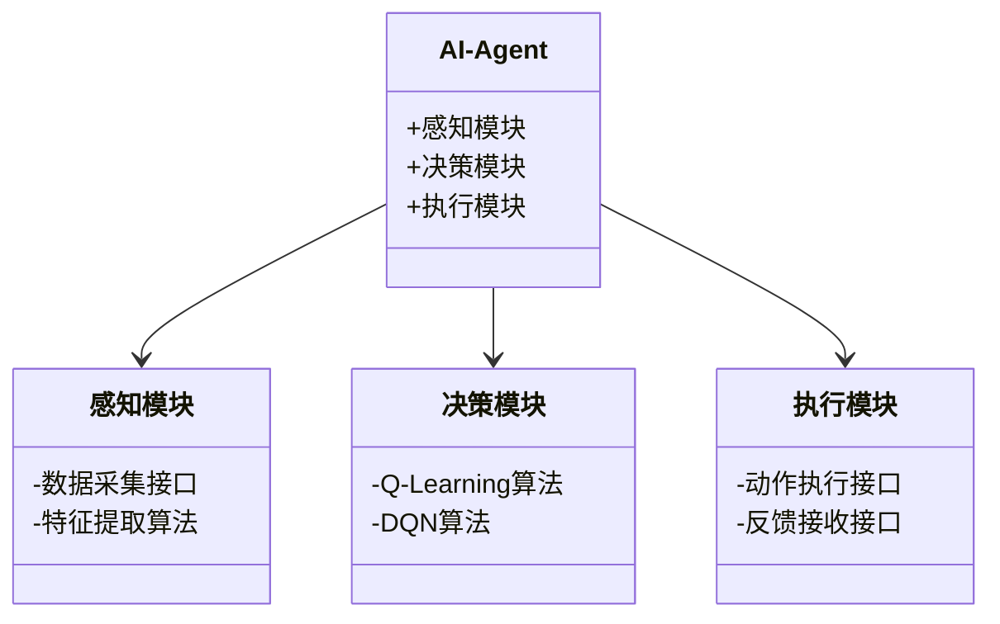
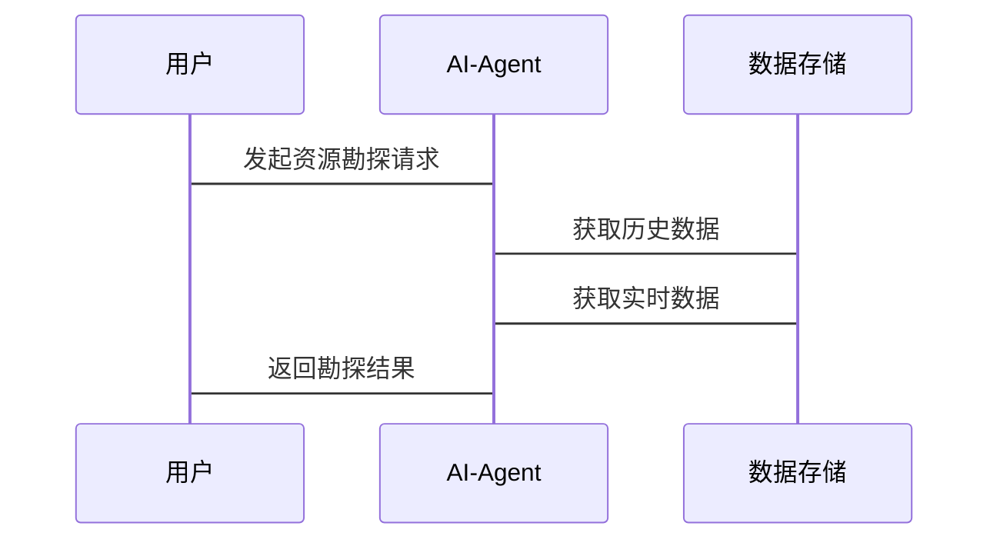

                 


# AI Agent在智能海洋资源勘探中的实践

## 关键词：
AI Agent, 海洋资源勘探, 强化学习, 机器学习, 智能系统, 数据分析

## 摘要：
随着人工智能技术的快速发展，AI Agent在智能海洋资源勘探中的应用变得越来越重要。本文详细探讨了AI Agent的核心概念、算法原理、系统架构设计以及在海洋资源勘探中的实际应用案例。通过结合强化学习、机器学习等技术，本文展示了如何利用AI Agent实现海洋资源的高效勘探和优化管理。文章还分析了系统设计的关键问题，并提供了具体的实现方案和代码示例，帮助读者更好地理解和应用相关技术。

---

## 第一部分: AI Agent在智能海洋资源勘探中的背景与概念

### 第1章: AI Agent与智能海洋资源勘探概述

#### 1.1 AI Agent的基本概念
##### 1.1.1 AI Agent的定义与核心属性
- AI Agent的定义：AI Agent是一种能够感知环境、自主决策并执行任务的智能体。
- 核心属性：自主性、反应性、目标导向、社会性。
- 行为模式：基于规则的决策、基于模型的决策、基于学习的决策。

##### 1.1.2 AI Agent在不同领域的应用
- 金融领域：智能投顾、风险控制。
- 医疗领域：疾病诊断、治疗方案优化。
- 工业领域：智能制造、设备维护。

##### 1.1.3 智能海洋资源勘探的定义与特点
- 智能海洋资源勘探：利用AI技术进行海洋资源的高效、精准勘探。
- 特点：实时性、准确性、高效性、适应性。

#### 1.2 海洋资源勘探的挑战与需求
##### 1.2.1 海洋资源勘探的基本流程
- 数据采集：声呐、地震勘探、卫星遥感。
- 数据处理：去噪、滤波、特征提取。
- 资源识别：目标检测、分类、定位。
- 风险评估：环境风险、技术风险、经济风险。

##### 1.2.2 传统海洋资源勘探的局限性
- 数据量大、处理复杂。
- 人工干预多、效率低。
- 精确度受限制。

##### 1.2.3 AI Agent在海洋资源勘探中的优势
- 高效数据处理能力。
- 自主决策能力。
- 实时反馈与优化能力。

#### 1.3 AI Agent在智能海洋资源勘探中的应用前景
##### 1.3.1 AI Agent在海洋资源勘探中的潜在价值
- 提高勘探效率。
- 降低勘探成本。
- 提升勘探精准度。

##### 1.3.2 未来技术发展趋势与挑战
- 多智能体协作。
- 边缘计算与实时性。
- 数据隐私与安全。

---

## 第二部分: AI Agent的核心概念与原理

### 第2章: AI Agent的核心概念与原理

#### 2.1 AI Agent的核心概念
##### 2.1.1 AI Agent的感知、决策与执行机制
- 感知：通过传感器或数据源获取环境信息。
- 决策：基于感知信息进行推理和选择。
- 执行：根据决策结果执行具体操作。

##### 2.1.2 AI Agent的多智能体协作
- 多智能体系统：多个AI Agent协作完成复杂任务。
- 协作机制：通信、协调、共享决策。

##### 2.1.3 AI Agent的自适应与学习能力
- 自适应：根据环境变化动态调整行为。
- 学习能力：通过经验改进性能。

#### 2.2 AI Agent的核心原理
##### 2.2.1 强化学习与决策树算法
- 强化学习：通过与环境交互获得奖励，优化决策策略。
- 决策树：基于特征的分类与回归。

##### 2.2.2 机器学习与深度学习的结合
- 机器学习：监督学习、无监督学习。
- 深度学习：神经网络、卷积神经网络（CNN）。

##### 2.2.3 知识图谱与语义理解
- 知识图谱：结构化知识表示。
- 语义理解：自然语言处理（NLP）技术。

#### 2.3 AI Agent在海洋资源勘探中的具体应用
##### 2.3.1 数据采集与处理
- 数据采集：声呐、地震勘探、卫星遥感。
- 数据处理：去噪、滤波、特征提取。

##### 2.3.2 资源识别与定位
- 目标检测：识别海底资源特征。
- 分类与定位：基于深度学习的分类模型。

##### 2.3.3 风险评估与优化
- 风险评估：环境风险、技术风险。
- 优化策略：动态调整勘探计划。

---

## 第三部分: AI Agent的算法原理与数学模型

### 第3章: AI Agent的算法原理与数学模型

#### 3.1 强化学习算法
##### 3.1.1 Q-Learning算法
- Q-Learning的基本原理：
  - 状态（State）、动作（Action）、奖励（Reward）、策略（Policy）。
  - Q值更新公式：
    $$ Q(s,a) = Q(s,a) + \alpha (r + \gamma \max Q(s',a') - Q(s,a)) $$
- 实际应用：机器人导航、游戏AI。

##### 3.1.2 DQN算法
- DQN（Deep Q-Network）：
  - 使用神经网络近似Q值函数。
  - 网络结构：输入层、隐藏层、输出层。

##### 3.1.3 算法的数学模型与公式
- Q-Learning的数学模型：
  $$ Q(s,a) = Q(s,a) + \alpha (r + \gamma \max Q(s',a') - Q(s,a)) $$
- DQN的数学模型：
  - 损失函数：均方误差（MSE）。
  - 目标网络：减少目标值的波动。

#### 3.2 机器学习算法
##### 3.2.1 监督学习算法
- 分类任务：逻辑回归、支持向量机（SVM）。
- 回归任务：线性回归、随机森林。

##### 3.2.2 无监督学习算法
- 聚类：K-means、层次聚类。
- 异常检测：孤立森林、PCA。

##### 3.2.3 半监督学习算法
- 使用少量标注数据和大量未标注数据进行训练。
- 核相关分析（Kernel Canonical Correlation Analysis）。

#### 3.3 算法的优化与改进
##### 3.3.1 神经网络优化
- 深度学习框架：TensorFlow、PyTorch。
- 模型优化：批量归一化（Batch Normalization）、Dropout。

##### 3.3.2 超参数调整
- 超参数：学习率、批次大小、 epochs。
- 调整方法：网格搜索、随机搜索、贝叶斯优化。

##### 3.3.3 算法的可解释性
- 可解释性：模型决策的透明性。
- 解释方法：特征重要性分析、模型可视化。

---

## 第四章: AI Agent的系统分析与架构设计

### 第4章: AI Agent的系统分析与架构设计

#### 4.1 系统分析
##### 4.1.1 问题场景介绍
- 海洋资源勘探的复杂性。
- 数据的实时性和准确性要求。

##### 4.1.2 项目介绍
- 项目目标：实现AI Agent在海洋资源勘探中的应用。
- 项目范围：数据采集、处理、分析、决策。

#### 4.2 系统功能设计
##### 4.2.1 领域模型（Mermaid类图）


##### 4.2.2 系统架构设计（Mermaid架构图）


#### 4.3 系统接口设计
##### 4.3.1 接口定义
- 数据接口：数据采集、数据存储。
- 通信接口：AI-Agent与外部系统的交互。
- 用户接口：人机交互界面。

##### 4.3.2 接口协议
- HTTP协议：RESTful API。
- 数据格式：JSON、XML。

#### 4.4 系统交互设计（Mermaid序列图）


---

## 第五章: AI Agent的项目实战

### 第5章: AI Agent的项目实战

#### 5.1 环境安装
##### 5.1.1 安装Python
- Python 3.8或更高版本。
##### 5.1.2 安装深度学习框架
- TensorFlow或PyTorch。
##### 5.1.3 安装其他依赖
- Matplotlib、Seaborn、Pandas。

#### 5.2 核心实现
##### 5.2.1 数据采集模块
```python
import numpy as np
import pandas as pd

# 示例数据：海洋深度数据
depth_data = pd.DataFrame({
    'longitude': np.random.uniform(-180, 180, 100),
    'latitude': np.random.uniform(-90, 90, 100),
    'depth': np.random.normal(5000, 100, 100)
})
```

##### 5.2.2 决策模块实现
```python
import tensorflow as tf
from tensorflow.keras import layers

# 示例：Q-Learning网络
class QNetwork(tf.keras.Model):
    def __init__(self, state_space, action_space):
        super(QNetwork, self).__init__()
        self.dense1 = layers.Dense(64, activation='relu')
        self.dense2 = layers.Dense(action_space, activation='linear')
    
    def call(self, state):
        x = self.dense1(state)
        x = self.dense2(x)
        return x

# 初始化网络
state_space = 10
action_space = 4
qnetwork = QNetwork(state_space, action_space)
```

##### 5.2.3 执行模块实现
```python
# 示例：执行动作
def execute_action(action):
    print(f"执行动作：{action}")
    return "动作执行成功"

# 示例：AI-Agent决策
state = np.random.random(10)
with tf.GradientTape() as tape:
    q_values = qnetwork(state)
    action = np.argmax(q_values)
    execute_action(action)
```

#### 5.3 案例分析
##### 5.3.1 数据分析与可视化
- 数据可视化：使用Matplotlib绘制深度图、温度分布图。
##### 5.3.2 算法实现与优化
- 算法优化：调整学习率、批量大小。
- 模型评估：准确率、召回率、F1分数。
##### 5.3.3 实际效果展示
- 案例1：海底资源定位。
- 案例2：环境风险评估。

#### 5.4 项目小结
##### 5.4.1 项目总结
- AI Agent在海洋资源勘探中的优势。
##### 5.4.2 经验与教训
- 系统设计中的挑战。
- 实际应用中的问题与解决方案。

---

## 第六章: 最佳实践、小结、注意事项与拓展阅读

### 第6章: 最佳实践、小结、注意事项与拓展阅读

#### 6.1 最佳实践
##### 6.1.1 系统设计
- 模块化设计：便于维护和扩展。
- 高可用性：确保系统的稳定性。
##### 6.1.2 算法选择
- 根据任务选择合适的算法。
- 深度学习 vs. 强化学习。
##### 6.1.3 数据管理
- 数据清洗：去除噪声数据。
- 数据安全：保护敏感数据。

#### 6.2 小结
- AI Agent在智能海洋资源勘探中的核心价值。
- 本文的主要内容回顾。

#### 6.3 注意事项
##### 6.3.1 技术实现
- 算法的可解释性。
- 系统的实时性。
##### 6.3.2 数据安全
- 数据隐私保护。
- 合规性要求。

#### 6.4 拓展阅读
##### 6.4.1 相关技术
- 联邦学习（Federated Learning）。
- 多模态数据融合。
##### 6.4.2 应用领域
- 海洋环境保护。
- 海洋生物研究。

---

## 第七章: 结语

### 第7章: 结语
AI Agent在智能海洋资源勘探中的应用前景广阔，随着技术的不断进步，AI Agent将在海洋资源勘探中发挥越来越重要的作用。通过本文的详细讲解，读者可以深入了解AI Agent的核心概念、算法原理和系统设计，并将其应用于实际场景中。未来，随着AI技术的进一步发展，AI Agent在海洋资源勘探中的应用将更加智能化、高效化。

---

## 参考文献
（此处列出相关文献和资料）

---

通过以上目录大纲，您可以逐步展开每个部分的内容，结合实际案例和详细的技术分析，撰写一篇完整的、高质量的技术博客文章。

