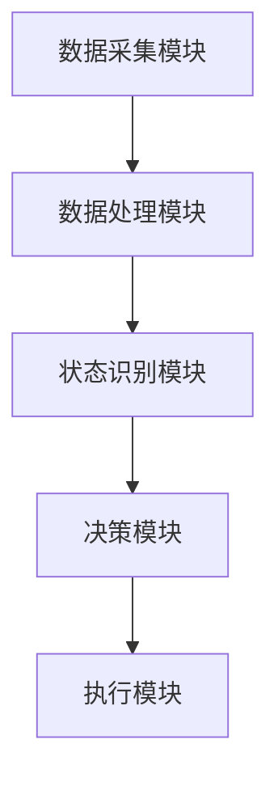
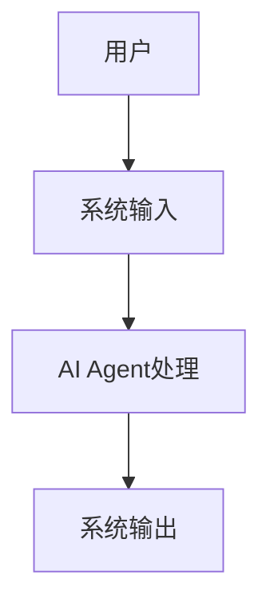

                 


# AI Agent在智能海洋资源管理中的应用

> 关键词：AI Agent, 智能海洋资源管理, 强化学习, 海洋生态保护, 资源优化配置

> 摘要：本文深入探讨了AI Agent在智能海洋资源管理中的应用，从技术基础到实际应用，全面分析了AI Agent在海洋资源监测、生态保护、资源优化配置等领域的核心作用。通过理论与实践相结合的方式，详细阐述了AI Agent的算法原理、系统架构设计以及实际应用场景中的案例分析。

---

## 第一部分: AI Agent与智能海洋资源管理概述

### 第1章: AI Agent的基本概念与技术基础

#### 1.1 AI Agent的定义与核心概念
- **1.1.1 AI Agent的定义**
  - AI Agent（智能体）是指在环境中能够感知并自主行动以实现目标的实体。
  - 核心属性：自主性、反应性、目标导向性、社会性。

- **1.1.2 AI Agent的核心属性与特征**
  - 表格对比：AI Agent与传统AI的区别。
  | 属性 | 传统AI | AI Agent |
  |------|--------|----------|
  | 行为方式 | 被动计算 | 主动执行 |
  | 交互方式 | 单向输入 | 双向交互 |
  | 环境适应 | 固定场景 | 动态环境 |

- **1.1.3 AI Agent与传统AI的区别**
  - 传统AI：专注于数据处理和问题求解，如搜索、分类、聚类。
  - AI Agent：具备环境感知能力，能够自主决策并执行动作，如自动驾驶、智能助手。

#### 1.2 AI Agent的工作原理
- **1.2.1 状态空间与动作空间**
  - 状态：系统当前的环境描述，如海洋中的鱼群分布、水质参数。
  - 动作：AI Agent可以执行的动作，如调整捕捞策略、优化航行路线。

- **1.2.2 奖励机制与目标函数**
  - 奖励机制：通过奖励函数指导AI Agent的行为，例如在生态保护中，保护濒危物种的奖励高于捕捞收益。
  - 目标函数：定义AI Agent追求的目标，如最大化资源利用效率或最小化环境破坏。

- **1.2.3 策略与价值函数的关系**
  - 策略：决定AI Agent在给定状态下采取的动作，如$\pi(a|s)$。
  - 价值函数：评估某个状态-动作对的价值，如$V(s)$。

### 第2章: 智能海洋资源管理的背景与需求

#### 2.1 海洋资源管理的现状与挑战
- **2.1.1 海洋资源的多样性与复杂性**
  - 海洋资源包括渔业资源、矿产资源、能源资源等，管理涉及多个领域。
  - 环境动态变化：如气候变化、海洋污染等对资源分布的影响。

- **2.1.2 传统海洋资源管理的局限性**
  - 传统方法依赖人工决策，效率低且容易受到主观因素影响。
  - 数据处理能力有限，难以应对海量数据和复杂场景。

- **2.1.3 智能化管理的需求**
  - 高效性：快速处理海量数据，实时优化资源分配。
  - 精准性：基于数据驱动的决策，减少资源浪费和环境破坏。

#### 2.2 AI Agent在海洋资源管理中的应用价值
- **2.2.1 提高资源利用效率**
  - 通过AI Agent优化捕捞策略，避免过度捕捞，保护渔业资源。
  - 在能源管理中，优化风力发电机组的运行效率。

- **2.2.2 实现动态监控与预测**
  - 利用AI Agent实时监控海洋环境，预测资源分布和环境变化。
  - 例如，在监测海洋污染时，AI Agent可以根据传感器数据预测污染扩散趋势。

- **2.2.3 优化决策支持系统**
  - 基于AI Agent的决策支持系统能够提供实时建议，帮助管理者做出最优决策。
  - 例如，在生态保护区管理中，AI Agent可以根据生物多样性数据调整保护策略。

---

## 第二部分: AI Agent在海洋资源管理中的技术实现

### 第3章: AI Agent的算法原理与数学模型

#### 3.1 基于强化学习的AI Agent算法
- **3.1.1 Q-learning算法原理**
  - Q-learning是一种经典的强化学习算法，通过学习状态-动作值函数$Q(s, a)$来优化决策。
  - 算法流程图（Mermaid）：
  ```mermaid
  graph TD
  A[环境] --> B[感知状态s]
  B --> C[选择动作a]
  C --> D[执行动作a]
  D --> E[获得奖励r]
  E --> F[更新Q值]
  ```

- **3.1.2 Deep Q-Network (DQN) 的实现**
  - 使用深度神经网络近似Q值函数，解决高维状态空间的问题。
  - DQN算法流程图（Mermaid）：
  ```mermaid
  graph TD
  A[环境] --> B[感知状态s]
  B --> C[输入神经网络]
  C --> D[输出Q值]
  D --> E[选择动作a]
  E --> F[执行动作a]
  F --> G[获得奖励r]
  G --> H[更新神经网络权重]
  ```

- **3.1.3 算法流程图（Mermaid）**
  ```mermaid
  graph TD
  S[状态s] --> A[选择动作a]
  A --> R[获得奖励r]
  R --> S'[状态s']
  ```

#### 3.2 数学模型与公式
- **3.2.1 Q-learning的更新公式**
  $$ Q(s, a) = Q(s, a) + \alpha [r + \gamma \max Q(s', a') - Q(s, a)] $$
  - $\alpha$：学习率
  - $\gamma$：折扣因子
  - $\max Q(s', a')$：下一个状态的最大Q值

- **3.2.2 状态转移概率矩阵**
  $$ P(s' | s, a) = \text{概率从状态s通过动作a转移到状态s'} $$

### 第4章: AI Agent的系统架构与设计

#### 4.1 系统功能设计
- **4.1.1 数据采集与处理模块**
  - 数据来源：海洋传感器、卫星图像、捕捞记录等。
  - 功能：数据清洗、特征提取、数据建模。

- **4.1.2 状态识别与分析模块**
  - 识别当前环境状态：如鱼类分布、水质参数。
  - 分析状态之间的关系：如温度变化对鱼类洄游的影响。

- **4.1.3 决策与执行模块**
  - 基于当前状态和目标，生成最优动作。
  - 执行动作：如调整捕捞策略、优化航行路线。

#### 4.2 系统架构设计（Mermaid）


---

## 第三部分: AI Agent在海洋资源管理中的应用实践

### 第5章: 项目实战与案例分析

#### 5.1 项目背景与目标
- 项目目标：利用AI Agent优化海洋资源管理。
- 项目背景：应对海洋资源过度开发和环境恶化的问题。

#### 5.2 环境安装与代码实现
- **5.2.1 安装环境**
  ```bash
  pip install gym numpy matplotlib
  ```

- **5.2.2 核心代码实现（Python）**
  ```python
  import numpy as np
  import gym

  env = gym.make('CustomMarineResourceEnv-v0')
  env.reset()

  for _ in range(1000):
      state, reward, done, info = env.step(env.action_space.sample())
      print(f"State: {state}, Reward: {reward}")
      if done:
          break
  ```

- **5.2.3 代码解读与分析**
  - 状态：当前环境状态，如鱼群位置、水质参数。
  - 动作：AI Agent选择的动作，如捕捞强度、航行方向。
  - 奖励：系统反馈的奖励，如捕捞收益或环境影响评分。

#### 5.3 实际案例分析
- **5.3.1 渔业管理案例**
  - 案例背景：某海域鱼类资源被过度捕捞，导致生态失衡。
  - AI Agent应用：优化捕捞策略，实现可持续捕捞。
  - 实施效果：鱼类资源恢复，捕捞收益提高。

- **5.3.2 生态保护案例**
  - 案例背景：保护濒危海洋物种，如海龟和鲸鱼。
  - AI Agent应用：实时监测和保护，避免误捕。
  - 实施效果：保护濒危物种，降低环境破坏。

#### 5.4 系统交互设计（Mermaid）


---

## 第四部分: 挑战与未来展望

### 第6章: 挑战与未来发展方向

#### 6.1 当前技术的局限性
- **数据不足**：海洋环境数据获取难度大，数据质量参差不齐。
- **算法性能**：复杂海洋环境下的算法收敛速度慢，鲁棒性不足。
- **多目标冲突**：海洋资源管理涉及多个利益相关者，目标冲突难以协调。

#### 6.2 未来发展方向
- **多智能体协作**：研究多个AI Agent协作优化海洋资源管理。
- **强化学习优化**：改进算法，提高在复杂环境下的适应能力。
- **人机协作**：结合人类专家知识，提升AI Agent的决策能力。

#### 6.3 未来展望
- **智能化监控网络**：构建覆盖全球海洋的智能化监控网络，实时感知和优化资源管理。
- **生态保护与利用的平衡**：通过AI Agent实现海洋资源的可持续利用，保护生态环境。

---

## 第五部分: 结论与参考文献

### 第7章: 结论

- **总结**：AI Agent在智能海洋资源管理中的应用前景广阔，能够有效提升资源管理效率，优化决策过程。
- **展望**：随着技术的进步，AI Agent将在海洋资源管理中发挥越来越重要的作用，推动海洋经济的可持续发展。

### 第8章: 参考文献

- [1] Russell S, Norvig P. Artificial Intelligence: A Modern Approach[M]. Pearson Education, 2010.
- [2] Mnih V, Kavukcuoglu K, Silver D, et al. Playing atari with deep reinforcement learning[J]. arXiv preprint arXiv:1312.5602, 2013.
- [3] LeCun Y, Bengio Y, Hinton G. Deep learning[J]. Nature, 2015, 521(7552): 436-444.

