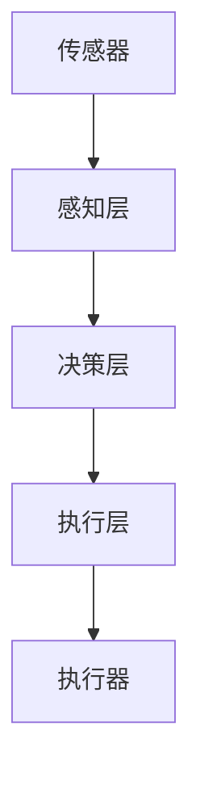
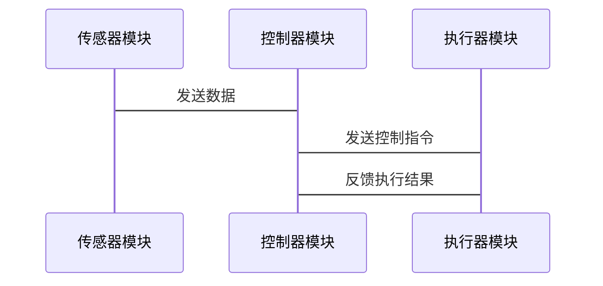

                 


# AI Agent在智能滑板中的平衡控制

## 关键词：
AI Agent, 智能滑板, 平衡控制, 传感器, 算法, 系统设计

## 摘要：
本文探讨了AI Agent在智能滑板平衡控制中的应用，从理论基础到算法实现，再到系统设计和项目实战，全面解析如何利用AI技术实现滑板的稳定平衡。文章详细介绍了PID控制、模糊控制和强化学习等算法，并通过Mermaid图表和Python代码示例，展示了系统的架构设计和实现过程。最后，结合实际案例，总结了当前技术的优缺点，并展望了未来的研究方向。

---

# 第一部分: AI Agent与智能滑板平衡控制基础

## 第1章: AI Agent与智能滑板概述

### 1.1 智能滑板的背景与应用
#### 1.1.1 滑板运动的物理机制
滑板作为一种极限运动工具，其平衡控制依赖于人体对重心的调整。在智能滑板中，AI Agent通过传感器数据实时调整滑板的姿态，确保其在运动中的稳定性。

#### 1.1.2 智能滑板的核心概念
智能滑板通过集成多种传感器（如加速度计、陀螺仪）和执行器（如电机、伺服机构），利用AI算法实现自主平衡和运动控制。

#### 1.1.3 AI Agent在滑板控制中的作用
AI Agent作为智能滑板的核心控制单元，负责处理传感器数据，执行决策并驱动执行器，从而实现滑板的动态平衡。

### 1.2 AI Agent的基本概念
#### 1.2.1 什么是AI Agent
AI Agent是一种能够感知环境并采取行动以实现目标的智能体。在智能滑板中，AI Agent通过传感器数据做出决策，调整滑板的姿态。

#### 1.2.2 AI Agent的分类与特点
AI Agent可以分为简单反射型、基于模型的反应型、目标驱动型和效用驱动型。在滑板控制中，通常使用基于模型的反应型AI Agent。

#### 1.2.3 AI Agent在智能滑板中的应用前景
随着AI技术的进步，智能滑板的平衡控制将更加智能化和高效，为极限运动爱好者提供更安全和便捷的体验。

## 第2章: 智能滑板平衡控制的核心概念

### 2.1 平衡控制的物理模型
#### 2.1.1 滑板的运动方程
滑板的平衡控制可以通过牛顿第二定律和刚体动力学方程来描述。滑板的姿态角θ、角速度ω和加速度α是关键变量。

#### 2.1.2 滑板的动态平衡条件
动态平衡条件涉及重力、惯性力和控制力的矢量和为零。公式表示为：
$$ \sum F = ma $$

#### 2.1.3 滑板平衡的数学模型
建立滑板的数学模型，包括状态变量（姿态角、角速度）和控制变量（电机转速）。

### 2.2 AI Agent的决策机制
#### 2.2.1 基于状态的决策模型
AI Agent根据当前状态（如姿态角、加速度）选择最优控制动作。

#### 2.2.2 基于反馈的控制策略
PID控制是一种常用的反馈控制策略，通过比例、积分和微分三个环节调整输出。

#### 2.2.3 多目标优化的平衡控制
在复杂环境中，AI Agent需要同时优化多个目标，如平衡稳定性和能耗效率。

### 2.3 传感器与执行器的协同工作
#### 2.3.1 传感器的作用与类型
加速度计、陀螺仪和倾角传感器用于采集滑板的姿态和运动数据。

#### 2.3.2 执行器的控制方式
电机和伺服机构通过PWM信号控制转速，实现姿态调整。

#### 2.3.3 传感器与执行器的协同优化
通过优化传感器采样频率和控制算法，提升系统的响应速度和控制精度。

---

# 第二部分: 智能滑板平衡控制的算法原理

## 第3章: 智能滑板平衡控制的算法原理

### 3.1 PID控制算法
#### 3.1.1 PID控制的基本原理
PID控制器由比例、积分和微分三个环节组成，公式为：
$$ u(t) = K_p e(t) + K_i \int e(t) dt + K_d \frac{de(t)}{dt} $$
其中，$e(t)$是误差，$K_p$、$K_i$、$K_d$是比例、积分和微分系数。

#### 3.1.2 PID参数的调整方法
通过试凑法调整PID参数，确保系统的稳定性和平滑性。

#### 3.1.3 PID在滑板平衡控制中的应用
PID控制器用于调整滑板的倾斜角度，确保其在运动中的动态平衡。

### 3.2 模糊控制算法
#### 3.2.1 模糊逻辑的基本概念
模糊控制将连续的输入变量转化为语言变量，并通过模糊规则进行推理。

#### 3.2.2 模糊控制在滑板平衡中的应用
模糊控制适合处理非线性和不确定性问题，适用于复杂的平衡控制场景。

#### 3.2.3 模糊控制算法的实现步骤
1. 模糊化处理输入变量。
2. 应用模糊规则生成控制量。
3. 解模糊化得到具体控制指令。

### 3.3 强化学习算法
#### 3.3.1 强化学习的基本原理
强化学习通过智能体与环境的交互，学习最优策略，公式为：
$$ Q(s, a) = r + \gamma \max Q(s', a') $$
其中，$s$是状态，$a$是动作，$r$是奖励，$\gamma$是折扣因子。

#### 3.3.2 DQN算法在滑板平衡控制中的应用
深度Q网络（DQN）通过神经网络近似Q值函数，实现滑板的自主学习和控制。

#### 3.3.3 强化学习算法的训练过程
通过模拟环境训练AI Agent，使其在虚拟环境中学习最优策略，再部署到实际滑板中。

---

# 第三部分: 智能滑板平衡控制的系统设计与实现

## 第4章: 智能滑板平衡控制的系统分析与架构设计

### 4.1 系统功能设计
#### 4.1.1 滑板平衡控制的系统架构
系统包括传感器模块、AI Agent控制器和执行器模块。

#### 4.1.2 系统功能模块划分
1. 传感器模块：采集姿态和运动数据。
2. 控制器模块：处理数据并生成控制指令。
3. 执行器模块：驱动滑板调整姿态。

#### 4.1.3 系统功能的实现流程
1. 传感器采集数据。
2. AI Agent处理数据并决策。
3. 执行器执行控制指令。

### 4.2 系统架构设计
#### 4.2.1 系统架构的组成
使用分层架构，分为感知层、决策层和执行层。

#### 4.2.2 系统架构的mermaid图


#### 4.2.3 系统接口设计
传感器接口（I2C或SPI）、电机驱动接口（PWM）和通信接口（蓝牙/WiFi）。

#### 4.2.4 系统交互的mermaid序列图


---

## 第5章: 智能滑板平衡控制的项目实战

### 5.1 环境配置
#### 5.1.1 硬件配置
- 加速度计和陀螺仪（ MPU6050）
- 电机驱动模块（L298N）
- 微控制器（Arduino或Raspberry Pi）

#### 5.1.2 软件配置
- 开发环境：Arduino IDE或Pyhton（使用Raspberry Pi）
- 库函数：I2C库、PWM库

### 5.2 系统核心实现源代码
#### 5.2.1 PID控制的Python实现
```python
class PIDController:
    def __init__(self, Kp, Ki, Kd):
        self.Kp = Kp
        self.Ki = Ki
        self.Kd = Kd
        self.error_sum = 0
        self.last_error = 0

    def compute(self, target, current):
        error = target - current
        self.error_sum += error
        derror = error - self.last_error
        output = self.Kp * error + self.Ki * self.error_sum + self.Kd * derror
        return output
```

#### 5.2.2 模糊控制的Arduino实现
```cpp
#include <AFMotor.h>

void setup() {
    // 初始化传感器和执行器
}

void loop() {
    // 读取传感器数据
    int angle = get_angle();
    // 模糊推理
    int control = fuzzy_control(angle);
    // 驱动电机
    motor_control(control);
}
```

### 5.3 测试与优化
#### 5.3.1 系统测试
测试PID控制的稳定性、模糊控制的适应性和强化学习的自适应能力。

#### 5.3.2 参数优化
调整PID参数、模糊规则和强化学习的奖励机制，提升系统性能。

### 5.4 实际案例分析
通过实际测试数据，分析不同算法在不同场景下的表现，找出最优控制策略。

### 5.5 项目小结
总结项目实现过程中的经验和教训，提出改进建议。

---

## 第6章: 总结与展望

### 6.1 最佳实践 tips
- 确保传感器的准确性和稳定性。
- 合理选择算法，根据实际需求调整参数。
- 重视系统的鲁棒性和容错设计。

### 6.2 小结
本文详细介绍了AI Agent在智能滑板平衡控制中的应用，从理论到实践，全面解析了系统的实现过程。

### 6.3 注意事项
- 系统的实时性和响应速度直接影响控制效果。
- 安全性问题需高度重视，确保系统在极端情况下的稳定运行。

### 6.4 拓展阅读
推荐相关领域的书籍和论文，鼓励读者深入研究AI在机器人控制中的应用。

---

通过以上目录结构，文章将系统地讲解AI Agent在智能滑板平衡控制中的各个方面，从基础理论到实际应用，帮助读者全面理解和掌握这一技术。

