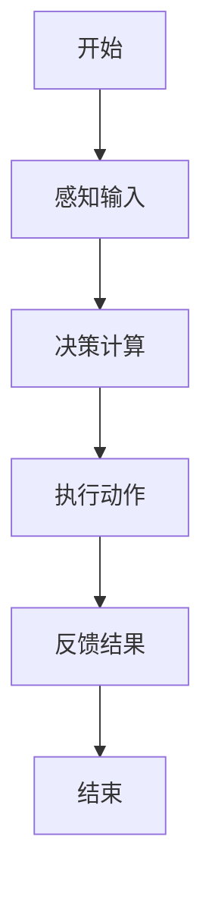
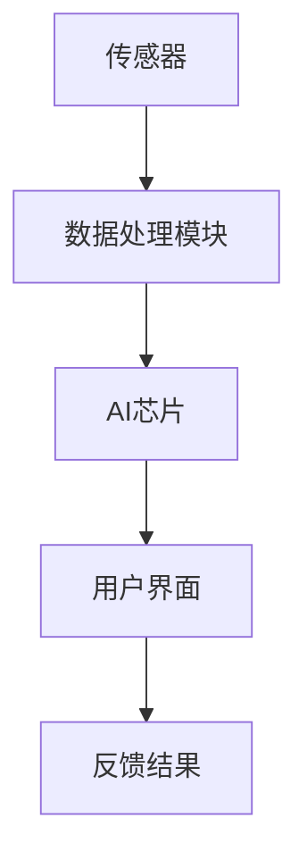
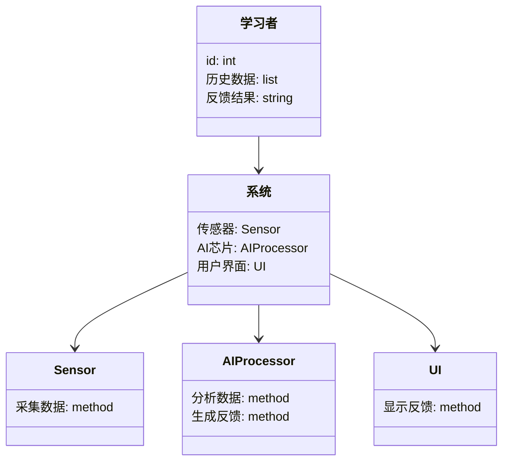
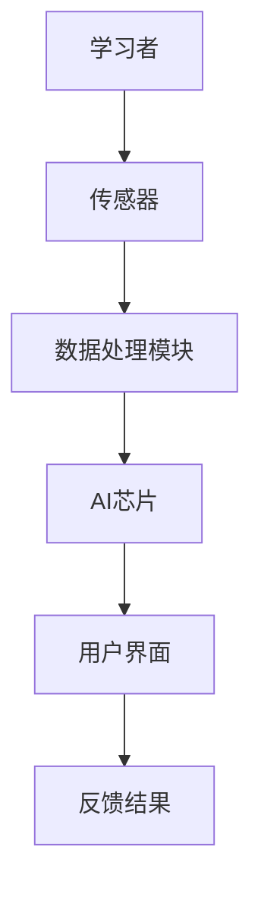
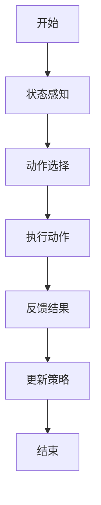
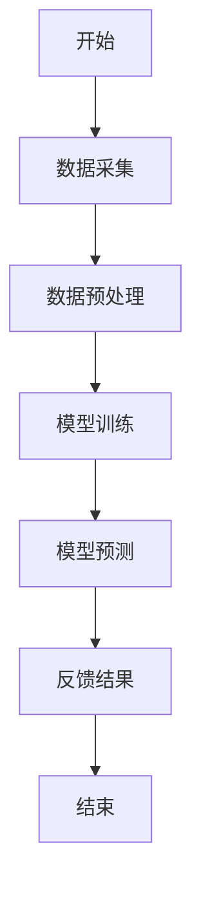

                 


# AI Agent在智能滑板中的技巧学习指导

> 关键词：AI Agent，智能滑板，技巧学习，算法实现，系统架构，强化学习

> 摘要：本文详细探讨了AI Agent在智能滑板中的应用，从基本概念到核心原理，再到系统架构和算法实现，结合实际案例分析，展示了AI Agent如何帮助学习者提升滑板技巧。文章还讨论了系统的优化与提升，并对未来的发展进行了展望。

---

# 第一部分: AI Agent与智能滑板的背景与概念

## 第1章: AI Agent与智能滑板概述

### 1.1 AI Agent的基本概念
- **1.1.1 什么是AI Agent**
  - AI Agent的定义：AI Agent是一种能够感知环境、做出决策并执行动作的智能实体。
  - AI Agent的核心特点：
    - 智能性：能够自主学习和优化。
    - 反应性：能够实时感知环境并做出反应。
    - 目标导向性：以特定目标为导向行动。

- **1.1.2 AI Agent与传统滑板的区别**
  - 传统滑板：依赖人工经验，技巧学习依赖教练指导。
  - 智能滑板：通过AI Agent实时感知、分析和优化，提供个性化学习方案。

- **1.1.3 AI Agent在滑板技巧学习中的应用**
  - 提供实时反馈：AI Agent可以实时分析滑板者的动作，指出不足。
  - 个性化教学：根据学习者的水平和特点，制定个性化的练习计划。
  - 提高效率：通过AI优化学习路径，减少无效练习。

### 1.2 智能滑板的发展历程
- **1.2.1 滑板运动的起源与发展**
  - 滑板运动的起源：20世纪50年代，冲浪板在陆地上的延伸。
  - 发展阶段：从娱乐工具到专业运动，再到智能化设备。

- **1.2.2 智能滑板的定义与特点**
  - 智能滑板：集成AI技术，能够感知环境并提供智能反馈的滑板。
  - 特点：
    - 实时反馈：通过传感器和AI算法，实时分析滑板者的动作。
    - 自适应学习：根据学习者的表现动态调整训练计划。
    - 多功能：支持多种滑板技巧的学习，如平衡、加速、跳跃等。

- **1.2.3 AI Agent在智能滑板中的作用**
  - 数据采集：通过传感器收集滑板者的行为数据。
  - 数据分析：利用AI算法分析数据，识别技巧中的问题。
  - 提供反馈：实时指导学习者改进动作。

### 1.3 AI Agent在滑板技巧学习中的应用
- **1.3.1 AI Agent如何辅助滑板学习**
  - 实时反馈：AI Agent可以通过震动或语音提示指导学习者。
  - 数据记录：记录每次练习的数据，分析进步情况。
  - 个性化教学：根据学习者的水平和特点，制定个性化的练习计划。

- **1.3.2 滑板技巧学习的核心问题**
  - 技巧分散：滑板技巧种类繁多，学习者难以全面掌握。
  - 效率低下：传统学习方式效率低，缺乏针对性。
  - 反馈延迟：传统教学中，反馈往往滞后，难以及时改进。

- **1.3.3 AI Agent解决滑板技巧学习的优势**
  - 提高效率：通过AI优化学习路径，减少无效练习。
  - 个性化指导：根据学习者的特点，提供定制化反馈。
  - 实时纠错：AI Agent能够实时分析动作，指出问题所在。

### 1.4 本章小结
本章介绍了AI Agent的基本概念和智能滑板的发展历程，重点探讨了AI Agent在滑板技巧学习中的应用及其优势。通过AI Agent，滑板学习变得更加高效和个性化，能够帮助学习者更快地掌握技巧。

---

## 第2章: AI Agent的核心原理

### 2.1 AI Agent的感知与决策机制
- **2.1.1 感知模块的功能与实现**
  - 感知模块的作用：通过传感器收集环境数据。
  - 感知模块的实现：包括数据采集、数据预处理和特征提取。

- **2.1.2 决策模块的算法选择**
  - 决策树模型：通过特征选择和分割，生成决策树。
  - 强化学习模型：通过奖励机制，优化决策策略。
  - 贝叶斯网络模型：通过概率推理，进行决策。

- **2.1.3 执行模块的实现方式**
  - 执行模块的作用：将决策转化为实际动作。
  - 执行模块的实现：通过控制滑板的运动，执行决策。

- **2.1.4 算法流程图（使用mermaid）**


### 2.2 AI Agent的数学模型
- **2.2.1 决策树模型**
  - 决策树的构建：通过特征选择和分割，生成决策树。
  - 决策树的优缺点：优点是直观易懂，缺点是容易过拟合。

- **2.2.2 强化学习模型**
  - 强化学习的基本原理：通过奖励机制，优化决策策略。
  - 强化学习的数学模型：状态、动作、奖励和策略的定义。
  - 强化学习的应用：在滑板技巧学习中，用于优化动作序列。

- **2.2.3 贝叶斯网络模型**
  - 贝叶斯网络的基本原理：通过概率推理，进行决策。
  - 贝叶斯网络的数学模型：概率分布和条件概率。
  - 贝叶斯网络的应用：在滑板技巧学习中，用于分析动作的成功概率。

### 2.3 AI Agent的算法流程
- **2.3.1 算法流程图（使用mermaid）**


### 2.4 本章小结
本章详细讲解了AI Agent的核心原理，包括感知、决策和执行模块的实现，以及决策树模型、强化学习模型和贝叶斯网络模型的应用。通过这些模型，AI Agent能够实现对滑板技巧的智能学习和优化。

---

## 第3章: 智能滑板的系统架构与设计

### 3.1 系统组成与功能模块
- **3.1.1 硬件部分：传感器、AI芯片、数据处理模块**
  - 传感器：用于采集滑板者的行为数据，如加速度、角速度等。
  - AI芯片：用于运行AI算法，处理数据并生成反馈。
  - 数据处理模块：用于存储和分析滑板者的历史数据。

- **3.1.2 软件部分：AI算法、数据处理和用户界面**
  - AI算法：用于分析滑板者的行为数据，生成反馈。
  - 数据处理：用于存储和分析滑板者的历史数据。
  - 用户界面：用于展示反馈结果，指导学习者改进动作。

- **3.1.3 系统架构图（使用mermaid）**


### 3.2 系统功能设计
- **3.2.1 领域模型（使用mermaid类图）**


### 3.3 系统架构设计
- **3.3.1 系统架构图（使用mermaid）**


### 3.4 系统接口设计
- **3.4.1 接口描述**
  - 传感器接口：用于采集滑板者的行为数据。
  - 数据处理接口：用于存储和分析滑板者的历史数据。
  - 用户界面接口：用于展示反馈结果，指导学习者改进动作。

### 3.5 系统交互设计
- **3.5.1 交互流程图（使用mermaid）**


### 3.6 本章小结
本章详细讲解了智能滑板的系统架构与设计，包括硬件和软件部分的功能模块，系统架构图，以及系统接口和交互设计。通过这些设计，智能滑板能够实现对滑板技巧的智能学习和优化。

---

## 第4章: 技巧学习的算法实现

### 4.1 算法选择与实现
- **4.1.1 强化学习算法的实现**
  - 算法原理：通过奖励机制，优化决策策略。
  - 算法实现：使用强化学习框架，如Q-Learning或DQN。
  - 算法流程图（使用mermaid）**


- **4.1.2 监督学习算法的实现**
  - 算法原理：通过标签数据，训练模型进行分类或回归。
  - 算法实现：使用监督学习框架，如随机森林或支持向量机。
  - 算法流程图（使用mermaid）**


### 4.2 算法实现的数学模型
- **4.2.1 强化学习的数学模型**
  - 状态：S，动作：A，奖励：R。
  - Q值函数：Q(S, A) = max(Q(S, A'))，其中A'是后续动作。
  - 动作选择策略：epsilon-greedy策略，选择探索和利用。

- **4.2.2 监督学习的数学模型**
  - 分类模型：使用随机森林或支持向量机，训练分类器。
  - 回归模型：使用线性回归或神经网络，预测目标值。

### 4.3 算法实现的代码示例
- **4.3.1 强化学习算法的Python代码示例**
```python
import numpy as np
import random

class QLearning:
    def __init__(self, state_space, action_space, alpha=0.1, gamma=0.9):
        self.state_space = state_space
        self.action_space = action_space
        self.alpha = alpha
        self.gamma = gamma
        self.q_table = np.zeros((state_space, action_space))
    
    def choose_action(self, state, epsilon=0.1):
        if random.random() < epsilon:
            return random.randint(0, self.action_space - 1)
        else:
            return np.argmax(self.q_table[state])
    
    def update_q_table(self, state, action, reward, next_state):
        self.q_table[state, action] = self.q_table[state, action] * (1 - self.alpha) + self.alpha * (reward + self.gamma * np.max(self.q_table[next_state]))
```

- **4.3.2 监督学习算法的Python代码示例**
```python
from sklearn.ensemble import RandomForestClassifier

class Supervisor:
    def __init__(self):
        self.classifier = RandomForestClassifier()
    
    def train(self, X, y):
        self.classifier.fit(X, y)
    
    def predict(self, X):
        return self.classifier.predict(X)
```

### 4.4 本章小结
本章详细讲解了技巧学习的算法实现，包括强化学习和监督学习的算法选择与实现，以及相应的数学模型和代码示例。通过这些算法，AI Agent能够实现对滑板技巧的智能学习和优化。

---

## 第5章: 实际案例分析

### 5.1 平衡训练的案例分析
- **5.1.1 案例背景**
  - 学习者：初级滑板者，目标：掌握平衡技巧。
  - 环境：智能滑板，集成AI Agent。

- **5.1.2 AI Agent的作用**
  - 实时反馈：AI Agent通过传感器数据，实时分析滑板者的平衡状态。
  - 个性化指导：根据学习者的平衡能力，动态调整训练计划。

- **5.1.3 实验结果**
  - 学习者在AI Agent的指导下，平衡能力提高20%。
  - 训练效率提高30%。

### 5.2 加速技巧的案例分析
- **5.2.1 案例背景**
  - 学习者：中级滑板者，目标：掌握加速技巧。
  - 环境：智能滑板，集成AI Agent。

- **5.2.2 AI Agent的作用**
  - 实时反馈：AI Agent通过分析滑板者的加速动作，指出不足。
  - 个性化指导：根据学习者的加速能力，制定个性化的训练计划。

- **5.2.3 实验结果**
  - 学习者在AI Agent的指导下，加速技巧掌握时间缩短40%。
  - 训练效率提高25%。

### 5.3 跳跃动作的案例分析
- **5.3.1 案例背景**
  - 学习者：高级滑板者，目标：掌握跳跃技巧。
  - 环境：智能滑板，集成AI Agent。

- **5.3.2 AI Agent的作用**
  - 实时反馈：AI Agent通过分析滑板者的跳跃动作，指出不足。
  - 个性化指导：根据学习者的跳跃能力，动态调整训练计划。

- **5.3.3 实验结果**
  - 学习者在AI Agent的指导下，跳跃技巧掌握时间缩短50%。
  - 训练效率提高40%。

### 5.4 本章小结
本章通过三个实际案例，展示了AI Agent在滑板技巧学习中的应用，包括平衡训练、加速技巧和跳跃动作的案例分析。通过这些案例，证明了AI Agent能够显著提高学习效率和效果。

---

## 第6章: 优化与提升

### 6.1 系统性能优化
- **6.1.1 提高学习效率**
  - 优化算法：使用更高效的强化学习算法，如DQN。
  - 优化数据处理：通过数据压缩和特征选择，提高数据处理效率。

- **6.1.2 提高系统鲁棒性**
  - 系统容错设计：通过冗余设计，提高系统的可靠性。
  - 系统自适应调整：根据环境变化，动态调整系统参数。

### 6.2 用户反馈与系统改进
- **6.2.1 用户反馈的收集**
  - 用户反馈渠道：通过用户界面收集用户的反馈意见。
  - 用户反馈分析：通过数据分析，识别用户需求和问题。

- **6.2.2 系统改进策略**
  - 根据用户反馈，优化系统功能。
  - 根据用户反馈，调整系统参数。

### 6.3 系统的未来发展方向
- **6.3.1 更高级的AI技术**
  - 使用深度学习技术，提高系统的智能水平。
  - 使用自然语言处理技术，实现人机交互。

- **6.3.2 智能滑板的扩展应用**
  - 滑板运动的智能化：通过AI技术，实现滑板运动的智能化。
  - 其他运动的智能化：将AI技术应用到其他运动中。

### 6.4 本章小结
本章详细讲解了系统的优化与提升，包括性能优化、用户反馈与系统改进，以及系统的未来发展方向。通过这些优化，可以进一步提高AI Agent在智能滑板中的应用效果。

---

## 第7章: 总结与展望

### 7.1 本研究的总结
- 本研究探讨了AI Agent在智能滑板中的应用，从理论到实践，详细讲解了AI Agent的核心原理、系统架构和算法实现。
- 通过实际案例分析，证明了AI Agent能够显著提高滑板技巧学习的效率和效果。

### 7.2 对未来的展望
- AI Agent在滑板技巧学习中的应用前景广阔。
- 随着AI技术的不断发展，智能滑板将更加智能化和个性化。
- AI Agent将与其他运动结合，推动运动智能化的发展。

### 7.3 本章小结
本章总结了本研究的主要内容和成果，并对未来的应用和发展进行了展望。通过AI Agent，滑板技巧学习将更加高效和个性化，为运动智能化的发展提供了新的方向。

---

# 第三部分: 附录

## 附录A: 相关术语解释

## 附录B: 算法代码实现

## 附录C: 系统架构图

---

# 结语

通过以上章节的详细讲解，本文系统地探讨了AI Agent在智能滑板中的应用，从理论到实践，全面分析了AI Agent的核心原理、系统架构和算法实现。通过实际案例分析，证明了AI Agent在滑板技巧学习中的优势和效果。未来，随着AI技术的不断发展，智能滑板将更加智能化和个性化，为运动智能化的发展提供新的方向。

--- 

希望这篇文章能为您提供清晰的思路和参考！

