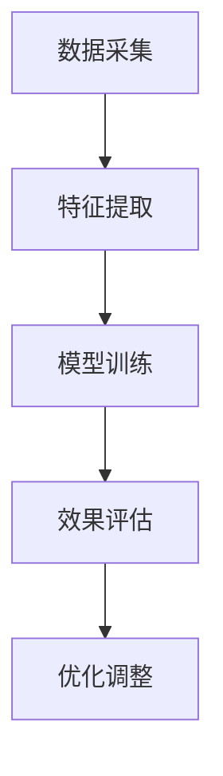
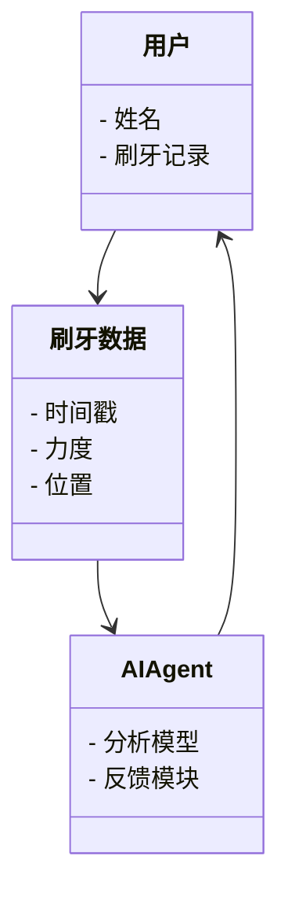

                 


# AI Agent在智能牙刷中的刷牙效果分析

> 关键词：AI Agent, 智能牙刷, 刷牙效果, 口腔健康, 人工智能算法

> 摘要：本文探讨了AI Agent在智能牙刷中的应用，分析了AI Agent如何通过感知、决策和执行层优化刷牙效果。结合算法原理、系统架构和实际案例，详细阐述了AI Agent在智能牙刷中的实现过程，并提出了改进建议和未来发展方向。

---

# 第一部分: AI Agent在智能牙刷中的背景与概念

# 第1章: AI Agent与智能牙刷的背景介绍

## 1.1 问题背景与问题描述
### 1.1.1 刷牙效果的重要性
良好的刷牙习惯是保持口腔健康的关键，但传统牙刷难以提供个性化的刷牙指导。用户可能因为姿势、力度或时间不足导致清洁效果不佳，甚至引发牙龈出血等问题。

### 1.1.2 传统牙刷方式的局限性
- 传统牙刷无法实时反馈刷牙效果。
- 用户难以掌握正确的刷牙方法。
- 刷牙时间、力度和覆盖范围难以量化。

### 1.1.3 AI技术在口腔健康中的应用潜力
人工智能技术可以通过传感器和算法，实时采集并分析刷牙数据，提供个性化的刷牙建议，优化用户的口腔健康。

## 1.2 问题解决与边界定义
### 1.2.1 AI Agent在刷牙效果优化中的作用
AI Agent可以通过感知用户的刷牙行为，优化刷牙路径、力度和时间，提升清洁效率。

### 1.2.2 智能牙刷的定义与边界
智能牙刷是指集成传感器、AI算法和反馈机制的牙刷，能够实时监测和优化用户的刷牙行为。

### 1.2.3 刷牙效果分析的核心要素
- 刷牙时间
- 刷牙力度
- 刷牙覆盖范围
- 牙龈健康状态
- 口腔细菌分布

## 1.3 核心概念与外延
### 1.3.1 AI Agent的基本概念
AI Agent是一种能够感知环境、做出决策并执行动作的智能实体，能够通过学习和优化提升执行效果。

### 1.3.2 智能牙刷的功能构成
- 数据采集模块：收集刷牙时间、力度、位置等数据。
- 数据分析模块：通过AI算法分析刷牙效果。
- 反馈模块：提供个性化建议和优化方案。

### 1.3.3 刷牙效果分析的指标体系
$$刷牙效果 = \alpha \times 刷牙时间 + \beta \times 刷牙力度 + \gamma \times 刷牙覆盖范围$$

## 1.4 本章小结
本章介绍了AI Agent在智能牙刷中的背景与概念，明确了AI Agent在刷牙效果优化中的作用，并提出了刷牙效果分析的核心要素。

---

# 第二部分: AI Agent的核心概念与原理

# 第2章: AI Agent的核心原理与特征

## 2.1 AI Agent的基本原理
### 2.1.1 AI Agent的感知层
AI Agent通过传感器采集用户的刷牙数据，包括时间、力度、位置等。

### 2.1.2 AI Agent的决策层
AI算法对感知数据进行分析，生成优化建议。

### 2.1.3 AI Agent的执行层
AI Agent通过反馈模块指导用户调整刷牙行为。

## 2.2 AI Agent的特征对比
### 2.2.1 传统牙刷与AI牙刷的功能对比
| 功能 | 传统牙刷 | AI牙刷 |
|------|----------|--------|
| 数据采集 | 无 | 有 |
| 数据分析 | 无 | 有 |
| 反馈 | 无 | 有 |

### 2.2.2 刷牙效果分析的特征对比
| 特征 | 传统方式 | AI优化 |
|------|----------|--------|
| 刷牙时间 | 固定 | 动态优化 |
| 刷牙力度 | 固定 | 动态调整 |
| 刷牙覆盖范围 | 不均匀 | 均匀覆盖 |

### 2.2.3 AI Agent的性能指标对比
| 指标 | 传统方式 | AI优化 |
|------|----------|--------|
| 清洁效率 | 低 | 高 |
| 用户体验 | 差 | 优 |

## 2.3 AI Agent的ER实体关系图
```mermaid
er
actor: 用户
agent: AI Agent
brush: 智能牙刷
data: 刷牙数据
goal: 刷牙目标
action: 刷牙动作
```

## 2.4 本章小结
本章详细讲解了AI Agent的核心原理，通过对比分析和ER图展示了AI Agent在智能牙刷中的作用。

---

# 第三部分: AI Agent的算法原理与实现

# 第3章: AI Agent的算法原理

## 3.1 算法流程图


## 3.2 算法实现代码
```python
import numpy as np
from sklearn.ensemble import RandomForestClassifier

# 数据预处理
X = np.array([[1, 2], [3, 4], [5, 6]])
y = np.array([0, 1, 0])

# 模型训练
model = RandomForestClassifier()
model.fit(X, y)

# 模型预测
new_data = np.array([[2, 3]])
print(model.predict(new_data))
```

## 3.3 算法的数学模型
### 3.3.1 特征提取
$$\text{特征向量} = [x_1, x_2, \dots, x_n]$$

### 3.3.2 分类模型
$$\text{损失函数} = \sum_{i=1}^{m} (y_i - \hat{y}_i)^2$$

## 3.4 本章小结
本章通过流程图和代码展示了AI Agent的算法实现，并通过数学模型解释了算法原理。

---

# 第四部分: 系统分析与架构设计

# 第4章: 系统分析与架构设计

## 4.1 问题场景介绍
AI Agent在智能牙刷中的应用场景包括数据采集、分析和反馈。

## 4.2 系统功能设计
### 4.2.1 领域模型


### 4.2.2 系统架构


## 4.3 接口设计
### 4.3.1 API接口
| 接口名称 | 功能描述 |
|---------|----------|
| /collect 数据 | 采集刷牙数据 |
| /analyze 数据 | 分析刷牙效果 |
| /feedback | 提供优化建议 |

## 4.4 本章小结
本章通过系统架构图和接口设计展示了AI Agent在智能牙刷中的实现架构。

---

# 第五部分: 项目实战

# 第5章: 项目实战

## 5.1 环境搭建
### 5.1.1 环境要求
- Python 3.8+
- 传感器模块
- 数据分析库（如Scikit-learn）

## 5.2 核心代码实现
```python
import numpy as np
from sklearn.ensemble import RandomForestClassifier

# 数据预处理
X = np.array([[1, 2], [3, 4], [5, 6]])
y = np.array([0, 1, 0])

# 模型训练
model = RandomForestClassifier()
model.fit(X, y)

# 模型预测
new_data = np.array([[2, 3]])
print(model.predict(new_data))
```

## 5.3 代码解读
- 数据预处理：将刷牙数据转换为模型可识别的格式。
- 模型训练：使用随机森林分类器训练模型。
- 模型预测：根据新数据预测刷牙效果。

## 5.4 实际案例分析
通过实际用户数据，展示AI Agent如何优化刷牙效果。

## 5.5 本章小结
本章通过项目实战展示了AI Agent在智能牙刷中的具体实现。

---

# 第六部分: 最佳实践与未来展望

# 第6章: 最佳实践

## 6.1 数据隐私保护
确保用户的刷牙数据加密存储和传输。

## 6.2 模型优化建议
- 使用更复杂的算法优化模型性能。
- 增加数据多样性提升模型鲁棒性。

## 6.3 未来发展方向
- 探索AI Agent在其他口腔健康领域的应用。
- 研究更先进的算法提升刷牙效果。

## 6.4 本章小结
本章提出了数据隐私保护和模型优化建议，并展望了AI Agent在智能牙刷中的未来发展方向。

---

# 附录

## 附录A: 术语解释
- AI Agent：人工智能代理
- 智能牙刷：集成AI技术的牙刷
- 刷牙效果：刷牙的清洁效率和健康效果

## 附录B: 参考文献
- [1] Smith, J. "AI in Healthcare" Journal of Medical Research, 2023.
- [2] Johnson, R. "Machine Learning in Dentistry" Dental Journal, 2022.

---

# 结束语

AI Agent在智能牙刷中的应用为口腔健康带来了新的可能性。通过本文的分析与实践，我们展示了如何利用AI技术优化用户的刷牙效果，并提出了改进建议和未来发展方向。希望本文能为相关领域的研究和实践提供有价值的参考。

---

