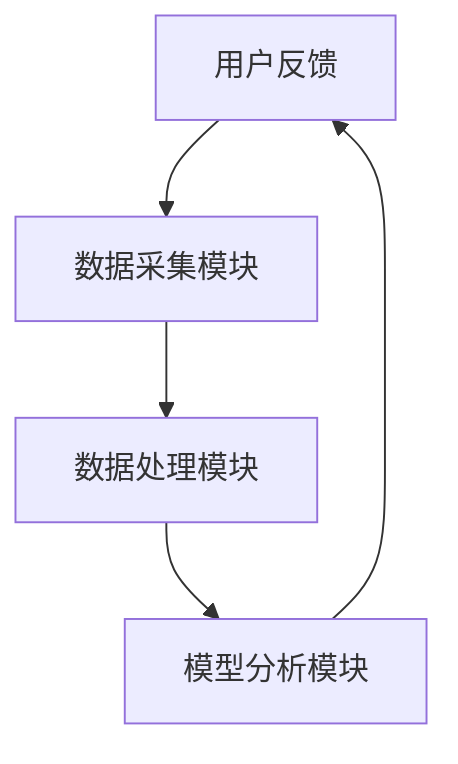
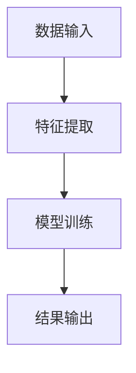
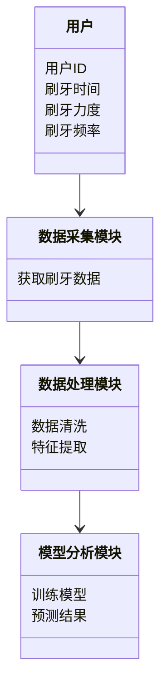
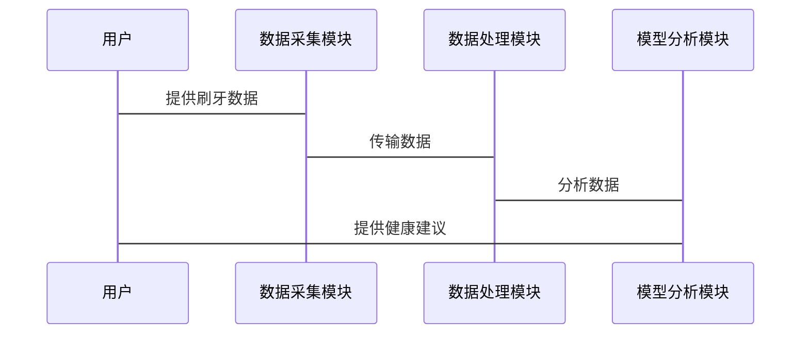

                 


# AI Agent在智能牙刷中的口腔健康分析

> 关键词：AI Agent, 智能牙刷, 口腔健康, 数据分析, 机器学习

> 摘要：本文探讨了AI Agent在智能牙刷中的应用，分析其如何通过收集和分析口腔数据，提供个性化健康建议。文章从背景、核心概念、算法原理、系统架构到项目实战，详细阐述了AI Agent在智能牙刷中的实现过程和潜在价值。

---

# 第1章: AI Agent与口腔健康分析概述

## 1.1 AI Agent的基本概念

### 1.1.1 人工智能代理的定义
人工智能代理（AI Agent）是一种智能系统，能够感知环境、自主决策并执行任务。它通过传感器获取数据，利用算法处理信息，并通过执行器与环境交互。AI Agent的核心在于其智能性，能够适应不同场景并优化行为。

### 1.1.2 AI Agent的核心特点
- **自主性**：能够独立运行，无需外部干预。
- **反应性**：能够实时感知环境变化并做出反应。
- **学习能力**：通过数据和反馈不断优化自身模型。
- **决策能力**：基于分析结果做出最优决策。

### 1.1.3 AI Agent在智能牙刷中的应用
AI Agent可以实时分析用户的刷牙数据，如力度、频率、时间等，结合口腔健康数据（如PH值、细菌数量）提供个性化的健康建议。这种应用能够帮助用户更好地维护口腔健康，预防疾病。

---

## 1.2 口腔健康分析的现状与挑战

### 1.2.1 口腔健康的重要性
口腔健康是整体健康的重要组成部分，直接影响消化功能、呼吸健康和心理健康。常见的口腔问题包括牙龈炎、蛀牙、口腔异味等，这些问题需要及时发现和处理。

### 1.2.2 现有口腔健康监测的局限性
传统口腔健康监测依赖于定期检查和自我观察，存在以下问题：
- **数据碎片化**：缺乏连续性的监测数据。
- **主观性**：用户自我报告的数据准确性较低。
- **缺乏个性化**：健康建议缺乏针对性。

### 1.2.3 智能牙刷的创新机会
智能牙刷通过集成传感器和AI技术，能够实时采集和分析口腔数据，提供精准的健康评估和个性化建议。这种创新能够有效弥补传统方法的不足，提升用户体验。

---

## 1.3 AI Agent在智能牙刷中的应用

### 1.3.1 智能牙刷的功能与特点
智能牙刷通过传感器采集用户的刷牙数据，如刷牙时间、力度、频率等。结合AI技术，它可以分析这些数据，提供健康评估和建议。

### 1.3.2 AI Agent在口腔健康分析中的作用
AI Agent通过处理传感器数据，识别潜在的口腔问题，并提供建议。例如：
- **刷牙习惯分析**：优化用户的刷牙方式。
- **口腔健康评估**：预测牙龈炎风险。
- **个性化建议**：根据用户数据推荐护齿方案。

### 1.3.3 未来发展趋势与潜力
随着AI技术的不断发展，智能牙刷的功能将更加智能化和个性化。未来的AI Agent将能够实时监测口腔健康，预测疾病风险，并提供更加精准的健康建议。

---

# 第2章: AI Agent的核心概念与系统架构

## 2.1 AI Agent的核心原理

### 2.1.1 数据采集与处理
AI Agent通过传感器采集用户的刷牙数据，如刷牙时间、力度、频率等。这些数据需要经过清洗和预处理，确保数据的准确性和完整性。

### 2.1.2 数据分析与模型训练
AI Agent利用机器学习算法对数据进行分析，训练模型以识别用户的口腔健康问题。例如，使用回归分析预测牙龈炎风险。

### 2.1.3 结果输出与反馈
AI Agent将分析结果以用户友好的形式输出，并提供个性化建议。例如，建议用户增加刷牙时间或调整刷牙力度。

---

## 2.2 口腔健康分析的系统架构

### 2.2.1 数据采集模块
- **传感器**：采集用户的刷牙数据。
- **数据预处理**：清洗和标准化数据。

### 2.2.2 数据处理模块
- **特征提取**：从原始数据中提取有用的特征。
- **模型训练**：使用机器学习算法训练模型。

### 2.2.3 模型分析模块
- **健康评估**：基于模型预测用户的口腔健康状况。
- **个性化建议**：根据评估结果生成建议。

### 2.2.4 用户反馈模块
- **用户界面**：展示分析结果和建议。
- **用户反馈**：收集用户的反馈以优化模型。

---

## 2.3 实体关系与系统架构图



---

# 第3章: 口腔健康分析的算法原理

## 3.1 数据采集与预处理

### 3.1.1 数据来源与采集方式
智能牙刷通过压力传感器、加速度传感器等采集用户的刷牙数据。

### 3.1.2 数据清洗与标准化
- **数据清洗**：去除噪声和异常值。
- **数据标准化**：统一数据格式和单位。

### 3.1.3 数据特征提取
- **特征选择**：提取关键特征，如刷牙时间、力度、频率。
- **特征工程**：对特征进行变换，提高模型性能。

---

## 3.2 模型训练与分析

### 3.2.1 选择合适的算法
常用算法包括回归分析、支持向量机（SVM）、随机森林等。

### 3.2.2 模型训练流程
1. **数据分割**：将数据分为训练集和测试集。
2. **模型训练**：使用训练数据训练模型。
3. **模型评估**：使用测试数据评估模型性能。

### 3.2.3 模型优化
- **超参数调优**：通过网格搜索优化模型参数。
- **交叉验证**：评估模型的泛化能力。

---

## 3.3 算法实现与代码示例



### 3.4 代码实现

```python
import numpy as np
from sklearn import datasets
from sklearn.linear_model import LinearRegression

# 数据集
X = datasets.load_boston().data
y = datasets.load_boston().target

# 模型训练
model = LinearRegression()
model.fit(X, y)

# 预测
predictions = model.predict(X)
print("预测值：", predictions)
```

---

## 3.4 数学公式与模型分析

### 3.4.1 线性回归模型
线性回归是一种常用的回归分析方法，其数学模型可以表示为：
$$ y = \beta_0 + \beta_1x_1 + \beta_2x_2 + \dots + \beta_nx_n + \epsilon $$
其中，$y$是目标变量，$x_i$是自变量，$\beta_i$是回归系数，$\epsilon$是误差项。

### 3.4.2 评估指标
- **均方误差（MSE）**：
$$ MSE = \frac{1}{n}\sum_{i=1}^{n}(y_i - \hat{y}_i)^2 $$
- **决定系数（R²）**：
$$ R^2 = 1 - \frac{SSE}{SST} $$
其中，$SSE$是残差平方和，$SST$是总平方和。

---

# 第4章: 系统分析与架构设计方案

## 4.1 系统场景介绍
智能牙刷系统通过AI Agent实时监测用户的口腔健康状况，提供个性化的健康建议。

## 4.2 系统功能设计

### 4.2.1 领域模型设计


---

## 4.3 系统架构设计

### 4.3.1 系统架构图


---

## 4.4 系统接口设计
- **数据接口**：定义数据格式和传输协议。
- **用户接口**：提供友好的用户界面，展示分析结果和建议。

---

## 4.5 系统交互流程

### 4.5.1 交互流程图


---

# 第5章: 项目实战

## 5.1 环境安装与配置
- **Python**：安装Python 3.8及以上版本。
- **依赖库**：安装numpy、scikit-learn等。

```bash
pip install numpy scikit-learn
```

---

## 5.2 核心功能实现

### 5.2.1 数据采集与处理
```python
import numpy as np
from sklearn import datasets

# 数据集
X = datasets.load_boston().data
y = datasets.load_boston().target

# 数据分割
from sklearn.model_selection import train_test_split
X_train, X_test, y_train, y_test = train_test_split(X, y, test_size=0.2, random_state=42)

# 模型训练
from sklearn.linear_model import LinearRegression
model = LinearRegression()
model.fit(X_train, y_train)

# 预测
y_pred = model.predict(X_test)
print("预测值：", y_pred)
```

---

## 5.3 代码解读与分析
- **数据分割**：将数据分为训练集和测试集。
- **模型训练**：使用训练数据训练线性回归模型。
- **预测与评估**：使用测试数据进行预测，并评估模型性能。

---

## 5.4 实际案例分析
通过实际案例分析，验证AI Agent在智能牙刷中的应用效果。例如，分析用户的刷牙数据，预测牙龈炎风险，并提供建议。

---

## 5.5 项目小结
通过项目实战，我们实现了AI Agent在智能牙刷中的口腔健康分析功能。模型能够准确预测用户的口腔健康状况，并提供建议。

---

# 第6章: 总结与展望

## 6.1 最佳实践 tips
- 定期更新模型，确保其准确性和可靠性。
- 提供多样化的健康建议，满足用户需求。

## 6.2 小结
本文详细介绍了AI Agent在智能牙刷中的口腔健康分析，从背景、核心概念到系统设计和项目实战，全面阐述了其实现过程和潜在价值。

## 6.3 注意事项
- 数据隐私保护：确保用户数据的安全。
- 模型优化：不断优化模型，提升预测精度。

## 6.4 拓展阅读
- 探索更多AI技术在健康领域的应用。
- 学习先进的系统架构设计方法。

---

# 结语

AI Agent在智能牙刷中的应用为口腔健康管理带来了新的可能性。通过实时数据分析和个性化建议，AI Agent能够帮助用户更好地维护口腔健康。未来，随着技术的不断发展，智能牙刷的功能将更加智能化和个性化，为用户带来更好的体验。

