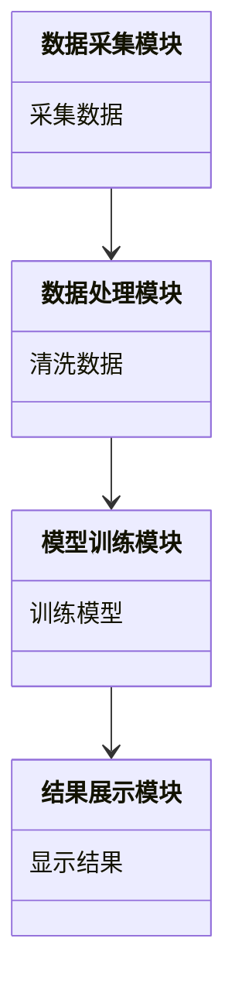
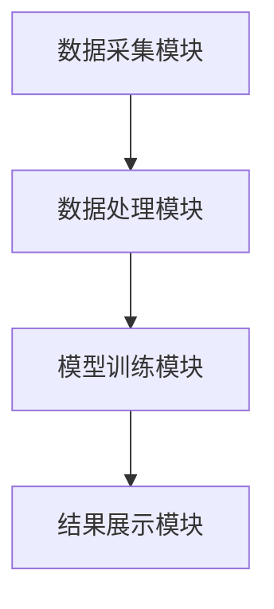
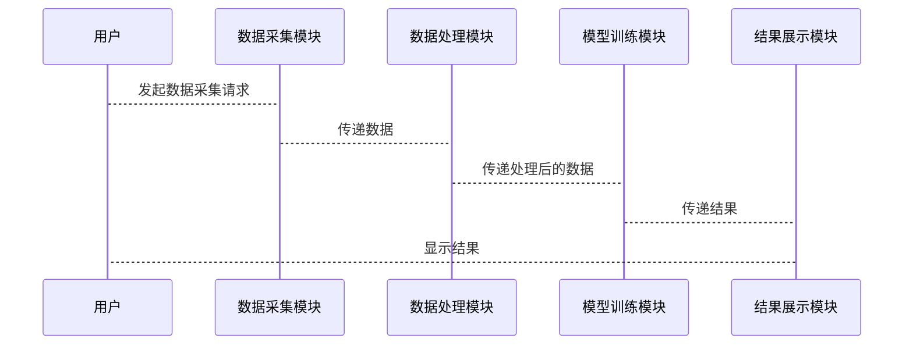

                 


# AI Agent在智能牙线中的口腔健康追踪

> 关键词：AI Agent, 智能牙线, 口腔健康, 数据分析, 机器学习, 传感器技术

> 摘要：本文探讨了AI Agent在智能牙线中的应用，详细分析了其在口腔健康监测中的核心原理、传感器技术、数据分析方法及系统架构设计。通过实际案例和项目实战，展示了如何利用AI技术提升口腔健康监测的精准性和便捷性。

---

## 第1章 AI Agent与智能牙线的基本概念

### 1.1 AI Agent的基本概念
AI Agent（人工智能代理）是指能够感知环境、自主决策并执行任务的智能实体。在智能牙线中，AI Agent主要用于实时监测口腔健康状况，提供个性化的健康建议。

#### 1.1.1 AI Agent的定义与特点
- **定义**：AI Agent是具有感知、推理、学习和执行能力的智能系统。
- **特点**：自主性、反应性、目标导向、社会能力。

#### 1.1.2 AI Agent的核心功能与作用
- **核心功能**：感知环境、分析数据、制定决策、执行操作。
- **作用**：提高监测精度，提供个性化建议，实现智能化管理。

#### 1.1.3 智能牙线的定义与工作原理
- **定义**：智能牙线是一种集成传感器和AI技术的口腔护理工具。
- **工作原理**：通过传感器收集口腔数据，利用AI算法进行分析和反馈。

### 1.2 AI Agent在智能牙线中的应用背景
#### 1.2.1 口腔健康的重要性
- 口腔健康直接影响整体健康，常见的口腔问题包括牙龈炎、龋齿等。

#### 1.2.2 传统口腔健康监测的局限性
- 传统方法依赖手动检查，存在误差大、效率低的问题。

#### 1.2.3 AI Agent在智能牙线中的优势
- 高精度监测：通过传感器和AI算法实现精准数据采集和分析。
- 实时反馈：即时提供健康建议，帮助用户及时调整口腔护理习惯。

### 1.3 本章小结
本章介绍了AI Agent和智能牙线的基本概念，分析了其在口腔健康监测中的重要作用和优势。

---

## 第2章 AI Agent的核心原理与技术

### 2.1 AI Agent的核心原理
#### 2.1.1 感知模块
- **功能**：通过传感器收集环境数据。
- **技术**：使用多种传感器（如温度、压力传感器）采集口腔数据。

#### 2.1.2 决策模块
- **功能**：基于感知数据进行分析和决策。
- **技术**：利用机器学习算法（如支持向量机、神经网络）进行分类和预测。

#### 2.1.3 执行模块
- **功能**：根据决策结果执行相应操作。
- **技术**：通过反馈机制优化执行效果。

### 2.2 AI Agent的关键技术
#### 2.2.1 传感器技术
- **常用传感器**：温度传感器、压力传感器、光学传感器。
- **技术优势**：高灵敏度、低功耗、小型化。

#### 2.2.2 数据处理与分析
- **数据预处理**：去噪、标准化、特征提取。
- **分析方法**：统计分析、机器学习、深度学习。

#### 2.2.3 机器学习算法
- **算法选择**：根据数据类型和任务选择合适的算法。
- **优化策略**：参数调优、模型评估、交叉验证。

### 2.3 AI Agent的数学模型与算法
#### 2.3.1 算法原理概述
- **分类算法**：支持向量机（SVM）、随机森林（RF）。
- **回归算法**：线性回归、逻辑回归。

#### 2.3.2 算法流程图（Mermaid）
```mermaid
graph TD
A[开始] -> B[数据采集]
B -> C[数据预处理]
C -> D[特征提取]
D -> E[模型训练]
E -> F[模型评估]
F -> G[结束]
```

### 2.4 本章小结
本章详细讲解了AI Agent的核心原理和关键技术，为后续章节的分析奠定了基础。

---

## 第3章 智能牙线的传感器与数据采集

### 3.1 智能牙线的传感器技术
#### 3.1.1 常见传感器类型
- **温度传感器**：监测口腔温度变化。
- **压力传感器**：检测牙龈压力。

#### 3.1.2 传感器的工作原理
- **温度传感器**：基于热电效应或电阻变化。
- **压力传感器**：基于压电效应或电阻变化。

#### 3.1.3 传感器的性能指标
- **灵敏度**：传感器对输入变化的响应能力。
- **响应时间**：传感器输出变化的时间。

### 3.2 数据采集与预处理
#### 3.2.1 数据采集流程
- **步骤**：传感器采集数据 → 数据传输 → 数据存储。
- **技术**：使用蓝牙或Wi-Fi传输数据。

#### 3.2.2 数据清洗与预处理
- **去噪**：去除噪声干扰。
- **归一化**：统一数据范围。

#### 3.2.3 数据格式化与存储
- **格式化**：将数据转换为统一格式。
- **存储**：使用数据库或文件存储。

### 3.3 数据采集的挑战与解决方案
#### 3.3.1 数据采集中的常见问题
- **传感器漂移**：传感器输出随时间变化。
- **环境干扰**：温度、湿度等因素影响。

#### 3.3.2 解决方案与优化策略
- **校准**：定期校准传感器。
- **算法优化**：改进数据处理算法。

### 3.4 本章小结
本章详细探讨了智能牙线的传感器技术及其数据采集过程，分析了常见问题及解决方案。

---

## 第4章 数据分析与健康评估

### 4.1 数据分析的基本方法
#### 4.1.1 数据可视化
- **工具**：使用Matplotlib或Seaborn进行数据可视化。
- **方法**：折线图、柱状图、散点图。

#### 4.1.2 数据特征提取
- **特征选择**：选择关键特征。
- **特征工程**：创建新特征以提高模型性能。

#### 4.1.3 数据建模与分析
- **模型选择**：根据数据类型选择模型。
- **模型训练**：使用训练数据训练模型。

### 4.2 健康评估模型的构建
#### 4.2.1 模型选择与设计
- **分类模型**：用于疾病诊断。
- **回归模型**：用于预测健康指标。

#### 4.2.2 模型训练与优化
- **训练方法**：监督学习、无监督学习。
- **优化策略**：交叉验证、网格搜索。

#### 4.2.3 模型评估与验证
- **评估指标**：准确率、召回率、F1分数。
- **验证方法**：训练集、验证集、测试集。

### 4.3 基于机器学习的健康评估
#### 4.3.1 机器学习算法的选择
- **算法选择**：根据数据类型和任务选择合适的算法。
- **算法实现**：使用Python库（如Scikit-learn）实现。

#### 4.3.2 算法实现与优化
- **实现步骤**：数据加载、特征工程、模型训练、结果分析。
- **优化策略**：参数调优、模型集成。

#### 4.3.3 健康评估结果的解释
- **结果解读**：根据模型输出结果解释健康状况。
- **可视化**：将结果以图表形式展示。

### 4.4 本章小结
本章详细讲解了数据分析与健康评估的过程，展示了如何利用机器学习算法进行健康预测和诊断。

---

## 第5章 系统架构与设计

### 5.1 系统架构设计
#### 5.1.1 系统模块划分
- **数据采集模块**：负责数据采集和传输。
- **数据处理模块**：负责数据清洗和特征提取。
- **模型训练模块**：负责模型训练和优化。
- **结果展示模块**：负责结果可视化和用户反馈。

#### 5.1.2 系统功能设计（Mermaid类图）


#### 5.1.3 系统架构实现（Mermaid架构图）


### 5.2 系统接口设计
#### 5.2.1 接口定义与实现
- **API设计**：定义RESTful API接口。
- **接口实现**：使用Flask或Django框架实现接口。

#### 5.2.2 接口交互流程
- **请求处理**：接收用户请求，处理数据。
- **响应返回**：返回处理结果。

### 5.3 系统交互设计（Mermaid序列图）


### 5.4 本章小结
本章详细讲解了系统的架构设计、接口设计和交互设计，展示了如何构建一个高效、可靠的智能牙线系统。

---

## 第6章 项目实战

### 6.1 项目介绍
- **项目目标**：开发一个基于AI Agent的智能牙线系统，实现口腔健康监测。
- **项目需求**：实时监测口腔数据，提供健康建议。

### 6.2 环境搭建
- **工具安装**：安装Python、TensorFlow、Scikit-learn等库。
- **开发环境**：配置Jupyter Notebook或PyCharm。

### 6.3 核心实现
#### 6.3.1 数据采集与预处理
- **代码示例**：
  ```python
  import numpy as np
  def preprocess_data(data):
      # 去噪处理
      data = data.dropna()
      # 标准化处理
      data = (data - data.mean()) / data.std()
      return data
  ```

#### 6.3.2 模型训练与优化
- **代码示例**：
  ```python
  from sklearn.svm import SVC
  model = SVC()
  model.fit(X_train, y_train)
  ```

#### 6.3.3 结果展示与反馈
- **可视化**：
  ```python
  import matplotlib.pyplot as plt
  plt.plot(history.history['accuracy'], label='训练准确率')
  plt.plot(history.history['val_accuracy'], label='验证准确率')
  plt.legend()
  plt.show()
  ```

### 6.4 实际案例分析
- **案例背景**：用户A长期有牙龈出血问题。
- **数据采集**：采集用户A的口腔数据。
- **数据分析**：模型诊断出牙龈炎。
- **健康建议**：建议用户增加牙线使用频率，定期检查。

### 6.5 本章小结
本章通过实际项目展示了AI Agent在智能牙线中的应用，从环境搭建到代码实现，再到案例分析，详细讲解了项目的实施过程。

---

## 第7章 最佳实践与小结

### 7.1 最佳实践
- **数据质量**：确保数据的准确性和完整性。
- **模型优化**：定期更新模型，提高预测精度。
- **用户体验**：设计友好的用户界面，提升用户体验。

### 7.2 小结
本文详细探讨了AI Agent在智能牙线中的应用，从技术原理到系统设计，再到项目实战，全面展示了如何利用AI技术提升口腔健康监测的精准性和便捷性。

### 7.3 注意事项
- **数据隐私**：注意用户数据的隐私保护。
- **系统维护**：定期维护系统，确保其正常运行。

### 7.4 拓展阅读
- **相关书籍**：《机器学习实战》、《深度学习》。
- **技术博客**：关注AI和物联网领域的技术博客，获取最新动态。

---

## 附录

### 附录A: 代码实现细节
- 数据采集模块的详细代码。
- 数据处理模块的详细代码。
- 模型训练模块的详细代码。

### 附录B: 图表详细说明
- 各种图表的详细解释和应用。

### 附录C: 参考文献
- 列出本文参考的所有文献和资料。

---

通过以上结构，我们可以清晰地看到AI Agent在智能牙线中的应用，从理论到实践，从系统设计到项目实现，全面展示了其在口腔健康监测中的巨大潜力。

