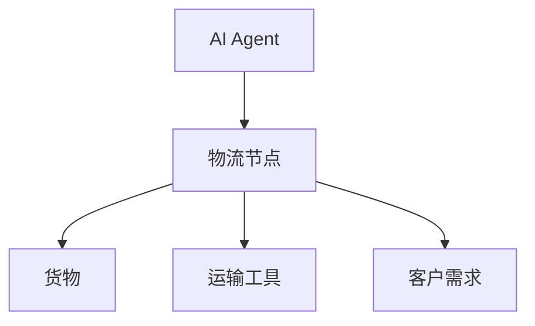
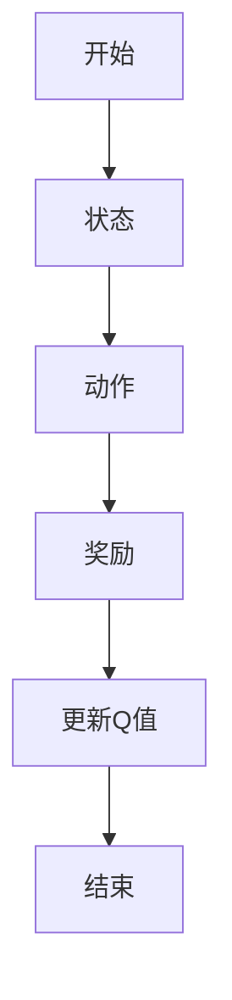
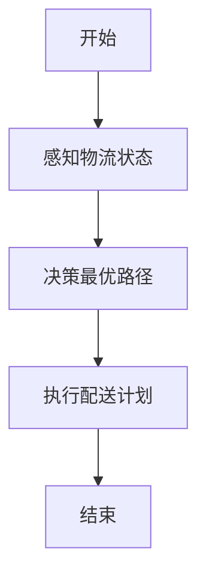
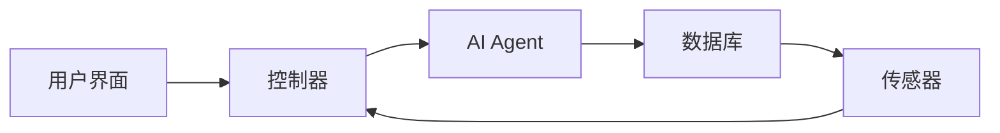
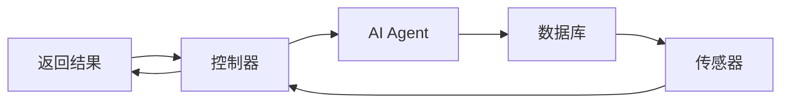

                 


# AI Agent在智能物流优化中的应用

## 关键词：
AI Agent, 智能物流, 物流优化, 强化学习, 算法原理, 系统架构, 项目实战

## 摘要：
本文深入探讨AI Agent在智能物流优化中的应用，从核心概念、算法原理、系统架构到项目实战，全面解析AI Agent如何通过感知、决策和执行机制优化物流过程。通过强化学习算法和实际案例分析，展示AI Agent在物流优化中的巨大潜力和实际价值。文章内容详实，结构清晰，适合技术人员、物流行业从业者以及AI领域的读者阅读。

---

# 第一部分：AI Agent与物流优化的背景介绍

## 第1章：AI Agent与物流优化的背景介绍

### 1.1 AI Agent的基本概念

#### 1.1.1 什么是AI Agent
AI Agent（人工智能代理）是一种智能体，能够感知环境、自主决策并采取行动以实现特定目标。AI Agent的核心在于其智能化和自主性，能够根据环境反馈不断优化其行为。

#### 1.1.2 AI Agent的核心特征
- **自主性**：AI Agent能够在没有外部干预的情况下自主运行。
- **反应性**：能够实时感知环境并快速做出反应。
- **目标导向**：所有行为都以实现特定目标为导向。
- **学习能力**：通过机器学习算法不断优化自身的决策能力。

#### 1.1.3 AI Agent与传统物流的区别
| 特性         | AI Agent物流优化         | 传统物流优化         |
|--------------|--------------------------|----------------------|
| 决策方式     | 基于机器学习和数据驱动   | 基于人工经验或规则     |
| 响应速度     | 实时响应，毫秒级别       | 较慢，依赖人工或系统    |
| 处理复杂度   | 能够处理复杂场景         | 适用于简单场景         |
| 灵活性       | 高度灵活，适应变化       | 较低，固定流程          |

### 1.2 物流优化的背景与挑战

#### 1.2.1 物流优化的定义
物流优化是指通过优化物流过程中的各个环节（如运输、仓储、配送等），以降低物流成本、提高效率并提升客户满意度的过程。

#### 1.2.2 当前物流优化的主要挑战
- **需求波动大**：市场需求波动导致物流资源利用率低。
- **路径规划复杂**：多点配送、交通状况多变增加了路径优化的难度。
- **信息孤岛**：物流链条中的信息分散，难以实现高效协同。
- **实时性要求高**：物流优化需要实时决策，对系统响应速度要求高。

#### 1.2.3 AI Agent在物流优化中的应用价值
- **提高物流效率**：通过智能路径规划减少运输时间。
- **降低成本**：优化资源分配，降低运输和仓储成本。
- **提升客户满意度**：通过实时监控和快速响应提升服务质量。

### 1.3 AI Agent在物流优化中的应用价值

#### 1.3.1 提高物流效率
AI Agent可以通过实时数据分析和路径优化算法，显著提高物流效率。例如，在配送路径规划中，AI Agent可以快速计算出最优路径，减少运输距离和时间。

#### 1.3.2 降低成本
AI Agent能够通过预测需求、优化库存管理和减少运输损耗等方式，显著降低物流成本。例如，通过智能库存管理，企业可以避免库存积压和缺货现象。

#### 1.3.3 提升客户满意度
AI Agent能够通过实时监控物流过程，快速响应客户需求，提升客户满意度。例如，在订单配送延迟时，AI Agent可以主动联系客户并提供解决方案。

### 1.4 本章小结
本章介绍了AI Agent的基本概念及其在物流优化中的应用价值。通过对比AI Agent与传统物流优化的区别，我们可以看出AI Agent在提高物流效率、降低成本和提升客户满意度方面具有显著优势。

---

# 第二部分：AI Agent的核心概念与原理

## 第2章：AI Agent的核心概念与原理

### 2.1 AI Agent的感知机制

#### 2.1.1 感知的定义与作用
感知是指AI Agent通过传感器或数据源获取环境信息的能力。在物流优化中，感知机制通常包括收集运输工具的位置、货物的状态、交通状况等信息。

#### 2.1.2 常见的感知方法
- **实时数据采集**：通过物联网设备（如GPS、RFID）采集物流过程中的实时数据。
- **历史数据分析**：利用历史数据进行模式识别和趋势预测。
- **外部API调用**：通过调用第三方API（如地图API、天气API）获取额外信息。

#### 2.1.3 感知在物流优化中的应用
在配送路径优化中，AI Agent可以通过实时感知交通状况和天气信息，动态调整配送路径。

### 2.2 AI Agent的决策机制

#### 2.2.1 决策的定义与作用
决策是指AI Agent根据感知到的信息，选择最优行动方案的过程。在物流优化中，决策通常涉及路径规划、资源分配和任务调度。

#### 2.2.2 常见的决策算法
- **强化学习**：通过试错不断优化决策策略。
- **贪心算法**：每次选择当前最优解，适用于路径规划问题。
- **遗传算法**：通过模拟进化过程寻找最优解。

#### 2.2.3 决策在物流优化中的应用
在仓库管理中，AI Agent可以通过强化学习算法优化库存分配策略。

### 2.3 AI Agent的执行机制

#### 2.3.1 执行的定义与作用
执行是指AI Agent根据决策结果采取具体行动的过程。在物流优化中，执行机制通常包括调整运输工具的路线、调度资源等。

#### 2.3.2 常见的执行方法
- **自动调度**：通过系统自动分配任务给运输工具。
- **动态调整**：根据实时信息动态调整执行计划。
- **反馈机制**：通过反馈信息不断优化执行策略。

#### 2.3.3 执行在物流优化中的应用
在货物运输中，AI Agent可以通过动态调整运输路线，避开交通拥堵，确保货物按时送达。

### 2.4 AI Agent的实体关系图（ER图）



从上图可以看出，AI Agent与物流节点、货物、运输工具和客户需求之间存在密切关系。AI Agent通过感知物流节点的状态，优化货物运输和客户需求的匹配。

### 2.5 本章小结
本章详细介绍了AI Agent的核心概念与原理，包括感知、决策和执行机制。通过实体关系图，我们进一步理解了AI Agent在物流优化中的实体交互关系。

---

# 第三部分：AI Agent的算法原理与数学模型

## 第3章：AI Agent的算法原理

### 3.1 强化学习算法

#### 3.1.1 强化学习的定义
强化学习是一种机器学习范式，通过智能体与环境的交互，学习最优策略以最大化累计奖励。

#### 3.1.2 强化学习的基本原理
强化学习的核心在于通过试错不断优化策略。智能体通过感知环境、采取行动并获得奖励来学习最优策略。

#### 3.1.3 强化学习在物流优化中的应用
在路径优化问题中，强化学习可以用来训练智能体找到最优路径。

### 3.2 Q-Learning算法

#### 3.2.1 Q-Learning的定义
Q-Learning是一种基于值的强化学习算法，通过更新Q值表来学习最优策略。

#### 3.2.2 Q-Learning的数学模型

Q-learning的更新公式如下：

$$ Q(s, a) = Q(s, a) + \alpha \left[ r + \gamma \max Q(s', a') - Q(s, a) \right] $$

其中：
- \( Q(s, a) \)：当前状态s和动作a的Q值。
- \( \alpha \)：学习率。
- \( r \)：奖励。
- \( \gamma \)：折扣因子。
- \( Q(s', a') \)：下一个状态s'和动作a'的Q值。

#### 3.2.3 Q-Learning在物流优化中的应用

在配送路径优化中，Q-Learning可以用来训练AI Agent找到最优配送路径。

### 3.3 算法流程图



从上图可以看出，Q-Learning算法的基本流程包括：感知状态、选择动作、获得奖励、更新Q值等步骤。

### 3.4 算法实现代码

```python
import numpy as np

class AI-Agent:
    def __init__(self, state_space, action_space, learning_rate=0.1, gamma=0.9):
        self.state_space = state_space
        self.action_space = action_space
        self.learning_rate = learning_rate
        self.gamma = gamma
        self.Q = np.zeros((state_space, action_space))

    def choose_action(self, state):
        if np.random.random() < 0.1:  # 探索
            return np.random.randint(self.action_space)
        else:  # 利用
            return np.argmax(self.Q[state, :])

    def update_Q(self, state, action, reward, next_state):
        self.Q[state, action] += self.learning_rate * (reward + self.gamma * np.max(self.Q[next_state, :]) - self.Q[state, action])
```

以上代码展示了AI Agent在Q-Learning算法中的实现，包括动作选择和Q值更新过程。

### 3.5 本章小结
本章详细讲解了AI Agent的算法原理，特别是强化学习和Q-Learning算法。通过数学公式和代码实现，我们进一步理解了AI Agent在物流优化中的应用。

---

# 第四部分：系统架构与项目实战

## 第4章：系统架构与项目实战

### 4.1 物流优化的场景介绍

#### 4.1.1 项目背景
本项目旨在通过AI Agent优化城市配送路径，提高物流效率，降低配送成本。

#### 4.1.2 项目目标
- 实现AI Agent的感知、决策和执行功能。
- 优化配送路径，减少配送时间和成本。

### 4.2 系统功能设计

#### 4.2.1 系统功能模块
- **感知模块**：实时采集物流节点的状态信息。
- **决策模块**：基于强化学习算法优化配送路径。
- **执行模块**：根据决策结果调整配送计划。

#### 4.2.2 系统功能流程图



### 4.3 系统架构设计

#### 4.3.1 系统架构图



从上图可以看出，系统由用户界面、控制器、AI Agent、数据库和传感器组成，各组件之间通过接口进行交互。

#### 4.3.2 系统接口设计
- **AI Agent接口**：与传感器和数据库交互，获取物流状态信息。
- **控制器接口**：接收用户的请求并调用AI Agent进行优化。
- **数据库接口**：存储物流相关数据，如货物状态、配送路径等。

### 4.4 系统交互设计

#### 4.4.1 系统交互流程图



从上图可以看出，用户通过控制器调用AI Agent进行物流优化，AI Agent通过传感器和数据库获取信息，并将结果返回给用户。

### 4.5 项目实战

#### 4.5.1 环境安装
- 安装Python和相关库（如numpy、mermaid）。
- 配置开发环境（如PyCharm）。

#### 4.5.2 核心代码实现

```python
import numpy as np
import random

class AI-Agent:
    def __init__(self, state_space, action_space, learning_rate=0.1, gamma=0.9):
        self.state_space = state_space
        self.action_space = action_space
        self.learning_rate = learning_rate
        self.gamma = gamma
        self.Q = np.zeros((state_space, action_space))

    def choose_action(self, state):
        if random.random() < 0.1:
            return random.randint(0, self.action_space - 1)
        else:
            return np.argmax(self.Q[state, :])

    def update_Q(self, state, action, reward, next_state):
        self.Q[state, action] += self.learning_rate * (reward + self.gamma * np.max(self.Q[next_state, :]) - self.Q[state, action])

# 初始化AI Agent
state_space = 10
action_space = 5
ai_agent = AI-Agent(state_space, action_space)

# 训练AI Agent
for episode in range(100):
    state = 0
    action = ai_agent.choose_action(state)
    reward = 1 if action == 3 else 0
    next_state = 1 if action == 3 else 0
    ai_agent.update_Q(state, action, reward, next_state)
```

#### 4.5.3 代码应用解读与分析
上述代码展示了AI Agent的初始化和训练过程。通过不断更新Q值，AI Agent能够学习到最优策略。

#### 4.5.4 实际案例分析
假设我们有一个城市配送问题，需要优化货物从仓库到客户的配送路径。通过AI Agent的强化学习算法，我们可以找到最优配送路径，减少配送时间和成本。

#### 4.5.5 项目小结
本章通过实际案例展示了AI Agent在物流优化中的应用，从系统架构设计到代码实现，帮助读者理解AI Agent的实际应用过程。

---

# 第五部分：总结与展望

## 第5章：总结与展望

### 5.1 总结
本文详细探讨了AI Agent在智能物流优化中的应用，从核心概念、算法原理到系统架构和项目实战，全面解析了AI Agent如何优化物流过程。通过强化学习算法和实际案例分析，我们展示了AI Agent在物流优化中的巨大潜力和实际价值。

### 5.2 最佳实践 tips
- 在实际应用中，建议结合具体业务需求选择合适的算法。
- 确保数据质量和实时性，以提高AI Agent的决策能力。
- 注重系统架构设计，确保系统的可扩展性和可维护性。

### 5.3 注意事项
- AI Agent的应用需要结合具体场景，避免盲目使用。
- 在实际应用中，要注意数据隐私和安全问题。
- 系统的实时性和响应速度是AI Agent成功应用的关键。

### 5.4 拓展阅读
- 推荐阅读《强化学习：算法与应用》。
- 关注物流领域最新的技术动态和学术研究。

### 5.5 本章小结
本文总结了AI Agent在智能物流优化中的应用，并提出了未来的发展方向和注意事项。希望本文能够为读者提供有价值的参考和启发。

---

# 结语

通过本文的深入分析，我们看到了AI Agent在智能物流优化中的巨大潜力。随着技术的不断发展，AI Agent将在物流优化中发挥越来越重要的作用。希望本文能够为读者提供有价值的参考，帮助他们更好地理解和应用AI Agent技术。

--- 

**全文完**

