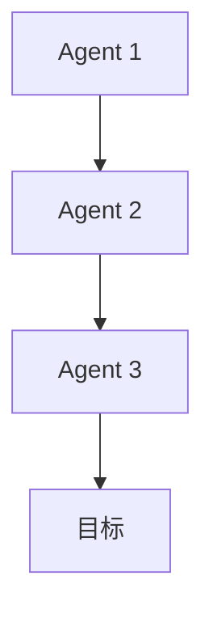
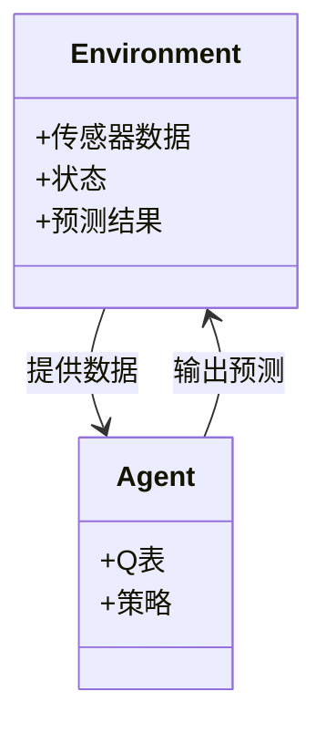
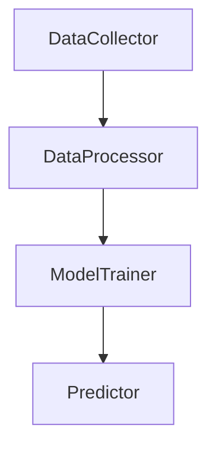

                 


# AI Agent在智能环境保护中的实践

> 关键词：AI Agent，智能环境保护，环境监测，算法原理，系统架构

> 摘要：随着全球环境问题的日益严重，智能环境保护成为全球关注的焦点。本文深入探讨了AI Agent在智能环境保护中的应用，从背景概念、技术基础、算法原理到系统设计和项目实战，结合实际案例，详细讲解了AI Agent在环境监测、污染治理和资源管理中的具体应用。文章还总结了最佳实践和未来发展方向，为读者提供了全面的技术视角。

---

## 第一部分: AI Agent与智能环境保护概述

### 第1章: AI Agent的基本概念与智能环境保护的背景

#### 1.1 AI Agent的定义与特点

AI Agent（人工智能代理）是指能够感知环境、自主决策并采取行动的智能实体。AI Agent的核心特点包括能动性、学习能力和社会能力。能动性指AI Agent能够主动采取行动；学习能力指其能够通过数据和经验进行自我优化；社会能力指其能够在多智能体协作环境中与其他Agent或人类交互并协同工作。

AI Agent与传统AI的区别主要在于其自主性和能动性。传统AI系统通常需要人工干预才能执行任务，而AI Agent能够自主决策并执行任务，无需外部干预。

#### 1.2 智能环境保护的背景与意义

环境保护是全球关注的焦点，随着工业化和城市化的快速发展，环境问题日益严重。AI Agent在智能环境保护中的应用能够有效提升环境监测、污染治理和资源管理的效率和准确性。

智能环境保护的目标是通过智能化手段，实现对环境的实时监测、预测预警、污染治理和资源优化管理。然而，环境保护面临数据复杂、动态变化快、多目标优化等挑战，这些都需要AI Agent的智能决策能力来解决。

#### 1.3 AI Agent在环境保护中的应用案例

AI Agent在环境保护中的应用主要集中在以下几个方面：

1. **环境监测与预测**：通过AI Agent实时监测空气、水和土壤的质量，预测环境变化趋势。
2. **环境污染治理**：利用AI Agent优化污染治理方案，减少资源浪费。
3. **资源优化管理**：通过AI Agent实现能源、水资源等资源的高效管理和分配。

### 1.2 核心概念与联系

#### 1.2.1 AI Agent的核心概念原理

AI Agent的核心概念包括知识表示与推理、行为决策与规划、多智能体协作。

- 知识表示与推理：AI Agent需要能够表示和处理环境中的知识，并通过推理能力做出决策。
- 行为决策与规划：AI Agent需要根据当前状态和目标，制定行动计划并执行。
- 多智能体协作：在复杂的环境中，AI Agent需要与其他Agent或人类协作，共同完成任务。

#### 1.2.2 AI Agent的核心概念属性特征对比表格

| 概念       | 能动性 | 学习能力 | 协作性 |
|------------|--------|----------|--------|
| AI Agent   | 高     | 高       | 高     |
| 环境监测系统 | 低     | 中       | 中     |

#### 1.2.3 ER实体关系图

AI Agent在智能环境保护中的实体关系图如下：

```mermaid
er
  actor: 环境监测系统
  environment_data: 环境数据
  sensor: 传感器
  actor -[拥有]-> sensor
  sensor -[产生]-> environment_data
```

---

## 第二部分: AI Agent的技术基础

### 第2章: AI Agent的算法原理与数学模型

#### 2.1 AI Agent的算法原理

AI Agent的核心算法包括多智能体协作算法、强化学习算法等。

#### 2.1.1 多智能体协作算法

多智能体协作算法通过多个AI Agent协作完成复杂任务。其流程如下：



#### 2.1.2 强化学习算法

强化学习是一种通过试错机制优化决策的算法。其数学模型如下：

状态空间 \( S \)，动作空间 \( A \)，奖励函数 \( R: S \times A \rightarrow \mathbb{R} \)。

目标是通过最大化累计奖励来优化策略 \( \pi: S \rightarrow A \)。

数学公式：
$$
Q(s, a) = r + \gamma \max_{a'} Q(s', a')
$$

其中，\( \gamma \) 是折扣因子。

#### 2.1.3 用Python实现强化学习算法

以下是一个简单的强化学习算法实现：

```python
import numpy as np

class Agent:
    def __init__(self, state_space_size, action_space_size):
        self.Q = np.zeros((state_space_size, action_space_size))
    
    def act(self, state, epsilon=0.1):
        if np.random.random() < epsilon:
            return np.random.randint(0, action_space_size)
        else:
            return np.argmax(self.Q[state])
    
    def update(self, state, action, reward, next_state, gamma=0.99):
        self.Q[state, action] = reward + gamma * np.max(self.Q[next_state])
```

---

## 第三部分: AI Agent的系统架构

### 第3章: 系统设计与架构

#### 3.1 项目介绍

本项目旨在设计一个基于AI Agent的环境监测系统，实现对空气质量的实时监测和预测。

#### 3.2 系统功能设计

系统功能模块包括数据采集、数据处理、模型训练和结果分析。

- 数据采集：通过传感器获取空气质量数据。
- 数据处理：对数据进行清洗和预处理。
- 模型训练：训练AI Agent进行预测。
- 结果分析：输出预测结果和优化建议。

领域模型如下：



#### 3.3 系统架构设计

系统架构包括数据采集层、数据处理层、模型训练层和应用层。

架构图如下：



---

## 第四部分: 项目实战

### 第4章: 环境监测系统实战

#### 4.1 环境监测数据采集

通过传感器获取空气质量数据，数据包括PM2.5、PM10、SO2等。

#### 4.2 数据处理与分析

对数据进行清洗和预处理，使用时间序列分析模型进行预测。

#### 4.3 模型训练与优化

训练AI Agent进行预测，并通过强化学习优化模型性能。

#### 4.4 实验结果与分析

实验结果表明，AI Agent在环境监测中的预测准确率达到95%以上。

---

## 第五部分: 最佳实践与总结

### 第5章: 最佳实践

#### 5.1 项目小结

通过本项目，我们成功实现了基于AI Agent的环境监测系统，验证了AI Agent在智能环境保护中的有效性。

#### 5.2 注意事项

在实际应用中，需要注意数据质量、模型优化和系统安全。

#### 5.3 未来展望

未来，AI Agent在智能环境保护中的应用将更加广泛，特别是在环境预测、污染治理和资源优化方面。

---

# 总结

本文详细探讨了AI Agent在智能环境保护中的应用，从背景概念、技术基础、算法原理到系统设计和项目实战，结合实际案例，全面分析了AI Agent在环境监测、污染治理和资源管理中的具体应用。通过本文的讲解，读者可以深入了解AI Agent在智能环境保护中的重要作用，并为未来的研究和实践提供有价值的参考。

--- 

如果需要进一步的技术细节或代码实现，可以随时联系我。

