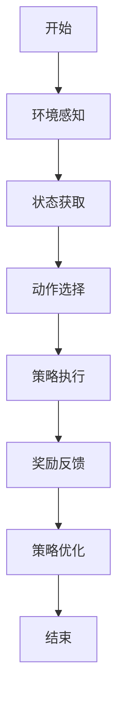
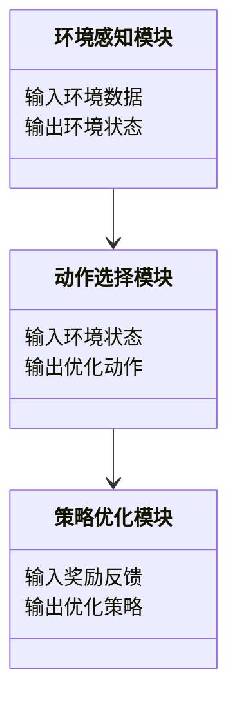

                 


# AI Agent在智能环境影响评估中的实践

> 关键词：AI Agent, 智能环境, 影响评估, 强化学习, 算法实现, 系统架构

> 摘要：本文详细探讨了AI Agent在智能环境影响评估中的应用实践。从AI Agent的核心概念与算法原理，到系统架构设计与实际案例分析，全面阐述了如何利用AI Agent技术进行智能环境影响评估。通过理论分析与实践结合，为读者提供了深入的技术见解与实践指导。

---

## 第一部分: AI Agent与智能环境影响评估基础

### 第1章: AI Agent与智能环境影响评估概述

#### 1.1 AI Agent的基本概念
- **1.1.1 AI Agent的定义与特点**  
  AI Agent（人工智能代理）是指能够感知环境、自主决策并采取行动的智能体。其核心特点包括：自主性、反应性、目标导向性和社会性。AI Agent能够根据环境反馈不断优化自身行为，以实现特定目标。

- **1.1.2 智能环境的基本概念**  
  智能环境是指能够感知并响应用户或系统需求的动态环境。智能环境通常具备自适应性、学习能力和优化能力，能够与AI Agent进行高效交互。

- **1.1.3 影响评估的核心目标与意义**  
  影响评估旨在通过AI Agent对环境变化进行预测、分析和优化，以最小化负面影响并最大化正向效应。在智能环境中，影响评估是实现可持续发展的重要手段。

#### 1.2 AI Agent在智能环境中的作用
- **1.2.1 AI Agent的核心功能与能力**  
  AI Agent在智能环境中主要负责环境感知、信息处理、决策制定和行动执行。其核心能力包括数据采集、状态分析、策略优化和结果反馈。

- **1.2.2 智能环境中的问题建模与求解**  
  智能环境中的问题通常涉及复杂的动态关系，AI Agent通过建立数学模型和优化算法，能够高效地解决问题。

- **1.2.3 影响评估的典型应用场景**  
  AI Agent在智能环境中的影响评估应用场景包括能源管理、交通优化、环境保护等领域。

### 1.3 本章小结  
本章介绍了AI Agent的基本概念、智能环境的定义以及影响评估的核心目标。通过分析AI Agent在智能环境中的作用，为后续章节奠定了理论基础。

---

## 第二部分: AI Agent的核心概念与算法原理

### 第2章: AI Agent的核心概念与原理

#### 2.1 AI Agent的核心概念
- **2.1.1 状态、动作与奖励的定义**  
  - 状态（State）：环境在某一时刻的特征描述。  
  - 动作（Action）：AI Agent在给定状态下采取的行为。  
  - 奖励（Reward）：AI Agent采取动作后获得的反馈，用于评估行为的好坏。

- **2.1.2 环境模型与决策空间**  
  环境模型是AI Agent与环境交互的基础，决策空间则是AI Agent可选择的所有动作的集合。

- **2.1.3 多智能体系统与协作机制**  
  多智能体系统通过协作机制实现任务分配与协同决策，确保系统整体性能的最优。

#### 2.2 AI Agent的算法原理
- **2.2.1 马尔可夫决策过程（MDP）模型**  
  MDP是一种数学模型，用于描述AI Agent在环境中的决策过程。其核心要素包括状态、动作、转移概率和奖励函数。

- **2.2.2 强化学习（RL）的基本原理**  
  强化学习是一种通过试错机制优化AI Agent行为的算法。AI Agent通过与环境交互，学习最优策略以最大化累积奖励。

- **2.2.3 策略网络与价值网络的实现**  
  策略网络直接输出最优动作，而价值网络则评估状态的价值。两者通过神经网络实现，是强化学习的核心技术。

### 第3章: AI Agent的数学模型与公式

#### 3.1 状态空间与动作空间的数学表示
- **3.1.1 状态空间的维度与范围**  
  状态空间的维度决定了AI Agent的感知能力，范围则决定了其可处理的环境复杂度。

- **3.1.2 动作空间的定义与选择**  
  动作空间的选择直接影响AI Agent的决策能力，通常需要根据环境特点进行定制化设计。

#### 3.2 奖励函数与目标函数的数学模型
- **3.2.1 奖励函数的设计原则**  
  奖励函数需要能够准确反映AI Agent行为的优劣，通常采用标量值进行度量。

- **3.2.2 最大化期望奖励的目标函数**  
  $$ J(\theta) = \mathbb{E}[R] $$  
  其中，$\theta$是策略参数，$R$是累积奖励。

- **3.2.3 动态模型与策略优化的数学公式**  
  动态模型通常采用概率转移矩阵表示：  
  $$ P(s'|s,a) = \text{概率在状态$s$采取动作$a$后转移到状态$s'$} $$  
  策略优化的目标是最大化：  
  $$ \theta^* = \arg\max_\theta J(\theta) $$

### 第4章: AI Agent的算法实现与流程图

#### 4.1 算法实现的步骤与流程
- **4.1.1 环境感知与状态获取**  
  AI Agent通过传感器或API获取环境状态信息。

- **4.1.2 动作选择与策略执行**  
  基于当前状态，AI Agent选择最优动作并执行。

- **4.1.3 奖励反馈与策略优化**  
  根据环境反馈的奖励，AI Agent更新策略以提高未来表现。

#### 4.2 算法流程图（Mermaid）


---

## 第三部分: 智能环境影响评估的系统分析与架构设计

### 第5章: 智能环境影响评估的系统分析

#### 5.1 问题场景介绍
- **5.1.1 智能环境的典型问题**  
  包括资源分配、能源消耗、交通拥堵等。

- **5.1.2 影响评估的核心任务**  
  通过AI Agent优化环境配置，减少负面影响。

- **5.1.3 系统需求与目标**  
  系统需要具备实时感知、智能决策和高效执行能力。

#### 5.2 系统功能设计
- **5.2.1 领域模型（Mermaid类图）**  


---

## 第四部分: 项目实战与优化建议

### 第6章: 项目实战

#### 6.1 环境安装与依赖配置
```bash
pip install gym numpy tensorflow
```

#### 6.2 系统核心实现源代码
```python
import numpy as np
import gym

class AI-Agent:
    def __init__(self, env):
        self.env = env
        self.observation_space = env.observation_space
        self.action_space = env.action_space
        self.model = self.build_model()

    def build_model(self):
        # 简单的神经网络模型实现
        pass

    def perceive(self):
        observation = self.env.observation()
        return observation

    def decide(self, observation):
        action = self.model.predict(observation)
        return action

    def execute(self, action):
        reward = self.env.do_action(action)
        return reward

    def learn(self, reward):
        self.model.update(reward)
```

#### 6.3 代码应用解读与分析
- 代码实现了AI Agent的基本功能，包括环境感知、决策制定和学习优化。通过神经网络模型进行策略更新，以最大化累积奖励。

#### 6.4 实际案例分析
- 以智能交通系统为例，AI Agent通过实时感知交通状况，优化信号灯配置，减少拥堵和能耗。

---

## 附录: 最佳实践 tips

### 7.1 小结
本文详细介绍了AI Agent在智能环境影响评估中的实践应用，从理论到实践，为读者提供了全面的技术指导。

### 7.2 注意事项
- 确保环境数据的实时性和准确性。
- 合理设计奖励函数，避免目标偏移。
- 定期优化策略，适应环境变化。

### 7.3 拓展阅读
- 《强化学习入门》
- 《智能系统设计与实现》

---

以上是文章的完整内容，涵盖了AI Agent在智能环境影响评估中的核心概念、算法实现、系统设计和实际应用。通过理论与实践结合，为读者提供了深入的技术指导。

