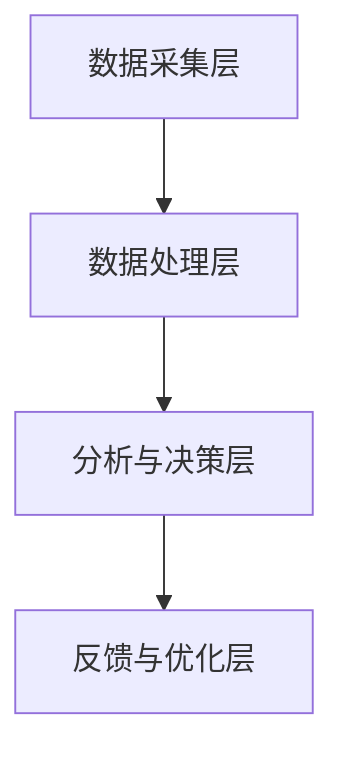
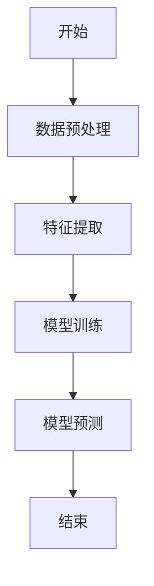

                 


# AI Agent在智能环境污染源追踪中的实践

> 关键词：AI Agent, 环境污染源追踪, 数据分析, 机器学习, 系统架构

> 摘要：随着环境污染问题的日益严重，利用AI Agent进行智能环境污染源追踪成为一项重要的技术手段。本文从AI Agent的基本概念出发，详细探讨了其在环境污染源追踪中的核心原理、关键技术、系统架构设计以及实际项目中的应用。通过理论与实践相结合的方式，本文旨在为读者提供一个全面了解和应用AI Agent进行环境污染源追踪的指导。

---

## 第一部分: AI Agent与环境污染追踪概述

### 第1章: AI Agent与环境污染追踪的背景

#### 1.1 环境污染追踪的背景与意义
环境污染问题日益严重，特别是在工业生产和城市化进程中，污染物的排放导致了空气、水和土壤的污染。传统的环境污染追踪方法依赖于人工调查和简单的传感器数据，存在效率低、精度差的问题。AI Agent作为一种智能代理，能够实时感知环境数据，自主决策并采取行动，为环境污染源追踪提供了新的解决方案。

#### 1.2 AI Agent的基本概念与特点
AI Agent是一种智能实体，能够感知环境、自主决策并执行任务。其特点包括：
- **自主性**：能够在没有人工干预的情况下独立运行。
- **反应性**：能够实时感知环境变化并做出响应。
- **学习能力**：通过机器学习算法不断优化自身的决策能力。
- **协作性**：能够与其他AI Agent或系统协同工作。

#### 1.3 环境污染源追踪的核心问题
环境污染源追踪的核心问题包括：
- **数据来源多样化**：需要整合空气质量传感器、卫星遥感数据、气象数据等多种来源的数据。
- **数据实时性要求高**：环境污染问题往往具有突发性，需要实时追踪和响应。
- **复杂环境分析**：需要处理复杂的环境数据，包括时空分布、污染物浓度变化等。

---

## 第二部分: AI Agent的核心原理与技术

### 第2章: AI Agent的核心原理

#### 2.1 AI Agent的感知与决策机制
AI Agent通过多种传感器和数据源获取环境信息，包括空气质量传感器、卫星遥感数据等。感知模块将这些数据进行预处理和特征提取，为后续的分析和决策提供基础。

#### 2.2 环境污染源追踪的算法原理
环境污染源追踪的核心算法包括：
- **机器学习算法**：如随机森林、支持向量机（SVM）等，用于分类和回归分析。
- **深度学习算法**：如卷积神经网络（CNN）和长短期记忆网络（LSTM），用于处理复杂的时空数据。
- **时间序列分析**：用于预测污染物的扩散趋势和来源。

### 第3章: AI Agent的关键技术

#### 3.1 数据采集与处理技术
- **数据融合**：将多源数据（如传感器数据、气象数据）进行融合，提高数据的准确性和完整性。
- **数据清洗**：对噪声数据进行过滤和补全，确保数据的可用性。
- **数据存储**：使用数据库或大数据平台（如Hadoop、Spark）进行存储和管理。

#### 3.2 AI算法在污染源追踪中的应用
- **机器学习模型**：用于污染物来源的分类和预测。
- **深度学习模型**：用于处理复杂的非线性关系，如污染物的扩散路径预测。

### 第4章: AI Agent的系统架构设计

#### 4.1 系统整体架构
系统架构包括以下模块：
- **数据采集层**：负责收集环境数据。
- **数据处理层**：对数据进行清洗、融合和预处理。
- **分析与决策层**：利用AI算法进行污染源定位和预测。
- **反馈与优化层**：根据结果优化模型和系统性能。

#### 4.2 系统架构的优化与扩展
- **可扩展性设计**：通过模块化设计，方便系统的扩展和升级。
- **可维护性设计**：通过日志记录和监控，方便系统的维护和调试。

---

## 第三部分: AI Agent在环境污染源追踪中的实践

### 第5章: 项目实战

#### 5.1 项目背景与目标
项目背景：某城市遭遇严重的空气污染问题，需要快速定位污染源。
项目目标：开发一个基于AI Agent的环境污染源追踪系统，实现污染源的实时定位和预测。

#### 5.2 项目实施步骤
- **数据采集**：部署空气质量传感器和气象传感器。
- **数据预处理**：清洗数据并进行特征提取。
- **模型训练**：利用机器学习和深度学习算法进行模型训练。
- **系统集成**：将各模块集成到一个系统中，并进行测试和优化。

### 第6章: 系统实现与代码解读

#### 6.1 环境搭建与工具安装
- **系统环境**：安装Python、Jupyter Notebook、TensorFlow、Keras等工具。
- **数据存储**：使用MySQL数据库存储环境数据。

#### 6.2 核心代码实现
- **数据采集模块**：读取传感器数据并存储到数据库中。
- **数据分析模块**：利用Python进行数据清洗和特征提取。
- **模型训练模块**：使用机器学习算法训练污染源定位模型。

---

## 第四部分: 总结与展望

### 第7章: 总结与展望
- **总结**：本文详细介绍了AI Agent在环境污染源追踪中的应用，从理论到实践，为读者提供了全面的指导。
- **展望**：未来，随着AI技术的不断发展，AI Agent在环境污染源追踪中的应用将更加广泛和深入。

---

## 关键技术的详细解释

### 1. 环境污染源追踪的数学模型
污染源定位的数学模型可以表示为：
$$
\text{位置} = f(\text{污染物浓度}, \text{气象条件}, \text{地理位置})
$$
其中，$f$ 是一个复杂的函数，可以通过机器学习算法进行训练。

### 2. 机器学习算法的实现
以下是随机森林算法的实现代码示例：
```python
from sklearn.ensemble import RandomForestClassifier
from sklearn.datasets import make_classification

# 生成数据
X, y = make_classification(n_samples=1000, n_features=4, n_classes=2)

# 训练模型
model = RandomForestClassifier()
model.fit(X, y)

# 预测
print(model.predict(X))
```

### 3. 系统架构设计图
以下是系统架构的Mermaid图：


### 4. 算法流程图
以下是随机森林算法的流程图：


---

## 结语

通过本文的详细介绍，读者可以全面了解AI Agent在环境污染源追踪中的应用，并能够将其应用到实际项目中。未来，随着AI技术的不断进步，AI Agent在环境污染源追踪中的作用将更加重要。

