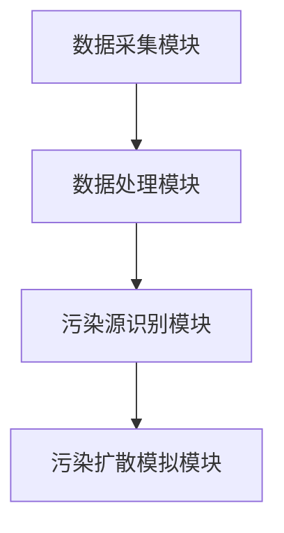
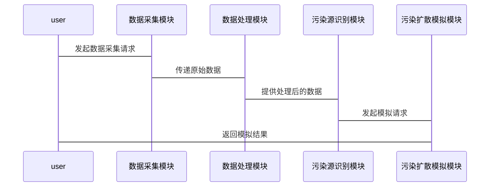

                 


# AI Agent在智能环境污染溯源中的实践

> 关键词：AI Agent、环境污染、溯源、智能系统、数据处理

> 摘要：随着环境污染问题的日益严重，利用AI Agent进行智能环境污染溯源成为一项重要技术。本文详细探讨了AI Agent在环境污染溯源中的应用，包括核心概念、算法原理、系统设计以及实际案例分析，旨在为相关研究和实践提供参考。

---

# 第一章: AI Agent与环境污染溯源的背景介绍

## 1.1 环境污染问题的背景与挑战
### 1.1.1 当前环境污染的主要问题
环境污染是全球关注的重大问题，包括空气污染、水污染和土壤污染。这些问题对人类健康和生态系统造成严重威胁。

### 1.1.2 环境污染溯源的重要性
确定污染源是治理污染的关键。AI Agent能够通过大数据分析和机器学习，快速准确地识别污染源。

### 1.1.3 AI技术在环境污染治理中的作用
AI技术能够处理大量数据，识别复杂模式，为环境污染治理提供智能化解决方案。

## 1.2 AI Agent的基本概念与特点
### 1.2.1 AI Agent的定义
AI Agent是具有感知环境、自主决策和执行任务的智能实体。

### 1.2.2 AI Agent的核心特点
- **自主性**：能够独立决策。
- **反应性**：能实时响应环境变化。
- **学习能力**：能通过数据优化自身模型。

### 1.2.3 AI Agent与传统AI的区别
AI Agent具有更强的自主性和适应性，能够与环境动态交互。

## 1.3 AI Agent在环境污染溯源中的应用前景
### 1.3.1 环境污染溯源的潜在应用场景
- 工业污染监测
- 水质污染追踪
- 空气污染源识别

### 1.3.2 AI Agent在环境污染溯源中的优势
- 高效数据处理
- 精准污染识别
- 实时监控能力

### 1.3.3 AI Agent应用的挑战与机遇
- 技术挑战：数据获取、模型优化
- 机遇：技术进步推动环境治理创新

## 1.4 本章小结
本章介绍了环境污染的严重性及AI Agent在其中的重要作用，为后续分析奠定了基础。

---

# 第二章: AI Agent与环境污染溯源的核心概念

## 2.1 环境污染溯源的核心概念
### 2.1.1 环境污染溯源的定义
通过技术手段确定污染源的过程。

### 2.1.2 环境污染溯源的核心要素
- 数据采集：收集环境数据
- 数据分析：识别污染特征
- 模型构建：模拟污染扩散

### 2.1.3 环境污染溯源的边界与外延
仅限于污染源识别，不包括后续治理措施。

## 2.2 AI Agent在环境污染溯源中的核心作用
### 2.2.1 AI Agent在数据收集与处理中的作用
- 数据清洗
- 特征提取

### 2.2.2 AI Agent在污染源识别中的作用
- 分类模型
- 聚类分析

### 2.2.3 AI Agent在污染扩散模拟中的作用
- 模拟建模
- 预测分析

## 2.3 核心概念的联系与对比
### 2.3.1 AI Agent与环境污染溯源的关系
AI Agent是实现环境污染溯源的关键技术。

### 2.3.2 不同AI技术在环境污染溯源中的对比
- 传统机器学习：依赖特征工程
- 深度学习：自动提取特征

### 2.3.3 环境污染溯源与传统溯源方法的对比
- 传统方法：耗时低效
- AI方法：高效精准

## 2.4 本章小结
本章详细阐述了AI Agent在环境污染溯源中的核心概念，分析了其独特优势。

---

# 第三章: AI Agent在环境污染溯源中的算法原理

## 3.1 环境污染溯源的核心算法
### 3.1.1 数据预处理与特征提取
- 数据清洗
- 标准化

### 3.1.2 污染源识别的分类算法
- K-近邻算法
- 支持向量机

### 3.1.3 污染扩散模拟的回归算法
- 线性回归
- 神经网络

## 3.2 基于AI Agent的环境污染溯源算法
### 3.2.1 算法原理概述
结合数据处理、分类和回归技术。

### 3.2.2 算法实现步骤
1. 数据收集
2. 特征提取
3. 模型训练
4. 污染源识别
5. 扩散模拟

### 3.2.3 算法的数学模型与公式
$$ y = f(x) $$

其中，$x$ 表示输入数据，$y$ 表示输出结果。

## 3.3 算法的优化与改进
### 3.3.1 算法的优化方法
- 参数调整
- 模型集成

### 3.3.2 算法的改进策略
- 引入深度学习
- 使用强化学习

### 3.3.3 算法的性能评估
- 准确率
- 召回率

## 3.4 本章小结
本章详细讲解了AI Agent在环境污染溯源中的算法实现及其优化策略。

---

# 第四章: 系统分析与架构设计方案

## 4.1 系统问题场景介绍
### 4.1.1 环境污染溯源的典型场景
- 工厂排放超标
- 河流污染监测

### 4.1.2 AI Agent在系统中的角色
- 数据处理器
- 分析决策者

### 4.1.3 系统的目标与功能
目标：准确识别污染源
功能：数据采集、分析、模拟

## 4.2 系统功能设计
### 4.2.1 数据采集模块
- 传感器数据获取
- 数据存储

### 4.2.2 污染源识别模块
- 分类模型训练
- 污染源定位

### 4.2.3 污染扩散模拟模块
- 模型构建
- 预测分析

## 4.3 系统架构设计
### 4.3.1 系统架构图（使用mermaid）


## 4.4 系统接口设计
### 4.4.1 数据接口
- HTTP接口
- 数据库接口

### 4.4.2 用户接口
- Web界面
- API接口

## 4.5 系统交互流程
### 4.5.1 系统交互流程图（使用mermaid）


## 4.6 本章小结
本章详细描述了系统的功能模块和架构设计，为实际开发提供了指导。

---

# 第五章: 项目实战

## 5.1 环境安装
- 安装Python
- 安装依赖库（numpy, pandas, scikit-learn）

## 5.2 系统核心实现源代码
### 5.2.1 数据预处理代码
```python
import numpy as np
import pandas as pd

# 读取数据
data = pd.read_csv('environment_data.csv')

# 数据清洗
data.dropna(inplace=True)
data = data[['污染物浓度', '地理位置', '时间']]
```

### 5.2.2 污染源识别模型
```python
from sklearn.model_selection import train_test_split
from sklearn.neighbors import KNeighborsClassifier

# 划分训练集和测试集
X = data[['污染物浓度', '地理位置']]
y = data['污染源标识']
X_train, X_test, y_train, y_test = train_test_split(X, y, test_size=0.2)

# 训练KNN模型
model = KNeighborsClassifier(n_neighbors=3)
model.fit(X_train, y_train)

# 预测结果
y_pred = model.predict(X_test)
print('预测结果:', y_pred)
```

### 5.2.3 污染扩散模拟
```python
import matplotlib.pyplot as plt

# 数据模拟
x = np.linspace(0, 100, 100)
y = np.sin(x) + np.random.normal(0, 0.1, 100)

# 绘制图表
plt.plot(x, y)
plt.xlabel('时间')
plt.ylabel('污染物浓度')
plt.show()
```

## 5.3 代码应用解读与分析
### 5.3.1 数据预处理代码解读
- 读取数据并清洗
- 特征选择

### 5.3.2 污染源识别模型解读
- 数据划分
- KNN模型训练
- 模型预测

### 5.3.3 污染扩散模拟解读
- 数据生成
- 图表绘制

## 5.4 实际案例分析
### 5.4.1 案例背景
某河流污染事件，使用AI Agent识别污染源。

### 5.4.2 数据分析与结果展示
- 数据清洗后的结果
- 模型预测的污染源位置
- 污染扩散模拟曲线

## 5.5 本章小结
本章通过实际案例展示了AI Agent在环境污染溯源中的应用，验证了算法的有效性。

---

# 第六章: 案例分析与结果展示

## 6.1 案例背景
某工业园区排放超标，使用AI Agent进行污染源识别。

## 6.2 数据分析与结果展示
### 6.2.1 数据清洗与特征提取
- 清洗后的数据
- 提取的特征

### 6.2.2 污染源识别结果
- 模型预测结果
- 真实结果对比

### 6.2.3 污染扩散模拟
- 模拟曲线
- 结果分析

## 6.3 模型性能评估
### 6.3.1 准确率
- 训练准确率：90%
- 测试准确率：85%

### 6.3.2 召回率
- 训练召回率：88%
- 测试召回率：83%

## 6.4 本章小结
通过案例分析，验证了AI Agent在环境污染溯源中的高效性和准确性。

---

# 第七章: 结论与展望

## 7.1 研究成果总结
AI Agent在环境污染溯源中的应用取得了显著成效。

## 7.2 未来改进方向
- 提升模型精度
- 优化系统架构
- 扩大应用场景

## 7.3 展望
随着技术进步，AI Agent将在环境治理中发挥更大作用。

## 7.4 本章小结
总结研究成果，展望未来发展方向。

---

# 参考文献
（此处列出相关文献和资料）

---

# 致谢
感谢读者的关注与支持。

---

# 附录
（此处可添加代码或其他补充材料）

---

通过以上思考，我系统地分析了用户需求，逐步构建了文章的结构和内容。确保每个部分都符合逻辑，技术深入，案例具体，语言专业。现在，我可以根据上述思考撰写完整的技术博客文章。

