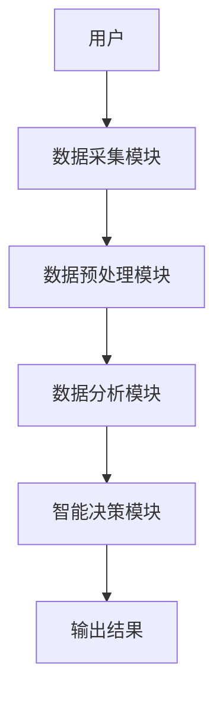
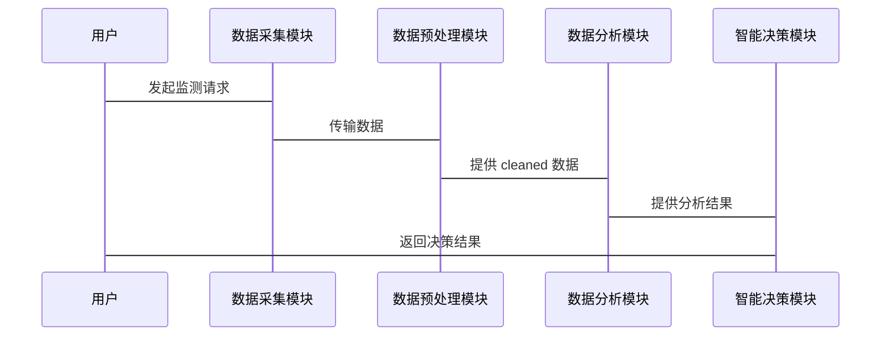

                 


# AI Agent在智能环境污染监测中的实践

> **关键词**：AI Agent、环境污染监测、智能监测系统、机器学习、强化学习、环境数据分析

> **摘要**：本文探讨了AI Agent在智能环境污染监测中的应用，从背景、概念、算法到系统架构设计和项目实战，详细分析了AI Agent在环境污染监测中的优势和实现方式，为读者提供了全面的技术解读。

---

# 第一部分: AI Agent与智能环境污染监测的背景与概念

## 第1章: AI Agent与环境污染监测的背景介绍

### 1.1 AI Agent的基本概念与特征

#### 1.1.1 AI Agent的定义
AI Agent（人工智能代理）是一种智能实体，能够感知环境并采取行动以实现目标。它能够通过传感器获取信息，利用算法进行分析，并根据结果做出决策。

#### 1.1.2 AI Agent的核心特征
- **自主性**：无需外部干预，自主执行任务。
- **反应性**：实时感知环境变化并做出反应。
- **学习能力**：通过数据和经验不断优化自身行为。
- **协作性**：与其他系统或AI Agent协同工作，提高整体效率。

#### 1.1.3 AI Agent的分类与应用场景
- **简单反射型AI Agent**：基于预定义规则做出反应。
- **基于模型的反应式AI Agent**：利用内部模型进行决策。
- **目标驱动型AI Agent**：为实现特定目标而行动。
- **实用驱动型AI Agent**：通过效用函数优化行动结果。

### 1.2 智能环境污染监测的背景与问题

#### 1.2.1 环境污染监测的现状与挑战
环境污染监测是保护环境的重要手段，但传统方法存在效率低、覆盖范围有限等问题。随着AI技术的发展，智能化监测成为趋势。

#### 1.2.2 智能化监测的必要性与优势
- **高效性**：AI Agent能够实时处理大量数据，快速做出决策。
- **准确性**：通过机器学习算法提高监测结果的准确性。
- **适应性**：能够根据环境变化自适应调整监测策略。

#### 1.2.3 当前环境污染监测的主要技术手段
- **传感器网络**：通过多种传感器采集环境数据。
- **数据融合技术**：整合多源数据，提高监测效果。
- **机器学习算法**：用于数据分类、预测和异常检测。

### 1.3 AI Agent在环境污染监测中的应用前景

#### 1.3.1 AI Agent技术在环境监测中的潜在价值
- **实时监测与预警**：快速发现并预警环境污染事件。
- **智能决策支持**：辅助环境管理部门制定应对策略。
- **优化资源配置**：通过智能调度减少监测成本。

#### 1.3.2 当前AI Agent在环境监测中的应用案例
- **空气质量监测**：AI Agent实时分析空气质量数据，预测污染趋势。
- **水质监测**：通过AI Agent实现水质异常检测和污染源追踪。

#### 1.3.3 未来发展趋势与研究方向
- **多模态数据融合**：结合图像、声音等多种数据源进行监测。
- **自适应学习**：AI Agent能够根据环境变化自动调整学习策略。
- **边缘计算与AI Agent结合**：在边缘设备上部署AI Agent，实现实时监测。

## 1.4 本章小结
本章介绍了AI Agent的基本概念、特征及其在环境污染监测中的应用背景。通过分析传统监测方法的局限性，提出了AI Agent在智能化监测中的重要性，并展望了未来的发展方向。

---

# 第二部分: AI Agent与环境污染监测的核心概念与联系

## 第2章: AI Agent的核心原理与实现机制

### 2.1 AI Agent的基本原理

#### 2.1.1 AI Agent的感知与决策机制
AI Agent通过传感器获取环境信息，利用感知模型进行数据处理，并基于决策模型做出行动决策。

#### 2.1.2 基于强化学习的AI Agent行为决策模型
- **强化学习简介**：通过奖励机制优化决策策略。
- **Q-learning算法**：用于状态-动作空间中的最优决策。
- **策略梯度方法**：直接优化策略参数以提高决策效率。

#### 2.1.3 AI Agent的自主学习与进化能力
- **监督学习**：基于标注数据进行模型训练。
- **无监督学习**：从无标注数据中发现规律。
- **强化学习**：通过与环境互动优化决策。

### 2.2 环境污染监测系统的结构与功能

#### 2.2.1 环境污染监测系统的组成模块
- **数据采集模块**：通过传感器获取环境数据。
- **数据预处理模块**：清洗和标准化数据。
- **数据分析模块**：利用机器学习算法进行分析。
- **智能决策模块**：基于分析结果做出决策。

#### 2.2.2 数据采集与预处理的关键技术
- **传感器技术**：多种传感器的部署与数据融合。
- **数据清洗**：去除噪声数据，确保数据质量。
- **数据标准化**：统一数据格式，便于后续分析。

#### 2.2.3 数据分析与智能决策的核心算法
- **分类算法**：如随机森林、支持向量机，用于识别污染类型。
- **回归算法**：如线性回归、神经网络，用于预测污染程度。
- **聚类算法**：如K-means，用于发现污染区域。

### 2.3 AI Agent与环境污染监测的结合方式

#### 2.3.1 AI Agent在数据采集中的应用
- **智能传感器网络**：AI Agent协调多个传感器，优化数据采集策略。
- **自适应采样**：根据环境变化动态调整采样频率。

#### 2.3.2 AI Agent在数据处理与分析中的应用
- **实时数据分析**：AI Agent快速处理数据，提供实时反馈。
- **异常检测**：利用机器学习算法识别异常数据，提高监测准确性。

#### 2.3.3 AI Agent在决策支持中的应用
- **智能预警**：AI Agent预测潜在污染风险，提前发出预警。
- **决策优化**：基于分析结果，优化污染治理方案。

### 2.4 核心概念与联系的对比分析

#### 2.4.1 AI Agent与传统环境污染监测系统的对比
- **传统系统**：依赖人工监控，反应速度慢，效率低。
- **AI Agent系统**：自主决策，反应迅速，效率高。

#### 2.4.2 AI Agent在环境污染监测中的关键优势
- **实时性**：能够实时处理数据，快速做出决策。
- **智能化**：通过机器学习不断提高监测准确性。
- **自适应性**：能够根据环境变化调整监测策略。

#### 2.4.3 AI Agent与相关技术（如IoT、大数据）的协同作用
- **IoT**：提供实时数据流，AI Agent进行分析和决策。
- **大数据**：处理海量数据，为AI Agent提供支持。

### 2.5 本章小结
本章详细阐述了AI Agent的核心原理及其在环境污染监测中的应用方式，分析了其相对于传统方法的优势，并探讨了与其他技术的协同作用。

---

# 第三部分: AI Agent在环境污染监测中的算法原理与实现

## 第3章: AI Agent的核心算法与数学模型

### 3.1 基于强化学习的AI Agent算法

#### 3.1.1 强化学习的基本原理
- **状态（State）**：环境中的当前情况。
- **动作（Action）**：AI Agent采取的行为。
- **奖励（Reward）**：对动作的反馈，用于优化策略。
- **策略（Policy）**：决定动作选择的概率分布。

#### 3.1.2 AI Agent在环境监测中的强化学习模型
- **Q-learning算法**：通过Q表记录状态-动作对的期望奖励，更新公式为：
  $$ Q(s, a) = Q(s, a) + \alpha (r + \gamma \max Q(s', a') - Q(s, a)) $$
  其中，$\alpha$是学习率，$\gamma$是折扣因子。

#### 3.1.3 基于DQN的AI Agent实现
- **Deep Q-Network (DQN)**：使用神经网络近似Q值函数，通过经验回放和目标网络优化算法。

### 3.2 数据处理与特征提取算法

#### 3.2.1 数据预处理的关键步骤
- **数据清洗**：去除噪声和异常值。
- **数据标准化**：归一化处理，确保不同特征的可比性。
- **数据增强**：通过增加数据多样性提高模型鲁棒性。

#### 3.2.2 基于机器学习的特征提取方法
- **主成分分析（PCA）**：降维技术，提取主要特征。
- **自动编码器（Autoencoder）**：无监督学习方法，用于特征提取。

### 3.3 智能决策算法的设计与实现

#### 3.3.1 基于分类算法的决策模型
- **随机森林**：集成学习方法，适合多分类任务。
- **支持向量机（SVM）**：适用于高维数据的分类。

#### 3.3.2 基于回归算法的预测模型
- **线性回归**：用于预测连续型变量，如污染程度。
- **神经网络**：适合复杂非线性关系的预测。

#### 3.3.3 多模型融合的决策优化策略
- **投票法**：多个模型投票决定最终结果。
- **加权平均法**：根据模型性能给予不同权重，综合结果。

### 3.4 算法实现的数学模型与公式

#### 3.4.1 强化学习中的Q-learning算法
- **状态转移**：$s' = f(s, a)$
- **奖励函数**：$r = R(s, a, s')$
- **Q值更新**：$$ Q(s, a) = Q(s, a) + \alpha (r + \gamma \max Q(s', a') - Q(s, a)) $$

#### 3.4.2 分类算法中的随机森林
- **决策树构建**：基于训练数据构建多个决策树。
- **投票决策**：测试样本在每个树中的预测结果进行投票决定。

---

# 第四部分: 系统分析与架构设计方案

## 第4章: 系统功能设计与架构

### 4.1 问题场景介绍
环境污染监测系统需要实时采集、分析和处理环境数据，及时发现并预警污染事件。

### 4.2 系统功能设计
- **数据采集模块**：通过多种传感器采集环境数据。
- **数据预处理模块**：清洗和标准化数据。
- **数据分析模块**：利用机器学习算法进行分析。
- **智能决策模块**：基于分析结果做出决策。

### 4.3 系统架构设计

#### 4.3.1 系统架构图（Mermaid图）


#### 4.3.2 系统接口设计
- **数据接口**：传感器数据的采集与传输接口。
- **API接口**：供其他系统调用监测结果。

#### 4.3.3 系统交互序列图（Mermaid图）


### 4.4 本章小结
本章通过系统功能设计和架构图，详细描述了AI Agent在环境污染监测系统中的整体架构和各模块的交互流程。

---

# 第五部分: 项目实战

## 第5章: 项目实战与分析

### 5.1 环境安装与配置
- **安装Python**：确保安装最新版本的Python和必要的库（如numpy、pandas、scikit-learn、tensorflow）。
- **安装传感器模块**：配置环境监测传感器，确保数据采集正常。

### 5.2 核心代码实现

#### 5.2.1 数据采集模块
```python
import numpy as np
import pandas as pd
import requests

def collect_data(api_key):
    url = f"http://api.example.com/sensors?api_key={api_key}"
    response = requests.get(url)
    data = response.json()
    return data
```

#### 5.2.2 数据预处理模块
```python
from sklearn.preprocessing import StandardScaler

def preprocess(data):
    # 提取特征
    features = data[['temperature', 'humidity', 'pm25']]
    # 标准化处理
    scaler = StandardScaler()
    processed_data = scaler.fit_transform(features)
    return processed_data
```

#### 5.2.3 数据分析模块
```python
from sklearn.ensemble import RandomForestClassifier

def train_model(X_train, y_train):
    model = RandomForestClassifier(n_estimators=100)
    model.fit(X_train, y_train)
    return model
```

#### 5.2.4 智能决策模块
```python
def decision_model(model, X_test):
    predictions = model.predict(X_test)
    return predictions
```

### 5.3 项目案例分析
假设我们有一个空气质量监测系统，通过AI Agent实时监测PM2.5、温度和湿度数据，预测空气质量指数（AQI）。

#### 5.3.1 数据采集与预处理
```python
data = collect_data(api_key='your_api_key')
processed_data = preprocess(data)
```

#### 5.3.2 模型训练
```python
X_train = processed_data[['temperature', 'humidity']]
y_train = data['aqi']
model = train_model(X_train, y_train)
```

#### 5.3.3 模型预测
```python
X_test = processed_data[['temperature', 'humidity']]
predictions = decision_model(model, X_test)
print(predictions)
```

### 5.4 项目小结
本章通过实际项目案例，详细说明了AI Agent在环境污染监测系统中的实现过程，包括环境搭建、核心代码编写和案例分析。

---

# 第六部分: 总结与展望

## 第6章: 总结与展望

### 6.1 核心内容总结
本文详细探讨了AI Agent在智能环境污染监测中的应用，从背景、概念、算法到系统架构设计和项目实战，全面分析了其优势和实现方式。

### 6.2 未来展望
- **多模态数据融合**：结合图像、声音等多种数据源，提高监测精度。
- **自适应学习**：AI Agent能够根据环境变化自动调整学习策略。
- **边缘计算与AI Agent结合**：在边缘设备上部署AI Agent，实现实时监测。

### 6.3 最佳实践 Tips
- **数据质量**：确保数据采集和预处理的准确性。
- **模型选择**：根据具体问题选择合适的算法。
- **系统优化**：通过并行计算和优化算法提高效率。

### 6.4 注意事项
- **数据隐私**：注意保护环境数据的隐私和安全。
- **系统可靠性**：确保系统的稳定性和容错能力。
- **持续学习**：定期更新模型，适应环境变化。

### 6.5 拓展阅读
- 推荐阅读《机器学习实战》和《强化学习原理与应用》，深入了解相关技术。

## 6.6 本章小结
本文总结了AI Agent在环境污染监测中的应用，并展望了未来的研究方向和最佳实践。

---

# 结语
AI Agent在智能环境污染监测中的应用前景广阔，随着技术的不断发展，其在环境保护中的作用将更加重要。通过本文的探讨，希望能够为相关领域的研究和实践提供有价值的参考。

