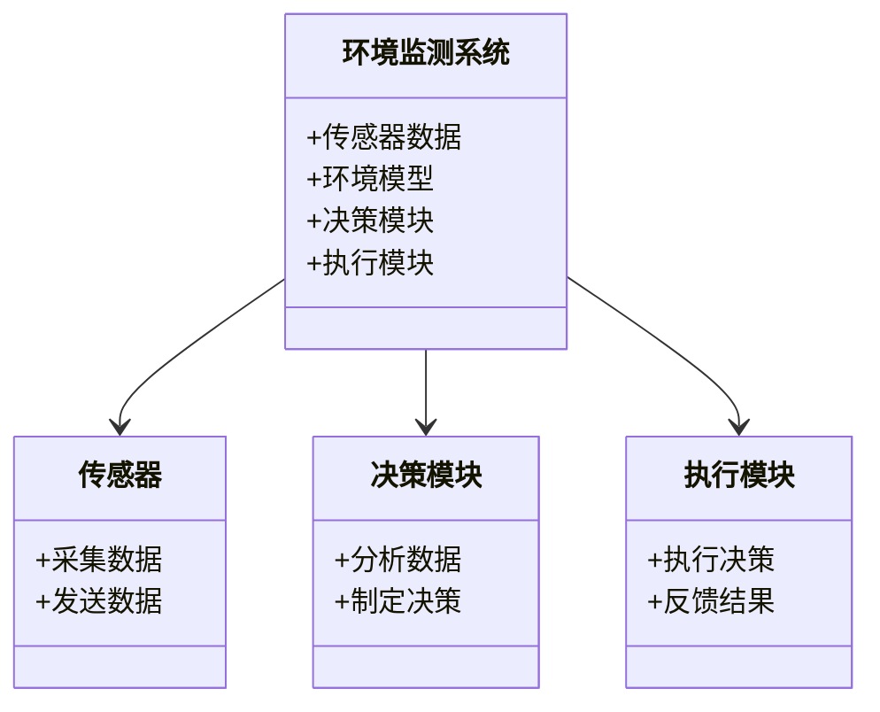
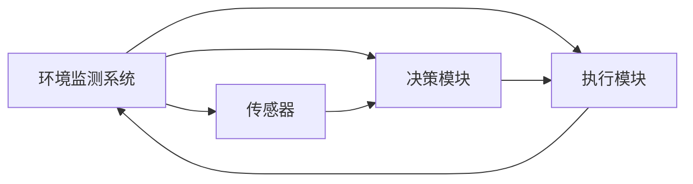
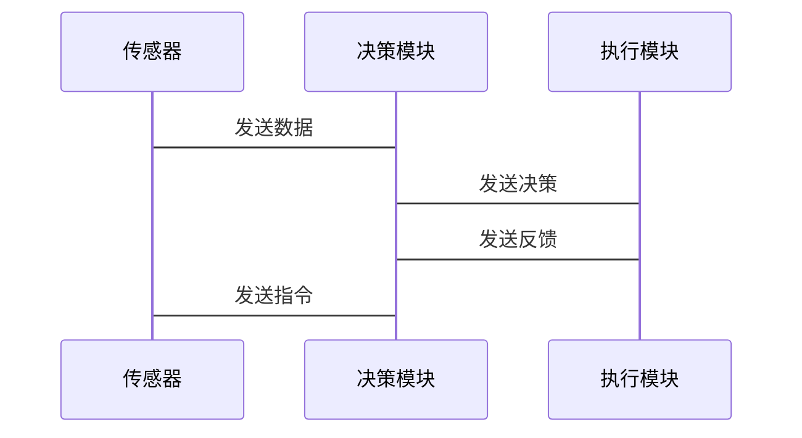

                 


# AI Agent在智能环境监测中的应用

> 关键词：AI Agent、智能环境监测、算法原理、系统架构、项目实战

> 摘要：本文深入探讨了AI Agent在智能环境监测中的应用，从基础概念到高级算法，从系统架构到项目实战，全面解析了AI Agent在环境监测中的核心作用。通过详细的技术分析和实际案例，展示了如何利用AI Agent提升环境监测的智能化水平。

---

## 第一部分: AI Agent与智能环境监测的背景介绍

### 第1章: AI Agent与智能环境监测概述

#### 1.1 AI Agent的基本概念

##### 1.1.1 AI Agent的定义与特点
AI Agent（人工智能代理）是一种能够感知环境、自主决策并执行任务的智能实体。它可以是一个软件程序、一个机器人，或者任何能够与环境交互的智能系统。AI Agent的核心特点包括：
- **自主性**：能够独立决策，无需人工干预。
- **反应性**：能够实时感知环境并做出响应。
- **目标导向**：具有明确的目标，驱动其行为。
- **学习能力**：能够通过数据和经验不断优化自身的性能。

##### 1.1.2 AI Agent的核心要素与功能
AI Agent的功能可以分为以下几个核心要素：
- **感知**：通过传感器或数据源获取环境信息。
- **决策**：基于感知的信息，通过算法做出决策。
- **执行**：根据决策结果执行相应的动作。
- **学习**：通过反馈不断优化自身的感知、决策和执行能力。

##### 1.1.3 AI Agent与智能环境监测的关系
智能环境监测是指利用先进的技术手段，实时、准确地监测和评估环境状态。AI Agent在其中扮演着关键角色，它能够处理海量的环境数据，快速做出决策，并通过执行机构实现对环境的干预。

#### 1.2 智能环境监测的背景与意义

##### 1.2.1 环境监测的定义与传统方法
环境监测是指对空气、水、土壤等环境要素进行定期检测和评估的过程。传统环境监测主要依赖人工采样和实验室分析，这种方法效率低、成本高，且难以实时响应环境变化。

##### 1.2.2 智能环境监测的发展趋势
随着人工智能技术的发展，智能环境监测逐渐成为环境管理的重要手段。通过AI Agent，可以实现环境数据的实时采集、智能分析和自动响应，大大提高了环境监测的效率和准确性。

##### 1.2.3 AI Agent在环境监测中的优势
AI Agent的优势在于其智能化和自主性。它能够处理复杂的环境数据，快速识别潜在的环境风险，并通过自主决策实现对环境的实时监控和干预。

#### 1.3 本章小结

##### 1.3.1 AI Agent的核心作用
AI Agent通过感知、决策和执行，能够显著提升环境监测的效率和准确性。

##### 1.3.2 智能环境监测的未来展望
随着AI技术的不断进步，智能环境监测将更加智能化和自动化，AI Agent将在其中发挥越来越重要的作用。

---

## 第二部分: AI Agent的核心概念与原理

### 第2章: AI Agent的核心原理

#### 2.1 AI Agent的分类与特点

##### 2.1.1 知识型AI Agent
知识型AI Agent依赖于预定义的知识库，能够根据知识库中的信息做出决策。例如，专家系统。

##### 2.1.2 数据驱动型AI Agent
数据驱动型AI Agent通过机器学习算法，从大量数据中提取特征并进行模式识别。例如，基于神经网络的图像识别系统。

##### 2.1.3 混合型AI Agent
混合型AI Agent结合了知识型和数据驱动型的优势，能够同时利用知识库和数据驱动的方法进行决策。例如，医疗诊断系统。

#### 2.2 AI Agent的决策机制

##### 2.2.1 基于规则的决策
基于规则的决策系统通过预定义的规则库进行推理和决策。例如，简单的条件判断语句。

##### 2.2.2 基于机器学习的决策
基于机器学习的决策系统通过训练模型，能够从数据中学习到决策规则。例如，随机森林、支持向量机等。

##### 2.2.3 基于强化学习的决策
强化学习是一种通过试错学习的决策方法，AI Agent通过与环境的交互，不断优化其决策策略。例如，Q-learning算法。

#### 2.3 AI Agent的通信与协作

##### 2.3.1 多智能体系统
多智能体系统是指多个AI Agent协同工作，共同完成复杂任务。例如，自动驾驶中的车辆协同决策。

##### 2.3.2 智能体之间的通信协议
智能体之间的通信需要遵循特定的协议，例如基于消息队列的通信机制。

##### 2.3.3 协作任务分配
协作任务分配是指多个智能体之间如何分配任务，以达到整体最优。例如，基于拍卖机制的任务分配。

#### 2.4 本章小结

##### 2.4.1 AI Agent的核心原理总结
AI Agent通过感知、决策和执行，能够实现智能化的环境监测。

##### 2.4.2 AI Agent在环境监测中的应用潜力
AI Agent在环境监测中的应用潜力巨大，尤其是在实时监控和应急响应方面。

---

## 第三部分: AI Agent在环境监测中的算法原理

### 第3章: AI Agent的算法原理

#### 3.1 强化学习算法

##### 3.1.1 Q-learning算法
Q-learning是一种经典的强化学习算法，通过维护Q表来记录状态-动作对的价值，逐步优化决策策略。

$$ Q(s,a) = Q(s,a) + \alpha \left( r + \gamma \max Q(s',a') - Q(s,a) \right) $$

其中：
- $Q(s,a)$ 表示当前状态$s$和动作$a$的Q值。
- $\alpha$ 是学习率。
- $\gamma$ 是折扣因子。
- $r$ 是奖励值。
- $s'$ 是下一个状态。

##### 3.1.2 Deep Q-Network (DQN)算法
DQN是一种基于深度学习的强化学习算法，通过神经网络来近似Q值函数。

##### 3.1.3 算法流程图（使用mermaid）
```mermaid
graph TD
    A[开始] --> B[初始化]
    B --> C[选择动作]
    C --> D[执行动作]
    D --> E[获取奖励]
    E --> F[更新Q值]
    F --> G[判断是否结束]
    G --> H[结束] 或者 H[继续]
```

#### 3.2 其他算法

##### 3.2.1 机器学习算法
- **监督学习**：用于分类和回归任务。
- **无监督学习**：用于聚类和降维任务。

##### 3.2.2 群智算法
群智算法是一种基于群体智能的算法，通过多个智能体的协作实现目标。

---

## 第四部分: 系统分析与架构设计

### 第4章: 系统分析与架构设计

#### 4.1 问题场景介绍
在智能环境监测中，我们需要实时监测空气质量、水质等环境参数，并根据监测结果采取相应的措施。

#### 4.2 项目介绍
本项目旨在设计一个基于AI Agent的智能环境监测系统，实现对环境数据的实时采集、智能分析和自动响应。

#### 4.3 系统功能设计

##### 4.3.1 领域模型（领域模型Mermaid类图）


#### 4.4 系统架构设计

##### 4.4.1 系统架构图（Mermaid架构图）


#### 4.5 系统接口设计

##### 4.5.1 接口设计
- **传感器接口**：用于采集环境数据。
- **决策模块接口**：用于接收传感器数据并返回决策结果。
- **执行模块接口**：用于执行决策并反馈执行结果。

#### 4.6 系统交互流程（Mermaid序列图）



---

## 第五部分: 项目实战

### 第5章: 项目实战

#### 5.1 环境安装
需要安装Python、TensorFlow、Keras等库。

#### 5.2 核心代码实现

##### 5.2.1 传感器数据采集
```python
import numpy as np

class Sensor:
    def __init__(self):
        self.data = []
    
    def collect_data(self):
        # 模拟传感器数据采集
        self.data.append(np.random.random())
```

##### 5.2.2 决策模块实现
```python
class DecisionModule:
    def __init__(self):
        self.model = self.build_model()
    
    def build_model(self):
        # 模拟神经网络模型
        pass
    
    def make_decision(self, data):
        # 根据数据做出决策
        pass
```

##### 5.2.3 执行模块实现
```python
class ExecutionModule:
    def __init__(self):
        pass
    
    def execute_action(self, action):
        # 执行动作
        pass
```

#### 5.3 代码应用解读与分析
详细解读上述代码的实现逻辑和应用场景。

#### 5.4 实际案例分析
通过具体案例分析AI Agent在环境监测中的实际应用。

#### 5.5 项目小结
总结项目实现的关键点和经验教训。

---

## 第六部分: 总结与扩展

### 第6章: 总结与扩展

#### 6.1 最佳实践 tips
- 确保数据的实时性和准确性。
- 合理设计系统架构，确保系统的可扩展性。
- 定期更新模型，提升系统的适应性。

#### 6.2 小结
AI Agent在智能环境监测中的应用前景广阔，通过不断优化算法和系统架构，可以进一步提升环境监测的智能化水平。

#### 6.3 注意事项
- 数据隐私和安全问题。
- 系统的稳定性和可靠性。

#### 6.4 拓展阅读
推荐相关书籍和论文，供读者进一步学习。

---

通过以上内容，我们详细探讨了AI Agent在智能环境监测中的应用，从基础概念到算法实现，从系统设计到项目实战，全面解析了AI Agent在环境监测中的核心作用。希望本文能够为读者提供有价值的参考和启发。

