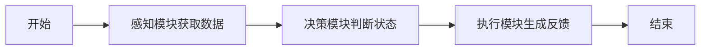
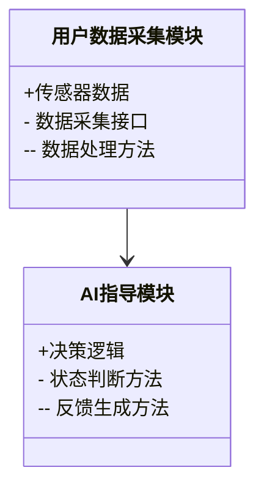

                 


# AI Agent在智能瑜伽垫中的冥想指导

## 关键词：AI Agent, 智能瑜伽垫, 冥想指导, 强化学习, 系统架构设计, 项目实战

## 摘要：本文探讨了AI Agent在智能瑜伽垫中的应用，特别是在冥想指导方面的创新。通过分析AI Agent的核心原理、算法设计、系统架构，结合实际案例，展示了如何利用AI技术提升冥想体验，为智能健康领域提供了新的解决方案。

---

# 第一部分: AI Agent与智能瑜伽垫的背景介绍

## 第1章: AI Agent与智能瑜伽垫概述

### 1.1 问题背景与描述

#### 1.1.1 现代冥想指导的挑战
现代人面临高压生活，冥想成为缓解压力的重要方式。传统冥想指导依赖真人教练，存在时间、空间和成本限制，难以大规模普及。此外，个体差异导致传统方法难以实现个性化指导。

#### 1.1.2 智能瑜伽垫的出现
智能瑜伽垫通过传感器技术采集用户生理数据（如心率、呼吸频率、体位角度等），结合AI技术提供实时反馈和指导。

#### 1.1.3 AI Agent在冥想指导中的作用
AI Agent作为智能瑜伽垫的核心，能够实时分析用户数据，提供个性化指导，帮助用户进入深度冥想状态。

### 1.2 问题解决与边界

#### 1.2.1 AI Agent如何解决冥想指导问题
AI Agent通过感知用户状态、做出决策并执行反馈，实时调整指导策略，提升冥想效果。

#### 1.2.2 边界与外延
AI Agent仅处理冥想指导相关数据，不涉及用户隐私保护之外的功能，如医疗诊断等。

#### 1.2.3 核心要素与组成
- **感知模块**：采集用户数据
- **决策模块**：分析数据并制定指导策略
- **执行模块**：输出指导反馈

---

# 第二部分: AI Agent的核心概念与原理

## 第2章: AI Agent的核心原理

### 2.1 感知模块

#### 2.1.1 数据采集与处理
智能瑜伽垫通过压力传感器、心率监测器等设备采集用户生理数据。

#### 2.1.2 传感器数据解析
将采集到的原始数据转换为可分析的特征，如心率变异性（HRV）。

### 2.2 决策模块

#### 2.2.1 状态识别与判断
基于生理数据和用户行为，识别用户当前的冥想状态（放松、专注、紧张）。

#### 2.2.2 决策逻辑与策略
根据用户状态，AI Agent决定反馈内容，例如提醒用户调整呼吸节奏。

### 2.3 执行模块

#### 2.3.1 指导反馈生成
生成个性化的指导建议，如“深呼吸，放松全身”。

#### 2.3.2 用户交互设计
通过震动、声音或触感反馈与用户交互，确保指导信息及时传达。

---

# 第三部分: 算法原理与数学模型

## 第3章: 强化学习算法在冥想指导中的应用

### 3.1 算法流程图


### 3.2 算法实现

#### 3.2.1 基于Q-learning的强化学习算法
```python
import numpy as np

class AI-Agent:
    def __init__(self, state_space=3, action_space=3):
        self.q_table = np.zeros((state_space, action_space))
        self.learning_rate = 0.1
        self.discount_factor = 0.9

    def perceive(self, state):
        # 状态处理
        return state

    def choose_action(self, state):
        # 探索与利用
        if np.random.random() < 0.1:
            return np.random.randint(0, 3)
        return np.argmax(self.q_table[state])

    def update_q_table(self, state, action, reward, next_state):
        # Q-learning更新
        self.q_table[state][action] = self.q_table[state][action] + self.learning_rate * (reward + self.discount_factor * np.max(self.q_table[next_state]) - self.q_table[state][action])
```

### 3.3 数学模型
强化学习的Q-learning算法更新公式为：
$$ Q(s, a) = Q(s, a) + \alpha (r + \gamma \max Q(s', a')) $$

---

# 第四部分: 系统架构与设计

## 第4章: 系统架构设计

### 4.1 项目背景与目标
智能瑜伽垫通过AI Agent实现个性化冥想指导，目标是帮助用户高效进入深度冥想状态。

### 4.2 系统功能设计

#### 4.2.1 用户数据采集模块
- **传感器类型**：压力传感器、心率监测器
- **数据采集频率**：实时采集

#### 4.2.2 AI指导模块
- **决策逻辑**：基于生理数据和用户行为，实时调整指导策略
- **反馈方式**：震动、声音或触感反馈

### 4.3 系统架构图


---

# 第五部分: 项目实战

## 第5章: 项目实战

### 5.1 环境搭建

#### 5.1.1 系统需求
- 操作系统：Linux/Windows/MacOS
- 开发工具：Python 3.8+
- 传感器：心率传感器、压力传感器

#### 5.1.2 环境配置
安装必要的库：
```bash
pip install numpy scikit-learn
```

### 5.2 核心代码实现

#### 5.2.1 感知模块实现
```python
import numpy as np

def感知模块实现：
    传感器数据采集
    数据预处理
    返回特征向量
```

#### 5.2.2 决策模块实现
```python
def决策模块实现：
    输入特征向量
    调用Q-learning算法
    输出动作
```

#### 5.2.3 执行模块实现
```python
def执行模块实现：
    输入动作
    生成反馈信号
    输出反馈
```

### 5.3 功能解读与案例分析
通过实际案例分析AI Agent在冥想指导中的应用效果，展示如何通过传感器数据优化指导策略。

---

# 第六部分: 总结与展望

## 第6章: 总结与展望

### 6.1 总结
本文详细介绍了AI Agent在智能瑜伽垫中的应用，从感知、决策到执行模块，结合强化学习算法，展示了如何实现个性化的冥想指导。

### 6.2 最佳实践 tips
- 数据采集的准确性直接影响指导效果
- 算法调参需结合实际用户反馈
- 系统设计需考虑用户体验

### 6.3 小结
AI Agent在智能瑜伽垫中的应用为冥想指导提供了新的可能性，未来可通过引入更多传感器数据和优化算法进一步提升指导效果。

### 6.4 注意事项
- 保护用户隐私
- 确保系统稳定性
- 定期更新算法模型

### 6.5 拓展阅读
推荐相关书籍和论文，进一步深入学习AI在健康领域的应用。

---

通过以上结构和内容，本文系统地介绍了AI Agent在智能瑜伽垫中的应用，从理论到实践，为读者提供了全面的技术指导。

