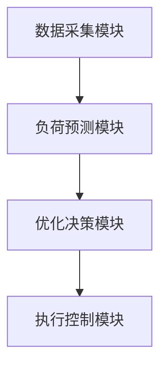
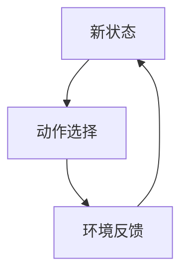

                 


# AI Agent在智能电力负荷均衡中的应用

> 关键词：AI Agent，电力负荷均衡，智能电网，强化学习，分布式能源管理，负荷预测，优化算法

> 摘要：  
电力负荷均衡是智能电网中的核心问题，旨在合理分配电力资源以满足用户需求并确保电网稳定运行。本文系统地探讨了AI Agent在电力负荷均衡中的应用，从AI Agent的基本概念到其在电力系统中的具体应用场景，结合数学模型和优化算法，详细阐述了AI Agent如何通过强化学习、多智能体协作等技术实现电力负荷的智能优化。本文还通过实际案例展示了AI Agent在电力负荷均衡中的应用效果，并提出了未来的发展方向。

---

# 第一部分: AI Agent与智能电力负荷均衡概述

## 第1章: AI Agent的基本概念与技术背景

### 1.1 AI Agent的定义与核心特征

#### 1.1.1 AI Agent的定义
AI Agent（人工智能代理）是指能够感知环境、自主决策并执行任务的智能实体。它能够通过传感器获取信息，利用算法进行分析和决策，并通过执行器与环境交互。

#### 1.1.2 AI Agent的核心特征
| 特征 | 描述 |
|------|------|
| 智能性 | 能够自主学习和适应环境 |
| 反应性 | 能够实时感知并响应环境变化 |
| 主动性 | 能够主动采取行动以实现目标 |
| 社会性 | 能够与其他智能体协作或竞争 |

#### 1.1.3 AI Agent与传统自动化的区别
AI Agent不仅能够执行预设任务，还能够通过学习和推理优化任务执行方式，具有更强的适应性和灵活性。

### 1.2 智能电力负荷均衡的背景与意义

#### 1.2.1 电力负荷均衡的定义
电力负荷均衡是指在电力系统中，根据电力需求和供应的动态变化，合理分配电力资源，确保电力供需平衡。

#### 1.2.2 当前电力系统面临的挑战
| 挑战 | 描述 |
|------|------|
| 负荷波动 | 用户需求的不确定性导致负荷波动 |
| 分布式能源 | 可再生能源的接入增加了系统的复杂性 |
| 节能需求 | 如何在满足负荷需求的同时实现能源节约 |

#### 1.2.3 AI Agent在电力负荷均衡中的作用
AI Agent能够通过实时感知负荷变化、优化资源分配，帮助电力系统实现高效、稳定的运行。

---

## 第2章: AI Agent在电力系统中的应用现状

### 2.1 电力系统中的智能化需求

#### 2.1.1 智能电网的概念
智能电网是指通过信息通信技术、互联网技术和电力系统相结合，实现电力的高效、可靠和经济的传输与分配。

#### 2.1.2 电力负荷预测的挑战
电力负荷预测需要考虑多种因素，如天气、用户行为、设备状态等，具有高度不确定性。

#### 2.1.3 AI技术在电力系统中的应用领域
| 领域 | 描述 |
|------|------|
| 负荷预测 | 使用AI技术预测电力需求 |
| 资源分配 | 优化电力资源的分配 |
| 故障诊断 | 通过AI检测电力系统故障 |

### 2.2 AI Agent在电力负荷均衡中的应用案例

#### 2.2.1 智能调度系统
通过AI Agent实现电力调度的智能化，优化电力传输路径，减少能量损耗。

#### 2.2.2 分布式能源管理
AI Agent能够协调分布式能源的输出，确保其与电网的稳定连接。

#### 2.2.3 用户行为预测与负荷优化
通过分析用户行为数据，AI Agent能够预测负荷需求，并制定最优的电力分配策略。

---

# 第二部分: AI Agent的核心原理与技术

## 第3章: AI Agent的核心原理

### 3.1 AI Agent的工作机制

#### 3.1.1 信息感知与状态识别
AI Agent通过传感器和数据采集系统获取环境信息，并通过特征提取和数据处理进行状态识别。

#### 3.1.2 行为决策与优化
AI Agent利用强化学习、决策树等算法进行行为决策，并通过优化算法不断改进决策策略。

#### 3.1.3 执行与反馈
AI Agent根据决策结果执行操作，并通过反馈机制调整后续行为。

### 3.2 AI Agent的决策算法

#### 3.2.1 强化学习算法
强化学习是一种通过试错机制优化决策策略的方法，适用于复杂的动态环境。

#### 3.2.2 多智能体协作机制
在电力负荷均衡中，多个AI Agent可以通过协作实现全局优化。

#### 3.2.3 基于模型的决策方法
基于模型的决策方法通过建立系统的数学模型进行预测和优化。

---

## 第4章: AI Agent的感知与学习能力

### 4.1 数据采集与特征提取

#### 4.1.1 电力负荷数据的采集方法
电力负荷数据可以通过智能电表、传感器等设备进行采集。

#### 4.1.2 数据预处理与特征工程
数据预处理包括清洗、归一化等，特征工程则通过提取关键特征提高模型性能。

#### 4.1.3 深度学习在特征提取中的应用
深度学习模型（如CNN、RNN）可以有效提取电力负荷数据中的复杂特征。

---

## 第5章: 电力负荷均衡的数学模型与优化方法

### 5.1 电力负荷均衡的数学模型

#### 5.1.1 目标函数
$$ \text{目标函数} = \sum_{i=1}^{n} w_i x_i $$
其中，$w_i$是权重，$x_i$是负荷分配变量。

#### 5.1.2 约束条件
电力负荷均衡需要满足以下约束：
$$ \sum_{i=1}^{n} x_i = D $$
$$ 0 \leq x_i \leq C_i $$

### 5.2 优化算法

#### 5.2.1 强化学习算法
强化学习通过奖励机制优化AI Agent的决策策略。

#### 5.2.2 遗传算法
遗传算法通过模拟自然选择和遗传变异实现全局优化。

---

## 第6章: 电力负荷均衡系统的架构设计

### 6.1 系统功能设计

#### 6.1.1 功能模块
- 数据采集模块
- 负荷预测模块
- 优化决策模块
- 执行控制模块

#### 6.1.2 功能流程
数据采集 → 负荷预测 → 优化决策 → 执行控制

### 6.2 系统架构设计

#### 6.2.1 系统架构图


#### 6.2.2 数据流设计
数据流从数据采集模块进入，经过负荷预测模块处理后，传递给优化决策模块，最终由执行控制模块输出指令。

---

## 第7章: 电力负荷均衡的算法实现

### 7.1 强化学习算法实现

#### 7.1.1 算法流程


#### 7.1.2 Python代码示例
```python
import numpy as np
import gym

env = gym.make('电力负荷均衡环境')
agent = AIAgent(env.observation_space.shape[0], env.action_space.n)
for episode in range(1000):
    state = env.reset()
    while True:
        action = agent.act(state)
        next_state, reward, done, _ = env.step(action)
        agent.remember(state, action, reward, next_state, done)
        state = next_state
        if done:
            break
```

---

## 第8章: 项目实战

### 8.1 某区域电力负荷优化案例

#### 8.1.1 项目背景
某地区电力负荷波动较大，希望通过AI Agent实现负荷优化。

#### 8.1.2 数据采集与处理
通过智能电表采集负荷数据，进行预处理和特征提取。

#### 8.1.3 模型训练与部署
使用强化学习算法训练AI Agent，并将其部署到电力系统中进行实时优化。

#### 8.1.4 实验结果与分析
通过实验验证AI Agent在电力负荷优化中的效果，包括负荷波动率、能量损耗率等指标。

---

## 第9章: 总结与展望

### 9.1 本书总结
本书系统地介绍了AI Agent在电力负荷均衡中的应用，从理论到实践进行了全面探讨。

### 9.2 未来展望
未来，AI Agent在电力负荷均衡中的应用将更加广泛，技术也将更加成熟。

---

通过以上目录和内容安排，您可以逐步构建《AI Agent在智能电力负荷均衡中的应用》这本书，确保每个章节都详细阐述相关知识，并结合实际案例和代码示例，帮助读者深入理解AI Agent在电力负荷均衡中的应用和实现方法。

