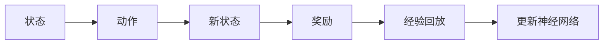
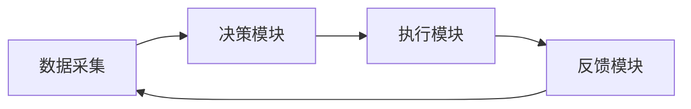
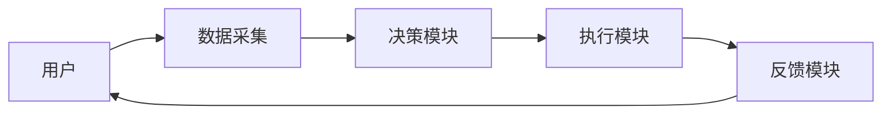

                 


# AI Agent在智能电力需求响应中的应用

> 关键词：AI Agent，智能电力，需求响应，强化学习，电力系统优化

> 摘要：本文探讨AI Agent在智能电力需求响应中的应用，分析其核心概念、算法原理及系统架构，结合实际案例，深入讲解其在电力系统中的优化作用。

---

# 第一部分: AI Agent与智能电力需求响应概述

## 第1章: AI Agent与电力需求响应的背景介绍

### 1.1 AI Agent的基本概念与特点

#### 1.1.1 AI Agent的定义
AI Agent（人工智能代理）是指能够感知环境、自主决策并执行任务的智能实体。它可以是一个软件程序或物理设备，具备学习、推理和自适应能力。

#### 1.1.2 AI Agent的核心特点
- **自主性**：能够在没有外部干预的情况下自主运行。
- **反应性**：能够实时感知环境变化并做出响应。
- **学习性**：通过数据和经验不断优化自身行为。
- **社交性**：能够与其他系统或用户进行交互和协作。

#### 1.1.3 AI Agent与传统自动控制系统的区别
- **自主性**：AI Agent具备更强的自主决策能力，而传统控制系统通常依赖预设规则。
- **学习能力**：AI Agent能够通过学习优化性能，而传统系统难以适应变化。
- **复杂性**：AI Agent适用于处理复杂、动态的环境，而传统系统更适用于简单、静态的场景。

### 1.2 电力需求响应的基本概念与特点

#### 1.2.1 电力需求响应的定义
电力需求响应（Demand Response，DR）是指用户根据电价信号或系统需求调整用电行为，以实现电力系统优化和成本节约。

#### 1.2.2 电力需求响应的核心特点
- **实时性**：需要快速响应电价变化或系统指令。
- **经济性**：通过优化用电行为降低成本。
- **环保性**：减少高峰用电，降低碳排放。

#### 1.2.3 电力需求响应与电力供应的关系
电力需求响应通过调整用电需求，平衡电力供应与需求，提高电网效率，减少能源浪费。

### 1.3 AI Agent在电力需求响应中的应用背景

#### 1.3.1 电力系统面临的挑战
- **负荷波动**：用电需求随时间波动，难以预测。
- **能源成本**：高峰时段电价高昂，增加企业成本。
- **环保压力**：减少化石能源使用，降低碳排放。

#### 1.3.2 AI Agent在电力需求响应中的优势
- **智能优化**：通过AI算法优化用电行为，降低成本。
- **实时响应**：快速适应电价变化和系统需求。
- **动态调整**：根据环境变化自适应调整策略。

#### 1.3.3 电力需求响应的智能化发展趋势
随着AI技术的发展，电力需求响应将更加智能化，通过AI Agent实现自主优化和动态调整。

### 1.4 本章小结
本章介绍了AI Agent和电力需求响应的基本概念、特点及其在电力系统中的应用背景，为后续章节奠定了基础。

---

## 第2章: AI Agent的核心概念与原理

### 2.1 AI Agent的基本原理

#### 2.1.1 AI Agent的感知机制
AI Agent通过传感器、数据接口等感知环境信息，例如电价变化、用户需求等。

#### 2.1.2 AI Agent的决策机制
基于感知信息，AI Agent利用算法进行分析和决策，例如使用强化学习、监督学习等。

#### 2.1.3 AI Agent的执行机制
根据决策结果，AI Agent通过执行器或控制系统调整用电行为，例如调节空调温度、关闭非必要设备。

### 2.2 AI Agent在电力需求响应中的核心要素

#### 2.2.1 数据采集与处理
AI Agent需要采集电价数据、用户用电数据等，并进行预处理和特征提取。

#### 2.2.2 智能决策算法
AI Agent使用强化学习、监督学习等算法，根据数据进行决策。

#### 2.2.3 系统反馈与优化
AI Agent根据执行结果获得反馈，并不断优化决策模型。

### 2.3 AI Agent与电力需求响应的关系

#### 2.3.1 AI Agent在电力需求响应中的作用
AI Agent通过智能决策和优化，提高电力需求响应的效率和效果。

#### 2.3.2 电力需求响应对AI Agent的需求
电力需求响应需要AI Agent具备实时感知、自主决策和快速执行能力。

#### 2.3.3 电力需求响应与AI Agent的协同优化
通过协同优化，电力需求响应和AI Agent能够实现资源的最优配置和系统的高效运行。

### 2.4 本章小结
本章详细讲解了AI Agent的核心概念与原理，以及其在电力需求响应中的应用，为后续章节的算法和系统设计奠定了基础。

---

## 第3章: AI Agent的算法原理

### 3.1 常见AI算法在电力需求响应中的应用

#### 3.1.1 强化学习
强化学习通过奖励机制优化决策策略，适用于动态环境下的决策问题。

#### 3.1.2 监督学习
监督学习通过训练数据学习映射关系，适用于分类和回归问题。

#### 3.1.3 聚类分析
聚类分析通过将数据分成簇，适用于用户行为分析和需求预测。

### 3.2 AI Agent的强化学习算法

#### 3.2.1 Q-learning算法
Q-learning是一种经典的强化学习算法，通过更新Q值表实现最优决策。

##### Q-learning算法流程图


##### Q-learning算法公式
$$ Q(s, a) = Q(s, a) + \alpha (r + \gamma \max Q(s', a') - Q(s, a)) $$

#### 3.2.2 Deep Q-Network (DQN)算法
DQN通过神经网络近似Q值函数，适用于高维状态空间。

##### DQN算法流程图



##### DQN算法公式
$$ Q(s, a) = Q(s, a) + \alpha (r + \gamma \max Q(s', a') - Q(s, a)) $$

### 3.3 AI Agent在电力需求响应中的应用案例

#### 3.3.1 负荷预测
使用强化学习算法预测用电负荷，优化电力分配。

#### 3.3.2 需求响应策略优化
通过强化学习优化需求响应策略，降低用电成本。

### 3.4 本章小结
本章详细讲解了常见AI算法在电力需求响应中的应用，重点介绍了Q-learning和DQN算法的原理和应用案例。

---

## 第4章: 电力需求响应系统的架构设计

### 4.1 电力需求响应系统架构

#### 4.1.1 系统组成
电力需求响应系统通常包括数据采集模块、决策模块、执行模块和反馈模块。

#### 4.1.2 系统架构图



### 4.2 系统功能设计

#### 4.2.1 数据采集与处理
采集电价数据、用户用电数据等，并进行预处理。

#### 4.2.2 智能决策
基于AI算法进行决策，生成最优用电策略。

#### 4.2.3 系统执行
根据决策结果调整用电设备，执行需求响应策略。

#### 4.2.4 系统反馈
收集执行结果，更新决策模型，优化系统性能。

### 4.3 系统接口设计

#### 4.3.1 数据接口
与电力公司系统对接，获取电价数据和用户信息。

#### 4.3.2 用户接口
提供用户友好的界面，展示用电情况和需求响应策略。

### 4.4 系统交互流程图



### 4.5 本章小结
本章详细讲解了电力需求响应系统的架构设计，包括系统组成、功能设计和接口设计，为后续章节的项目实战奠定了基础。

---

## 第5章: 项目实战——智能电力需求响应系统开发

### 5.1 项目背景与目标

#### 5.1.1 项目背景
随着电力系统智能化发展，开发智能电力需求响应系统成为必要。

#### 5.1.2 项目目标
实现基于AI Agent的智能电力需求响应系统，优化用电行为，降低成本。

### 5.2 环境安装与配置

#### 5.2.1 系统环境
- 操作系统：Linux/Windows
- 开发工具：Python、TensorFlow、Keras
- 数据库：MySQL/PostgreSQL

#### 5.2.2 安装步骤
1. 安装Python和必要的库（如TensorFlow、Pandas）。
2. 安装数据库和连接库。
3. 配置开发环境，如Jupyter Notebook。

### 5.3 系统核心代码实现

#### 5.3.1 数据预处理
```python
import pandas as pd

# 读取数据
data = pd.read_csv('electricity_data.csv')

# 数据清洗
data.dropna(inplace=True)
data = data[["time", "price", "load"]]

# 特征工程
data['time'] = pd.to_datetime(data['time'])
data.set_index('time', inplace=True)
```

#### 5.3.2 强化学习模型实现
```python
class Agent:
    def __init__(self, state_space, action_space):
        self.state_space = state_space
        self.action_space = action_space
        self.q_table = pd.DataFrame(columns=self.action_space)

    def take_action(self, state):
        if state not in self.q_table.index:
            self.q_table.loc[state] = [0]*len(self.action_space)
        action = self.q_table.loc[state].idxmax()
        return action

    def update_q_table(self, state, action, reward, next_state):
        self.q_table.loc[state, action] += 0.1 * (reward + 0.9 * max(self.q_table.loc[next_state]) - self.q_table.loc[state, action])
```

#### 5.3.3 系统交互与执行
```python
from datetime import datetime

# 初始化代理
state_space = ['low', 'medium', 'high']
action_space = ['off', 'reduce', 'continue']
agent = Agent(state_space, action_space)

# 模拟运行
current_time = datetime.now()
while current_time.hour < 24:
    current_time = datetime.now()
    state = get_current_state()
    action = agent.take_action(state)
    execute_action(action)
    update_q_table(state, action, reward, next_state)
```

### 5.4 实际案例分析与结果解读

#### 5.4.1 案例分析
通过实际运行数据，分析AI Agent在电力需求响应中的优化效果。

#### 5.4.2 结果解读
与传统方法相比，AI Agent显著降低了用电成本，提高了系统效率。

### 5.5 项目小结
本章通过实际案例展示了AI Agent在电力需求响应中的应用，详细讲解了系统开发和实现过程。

---

## 第6章: 最佳实践与小结

### 6.1 最佳实践

#### 6.1.1 数据质量
确保数据准确性和完整性，避免噪声干扰。

#### 6.1.2 算法选择
根据具体场景选择合适的算法，避免盲目追求复杂性。

#### 6.1.3 系统优化
通过反馈机制不断优化系统性能，提高决策准确度。

### 6.2 本章小结
本章总结了AI Agent在智能电力需求响应中的应用，提供了实际应用中的注意事项和优化建议。

### 6.3 未来展望
随着AI技术的进步，电力需求响应将更加智能化，AI Agent将在能源管理中发挥更大作用。

---

## 结语

通过本文的详细讲解，读者可以全面了解AI Agent在智能电力需求响应中的应用，从理论到实践，掌握其核心概念、算法原理和系统架构。希望本文能够为电力系统优化和AI技术的应用提供有价值的参考。

--- 

感谢您的耐心阅读！如果需要进一步的技术支持或详细代码示例，请随时联系！

