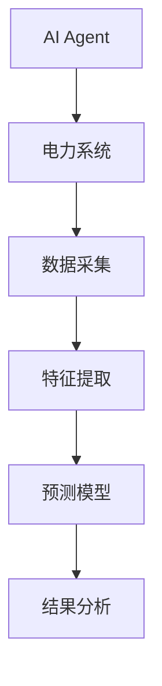
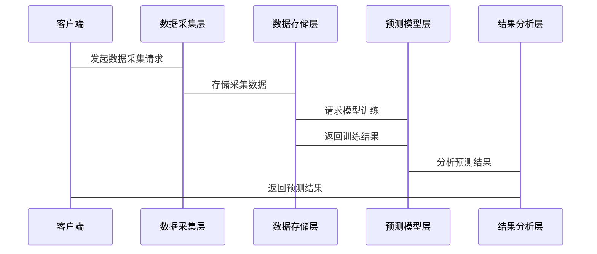

                 


# AI Agent在智能电力需求预测中的应用

## 关键词：AI Agent, 电力需求预测, 人工智能, 机器学习, 智能系统

## 摘要：AI Agent作为一种智能代理技术，在电力需求预测中展现出独特的优势。本文从AI Agent的基本概念出发，探讨其在电力需求预测中的应用背景、核心原理、算法实现及系统架构设计，并通过实际案例展示AI Agent在电力需求预测中的具体应用。文章最后总结了AI Agent在该领域的优势及未来发展方向。

---

# 第一部分: AI Agent与电力需求预测的背景

## 第1章: AI Agent与电力需求预测概述

### 1.1 AI Agent的基本概念

#### 1.1.1 AI Agent的定义与特点
- **定义**：AI Agent（智能代理）是指能够感知环境、做出决策并采取行动以实现特定目标的智能实体。
- **特点**：
  - **自主性**：能够在没有外部干预的情况下自主运作。
  - **反应性**：能够实时感知环境变化并做出响应。
  - **学习能力**：通过数据和经验不断优化自身的预测和决策能力。
  - **适应性**：能够适应不同的环境和任务需求。

#### 1.1.2 AI Agent的核心原理
- **状态感知**：通过传感器或数据源获取环境信息。
- **目标设定**：根据感知信息确定需要实现的目标。
- **行动决策**：基于目标和当前状态，选择最优行动方案。
- **行动执行**：执行决策并观察结果。
- **反馈优化**：根据反馈调整模型和策略，以提高预测准确性。

#### 1.1.3 AI Agent与传统算法的区别
| 特性             | AI Agent                     | 传统算法                 |
|------------------|------------------------------|--------------------------|
| 自主性           | 高                           | 低或无                   |
| 学习能力         | 强，支持在线学习             | 较弱，通常需要重新训练     |
| 适应性           | 强，能够实时调整             | 较弱，适应性有限           |
| 决策能力         | 高，能够处理复杂问题         | 较低，通常处理特定任务     |
| 反馈机制         | 有，能够根据反馈优化         | 通常没有反馈优化机制       |

### 1.2 电力需求预测的背景与挑战

#### 1.2.1 电力需求预测的重要性
- **能源管理**：准确预测电力需求有助于优化能源分配，减少浪费。
- **电网稳定性**：预测电力需求有助于确保电网的稳定运行，避免电力短缺或过剩。
- **成本控制**：通过合理预测需求，可以降低发电和配电的成本。

#### 1.2.2 电力需求预测的传统方法
- **时间序列分析**：如ARIMA模型，基于历史数据进行预测。
- **统计方法**：如回归分析，用于分析变量之间的关系。
- **专家系统**：依赖专家经验进行预测。

#### 1.2.3 电力需求预测的难点与挑战
- **数据多样性**：需求数据受季节、天气、经济等多种因素影响。
- **模型复杂性**：需要处理高维数据和复杂的非线性关系。
- **实时性要求**：电力系统需要实时预测，对计算速度要求高。

### 1.3 AI Agent在电力需求预测中的应用前景

#### 1.3.1 AI Agent在电力系统中的潜在应用
- **智能调度**：优化电力分配，提高效率。
- **故障预测**：通过实时数据预测设备故障，提前进行维护。

#### 1.3.2 AI Agent在电力需求预测中的优势
- **高效性**：能够快速处理大量数据，实时更新预测结果。
- **准确性**：通过深度学习等技术，提高预测精度。
- **适应性**：能够根据环境变化自动调整预测模型。

#### 1.3.3 AI Agent应用的未来发展趋势
- **多智能体协作**：多个AI Agent协作，提高预测的准确性和鲁棒性。
- **边缘计算**：将AI Agent部署在边缘设备，实现本地实时预测。
- **人机协作**：结合人类专家的经验，提升预测系统的智能化水平。

---

# 第二部分: AI Agent的核心概念与原理

## 第2章: AI Agent的核心原理

### 2.1 AI Agent的基本工作原理

#### 2.1.1 状态感知与目标设定
- **状态感知**：通过传感器或数据源获取环境信息，如电力需求、天气状况等。
- **目标设定**：根据当前状态和历史数据，确定预测的目标，如未来24小时的电力需求。

#### 2.1.2 行动决策与执行
- **行动决策**：基于感知的状态和预设的目标，选择最优的预测模型或参数。
- **行动执行**：运行预测模型，生成预测结果。

#### 2.1.3 反馈机制与优化
- **反馈机制**：根据实际结果与预测结果的差异，调整预测模型或参数。
- **优化**：通过反馈不断优化模型，提高预测精度。

### 2.2 AI Agent在电力需求预测中的具体应用

#### 2.2.1 数据采集与特征提取
- **数据采集**：通过传感器、数据库等获取电力需求的历史数据。
- **特征提取**：从原始数据中提取有用的特征，如时间、温度、节假日等。

#### 2.2.2 预测模型的构建与优化
- **模型构建**：选择合适的算法（如LSTM、ARIMA等）构建预测模型。
- **模型优化**：通过调参、交叉验证等方法，提高模型的预测精度。

#### 2.2.3 结果分析与决策支持
- **结果分析**：对预测结果进行分析，找出潜在的问题或异常情况。
- **决策支持**：根据分析结果，为电力调度提供决策支持。

### 2.3 AI Agent的核心概念图



---

# 第三部分: 电力需求预测的算法原理

## 第3章: 常见预测算法原理

### 3.1 时间序列分析

#### 3.1.1 ARIMA模型原理

- **ARIMA模型**：自回归积分滑动平均模型，适用于线性时间序列数据。
- **数学公式**：
  $$ ARIMA(p, d, q) $$
  - \( p \)：自回归阶数
  - \( d \)：差分阶数
  - \( q \)：滑动平均阶数

#### 3.1.2 LSTM模型原理

- **LSTM模型**：长短期记忆网络，适用于处理长序列数据。
- **网络结构**：
  - **输入门**：控制信息的输入。
  - **遗忘门**：决定哪些信息需要遗忘。
  - **输出门**：决定输出的信息。

#### 3.1.3 Prophet模型

- **Prophet模型**：由Facebook开源的时间序列预测模型，基于ARIMA和LSTM的混合模型。
- **优点**：
  - 易用性高，适合非专业用户。
  - 具有自动特征工程能力。

### 3.2 机器学习算法

#### 3.2.1 支持向量回归（SVR）

- **SVR模型**：通过构建支持向量回归模型，对数据进行非线性回归。
- **数学公式**：
  $$ y = \text{sign}(\sum_{i=1}^n \alpha_i (x_i \cdot x + b)) $$

#### 3.2.2 随机森林回归（Random Forest）

- **Random Forest模型**：通过集成多个决策树，提高预测的准确性和鲁棒性。
- **优点**：
  - 能够处理高维数据。
  - 对噪声数据具有较强的鲁棒性。

#### 3.2.3 神经网络（ANN）

- **ANN模型**：通过多层神经网络，对数据进行非线性拟合。
- **网络结构**：
  - **输入层**：接收输入数据。
  - **隐藏层**：通过神经元进行特征提取。
  - **输出层**：输出预测结果。

### 3.3 深度学习算法

#### 3.3.1 卷积神经网络（CNN）

- **CNN模型**：通过卷积操作提取局部特征，适用于图像和时序数据。
- **数学公式**：
  $$ f(x) = \text{conv}(x, W) + b $$

#### 3.3.2 循环神经网络（RNN）

- **RNN模型**：通过循环结构处理序列数据，适用于时间依赖性强的任务。
- **数学公式**：
  $$ s_t = \sigma(W_{hh} s_{t-1} + W_{xh} x_t + b_h) $$
  $$ y_t = W_{hy} s_t + b_y $$

#### 3.3.3 图神经网络（GNN）

- **GNN模型**：通过图结构数据，建模实体之间的关系，适用于复杂的网络结构。
- **数学公式**：
  $$ z_i = \text{aggregate}(\{z_j | j \in N(i)\}) $$
  $$ h_i = \text{transform}(z_i, h_{i-1}) $$

---

# 第四部分: 系统分析与架构设计

## 第4章: 电力需求预测系统的架构设计

### 4.1 系统概述

电力需求预测系统是一个复杂的智能系统，集成了数据采集、特征工程、模型训练、预测推理和结果分析等多个模块。系统的目标是通过AI Agent技术，实现电力需求的实时预测和优化。

### 4.2 系统功能设计

#### 4.2.1 数据采集模块

- **功能**：从各种数据源（如数据库、传感器）采集电力需求的历史数据。
- **流程**：
  1. 确定数据源。
  2. 采集数据。
  3. 数据清洗和预处理。

#### 4.2.2 数据预处理模块

- **功能**：对采集到的数据进行清洗、归一化和特征提取。
- **流程**：
  1. 清洗数据，去除异常值。
  2. 对数据进行归一化处理。
  3. 提取有用的特征，如时间、温度、节假日等。

#### 4.2.3 预测模型构建模块

- **功能**：选择合适的算法，构建预测模型。
- **流程**：
  1. 选择算法（如LSTM、ARIMA等）。
  2. 构建模型。
  3. 训练模型，调整参数，优化模型。

#### 4.2.4 结果分析模块

- **功能**：对预测结果进行分析，评估模型的准确性和稳定性。
- **流程**：
  1. 计算预测误差（如均方误差、平均绝对误差）。
  2. 可视化预测结果。
  3. 根据结果优化模型或调整参数。

### 4.3 系统架构设计

```mermaid
diagram
    客户端 <--API--> 数据采集层
    数据采集层 <--DB--> 数据存储层
    数据存储层 <--训练--> 预测模型层
    预测模型层 <--推理--> 结果分析层
```

### 4.4 系统接口设计

#### 4.4.1 数据接口

- **功能**：定义数据输入和输出的接口。
- **接口描述**：
  - 输入接口：接收原始数据。
  - 输出接口：输出处理后的数据。

#### 4.4.2 模型接口

- **功能**：定义模型训练和推理的接口。
- **接口描述**：
  - 训练接口：接收训练数据和参数。
  - 推理接口：接收输入数据，返回预测结果。

#### 4.4.3 结果接口

- **功能**：定义结果输出和展示的接口。
- **接口描述**：
  - 输出接口：输出预测结果和评估指标。
  - 展示接口：将结果可视化展示。

### 4.5 系统交互流程



---

# 第五部分: 项目实战

## 第5章: 电力需求预测项目实战

### 5.1 项目背景与目标

本项目旨在利用AI Agent技术，构建一个电力需求预测系统，实现对电力需求的实时预测和优化。

### 5.2 项目环境搭建

#### 5.2.1 安装Python与相关库

```bash
pip install numpy pandas scikit-learn tensorflow
```

#### 5.2.2 数据集获取与预处理

```python
import pandas as pd
import numpy as np

# 加载数据集
df = pd.read_csv('电力需求数据.csv')

# 数据预处理
data = df['需求量'].values
data = data.reshape(-1, 1)

# 划分训练集和测试集
train = data[:1000]
test = data[1000:]
```

### 5.3 系统核心实现

#### 5.3.1 数据采集与特征工程

```python
import pandas as pd
import numpy as np

# 数据加载
df = pd.read_csv('电力需求数据.csv')

# 数据预处理
data = df['需求量'].values
data = data.reshape(-1, 1)
```

#### 5.3.2 模型训练与优化

```python
from keras.models import Sequential
from keras.layers import LSTM, Dense

# 构建模型
model = Sequential()
model.add(LSTM(50, input_shape=(None, 1)))
model.add(Dense(1))
model.compile(optimizer='adam', loss='mse')

# 训练模型
model.fit(train, epochs=50, batch_size=32, verbose=1)
```

#### 5.3.3 结果可视化与分析

```python
import matplotlib.pyplot as plt

# 预测
predicted = model.predict(test)

# 可视化
plt.figure(figsize=(12, 6))
plt.plot(test.reshape(-1), label='实际值')
plt.plot(predicted.reshape(-1), label='预测值')
plt.legend()
plt.show()

# 评估
mse = mean_squared_error(test.reshape(-1), predicted.reshape(-1))
print(f"均方误差: {mse}")
```

### 5.4 项目小结

通过本项目，我们成功构建了一个基于AI Agent的电力需求预测系统，实现了对电力需求的实时预测和优化。系统具有高效性、准确性和适应性，能够为电力调度提供有力支持。

---

# 第六部分: 最佳实践与小结

## 第6章: AI Agent在电力需求预测中的最佳实践

### 6.1 实践中的注意事项

- **数据质量**：确保数据的准确性和完整性。
- **模型选择**：根据具体场景选择合适的算法。
- **系统优化**：通过并行计算、分布式训练等技术优化系统性能。

### 6.2 优化建议

- **数据增强**：通过数据增强技术，增加数据多样性。
- **模型融合**：结合多种模型，提高预测精度。
- **实时反馈**：建立实时反馈机制，动态优化模型。

### 6.3 未来发展方向

- **多智能体协作**：研究多个AI Agent协作的机制，提高预测的准确性和鲁棒性。
- **边缘计算**：将AI Agent部署在边缘设备，实现本地实时预测。
- **人机协作**：结合人类专家的经验，提升预测系统的智能化水平。

---

## 第7章: 总结与展望

本文详细探讨了AI Agent在智能电力需求预测中的应用，从基本概念到算法实现，再到系统架构设计，层层展开，深入剖析了AI Agent的优势和潜力。未来，随着人工智能技术的不断发展，AI Agent将在电力需求预测中发挥越来越重要的作用，为电力系统的智能化和高效化提供强有力的支持。

---

通过以上内容，我们全面了解了AI Agent在智能电力需求预测中的应用，从理论到实践，从算法到系统设计，为读者提供了一个完整的知识框架。

