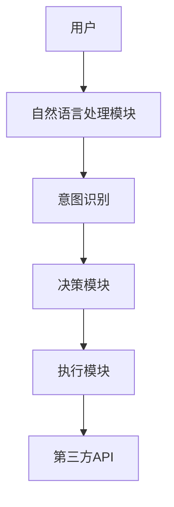
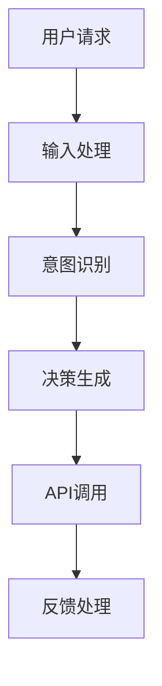
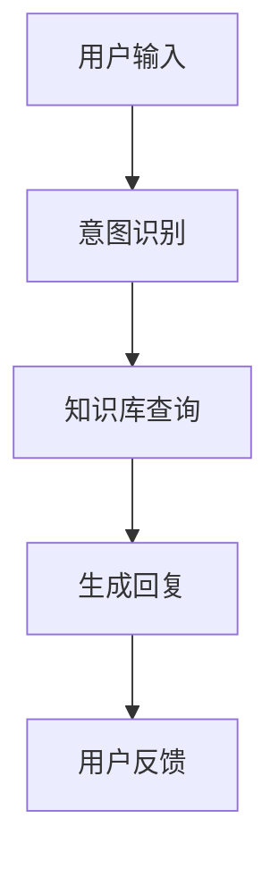
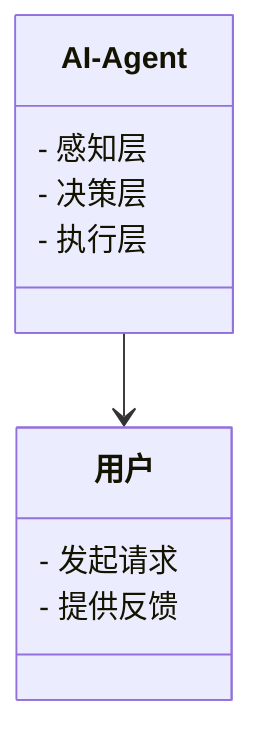

                 


# AI Agent在智能电子商务中的应用

## 关键词
AI Agent, 智能电子商务, 推荐系统, 自然语言处理, 强化学习, 个性化推荐, 智能客服

## 摘要
本文探讨了AI Agent在智能电子商务中的应用，分析了其在推荐系统、用户行为分析、智能客服等场景中的作用。通过详细的技术原理、系统架构设计和项目实战，展示了如何利用AI Agent优化电商体验，并展望了未来的发展趋势。

---

## 第一部分：AI Agent与智能电子商务的背景介绍

### 第1章：AI Agent的基本概念与作用

#### 1.1 AI Agent的基本概念
- **AI Agent**（人工智能代理）是指能够感知环境、自主决策并执行任务的智能实体。AI Agent的核心特征包括自主性、反应性、目标导向和社会能力。
- AI Agent与传统软件的区别在于其具备学习和适应能力，能够根据环境反馈优化行为。

#### 1.2 AI Agent在智能电子商务中的作用
- **提高用户体验**：通过个性化推荐和智能客服提供更贴心的服务。
- **优化业务流程**：自动化处理订单、库存管理和客户支持，提高效率。
- **数据驱动决策**：利用AI Agent分析数据，提供精准的市场洞察。

### 第2章：智能电子商务的核心概念与AI Agent的关系

#### 2.1 智能电子商务的定义与特点
- 智能电子商务通过AI、大数据和物联网等技术，实现业务的智能化和自动化。
- 其特点包括个性化推荐、智能客服、自动化供应链和精准营销。

#### 2.2 AI Agent与智能电子商务的关系
- AI Agent是智能电子商务的核心技术之一，推动了电商从传统模式向智能化转型。
- 通过AI Agent，电商企业能够更好地理解用户需求，优化运营策略。

---

## 第二部分：AI Agent的技术原理

### 第3章：AI Agent的技术基础

#### 3.1 自然语言处理（NLP）
- **NLP的基本概念**：研究人类语言的计算机科学，包括文本分析、语义理解和生成。
- **NLP在AI Agent中的应用**：用于用户意图识别、情感分析和对话生成。

#### 3.2 强化学习（Reinforcement Learning）
- **强化学习的定义**：通过试错机制，学习最优策略。
- **强化学习在AI Agent中的应用**：用于决策优化和任务执行。

### 第4章：AI Agent的核心算法原理

#### 4.1 感知层：用户意图识别
- **基于词嵌入的意图识别**：使用Word2Vec或BERT模型进行文本向量化。
- **注意力机制**：通过自注意力网络（Self-Attention）捕捉文本中的关键信息。

#### 4.2 决策层：策略优化
- **基于Q-learning的决策优化**：通过状态-动作-奖励模型，优化决策策略。
- **数学模型**：Q(s, a) = max(Q(s, a))，其中s是状态，a是动作。

#### 4.3 执行层：API调用与反馈
- **API调用流程**：AI Agent通过调用第三方API（如支付网关或库存系统）执行任务。
- **反馈机制**：根据用户反馈调整行为策略。

### 第5章：AI Agent的系统架构设计

#### 5.1 系统架构图


#### 5.2 数据流图


---

## 第三部分：AI Agent在智能电子商务中的应用场景

### 第6章：用户行为分析与个性化推荐

#### 6.1 用户画像构建
- **用户画像**：基于用户的历史行为、偏好和属性，构建用户画像。
- **机器学习模型**：使用协同过滤或深度学习模型（如神经网络）进行用户聚类。

#### 6.2 个性化推荐系统
- **推荐算法**：基于协同过滤（CF）或基于内容的推荐（CB）。
- **混合推荐模型**：结合CF和CB，提升推荐准确率。

### 第7章：智能客服与对话系统

#### 7.1 对话系统设计
- **对话流程图**：


#### 7.2 情感分析与意图识别
- **情感分析算法**：使用LSTM或Transformer模型进行情感分类。
- **意图识别**：基于预训练模型（如BERT）进行意图分类。

---

## 第四部分：系统设计与架构

### 第8章：系统架构设计

#### 8.1 系统功能设计
- **功能模块**：用户请求处理、意图识别、决策生成、API调用、反馈处理。
- **模块划分图**：


#### 8.2 系统架构图


---

## 第五部分：项目实战

### 第9章：AI Agent的实现与应用

#### 9.1 环境配置
- **Python版本**：3.8以上
- **依赖库**：numpy、pandas、tensorflow、scikit-learn
- **安装命令**：
  ```bash
  pip install numpy pandas tensorflow scikit-learn
  ```

#### 9.2 核心代码实现
- **意图识别模型**：
  ```python
  import tensorflow as tf
  model = tf.keras.Sequential([
      tf.keras.layers.Embedding(input_dim=10000, output_dim=16),
      tf.keras.layers.GlobalAveragePooling1D(),
      tf.keras.layers.Dense(1, activation='sigmoid')
  ])
  model.compile(optimizer='adam', loss='binary_crossentropy', metrics=['accuracy'])
  ```

- **推荐系统实现**：
  ```python
  import numpy as np
  from sklearn.metrics.pairwise import cosine_similarity

  # 假设user_features和item_features为向量表示
  similarities = cosine_similarity(user_features, item_features)
  top_recommended = np.argsort(similarities, axis=1)[:, ::-1]
  ```

#### 9.3 案例分析与总结
- **案例分析**：通过一个电商推荐系统案例，展示AI Agent的实现过程和效果。
- **总结**：AI Agent能够显著提升用户体验和运营效率，但需要解决数据隐私和模型解释性问题。

---

## 第六部分：高级主题与未来趋势

### 第10章：AI Agent的高级应用

#### 10.1 多智能体协作
- **多智能体系统**：多个AI Agent协同工作，共同完成复杂任务。
- **协作机制**：基于分布式计算和事件驱动的通信。

#### 10.2 边缘计算与AI Agent
- **边缘计算的优势**：低延迟、高隐私、高效能。
- **AI Agent在边缘计算中的应用**：实时数据处理和本地决策。

### 第11章：未来发展趋势

#### 11.1 可解释性AI
- **可解释性的重要性**：提升用户信任和模型可靠性。
- **实现方法**：通过可视化和规则生成技术，使AI决策过程更透明。

#### 11.2 AI Agent的伦理与挑战
- **伦理问题**：数据隐私、算法偏见和责任归属。
- **技术挑战**：模型泛化能力、多模态处理和实时性要求。

---

## 总结
本文全面探讨了AI Agent在智能电子商务中的应用，从技术原理到实际案例，展示了其在提升用户体验和优化业务流程中的巨大潜力。未来，随着技术的进步，AI Agent将在电商领域发挥更大的作用，但也需要解决数据隐私和伦理等挑战。

